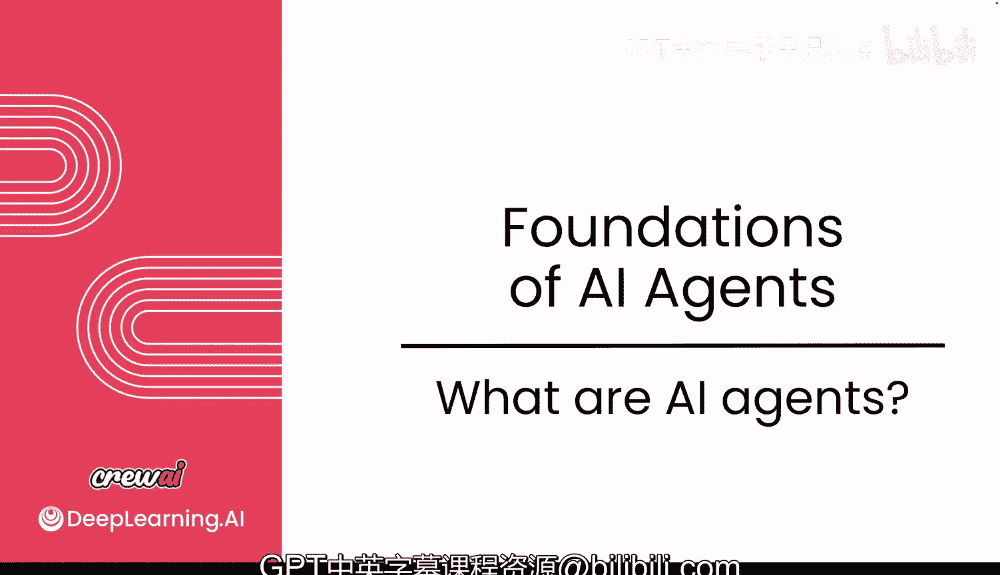
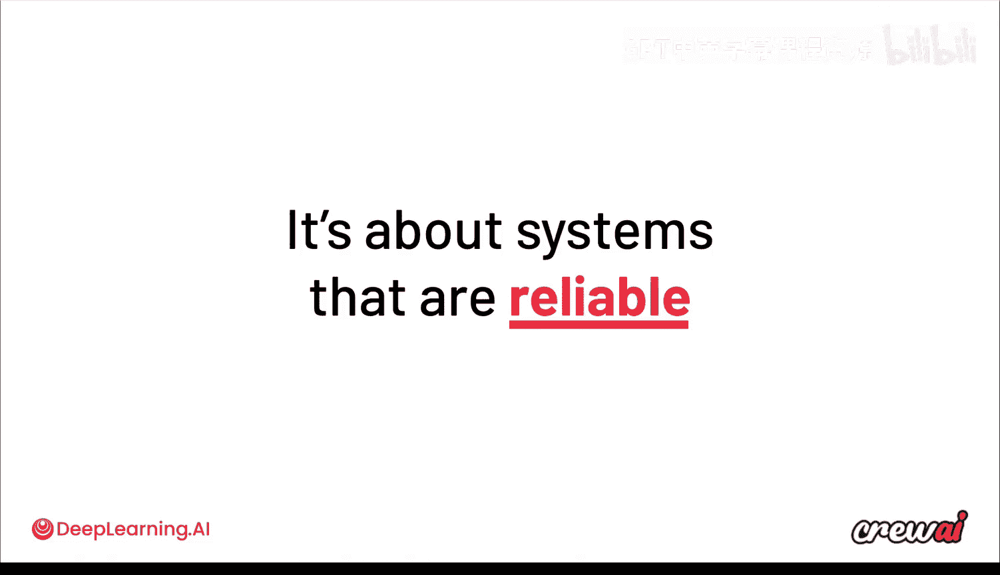

# 003：什么是AI智能体 🤖

在本节课中，我们将要学习AI智能体的核心概念、工作原理以及它们与传统自动化系统的区别。我们将深入探讨智能体如何做出决策，并理解为何它们能实现更复杂、更灵活的任务自动化。

---

## 什么是AI智能体？

你可能对AI智能体有自己的定义。为了确保我们讨论的是同一概念，我们需要明确AI智能体的不同选项、其本质以及工作原理。在本节课程中，我们将详细探讨智能体的方方面面及其运作机制。

现在，让我们开始深入了解。

---

## 智能体的核心定义 🎯

关于AI智能体的讨论非常多。但在深入之前，我们先就其定义达成一致。

我的定义是：**AI智能体是一个能够决定下一步行动以完成特定目标的系统**。

让我们深入剖析这个定义。

---

## 智能体的基础：大语言模型（LLM）🧠

所有智能体的核心都始于一个**大语言模型**。在本课程中，你将看到如何为LLM添加各种工具、防护栏和控制机制，使其能够像智能体一样行动。

LLM非常擅长生成内容。如果你要求它写一封电子邮件，它会为你完成。如果你要求它写得更有趣，它至少会尝试。但更有趣的是，如果你为它提供选项。

例如，一个选项可能更严肃一些，另一个选项则略有不同。此时，LLM将进行选择，并告诉你版本A更好，因为原因A、B或C；或者版本B更好，因为原因1、2或3。

归根结底，正是这种做出合理选择的能力——我们称之为**认知能力**——使得这些模型能够判断哪封邮件更好。

---

## 从聊天到控制应用流程 🔄

现在，如果我们暂时忘记邮件，转而讨论一个商业目标或任务目标，并且由LLM实际决定为实现该目标需要采取哪些步骤，那么情况就完全不同了。

这时，我们就不再是简单的聊天了。现在，AI正在控制应用程序的流程，由这些LLM做出选择，以完成你为它们设定的最终目标。

---

## 为何需要关注AI智能体？💡

你可能会想，我为什么要关心这个？你应该关注AI智能体的原因在于，我们最终讨论的是**自动化**，而且是以前无法实现的自动化。

具体来说，它允许你构建非常复杂且灵活的自动化系统。

---

## 用例对比：传统自动化 vs. AI智能体 🤖

让我们通过一个客户支持聊天机器人的用例示例，来比较旧式自动化与当今AI智能体风格自动化的区别。

当你思考传统的自动化时，通常需要映射所有不同的分支路径。例如，有一个起点A（客户输入），它会带你到点B（显示帮助文章）。但这并非唯一的路径。当你深入思考这个用例时，你会发现其中涉及更多环节。

点C出现了，你需要检查用户登录状态。然后点D出现了，你需要查看用户是否能访问购买记录。你可能还会添加其他升级点。你可以看到，随着添加所有这些不同的点，情况会变得多么复杂。

在更传统的自动化中，你必须映射所有不同的边和连接，以确保系统能够工作。如果你遗漏了一个，系统就会崩溃，无法运行。

---

## AI智能体的不同之处 🚀

现在，如果你考虑AI智能体，你可以采取完全不同的方法。智能体可以根据客户输入，自行决定要做什么以及按什么顺序做。

它可能决定立即显示文章，稍后检查登录状态，最终再决定是否升级。你可以看到智能体如何拥有不同的选项，并像之前选择哪封邮件更好一样，自主选择如何在这些选项中导航。

---

## AI智能体带来的优势 ✨

这种方法带来了几个关键优势：
1.  **认知能力**：智能体能够自主选择。
2.  **实时反应**：智能体能对你输入的任何内容做出实时反应。根据客户输入的不同，智能体会决定最合适的下一步。
3.  **自我修复能力**：这意味着如果“检查登录状态”这一步失败了，智能体可能会找到解决方法，例如使用另一个API，或执行另一个步骤。
4.  **自我改进能力**：这个概念指智能体确保能从自己的行为中学习。随着处理更多示例、用例和运行次数，它们会了解什么有效、什么无效，从而强化有效的行为。

这些是传统自动化所不具备的特性。

---

## 驱动智能体自动化的两大核心 🏗️

归根结底，如果我们放大视角，驱动智能体自动化和智能体系统的两大核心是：
1.  **创造能力**：撰写电子邮件、生成图像等。
2.  **决策能力**：决定使用什么工具、使用什么数据、如何从失败中恢复。

---

## 构建可靠、可扩展的智能体系统 ⚙️

最终，为了使这些智能体具有可扩展性，它们必须是可靠的。这意味着系统需要易于构建、值得信赖且易于管理。

如果一个客户支持智能体在大多数时候都无法响应用户请求，或者向不符合条件的客户提供退款，那么它对你的公司来说就没有多大用处。

因此，本课程的一个重点是如何设计系统，使其能够提供高质量的产出。

---

## 数据的重要性与适用场景 📊

我们很快就会深入讨论数据。随着你越来越多地使用AI智能体，你会注意到并非所有用例都生而平等。有些用例比其他用例更适合使用智能体。

---

## 总结 📝

本节课中，我们一起学习了AI智能体的核心定义，理解了其基于大语言模型的工作原理，以及它如何通过认知和决策能力实现复杂的自动化。我们对比了传统自动化与AI智能体自动化的区别，并探讨了智能体带来的实时反应、自我修复和自我改进等独特优势。最后，我们明确了构建可靠、可扩展的智能体系统的关键，并预告了下一节关于如何为AI智能体寻找最佳用例的内容。