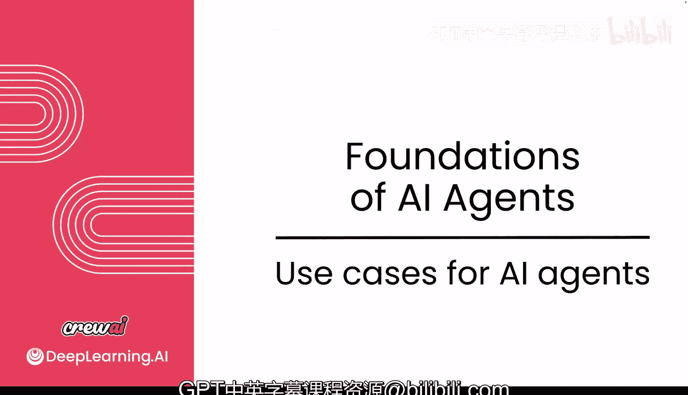
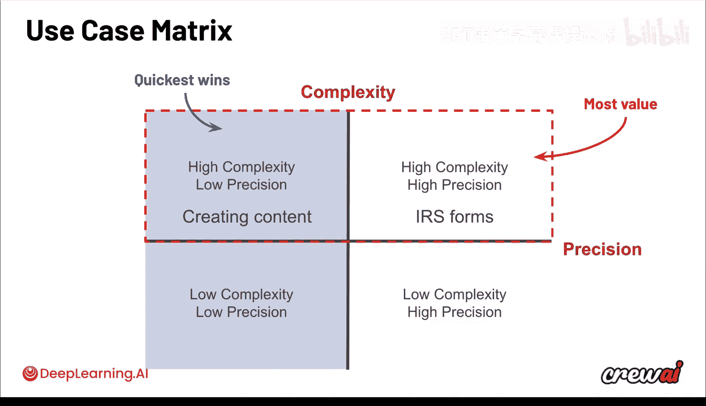
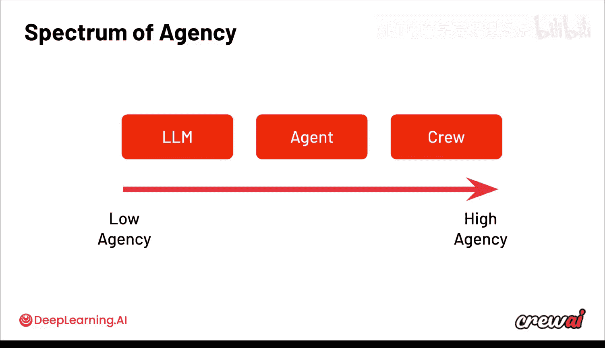
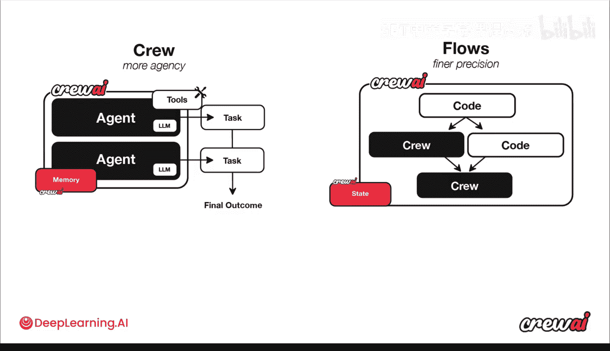
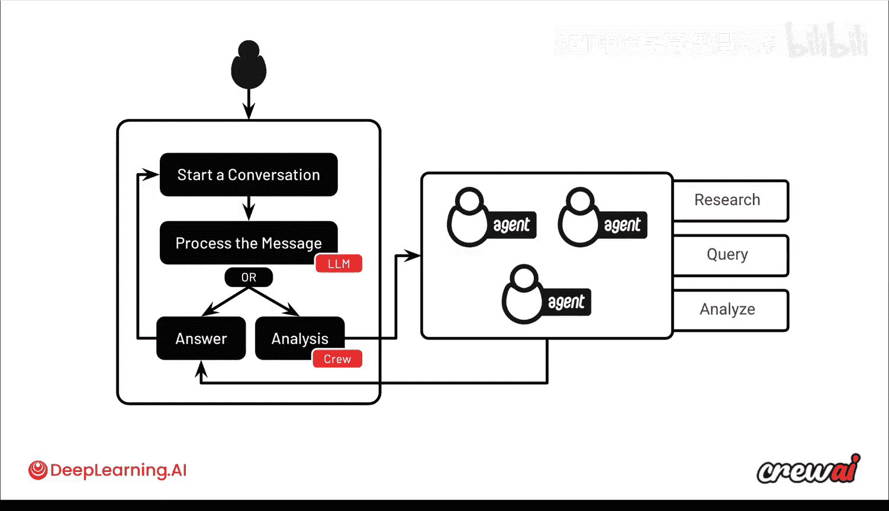

# 004：AI智能体的应用场景

在本节课中，我们将学习如何思考、衡量和选择AI智能体的应用场景。我们将通过一个“用例矩阵”来分析不同场景对复杂度和精度的要求，并探讨如何根据需求选择从单一LLM调用到多智能体协作的不同实现方案。

## 用例矩阵：复杂度与精度



上一节我们介绍了AI智能体的基本概念，本节中我们来看看如何评估一个具体问题是否适合用智能体来解决。一个有效的方法是使用“用例矩阵”，它可以帮助你根据任务的**复杂度**和**精度**要求来定位你的用例。

*   **复杂度**：指任务涉及的步骤、信息量和逻辑关系的多少。
*   **精度**：指任务输出结果必须达到的准确性和可靠性标准。

根据这两个维度，我们可以将用例分为四个象限：

1.  **高复杂度 & 高精度**：例如填写长达70页、附带700多页说明的税务表格。这类任务极其复杂，且不容出错。
2.  **高复杂度 & 低精度**：例如内容创作。虽然需要处理复杂的信息和创意，但对输出格式和具体措辞有更大的宽容度。
3.  **低复杂度 & 高精度**：例如简单的数据验证或格式化。
4.  **低复杂度 & 低精度**：例如生成一些简单的提示或想法。

AI智能体可以处理所有这些维度的问题，但最具价值的通常是**高复杂度**的问题，而能最快取得成效的则是**低精度**的问题。一个理想的起点是**高复杂度、低精度**的象限，因为智能体擅长解决复杂任务，同时输出上的灵活性允许你快速获得可用的成果。

## 智能体层级谱系：从LLM到智能体群组

无论你考虑哪种用例，都需要在“智能体层级谱系”中做出选择。这个谱系的一端是简单的**大型语言模型调用**，另一端则是复杂的**智能体群组协作**。



以下是这个谱系的构成：

*   **单一LLM调用**：某些用例可能只需要向大语言模型发起一次调用就能获得所需信息。这属于**低自主性**的方案。
*   **单一智能体**：有些任务需要一个具备特定角色、记忆和工具的独立智能体来完成。
*   **智能体群组**：最复杂的场景需要一整个**Crew**，即一组各司其职的智能体协同工作。例如之前提到的会议准备用例。这属于**高自主性**的方案，智能体们会自主决定每个步骤的执行。

## CrewAI的两种核心抽象





为了支持这种谱系，CrewAI提供了两种核心抽象来满足不同层级的控制需求。

*   **Crews**：为**高自主性**优化。智能体群组拥有记忆、工具和任务，能够自主协作。公式可以表示为：`Crew = 多个智能体 + 共享目标 + 协调机制`。
*   **Crew AI Flows**：这是一个**低层级框架**，赋予你完全的控制权，可以精确决定执行流程的顺序。你可以混合使用普通Python函数、单一LLM调用和整个Crew。代码结构示意如下：
    ```python
    # 伪代码示例
    def my_flow():
        result_a = regular_python_function()  # 第一步：执行普通函数
        result_b = llm_call(result_a)         # 第二步：进行LLM调用
        final_result = crew.execute(result_b) # 第三步：启动智能体群组
        return final_result
    ```

## 示例：对话式员工福利系统

让我们通过一个具体例子来理解如何应用这些概念。假设要构建一个对话式系统，让员工咨询福利问题。

这个用例通常始于用户通过聊天界面发起对话。处理初始消息可能不需要很高的自主性，一次简单的LLM调用就足以理解用户意图并判断是否需要进一步处理。

如果LLM判断需要深入分析（例如查询数据库获取具体的福利数据，或在客服用例中查询内部系统），这时就需要更高的自主性和复杂性。这便适合交由一个**Crew**来完成，其中可以包含负责研究、查询、分析的多个智能体协同工作，最终将答案返回给用户。

整个流程通过**Crew AI Flow**来编排：先进行LLM调用，再在必要时触发智能体群组。这样，我们只在真正需要的地方“引入”智能体的自主性，从而在保持对流程控制的同时，解决了复杂问题。



本节课中我们一起学习了如何利用用例矩阵评估AI智能体项目的可行性，认识了从LLM到多智能体的谱系选择，并了解了CrewAI如何通过Crews和Flows两种抽象来满足不同复杂度和控制需求的应用场景。下一节，我们将深入探讨AI智能体的智能基础，了解它们为何能够表现出“智能”行为。