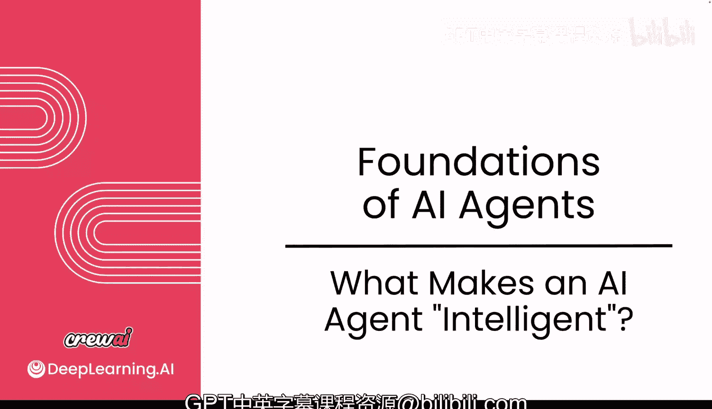
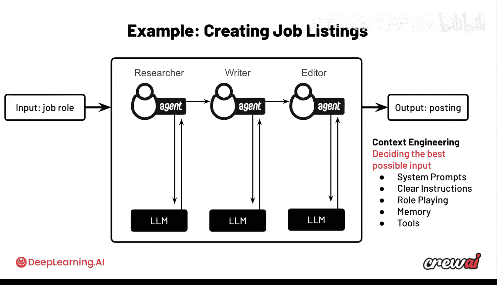

# 005：什么让AI智能体变得智能？🤖

在本节课中，我们将探讨什么因素使得一个AI智能体变得“智能”。我们将从理解大型语言模型与传统AI系统的区别开始，并深入探讨“上下文工程”如何成为构建可靠、可重复智能体的关键。通过一个具体的多智能体团队示例，我们将了解如何通过优化输入来引导模型，从而获得高质量的输出。

---

## 理解AI智能体的智能本质

上一节我们介绍了智能体的基本概念，本节中我们来看看智能的核心驱动因素。

一个能够投入生产的AI智能体，意味着它能提供可靠且可重复的结果。这要求我们必须仔细思考背后的“上下文工程”，即你在每次API调用中提供给模型的信息。让我们深入探讨这一点，以便你更好地理解如何优化你的智能体，以获得最佳的输出质量。

---

## 传统AI系统 vs. 大型语言模型

我非常期待这一课，因为我们将退一步，简要地理解大型语言模型的工作原理，以及它们与更传统的AI系统有何不同。

传统AI系统的核心，是尝试理解输入以预测输出。让我们看一个简单的例子：一个试图预测是否会下雨的传统AI系统。

为了做到这一点，它会使用几个不同的数据点，例如：
*   地理位置
*   季节
*   温度

使用这些特征，我们试图预测是否会下雨。一个好的例子是：孟买在夏季，华氏90度，我们预测不会下雨；但在坦佩的冬季，华氏65度，则会下雨。

这种模型的工作方式是：你向它展示足够多的关于地点、季节和温度的例子，它就会开始理解所有这些特征与预测结果之间的相关性。你向模型展示的例子越多（我们称之为“训练”），它就越能理解不同特征与实际输出之间的关联。这样在未来，如果你展示一个它未见过的例子，例如东京在夏季，华氏85度，它也能够预测是否会下雨。

这里的核心思想是，模型利用这些特征来理解它们如何与最终预测相关联。这一点在很大程度上也适用于大型语言模型。我知道这是一个简化的比较，但LLMs中确实存在大量类似的机制。它也是一个常规的AI模型，但在这种情况下，“特征”是你迄今为止输入的所有词语。

例如，当你进入ChatGPT并输入“给我一份特斯拉的股票报告”，然后它输出一个答案。理解方式是：你的提示词实际上是告知模型进行预测（即生成答案）的“特征”。这意味着你对最终得到的预测（答案）拥有比你想象的更多的控制权。你可以通过改变提示词来获得不同的回应。这本质上就是人们常说的“提示工程”——理解如何组织句子，以引导模型给出最佳答案。

一个你可以自己尝试的提示工程例子是：不要直接运行“给我一份特斯拉的股票报告”，而是将提示词改为“作为一名出色的金融顾问，给我一份特斯拉的股票报告”。你可以看到这里多了几个词，就像我们改变了季节、地点或温度一样。现在我们提供了不同的信息，这将显著影响预测，从而得到不同的答案。

系统的智能性来源于它们能够接受海量的特征作为输入，并能在这些输入之间建立复杂的关联，以预测接下来会发生什么。这一点之所以重要，是因为输入LLM的内容会极大地影响它的回应方式。而有效地做到这一点，正是构建优秀智能体的关键。

---

## 从确定性软件到非确定性AI

让我们再退一步思考。如果你考虑更传统的软件，所有的软件都是强类型的。我的意思是，你非常清楚输入的数据是什么、发生了哪些转换、以及输出的数据是什么。这就是为什么你可以进行测试，因为你知道 `2 + 2` 总是等于 `4`。

然而，当你考虑AI系统时，它们是非确定性的。这意味着你不知道输入的数据具体是什么，模型本身是一个黑箱，你也不知道输出的数据会是什么。想想ChatGPT，你可以在里面输入蛋糕的食谱或博士论文，有时你无法确切知道会得到什么样的数据。这既是它的魅力所在，但也影响了你能对系统施加多少控制，以确保获得可靠的输出。

---

## 上下文工程：构建智能体的核心

假设你正在构建一个能够创建职位列表的智能体团队。这个团队将帮助你研究、撰写职位描述并进行编辑，确保其质量一流。

这个团队将包含三个智能体：
1.  **研究分析师**
2.  **撰写者**
3.  **编辑者**

其工作流程是：研究员将职位角色作为输入，去研究其他职位列表，查看相关技能以及竞争对手的需求。然后，撰写者将获取所有研究结果和职位规范，并实际撰写职位描述。最后，编辑者将审查所有内容，确保其符合你公司的风格和文化。

首先，让我们谈谈上下文工程如何让你引导这个团队协同工作，决定每次请求的最佳可能输入。上下文工程的核心就是优化这一系列输入，使其作为“特征”，为你带来可能的最佳输出。

以下是构成上下文工程的关键要素：
*   **系统提示**：发送给模型的提示是什么？它们提供了关于LLM应如何行为的指导。
*   **清晰的指令**：特别是要解释对该智能体的期望是什么，以及“完成”的良好定义是什么。
*   **角色扮演**：确保让这些智能体进行角色扮演。请记住，你提供给这些模型的“特征”会影响你得到的输出。因此，如果你让这些智能体扮演特定角色（就像我们之前让它们扮演“出色的金融顾问”一样），当它们化身为研究员、撰写者和编辑者时，你会从这些智能体那里得到更好的回应。
*   **记忆**：记忆也将发挥作用，它赋予这些智能体记住过去做得好与不好的能力。
*   **工具**：这些是智能体为了能够进行研究（例如搜索网络）、撰写内容和审阅内容所需的东西。

我知道信息量很大，但别担心，因为我们将在后续课程中深入探讨每一个方面。

---

## 总结与预告

本节课中，我们一起学习了AI智能体智能的本质。我们了解到，智能并非凭空产生，而是源于对模型输入（即“上下文”）的精心设计与工程化。通过与传统AI系统对比，我们明白了LLMs将我们的提示词视为预测答案的“特征”。我们还探讨了如何通过系统提示、清晰指令、角色扮演、记忆和工具等上下文工程要素，来引导多智能体团队协同工作，从而获得可靠、高质量的输出。

在接下来的视频中，我们将一起启动我们的第一个智能体，实时观察上下文工程的实际应用。我们稍后见。