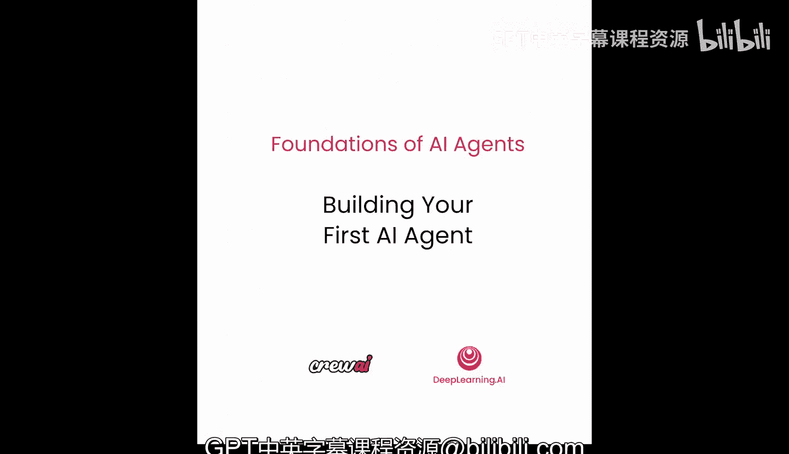
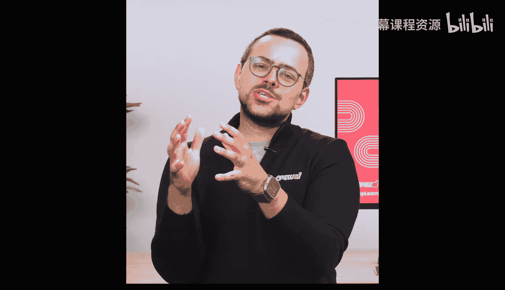
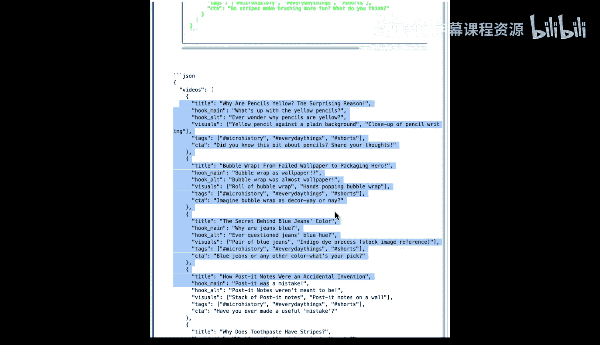

# 006：构建你的第一个AI智能体 🚀

在本节课中，我们将动手实践，构建你的第一个AI智能体。你将学习如何运用之前讨论的“上下文工程”原理，来构建尽可能优秀的智能体。这些核心原则适用于所有用例，无论你是否使用CrewAI或其他框架。

## 概述：智能体与任务的设计哲学

上一节我们介绍了上下文工程的重要性，本节中我们来看看如何将其应用于具体的智能体构建。一个关键的建议是遵循**80/20法则**：应将更多精力放在**任务**设计上，而非仅仅关注智能体本身。虽然智能体很重要，但我们的经验表明，清晰定义的任务对最终输出质量的影响最大。






你应该像一位**管理者**一样思考。优秀的经理往往也是出色的智能体创建者，因为他们不仅考虑“雇佣谁来完成任务”，更清楚设定成功标准的重要性。

## 深入理解任务

任务是单一目的和单一输出的。其有效性主要依赖于两个属性：**描述**和**期望输出**。

以下是任务的两个核心组成部分：
*   **描述**：阐述需要完成什么以及为何要完成。
*   **期望输出**：不仅定义输出格式，更明确“成功”的具体样貌。例如，输出应包含什么内容、采用何种格式、语气如何。

描述和期望输出在上下文工程中扮演关键角色，它们会被用于系统提示、角色扮演、写入记忆或智能体自我评估等不同环节。

## 剖析智能体

现在，让我们谈谈智能体。一个智能体主要包含三个组件：

以下是智能体的三个核心组成部分：
*   **角色**：应尽可能使用真实的职位头衔，或能明确传达你希望LLM扮演什么角色的描述。
*   **目标**：定义该智能体在所有任务中追求的最终目的，即它的“成功”标准。
*   **背景故事**：在这里你可以自由发挥，添加专业知识、工作风格或价值观等信息，以强化角色扮演效果，确保获得期望的输出。

## 实战演练：从欠佳示例到优秀示例

接下来，我们跳转到代码笔记本，看看任务和智能体如何结合，形成我们的第一个“团队”。

首先，你需要导入CrewAI的三个主要构建块。

```python
from crewai import Agent, Task, Crew
```

### 一个欠佳的示例

假设我们想创建一个内容创作助手，用于生成30-45秒的YouTube短视频创意。

一个欠佳的设计可能如下：

```python
# 智能体定义过于简单
agent = Agent(
    role='内容创作助手',
    goal='提出视频创意',
    backstory='一个拥有丰富视频内容创作经验的人。'
)

# 任务定义模糊
task = Task(
    description='提出5个新的视频创意。',
    expected_output='至少5个创意列表。',
    agent=agent
)
```

然后，我们将智能体和任务组合成团队并运行。但这样的设计存在明显问题：智能体甚至不知道它在为YouTube创作，也不了解“短视频”的特定要求。运行结果很可能不尽人意，例如生成一些适合长纪录片的主题，而非高 retention 的短视频创意。

### 一个优秀的示例

现在，让我们看一个经过深思熟虑的优秀设计：

```python
# 智能体定义具体、目标明确
agent = Agent(
    role='YouTube短视频内容策略师',
    goal='创作能保持一周高留存率的YouTube短视频内容',
    backstory='你是一位专攻病毒式传播和平台算法的专家，擅长创作能在前3秒抓住观众注意力、并鼓励完播和互动的短视频内容。'
)

# 任务描述详尽，期望输出格式清晰
task = Task(
    description='基于当前趋势，构思5个YouTube短视频创意。每个创意必须适合30-45秒的格式，并优化以适应YouTube Shorts的算法推荐机制。',
    expected_output="""
    一个JSON数组，包含5个对象。每个对象必须包含以下字段：
    - "title": 视频标题
    - "hook": 开场3秒的钩子文案
    - "visuals": 建议的主要视觉元素描述
    - "tags": 5个相关标签的列表
    - "call_to_action": 视频结尾的行动号召
    """,
    agent=agent
)
```

将这个智能体和任务组合成团队并运行后，你会得到结构清晰、符合平台特性的高质量输出（例如格式规范的JSON数据），与欠佳示例的结果有**天壤之别**。

## 总结

本节课中，我们一起学习了构建第一个AI智能体的核心步骤。关键在于：
1.  遵循**80/20法则**，优先精心设计**任务**的描述与期望输出。
2.  像管理者一样定义**智能体**，明确其角色、目标和背景故事。
3.  通过具体、详细的上下文信息（如平台、格式、成功标准）来引导智能体，这能极大提升输出质量。



这只是一个单一智能体的例子。此用例可以扩展为包含多个智能体的团队，例如负责脚本起草、深度研究、社交媒体营销等，从而构建完整的内容生产流水线。在接下来的课程中，我们将继续探索多智能体协作的奥秘。