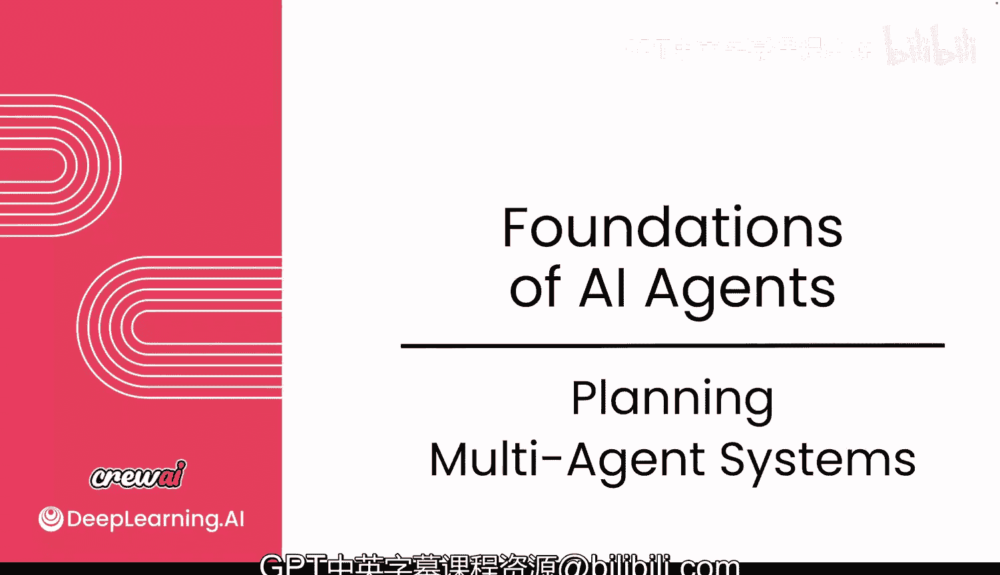
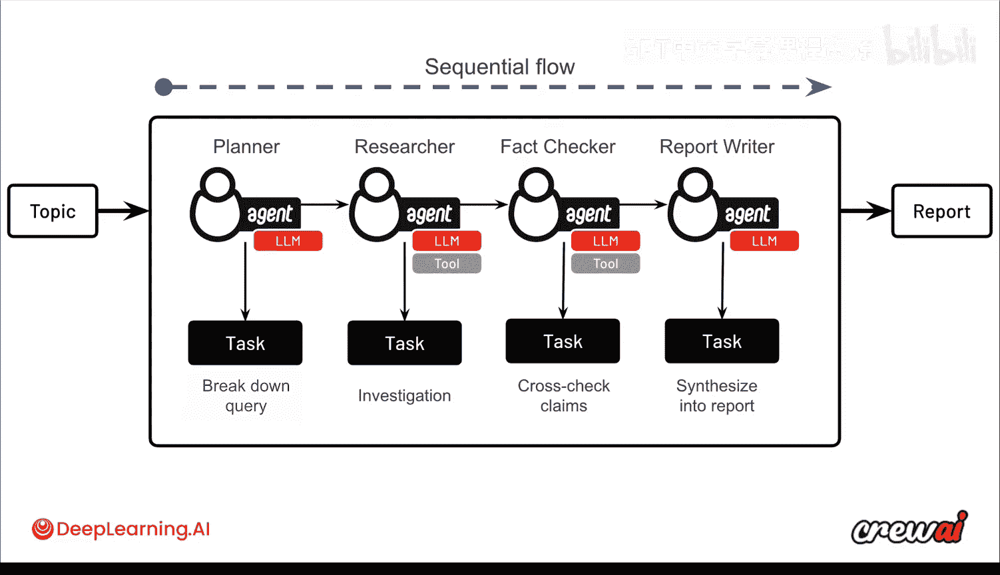

# 007：多智能体系统规划 🧠

## 概述
在本节课中，我们将要学习如何规划和设计多智能体系统。我们将探讨单个智能体的局限性，并理解如何通过组合多个专业化的智能体来应对更复杂的任务，从而获得更强大的能力。

## 从单智能体到多智能体
上一节我们介绍了如何构建你的第一个智能体、任务和团队。你已经准备好开始理解其中的一些基本概念。这种智能体执行工作并被分配任务的思想，在整个行业中，无论你使用的是 CrewAI 还是其他任何智能体构建工具，都是通用的。

现在，我们不仅要关注可以使用一个智能体，更要关注你也可以使用多个智能体。这里存在一个平衡：何时引入更多智能体以及引入多少。其核心理念在于，多个智能体能让你拥有更**专业化的能力**，正是通过它们的协同努力，你才能处理更复杂的使用场景。

## 使用场景与智能体数量
如果我们回顾一下之前提到的使用场景矩阵，你会发现，对于**高复杂度、低精度**，甚至是**高复杂度、高精度**的任务，通常需要多个智能体来完成，而不是单个智能体。这是因为你需要确保“分而治之”，甚至可以根据需要为你的智能体设置不同的语言模型，一切都是为了获得最佳的输出结果。

## 案例：深度研究团队
接下来，让我们谈谈在后续视频中将要一起构建的用例：一个深度研究团队。这基本上是一个能够对某个主题进行深入研究并生成报告的智能体小组。

输入是一个初始主题，输出是一份报告。我们将通过让四个智能体以**顺序方式**协作，来完成从主题到报告的转化。

以下是这个流程中各个智能体的角色和任务：

*   **规划者智能体**：第一个任务是将初始查询分解。无论我们得到什么主题，我们都希望将其分解成更易于管理的小块。
*   **研究者智能体**：我们需要对该主题进行一些调查。这个智能体可能需要一些工具（例如网络搜索）来查找构建报告所需的信息。
*   **事实核查者智能体**：我们希望确保报告事实准确。因此，会有一个单独的智能体专门进行事实核查，交叉验证各种说法，确保一切有效，并尽量减少可能出现的幻觉。
*   **报告撰写者智能体**：最后的智能体负责将所有来自规划、研究和事实核查的知识整合成一份连贯的报告，从而在最终获得高质量的输出。

为了直观展示，我们可以用一个简单的流程图来表示这个顺序过程：

## 智能体的协作模式
正如你所见，在这个例子中，智能体以特定的顺序工作以生成最终报告。但是，当你构建这些用例时，顺序协作可能并不总是最优的。你可能需要探索智能体之间不同的通信和协作风格。

以下是几种常见的协作模式：

*   **分层式**：智能体之间存在明确的层级关系，上级智能体协调下级智能体。
*   **混合式**：结合了多种协作模式。
*   **并行式**：多个智能体可以同时并行工作。
*   **异步式**：智能体可以并行工作，最终再汇聚到一个智能体进行整合。

## 总结
本节课中，我们一起学习了多智能体系统的规划。我们理解了单个智能体的能力边界，以及如何通过引入多个专业化智能体来应对复杂任务。我们介绍了一个具体的用例——深度研究团队，并分析了其中四个智能体（规划者、研究者、事实核查者、报告撰写者）在顺序工作流中的角色。最后，我们还简要提及了智能体之间可能存在的其他协作模式，如分层、并行等，为后续更灵活的系统设计奠定了基础。