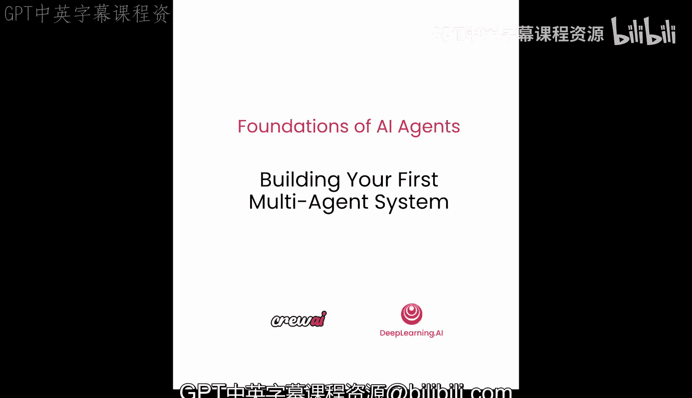
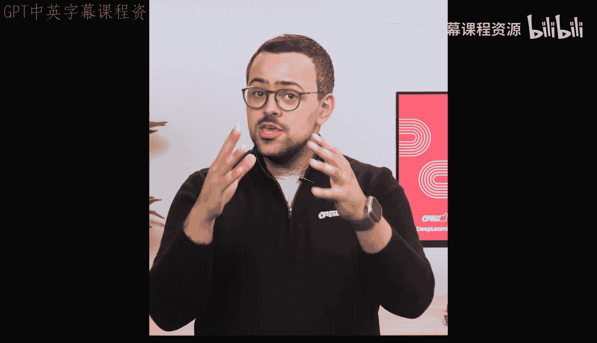
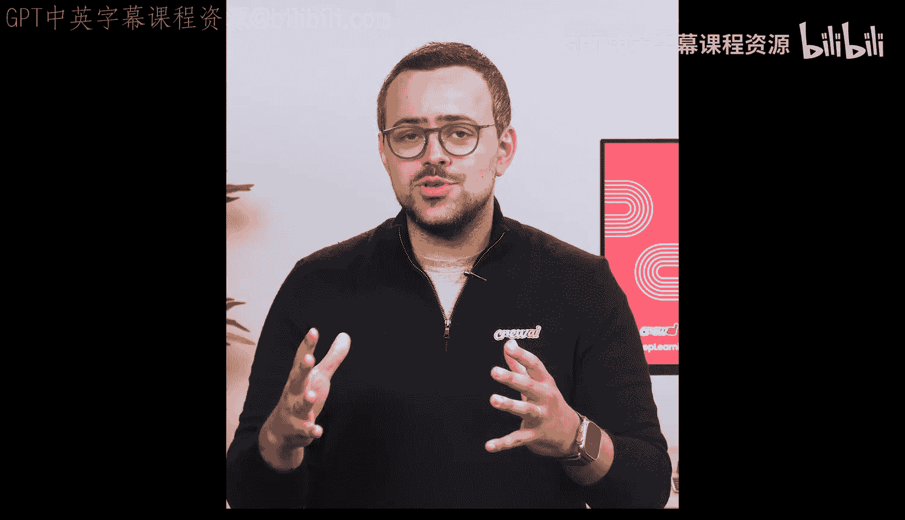
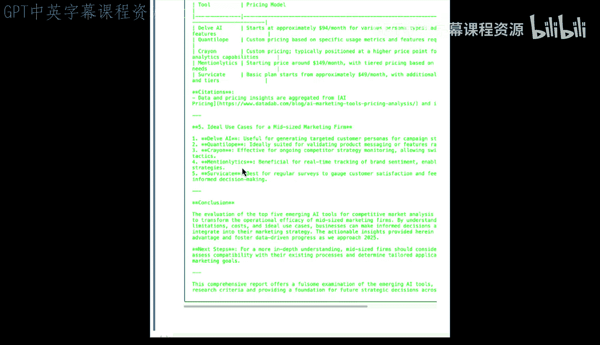

# 008：构建你的第一个多智能体系统 🚀

在本节课中，我们将动手构建你的第一个多智能体系统。你已经学习了许多核心概念，并花时间规划了用例，现在是时候将这些知识付诸实践了。

我们将深入代码，构建一个“深度研究团队”。这个团队将伴随我们走过后续多节课程，我们会不断用新学到的知识来改进和增强它。

## 概述

这个初始团队将由四个智能体组成：一个研究规划师、一个互联网研究员、一个事实核查员和一个报告撰写员。这些智能体将按顺序执行一系列任务，最终为我们生成一份关于任何我们想要研究主题的完整报告。

我们需要为互联网研究员智能体提供一些工具。关于工具的详细讨论将在未来的课程中进行。目前，我们仅使用一个预构建的工具。最终，我们甚至会学习如何构建自定义工具。

现在，让我们进入代码环节，开始实际操作。

## 第一步：导入必要的库和配置

首先，我们需要导入 CrewAI 的核心类：`Agent`、`Task` 和 `Crew`。这些类与我们在上一个笔记本中使用的是相同的。







```python
from crewai import Agent, Task, Crew
```

为了更方便地管理 OpenAI 的 API 密钥，我们还需要导入一些辅助代码。这是一段样板代码，你可以直接复制粘贴，它会正常工作。

```python
# 导入用于加载环境变量和API密钥的模块
import os
from dotenv import load_dotenv
load_dotenv()

# 配置OpenAI API密钥
os.environ["OPENAI_API_KEY"] = os.getenv("OPENAI_API_KEY")
```

在本笔记本的最后，我邀请你尝试更换模型，观察不同模型的效果。

## 第二步：配置研究工具

因为我们需要为智能体提供研究工具来收集数据，所以我们将使用一个应用程序来进行网络搜索。再次强调，现在不必过于纠结工具的细节，我们将在后续课程中详细讨论。

我们只需导入相关模块，并通过加载密钥、创建搜索工具实例和网站抓取工具实例来正确配置它们。

```python
from langchain.tools import DuckDuckGoSearchRun
from langchain.agents import Tool

# 创建搜索工具实例
search_tool = DuckDuckGoSearchRun()
# 创建网站抓取工具实例（此处为示例，实际可能需要其他库如BeautifulSoup）
# scrape_tool = Tool(name="ScrapeWebsite", func=scrape_website_function)
```

## 第三步：创建智能体

现在，让我们开始创建智能体。第一个智能体是**研究规划师**。它的核心思想是能够分析查询，并将其分解为更小、更具体的研究主题。

紧接着的下一个智能体是**互联网研究员**，它将基于研究规划师的计划来执行具体的研究工作。

你可以看到，我们为每个智能体都设定了非常具体的角色、目标和背景故事。事实核查员和报告撰写员智能体也将遵循相同的模式创建。

```python
# 创建研究规划师智能体
research_planner = Agent(
    role='研究规划师',
    goal='分析用户查询并将其分解为具体的研究主题和问题',
    backstory='你是一位经验丰富的研究策略专家，擅长将宽泛的主题拆解为可执行的研究步骤。',
    verbose=True
)

# 创建互联网研究员智能体
internet_researcher = Agent(
    role='互联网研究员',
    goal='根据研究计划，在互联网上搜索并收集关于指定主题的详细信息',
    backstory='你是一位高效的网络信息搜集专家，擅长使用各种工具找到准确、相关的数据。',
    tools=[search_tool], # 为该智能体分配搜索工具
    verbose=True
)

# 创建事实核查员智能体
fact_checker = Agent(
    role='事实核查员',
    goal='验证研究员收集信息的准确性和时效性',
    backstory='你是一位严谨的事实核查员，对信息的真实性有极高的要求。',
    tools=[search_tool], # 事实核查员也可以使用搜索工具进行验证
    verbose=True
)

# 创建报告撰写员智能体
report_writer = Agent(
    role='报告撰写员',
    goal='根据已验证的研究信息，撰写一份结构清晰、内容全面的研究报告',
    backstory='你是一位专业的科技报告作者，擅长将复杂信息整合成易于理解的格式。',
    verbose=True
)
```

需要指出的是，研究员和事实核查员都使用了同一组工具子集。

## 第四步：创建任务

有了智能体后，我们接下来创建任务。我们从“研究计划任务”开始。

这个任务非常具体地定义了它希望智能体做什么：基于用户查询，研究相关主题，理解核心问题，并创建研究计划。

在这里，你第一次看到我们向任务中**插入了一些变量**。这很重要，因为当你运行这些智能体时，总会有用户输入的成分。无论是查询还是其他输入，你都需要将其注入到工作流中。在这个案例中，我们从第一个任务就注入了用户查询，它将从此处开始指导整个计划。

```python
# 创建研究计划任务
plan_task = Task(
    description="""基于以下用户查询，制定一份详细的研究计划。
    识别主要研究问题，并将宽泛的主题分解为具体的、可搜索的子主题。
    用户查询：{user_query}""",
    agent=research_planner,
    expected_output="一份包含具体研究问题和子主题的详细计划大纲。"
)

# 创建互联网研究任务
research_task = Task(
    description="""执行研究计划。使用提供的工具搜索互联网，收集关于每个研究子主题的全面、最新信息。
    确保信息来源可靠，并记录关键发现和数据点。""",
    agent=internet_researcher,
    expected_output="一份包含所有研究子主题详细发现的汇总，附信息来源。"
)

# 创建事实核查任务
check_task = Task(
    description="""验证研究员收集的所有信息。检查关键数据、声明和统计数据的准确性。
    确认信息的发布时间，并标记任何存疑或过时的内容。""",
    agent=fact_checker,
    expected_output="一份经过验证的信息列表，标注已验证和待核实的内容。"
)

# 创建报告撰写任务
write_task = Task(
    description="""基于已验证的研究信息，撰写一份最终的研究报告。
    报告应采用Markdown格式，结构清晰，包含引言、主要发现、详细分析、数据表格（如适用）和结论。
    确保报告全面、易读且专业。""",
    agent=report_writer,
    expected_output="一份完整的、格式良好的Markdown研究报告。"
)
```

观察其余任务，你可以看到我们应用了与之前相同的标准，使用了大量形容词（如“全面的”）来精确描述期望包含的内容和搜索范围。

## 第五步：组建团队并运行

现在，让我们将智能体和任务整合到这个“团队”中，以便实际运行它。这与我们之前所做的完全相同，只是现在有了更多的智能体和任务。

请记住，这里的整个规划是让这些智能体和任务以**顺序方式**工作，即一个智能体的输出将成为下一个智能体的输入。这意味着我们将首先进行规划，然后根据规划收集研究，接着验证信息，最后撰写最终报告。

我们仍然需要将用户查询注入到这个流程中。

```python
# 定义用户查询
user_query = "评估2025年用于自动化竞争市场分析的五大新兴AI工具"

# 创建团队，指定任务顺序
research_crew = Crew(
    agents=[research_planner, internet_researcher, fact_checker, report_writer],
    tasks=[plan_task, research_task, check_task, write_task],
    verbose=2
)

# 运行团队，传入用户查询
result = research_crew.kickoff(inputs={'user_query': user_query})
```

在这里，我们通过 `kickoff` 方法传递了输入。这就是**变量插值**魔法发生的地方：我们将上面单元格中编写的用户查询传递给团队，它会自动将该查询插入到任何提及它的任务和智能体中。

现在，让我们启动它，看看结果。

```python
print(result)
```

## 执行过程解析

如果我们跟随执行过程，可以看到研究规划师智能体首先启动，开始创建整个计划，确定我们需要寻找哪些信息来生成报告。

随着进程继续，事情变得更加有趣。当轮到互联网研究员时，这个智能体实际上可以使用工具。你可以看到它使用了搜索工具，正在执行关于“2025年市场分析新兴AI工具”的搜索，并能在输出中看到工具的返回结果：URL、标题、摘要以及网站发布时间。

接着，互联网研究员可能会决定抓取特定网站以获取关于某个工具的更多信息，并可能对找到的多个网站都执行此操作。在抓取信息后，它会生成最终答案，给出所有找到的工具及其相关信息的完整回复。

我再次邀请你尝试更换模型，观察这对输出结果的影响，你会从中获得很多乐趣。

继续向下滚动到事实核查员智能体，我们可以看到它也在进行搜索，但搜索目标更侧重于查找功能、定价等信息，以确保验证之前发现的信息。它会为我们找到的所有软件（如 Quantal lope 等）执行此操作。

所有这些经过验证的信息最终都会输入给报告撰写员。

## 最终输出

报告撰写员最终生成了一份 Markdown 文件，内容是关于“2025年用于自动化竞争分析市场的五大新兴AI工具”的全面研究报告。

报告涵盖了从“12 AI”到“Quentaloupe”等所有发现的工具，提供了引用来源、详细说明，甚至提到了发现这些信息的具体网站。它还为我们绘制了一个表格，概述了每个工具的功能，并指出了它们的潜在局限性，包括潜在的成本分析等内容。

## 总结

本节课中，我们一起动手构建了你的第一个多智能体系统。我们创建了一个由四个智能体（研究规划师、互联网研究员、事实核查员、报告撰写员）组成的“深度研究团队”，并让它们按顺序协作，最终根据用户查询生成了一份完整的研究报告。我们学习了如何导入库、配置工具、创建智能体和任务，以及如何通过变量插值将用户输入注入到工作流中。

如果你继续学习下一课，将会看到，随着我们学到更多知识，我们会不断将新功能带回这个用例中，使其不仅更加复杂，同时也更加可靠。



关于后续课程，让我们跳入下一节。期待稍后与你再见。