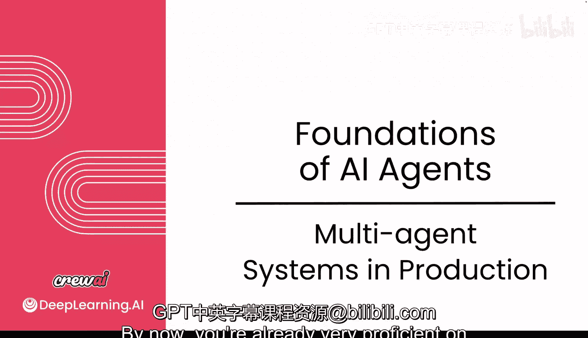
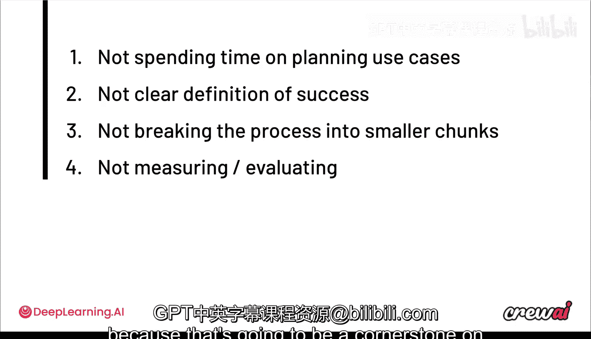

# 009：生产环境中的多智能体系统 🚀

在本节课中，我们将探讨如何将多智能体系统从原型阶段推进到生产环境。我们将了解原型与生产系统之间的巨大差异，识别在生产化过程中面临的挑战与常见陷阱，并概述确保系统稳定、可观测和高质量运行的关键考量。

## 从原型到生产的跨越

上一节我们介绍了多智能体系统的基本构建方法。本节中，我们来看看将系统投入生产环境意味着什么。

构建原型与投入生产之间存在巨大差距。在原型阶段，您可能以一次性自动化的方式运行智能体。例如，我们早期构建的用于帮助组织和准备会议的智能体团队（Crew），或者另一个用于总结会议记录、提取行动项并起草邮件的用例。

在原型阶段，这个Crew可能由您手动触发，运行后获得结果；或者您可以将其小规模部署给您的工程团队使用。关键在于，一旦您将其全面推广至整个公司，您就从“人力时间”转向了“机器时间”。

*   **人力时间**：用户少，执行次数少，易于监控和修复问题。
*   **机器时间**：用户成千上万，执行次数数十万计，如果早期没有投入精力构建监控体系，大规模下的监控和修复将变得极其困难。

当每天只有几次Crew执行时，理解执行轨迹、定位问题并修复相对容易。但当规模扩展到数百、数千甚至数十万次执行时，您无法再进行临时监控，必须确保漏洞不会开始堆积。这就是“机器时间”的含义：智能体进入高速运行环境，执行大量任务，而您仍需能以某种方式追踪其性能。

## 生产环境的核心指标

为了有效监控生产系统，您需要关注两类核心指标。

以下是您需要关注的两类指标：

1.  **深入指标**：这类指标关乎**调试和复现错误、检查执行轨迹、计算提示词（Prompt）令牌数**的能力。其核心在于能够深入任何一次具体执行，追踪并理解其中发生的一切。
2.  **宏观指标**：这类指标更多围绕**使用大语言模型作为评判员、检查输出质量、识别幻觉、评估相关性或成功率**。其理念是，您或许可以依赖深入指标进行临时调试，但一旦系统大规模运行，您需要确保有相应的体系来检查整个系统的整体质量。

## 常见的生产化陷阱

认识到生产系统的挑战后，理解如何应对至关重要。但在此之前，了解常见的失败原因同样重要。

我们发现，当前大多数在将系统投入生产时遇到困难的团队和公司，其问题往往出在**流程**上，而非**技术**上。技术已经就位，强大的模型和丰富的功能触手可及。

以下是几个常见的流程陷阱：

*   **规划不足**：没有花费足够的时间来规划这些用例。
*   **成功定义模糊**：没有清晰的成功标准定义。
*   **流程未模块化**：没有将流程分解为更小的、可供多个智能体使用的模块。
*   **缺乏评估**：即使有清晰的成功定义，也没有进行度量和评估。

无法评估系统是否真正为您创造价值，这将阻碍您做出进一步投资的决策。同时，在改进系统时，您也需要能够判断改进方向是否正确。

## 课程总结与展望

本节课中，我们一起学习了多智能体系统从原型迈向生产环境所面临的本质变化、需要监控的核心指标（深入指标与宏观指标），以及在此过程中常见的流程性陷阱。

现在您已经了解了生产系统的一些挑战，理解如何实际解决这些问题就变得非常重要。在接下来的视频中，您将看到许多可以用于调试、观测和优化多智能体系统的不同策略和技巧。请确保不要错过下一课，因为它将成为后续一些新示例的基石。