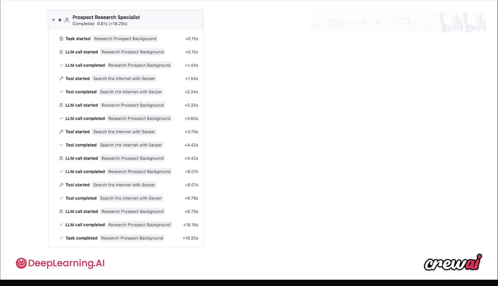
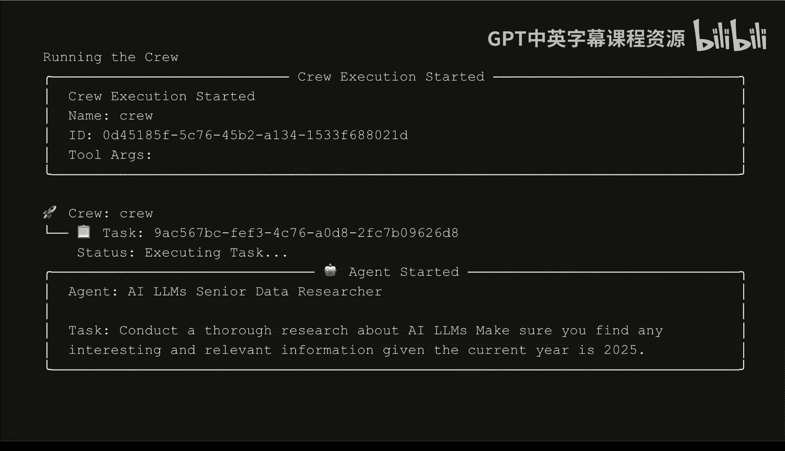
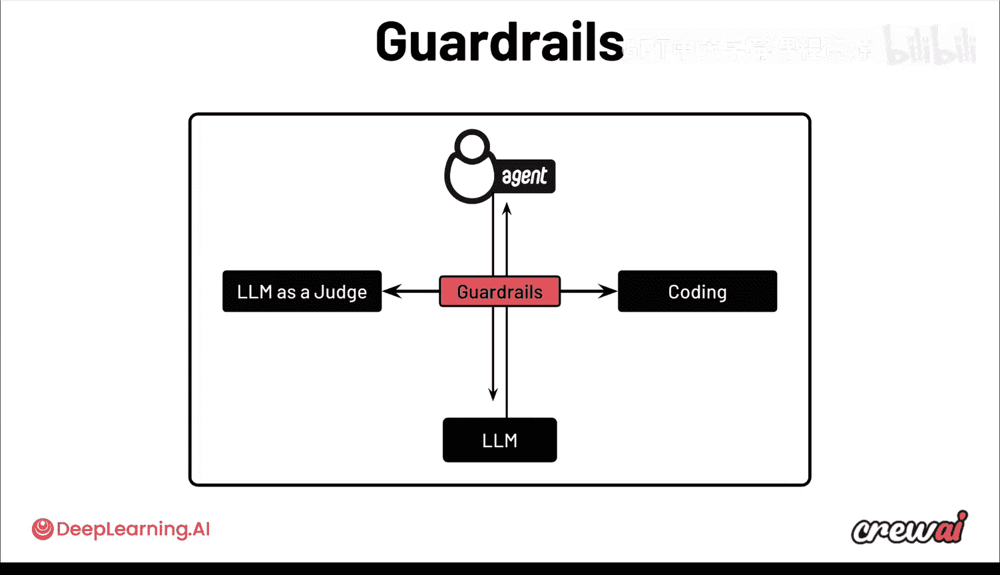

# 010：调试、观察与优化策略 🐛

在本节课中，我们将学习如何调试、观察和优化你的多智能体系统。理解系统内部运行机制并制定优化策略，对于确保系统长期稳定运行和持续改进至关重要。

## 运行时间：人类时间与机器时间

上一节我们介绍了多智能体系统的趣味性。本节中，我们来看看系统执行过程中的时间概念。

系统执行会不断累积。执行次数越多，你对系统的信任度要求就越高。最终，这不仅关乎实现价值的速度，更关乎你对输出结果的信任程度，以便你能将系统性能发挥到极致。

## 引导智能体的方法

为了引导智能体朝特定方向行动，你可以实施多种方法。以下是几种核心的上下文工程技术：

*   **系统提示词**：设计清晰的指令。
*   **角色扮演**：为智能体定义明确的角色。
*   **记忆**：利用记忆功能。
*   **工具**：为智能体配备合适的工具。

好消息是，CrewAI 已经内置了许多此类功能。然而，在部署和调试过程中，你仍会遇到许多问题，例如：智能体为何采取某个行动？数据从何而来？智能体使用了哪些工具？在早期调试、测试和部署阶段，追踪这些信息可能很困难。你需要答案来精确理解系统的行为逻辑及其决策原因。

## 核心调试与优化策略

接下来，我们将探讨几种能极大简化你工作的策略。

### 1. 利用追踪功能 🔍





当你本地运行智能体时，可以查看追踪信息。这些追踪信息会在 CAMP 的浏览器界面中打开，让你能看到智能体的每一个动作：从初始任务，到所有大语言模型调用，再到使用的工具，以及其间的一切过程。你不仅能查看耗时，还能展开细节，了解具体使用了什么工具、提供了什么输入。你甚至可以查看所有独立的消息。

当你在本地计算机上运行 Crew 时，终端会直接显示一些追踪信息，帮助你理解当前状况。执行结束后，你总会获得一个链接，确保你可以在实际用户界面中查看智能体的运行情况并进行监控。

### 2. 任务与测试

我们讨论了很多关于上下文工程和提示词设计的想法。我们知道每个智能体都有角色和背景故事，每个任务都有描述和期望输出。通过更新这些内容，你可以很大程度上控制发送给模型的信息。

但提示词设计只是冰山一角。通过任务和测试，是理解智能体行为并找到最适合你的模型的有效方法。你可以让单一智能体定义和单一任务定义，针对多个不同的大语言模型进行测试。系统会使用一个大语言模型作为“裁判”来评判每个请求的输出结果。通过这种方式，你可以基于事实数据（而不仅仅是感觉）来比较哪个大语言模型在该任务上表现最佳，哪个更可靠、更符合你的期望。

### 3. 训练智能体 🏋️

测试仅帮助你选择模型。选定模型后，如何让智能体强制执行特定格式或行为呢？这时就需要引入“训练”这一新功能。这是一种非常强大的技术。

这里的“训练”并非指训练或微调一个大语言模型（当然你也可以这么做），而是一种技术：让你的智能体多次执行任务，获取你的反馈，然后再次尝试。它会更新自己的内部记忆以学习如何改进，从而随着时间的推移不断进步。

在这个过程中，智能体反复执行任务。每次完成后，它会向你（人类）征求反馈。你提供的任何反馈都会被转化为学习经验，存入该智能体的记忆中。因此，当这个智能体执行未来的任务时，这些反馈会被注入到其提示词中。这为你提供了另一种影响上下文的方式，而不必仅仅修改任务描述或智能体定义。

### 4. 设置防护栏 🚧

许多生产系统都能从防护栏中受益。防护栏的理念是强制执行特定行为。回顾我们讨论过的从任务到训练再到防护栏的所有内容，你会发现一个共同点：确保你的智能体以某种特定方式行事。

你可以将防护栏视为位于智能体和任务完成之间的一个“关卡”。在智能体最终完成工作并传递结果之前，它会经过这个防护栏。防护栏可以是一个作为裁判的大语言模型，也可以是一个代码防护栏，即你编写代码来检查输出。

防护栏随后会判断最终输出是否成功。如果成功，则让响应通过并给出最终答案；如果发现不足，则会向智能体反馈信息，让智能体再次尝试改进。

以下是几个例子：

*   **代码防护栏示例**：假设你只想确保最终输出少于200个字符。你可以直接为此编写一个代码防护栏，使用常规 Python 代码计算字符数。如果不少于200，则发回给智能体重写。
    ```python
    if len(final_output) >= 200:
        # 触发重写逻辑
        return “output_too_long”
    ```
*   **LLM 裁判示例**：除了少于200字符，你还想确保内容是积极的。你可以使用一个大语言模型作为裁判，来检查输出是否积极。这能实现仅靠编码无法完成的复杂检查。

## 总结

本节课中，我们一起学习了调试、观察和优化多智能体系统的核心策略。我们探讨了利用**追踪功能**深入理解系统行为，通过**任务测试**科学选择模型，运用**训练**技术让智能体从反馈中学习改进，以及设置**防护栏**来强制执行特定规则以保证输出质量。



除了测试、训练、防护栏和上下文工程，还有许多其他选项可以提升系统性能，其中一些我们将在后续模块中看到。接下来，请观看下一个视频，了解最成功和最常见的生产用例有哪些。我们稍后见。