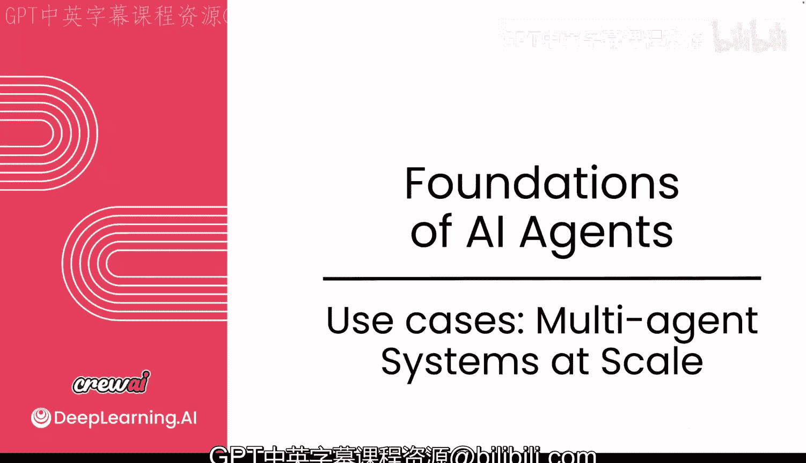
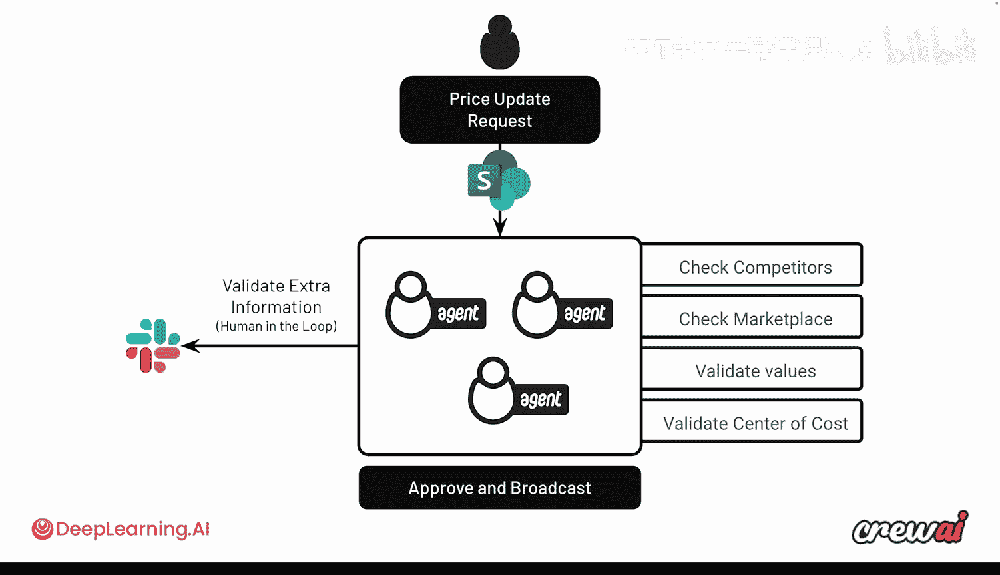
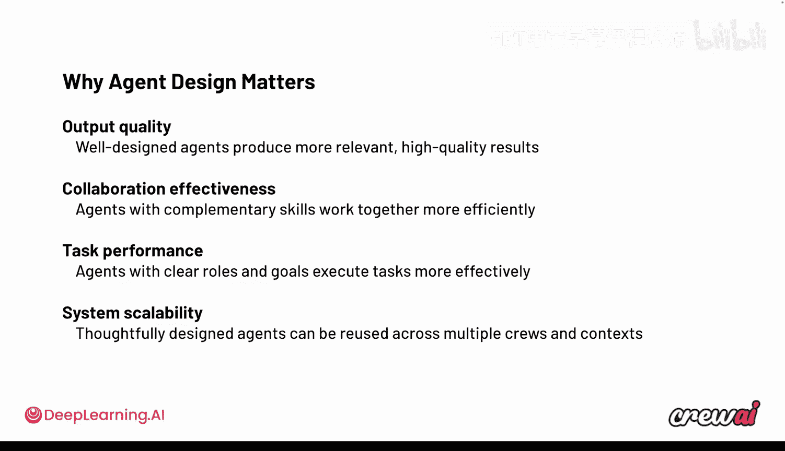

# 011：规模化多智能体系统的实际应用案例 🚀

在本节课中，我们将探讨多智能体系统在真实商业环境中的规模化应用。你将了解哪些实际用例正在为企业带来显著效益，以及如何衡量这些系统的效率提升。

## 规模化应用的实际用例

上一节我们深入探讨了多智能体系统的设计，本节中我们来看看它们在现实世界中的表现。目前，许多应用案例已展现出惊人的效率提升，范围在80%到97%之间。这里的“效率”可以通过多种方式衡量，最常见的是比较企业在实施智能体系统前后，完成特定任务所花费的时间。

## 一个真实的财富500强公司案例

为了具体说明，让我们分析一个真实的财富500强消费品公司的案例。这家公司销售薯片、维生素、方便面或啤酒等超市常见商品。

他们实施了一个非常有趣的用例，称为“收入运营”。其核心目标是解决一个历史难题：如何比以往更快地批准价格变动。这个过程传统上需要大量人工审批，例如检查竞争对手价格、核查市场行情等。

以下是该智能体系统的工作流程：

1.  **流程起点**：一切从一个更新请求开始，该请求会被录入一个SharePoint数据库。
2.  **信息检索**：智能体能够从数据库中检索该请求信息。
3.  **系列检查**：为了决定是否批准此变更，智能体会执行一系列检查：
    *   检查竞争对手价格。
    *   检查市场价格。
    *   验证数值并遵循若干基本规则，例如成本中心是谁、谁为折扣买单。
4.  **决策与执行**：如果所有检查都通过，智能体将批准并广播新的价格值，这将直接影响产品的最终售价。
5.  **人工介入机制**：如果在任何环节出现问题（例如，拟更新的价格不符合竞争对手定价），智能体会主动向相关人员请求额外验证。它们会向负责人发送提示并提出具体问题，以获取批准请求前所需的验证和信息。

这是一个极其强大的用例。可以想象，对于一家全球运营的公司，如果此类流程被妥善自动化，每周可以节省数百小时。对该企业而言，这是一个出色的初始用例。经过几周的优化实施，仅此用例就为他们带来了**94%的效率提升和97%的决策准确率**。准确率是通过比较智能体在同期做出的决策与之前人工所做的决策来衡量的，以确保一对一的可比性。

分享这个案例的目的，是为你提供一个蓝图，供你在自己的公司或团队中参考实施。

## 广泛的应用领域与功能

超越这家公司，你会发现许多顶级行业都在应用多智能体系统。我们看到高科技、消费电信、金融、客户服务、保险等领域的公司都在广泛受益。

在这些行业中，具体的功能应用主要集中在以下几个领域：
*   **销售与营销自动化**
*   **开发人员自动化**
*   **网络安全**
*   **供应链管理**
*   **定价策略**
*   **人员管理**

## 成功实施的关键考量

在讨论了所有内容之后，我们可以总结出，在实施前进行周密思考是成功的关键。你需要围绕以下几点进行设计：

*   **输出质量**：明确你希望获得什么样的输出质量。
*   **智能体协作**：思考智能体之间最佳的协作方式。
*   **性能衡量**：确定如何衡量系统性能。
*   **模型测试**：确保针对不同模型进行测试验证。
*   **规模化与护栏**：规划如何扩展系统，并设置适当的防护措施。
*   **可观测性与追踪**：添加可观测性和追踪机制，以确保获得尽可能好的输出。

我想强调的是，**在设计阶段投入时间进行深入思考，将最终帮助你取得更好的成果**，这一点至关重要。

## 总结与展望

本节课中，我们一起学习了多智能体系统规模化应用的实际案例、其带来的巨大效率收益，以及一个消费品公司的详细实施流程。我们还看到了该系统在不同行业和功能领域的广泛应用前景，并总结了成功部署的关键设计考量。

现在，你已经了解了将多智能体系统投入生产环境的主要考虑因素。我邀请你跟随我进入下一个视频，我们将讨论AI智能体革命为何正在此时发生，以及你如何参与构建它。请不要错过。我们稍后见。😊