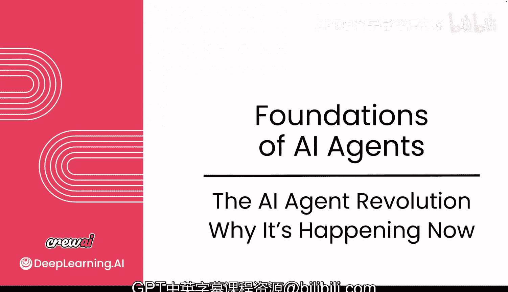
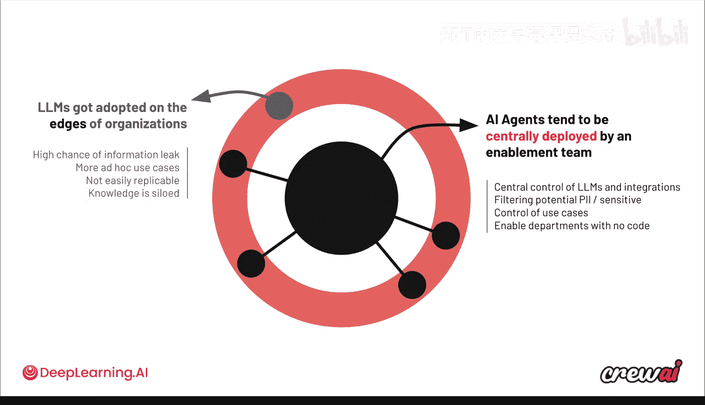
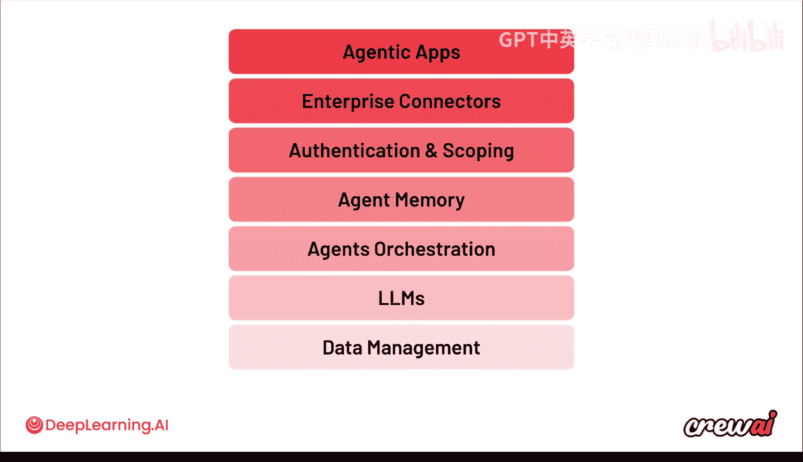
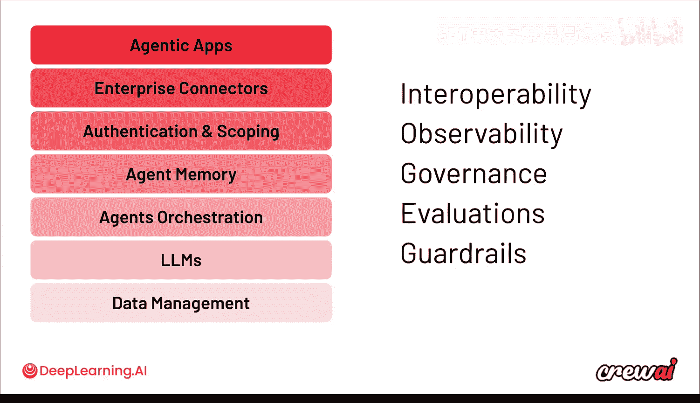

# 012：为何发生在当下

在本节课中，我们将回顾迄今为止所学的关于 AI 智能体的知识，并探讨其未来发展趋势，以及这些趋势可能对您、您的团队和公司技术决策产生的影响。

## 智能体采用模式的演变

上一节我们介绍了智能体的构建与应用。本节中，我们来看看企业采用 AI 技术的模式正在发生怎样的根本性转变。

一年前，大型语言模型的采用模式始于“边缘”。这意味着某个部门的个人开始使用 LLM 处理任务，效果很好，但并未广泛告知他人。这种模式带来了诸多问题。

以下是这种模式导致的主要问题：

*   **信息泄露风险高**：不应发送给 LLM 的数据可能被误传。
*   **用例临时性强**：难以复制推广，其他人无法效仿。
*   **知识孤岛化**：相关知识被局限在少数人手中。

这导致 LLM 的采用比预期更为分散。许多公司后来意识到了问题，并试图建立专门的团队和卓越中心。

如今，AI 智能体的采用模式则截然不同。我们看到的是“中心化”采用模式：由一个赋能团队集中部署智能体，然后允许其他团队自行使用。这确保了以下几点：

*   **对 LLM 和集成的集中控制**。
*   **在中心位置处理个人身份信息等敏感数据的移除**。
*   **对用例及其实现方式的统一管理**。

随后，赋能团队可以进入其他部门（无论是技术还是非技术部门），根据他们是否需要编码，通过 Crew Studio 或无代码方案，或直接使用 CrewAI 开源库，来启用这些用例。这是企业采用智能体方式的一个非常有趣的变化。

## 构建可靠智能体的核心概念

围绕构建可靠智能体的理念，主要基于以下三点：

1.  **易于构建**：无论是通过编码还是无代码方式，都需要非常容易使用和构建，实现从零到一的快速启动。
2.  **结果可重复**：我们深知这是非确定性系统，无法保证两次答案完全相同，但必须确保所有输出结果都是高质量的。
3.  **方案可扩展**：这不仅指能运行百万个智能体，还包括如何确保公司或团队不会重复构建相同的智能体或工具，并能在全公司范围内复用这些构建模块。

## 正在形成的智能体技术栈

基于构建智能体的理念，一个完整的技术栈正在形成。我们可以从数据管理层开始，逐级向上看：

*   **数据管理**：智能体需要接触数据，无论是 Databricks、Snowflake、Redshift 还是 BigQuery。
*   **大型语言模型**：存在多种 LLM，每个模型都有其特色和能力。您可能希望在某些用例中使用 GPT-4，在另一些用例中使用 Claude 或 Gemini。
*   **智能体编排**：这是 CrewAI 的核心领域，需要确保任务能可靠运行，并能以适当的方式进行观察和监控。
*   **认证与作用域**、**企业连接器**以及**智能体应用**。

此外，还有可观测性、支付等新兴类别不断涌现。这里的核心思想是，公司认识到智能体需要与数据交互，并且需要灵活运用不同的 LLM。

## 企业关注的五大核心要素

无论公司为技术栈的每个部分选择何种具体方案，有五件事是所有公司都会考虑的：

1.  **互操作性**：使用不同供应商服务且不被厂商锁定的能力。
2.  **可观测性**：清晰理解您的智能体做了什么，并能追溯其执行过程。
3.  **治理**：跟踪数据访问权限，确保现有的认证和授权系统能使您始终符合内部所有合规要求。
4.  **评估**：如何确保智能体的表现符合速度和质量的预期，从而保证智能体持续有效工作。
5.  **防护栏**：帮助您获得更可靠、可重复的结果。

这五大要素是每家公司都在询问的，与他们的具体技术栈构成无关。因此，最终，即使在 CrewAI 平台上，我们也确保您构建的任何东西都可以作为开源项目下载并在任何地方运行。

## 课程总结与下一步

本节课中，我们一起回顾了 AI 智能体的核心概念，探讨了其企业采用模式的演变、构建可靠智能体的要点、正在形成的技术栈以及企业关注的五大核心要素。

希望学完本课，您能收获满满，对构建自己的首个多智能体系统、理解如何将这些系统扩展到生产环境，以及哪些用例对企业最具价值充满信心。

既然您已掌握了所有这些知识，就可以准备进入我们的分级实验和分级测验了。在分级实验中，您将实现一个多智能体自动代码审查系统，这将会非常棒。

完成后，我们将在下一个模块中立即见面，在那里我们将动手实践，学习如何为您的 Crew 实现工具、防护栏、执行钩子和 MCP 服务器。这将非常令人兴奋。

期待在那里与您相见。