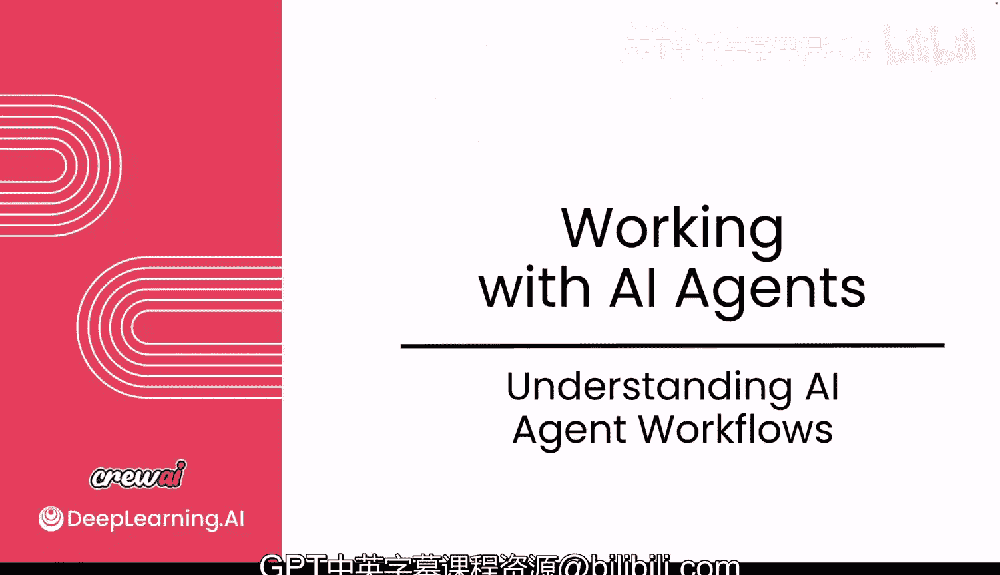
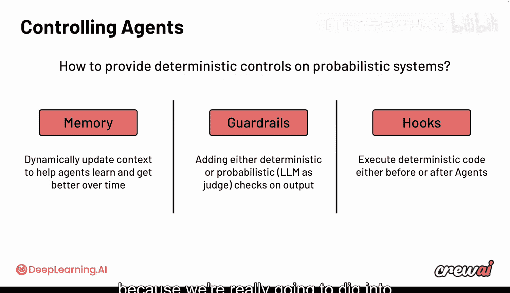
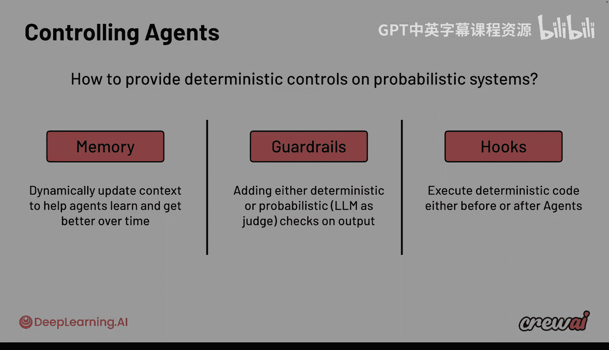

# 013：理解AI智能体工作流 🧠

在本模块中，我们将深入探讨之前学习的所有内容。我们将从理解智能体如何实际工作开始，探究其背后的运行机制、规划与执行任务的方式，以及它们如何对输出结果进行反思。这将非常令人兴奋，因为您将开始以一种前所未有的方式理解智能体的内部运作原理。

## 智能体协作与ReAct循环 🔄

我们已经了解了智能体群组（Crews）以及多个智能体如何协作完成任务。这些智能体可以通过多种方式协作，完成研究、内容创作、分析、撰写报告等各种活动。

现在，让我们聚焦于单个智能体，并讨论其核心驱动机制：**ReAct循环**。这个循环是智能体运行的基础，它代表了智能体**推理（Reason）、行动（Act）**并反复进行直到得出结论或最终输出的能力。

具体过程如下：
1.  **推理**：大型语言模型（LLM）会思考下一步该做什么。
2.  **行动**：根据推理，智能体可能会采取一个行动（例如使用一个工具）。
3.  **观察**：智能体观察该行动产生的输出结果。
4.  **循环或输出**：基于观察，智能体要么给出最终答案，要么返回第一步，重新进行推理以决定下一步行动。

例如，在创建或研究某事物的过程中，智能体会决定：“为了继续，我需要使用工具A。”获得工具A的信息后，它可能意识到还需要更多信息，于是再次进入循环，选择使用工具B。这就是标准的ReAct循环流程。

## 循环的扩展：规划、记忆与护栏 🛡️

ReAct循环还可以加入更多步骤，使其功能更强大。

*   **规划阶段**：许多现代智能体系统会在开始执行前加入一个规划阶段。智能体在此阶段进行预先推理，制定计划，该计划将影响其后续行动。这有助于智能体处理更复杂的工作。在CrewAI中，您可以通过设置一个标志（如 `reasoning=True`）来启用此功能。

*   **记忆的作用**：记忆在智能体工作流中扮演着关键角色。它会在每个步骤中动态地存入和取出信息。每当智能体进行推理或采取行动时，都会创建记忆并存入其记忆库。同样，当智能体决定下一步做什么时，也会从其记忆库中提取相关信息。

*   **护栏的作用**：护栏在后期阶段介入，用于防止输出在未完成或未达到用例标准之前被释放。它可以提供确定性或概率性的控制和检查。

## 多智能体工作流与任务委派 👥

ReAct循环不仅限于单个智能体。在我们的智能体群组中，每个执行不同任务的智能体背后都在运行着各自的ReAct循环。

您可以设计一个智能体的ReAct循环触发其他多个智能体的工作。这就像一个**管理者智能体**，它将工作委派给其他智能体，不仅决定委派什么和如何委派，还会审查返回的结果。这些被委派的智能体可以并行执行任务。

例如，初始智能体将一系列任务委派给其他智能体，最后由一个报告智能体进行汇总。报告智能体将所有智能体完成的任务和信息整合到最终报告中。

您可能还注意到了“前置与后置钩子”的概念。我们将在后续课程中详细讨论。有时，您需要这些钩子在智能体群组工作之前或之后执行代码，这在从外部拉取数据或将数据推送到外部时非常有用。

## 核心控制机制总结 📋

归根结底，我们花了大量时间讨论如何控制智能体，以及如何在这些概率性AI系统中提供确定性控制。目前，我们主要关注三种核心机制：

1.  **记忆**：动态更新的上下文，帮助智能体随时间推移更好地学习。
2.  **护栏**：为输出添加确定性或概率性控制和检查（例如使用LLM作为评判员或代码护栏）。
3.  **钩子**：允许在智能体工作之前或之后执行确定性代码。

我们将在下一个模块讨论一个更高级的控制手段：**工作流**。但现在，让我们先关注这些离散的确定性控制工具。使用它们可以显著提高您用例的可靠性。

## 下节预告 🚀

在接下来的课程中，我们将专门深入探讨**记忆**这个非常令人兴奋的主题。我们将详细研究所有不同类型的记忆及其工作原理。

本节课中，我们一起学习了AI智能体的核心工作流——ReAct循环，了解了其基本步骤以及如何通过规划、记忆和护栏进行扩展。我们还探讨了多智能体场景下的任务委派模式，并总结了当前可用于控制智能体行为的几种关键机制。理解这些基础概念是设计和构建高效多智能体系统的第一步。