# 014：2. 融入记忆与知识

在本节课中，我们将要学习如何为AI智能体赋予记忆与知识。这些能力使智能体能够自我修复、随时间改进，并更有效地完成任务。我们将探讨记忆的类型、知识如何融入，以及它们如何共同提升智能体的性能。

---

## 🧠 记忆的类型

上一节我们介绍了智能体的基本概念，本节中我们来看看智能体如何通过记忆来学习和改进。在CrewAI和大多数智能体框架中，存在几种不同类型的记忆。CrewAI特别定义了三种至关重要的记忆类型：短期记忆、长期记忆和实体记忆。

**短期记忆**旨在帮助智能体在既定上下文之外交换信息。这意味着智能体在执行任务和行动时，会将信息写入该记忆，并允许其他智能体从中读取。

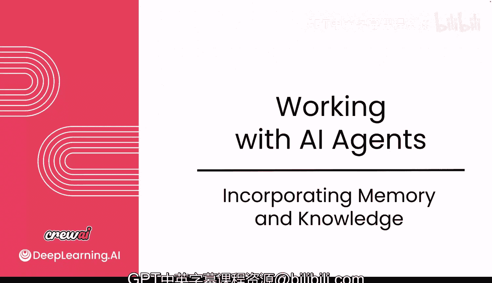

**长期记忆**则旨在帮助智能体进行自我反思，以理解随时间改进的方法。当智能体完成任务后，它们会将实际输出与预期输出进行比较，汲取经验教训，并存储起来供后续使用。这样，当它们再次执行相同任务时，就能了解哪些做法是好的、应该多做，哪些做法应该避免。

**实体记忆**帮助智能体记住可识别的实体，例如公司、产品、流程等及其描述。一个实体记忆可能包含的概念包括人物、组织和地点。智能体开始学习这些不同的事物并存储它们，这样在后续过程中就不需要再次推断或学习它们是什么。

---

## ⚙️ 启用记忆

如果你希望为你的智能体启用记忆功能，操作非常简单。你只需要在Crew实例中将一个标志位设置为 `True`。

```python
memory = True
```

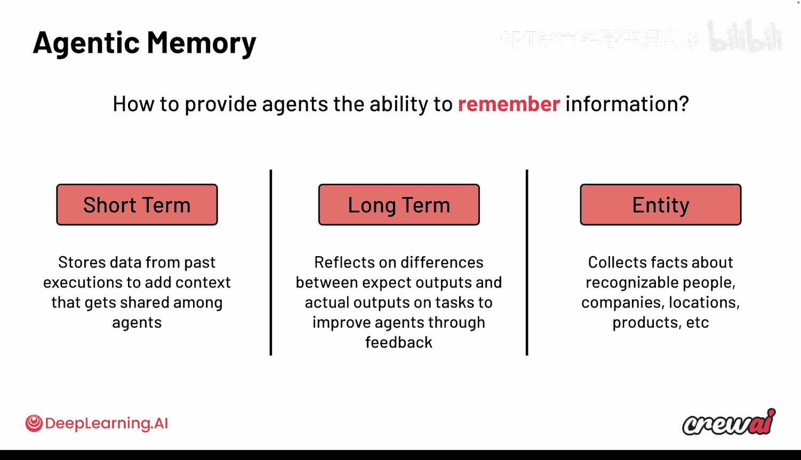

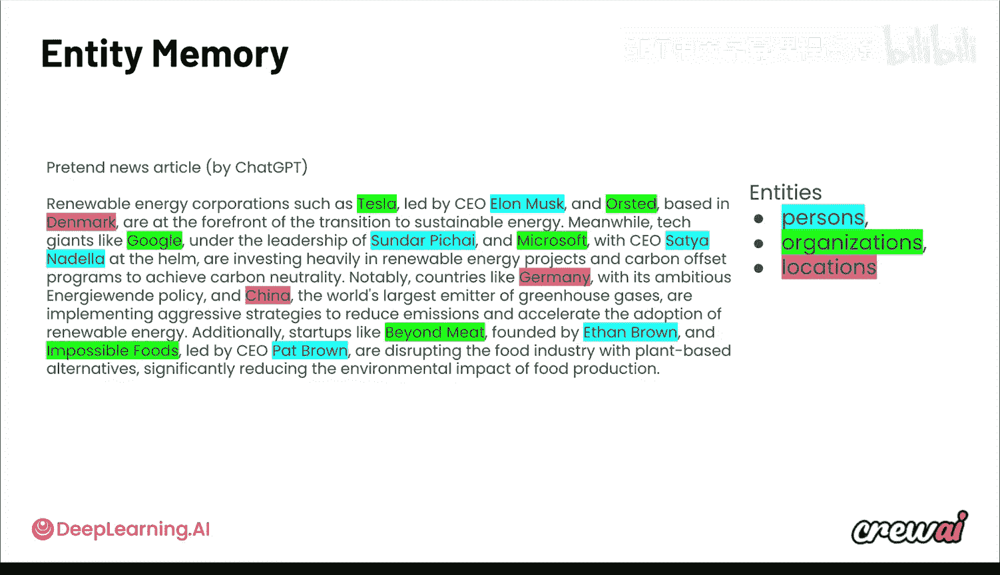

启用此标志后，你所有的智能体都将开始使用这些记忆功能。

---

## 🔄 记忆如何工作

现在我们已经了解了记忆的类型和启用方法，接下来看看记忆在智能体运行过程中是如何工作的。如果我们回顾智能体的反应循环，现在可以看到，长期、短期和实体记忆这三个不同的数据库都会将信息输入到思考过程中。

这使得智能体不仅能更了解如何做得更好，还能了解正在讨论的内容以及其他智能体可能在做的事情。当智能体完成回答后，在循环末尾会新增一些步骤，这些步骤基本上会添加反思，从而将记忆注入回那些数据库中，供未来使用。

---

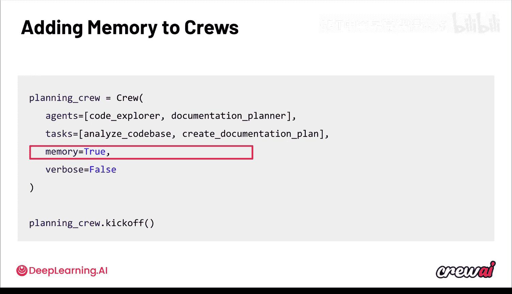

## 👨‍🏫 通过反馈生成记忆

除了数据，你还可以通过提供反馈来为智能体生成记忆。实现这一目标的方法是使用CrewAI训练功能。

CrewAI训练是你在终端运行的一项功能，它在执行结束时提示你为智能体提供反馈。这些反馈将被用来生成记忆，然后注入回数据库中。未来当这些智能体再次运行时，这些记忆将被重新注入到思考过程中。

总而言之，关于记忆，有两种生成方式：
1.  通过常规的执行过程，记忆被自动注入到记忆数据库中。
2.  通过带有明确指导的人类反馈进行训练，你指出智能体做对和做错的事情，从而生成记忆。

---

## 🗑️ 重置记忆

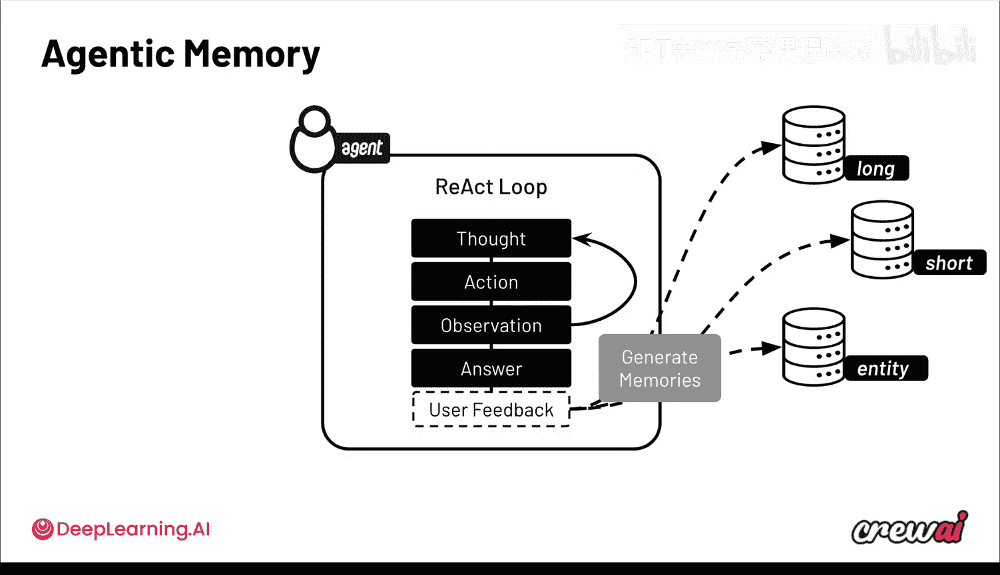

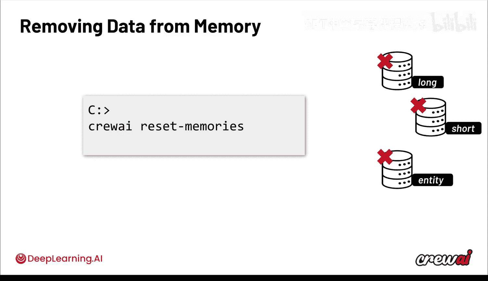

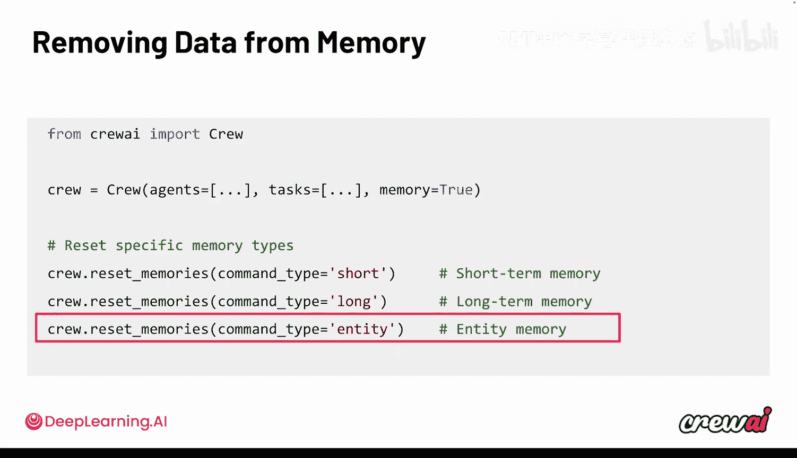

在某些时候，尤其是当你尝试使用记忆功能时，可能会需要了解如何重置这些记忆。好消息是，你只需要运行一个简单的命令。

```bash
crewai reset memories
```

这个命令会自动为你清除所有记忆，然后你可以从头开始重新创建它们，无论是通过执行智能体任务还是通过提供反馈。

---

## 📊 记忆的影响

无论你是通过生成记忆还是通过反馈训练，额外的上下文都能对智能体性能产生可衡量的影响，因为它有助于控制行为、格式或风格等方面。

例如，在一次反馈会话中，如果你告诉智能体你希望答案始终以Markdown格式呈现，它实际上会创建一个关于此的记忆。现在，该指令将自动添加到每次智能体执行中，从而强制使用特定的格式。或者，如果你希望它非常幽默，那将创建一个记忆，然后被注入以强制特定的风格。

由此可见，记忆实际上是一种非常强大且重要的方式，让你能更多地控制智能体的工作方式以及它们如何完成任务。

---

## 📚 知识：预加载的数据源

记忆并不是控制智能体的唯一方式。记忆中的数据是在执行过程中被选择性添加到上下文中的，并通过人类反馈或内部LLM作为评判来更新。

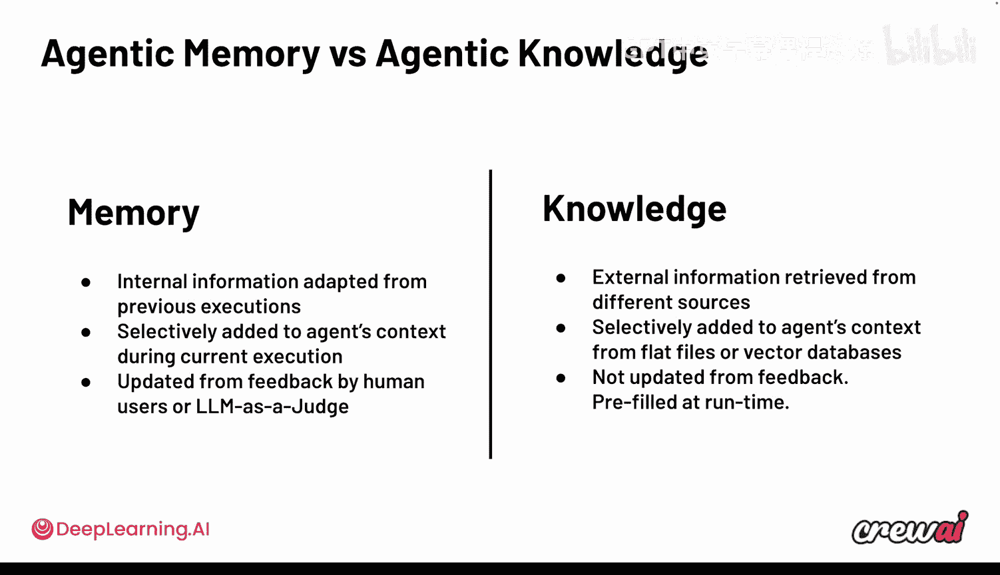

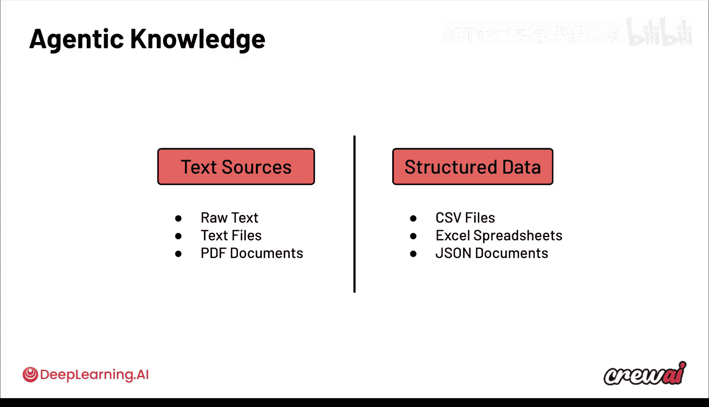

而**知识**则是数据，它同样被选择性添加，但它是**预先添加**到你的智能体中的。这意味着它不是动态生成的。如果你有特定的数据源，希望智能体在执行任务时能够意识到，你可以将这些知识预加载到智能体中，在智能体执行过程中，这些知识将被选择性使用。

这些知识源可以是：
*   文本文件（原始文本或PDF文档）
*   结构化数据（如CSV文件、Excel电子表格甚至JSON文档）

将这类数据输入到你的智能体中极其简单。你需要做的就是加载文档，然后根据知识的具体类型，使用不同的类将其嵌入到你的智能体中。

```python
# 示例：加载知识文档（伪代码）
knowledge_base = load_documents(["file1.pdf", "data.csv"])
agent.knowledge = knowledge_base
```

从那时起，你就可以确保你的智能体内部拥有这些知识源。这意味着在反应循环期间，智能体现在将能够从该知识中提取相关信息片段，以提供正确的答案。这是一种非常有用的方式，可以将额外的信息包含到你的智能体中，并确保这些信息在未来的任何执行中都能持续存在。

---

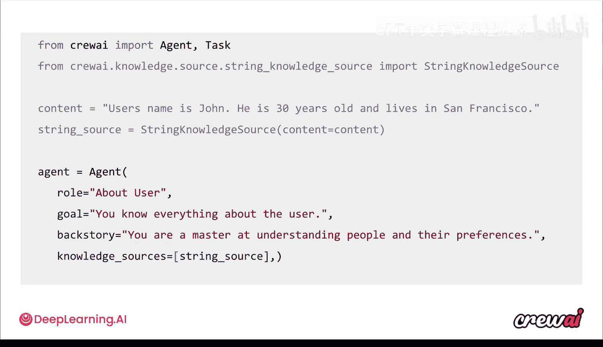

## 🎯 总结与展望

本节课中，我们一起学习了智能体的记忆与知识。记忆（短期、长期、实体）使智能体能够从经验中学习、自我反思并与同伴共享信息。知识则允许你为智能体预加载特定的、静态的数据源。两者结合，为你提供了控制智能体、强化特定模式的方法，无论是让它们随时间自我改进，还是通过反馈或预先提供知识来实现。

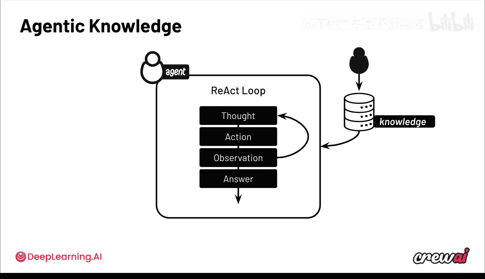

记忆非常有趣，但我对接下来的课程内容更感兴趣。那就是**防护栏**。防护栏为你提供了比记忆和知识更具确定性的控制可能性。我非常期待这个主题。下一节我们将深入探讨防护栏的工作原理以及它们如何帮助你。我们稍后见。