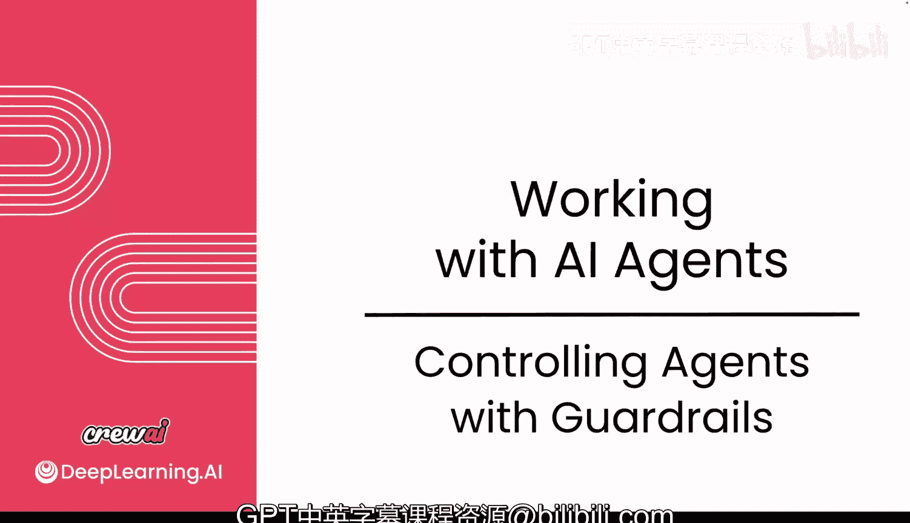
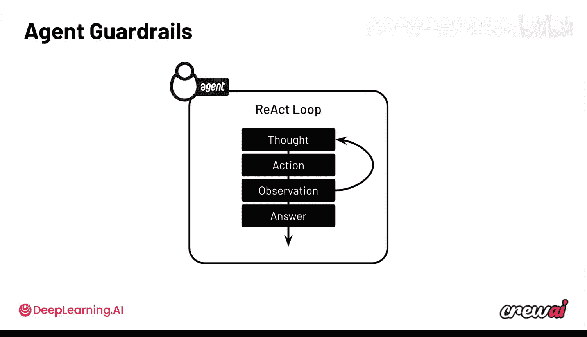
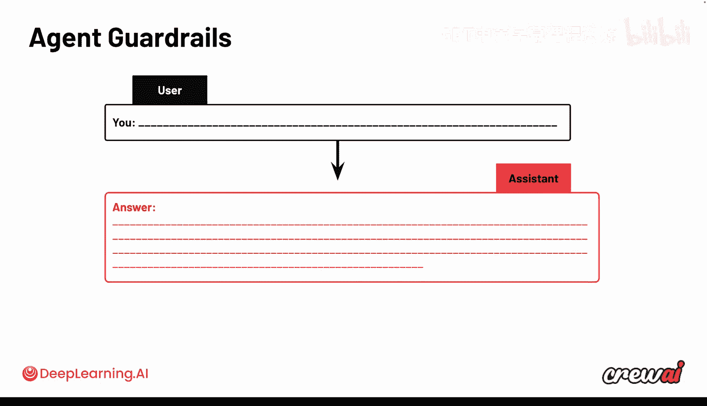
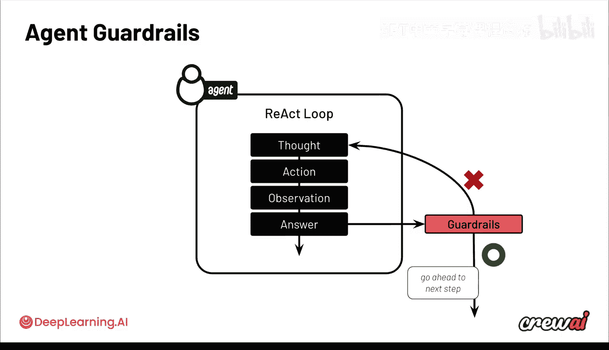
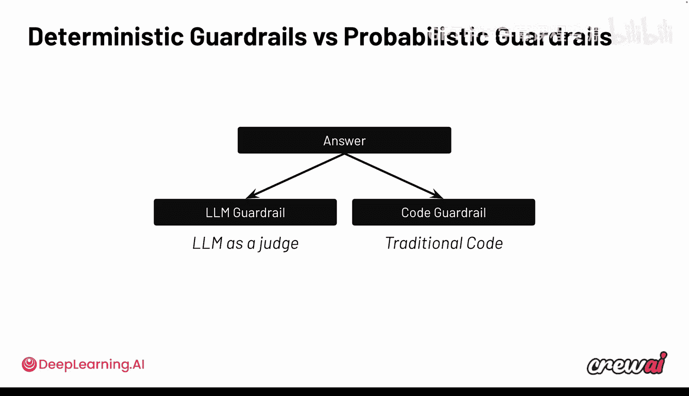
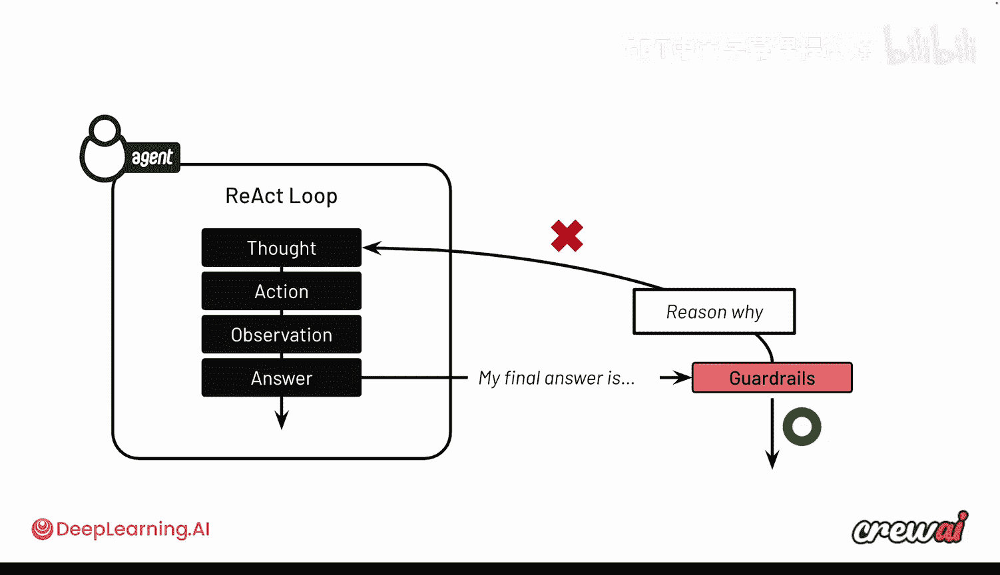
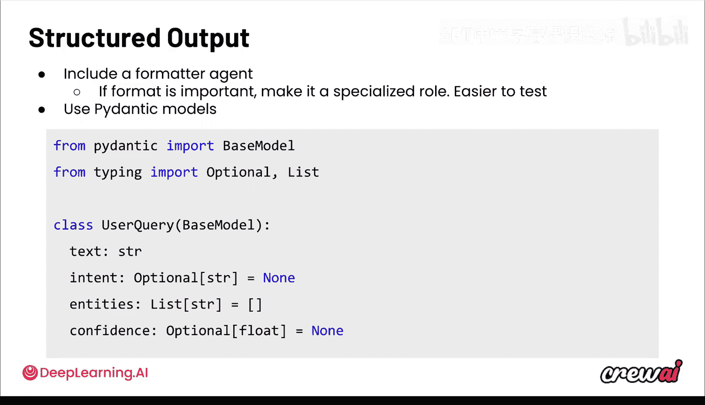

# 015：3. 使用护栏控制智能体

在本节课中，我们将要学习如何为智能体系统添加“护栏”，以确保其输出更可靠、更可预测。我们将探讨两种主要的护栏类型：LLM护栏和代码护栏，并了解它们如何在智能体的反应循环中发挥作用，以强制执行特定的输出准则。

## 概述

到目前为止，你已经对智能体有了很多了解。你理解了智能体循环、如何构建智能体以及如何构建有用的东西。

但让构建变得容易只是其中一部分。另一部分是构建你信任的东西，即能提供可靠且可重复输出的东西。所以在本视频中，我们将讨论护栏。护栏是一个基石，它能让你的智能体以更可预测的方式运行。

请记住，构建智能体系统与编写传统软件工程截然不同。因为传统软件是强确定性的，而智能体系统是非确定性的。因此，护栏在如何强制智能体以不同方式行为方面扮演着重要角色。这将会非常令人兴奋。让我们开始吧。

## 护栏的作用

护栏允许你在智能体中添加更多确定性控制，主要通过两种方式实现：使用另一个LLM作为“法官”，或者使用确定性代码。我们将讨论这两种方式，以及它们在反应循环中扮演的角色。在下一个模块中，我们还将讨论“工作流”，如果你想深入控制，这是终极方法。但当你试图强制执行特定的输出准则时，护栏可能就能解决大部分问题。

我们已经讨论过这个反应循环，它从任务开始，最终产生一系列导致答案的行动和观察。这个过程没有任何确定性。对于大多数用例来说，这就是问题所在，它们需要非常具体的答案。你不一定每次都想要相同的答案，而是想要可靠、可重复的结果。所以答案可以不同，但每次都需要令人满意。

## 护栏如何融入循环

现在，我们继续讨论对话的概念，以及你的特征和提示如何影响助手。如果你仔细想想，这些模型的核心就是你发送给它们的消息和提示。在这种智能体内部思考过程的混合中，可能会出现幻觉，模型可能会给出不一定正确的答案，或者开始偏离你实际想要的内容，不仅在内容上，在格式和风格上也是如此。

这就是护栏可以发挥作用的地方，它可以作为安全检查，作为最后的防线，确保答案是令人满意的。在模块3的后面，我们还将讨论工作流，这让我非常兴奋，因为工作流是为你的自动化构建控制层的终极方式。但护栏非常棒，因为它们允许你与大量智能体一起工作。

## 护栏的工作机制

你强制执行特定的输出。这里的想法是，你可以使用一个护栏来验证实际的答案，然后可能发生两种情况之一。首先，答案没有通过护栏检查。这意味着答案不符合你定义的任何标准，然后它会回到循环中。但护栏实际上可以提供关于答案为何错误的额外反馈，并将其注入回反应循环，以便智能体可以做得更好。然后，如果智能体再次尝试，并且这次通过了，护栏就允许它进入下一步并给出实际答案。

护栏的酷炫之处在于，它们允许你在流程中途验证信息，因为它们是在任务级别运行的。不仅如此，它们还允许你将反馈注入回循环。你可以把这看作是一个更确定性的“人在回路”机制，你不仅可以让你的智能体与真实的人对话，现在还可以通过编程方式检查输出。

你可以使用两种类型的护栏。

## 护栏的两种类型

第一种是LLM护栏。这基本上是使用另一个LLM作为法官，让这个LLM进行事实核查或对消息进行某些处理，以判断其好坏。

另一种是代码护栏。你可以编写实际的代码来验证答案是否正确。

你可以在CrewAI中开箱即用地使用这两种护栏。LLM护栏稍微宽松一些，因为它依赖于另一个LLM，但构建起来极其简单。而传统的代码护栏需要你进行一些额外的编码，但允许你做到你想要的任何具体程度。

如果你考虑LLM护栏，这里发生的情况是：当智能体获得最终答案时，它会进入这个LLM护栏，然后护栏调用一个单独的LLM，根据某些特定标准检查这个答案是否合理。如果答案不合理，则返回思考过程。如果答案良好，则可以继续前进。

代码护栏的一个例子会是更确定性的东西，比如检查答案长度。你可以检查答案是什么并计算字符数。如果字符数少于200，因为你有一个硬性要求，答案必须简短，那么代码检查通过，任务完成。但如果不符合，则将其发送回反应循环。因此，在这里你可以看到，使用代码护栏，你可以非常具体，并使用常规的Python来实现这些检查。而对于LLM护栏，你可以直接告诉另一个LLM去进行事实核查或任何LLM可能能够进行的其他检查。

关于这一点很酷的是，无论你使用的是代码护栏还是LLM护栏，总会有一些关于未通过护栏的原因的反馈，你可以将其发送回去。

## 反馈机制

在LLM护栏的情况下，反馈将自动生成并发送回去。但在代码护栏的情况下，你可以动态设置原因，例如告诉智能体这个答案太长了，需要只有200个字符长。这些信息将被发送回反应循环，允许你的智能体接收这些信息，并尝试重写最终答案，或者采取更多行动，以实现符合护栏要求的结果。

让我给你看一些快速的代码，展示这是如何工作的。

## 代码护栏示例

对于代码护栏，你需要做的就是在Python中定义一个简单的函数。

这个函数将接收一个字符串作为输出参数，这基本上就是智能体发送给这个函数进行验证的内容。

在这个函数内部，你可以做任何你想做的事情。在这个例子中，我们保持简单，只检查字数是否少于200。

如果为真，它将允许你的智能体继续前进，给出最终答案，并进行下一个任务。

但如果为假，你也可以在这里包含一个原因，说明为什么它不好。这些信息将被注入回智能体，让它再试一次。

为了将护栏实际添加到智能体本身，你只需要在你的任务中添加一个新属性，即 `guardrails`。你也可以添加多个，因为它接受一个数组作为值，这意味着你可以添加许多不同的护栏。不仅可以是代码护栏，也可以是LLM护栏，或者任何你想要的护栏。

## 强制执行结构化输出

另一种获得更好结果的方法是强制执行结构化输出。这可以确保无论你从智能体和Crew中得到什么，都遵循你期望的特定格式。这可能非常有帮助，特别是如果你计划对这些数据做些什么。

所以，如果你要将这些数据发送到某个地方，比如外部应用程序，或者如果你想基于这个输出采取行动，那么最好能确切知道你得到的格式是什么。你可以在这里使用Pydantic来实际强制执行这种格式，并确保Crew的输出始终映射到你的需求。

强制执行特定格式的一个选项是使用专用的格式化智能体。这种策略更容易分配给任务，因为它使格式化成为一个专门的角色。

然而，最终的格式化强制执行是使用Pydantic模型，你可以实际使用一个单独的LLM（如果你想的话）来生成结构化的函数调用输出。

所以，你可以创建你的类，例如这个 `UserQuery` 类，它使用Pydantic的 `BaseModel` 来定义该系列属性。现在，你可以实际将这个类作为你希望从此智能体获得的输出示例传递，智能体将实际强制执行并对照该示例进行检查。

这里很酷的一点是，你可以选择在最后获得一个Pydantic对象实例，或者这个对象的JSON结构。你可以通过设置 `output_pydantic` 或 `output_json` 来指定。通过这种方式，你可以确保始终获得你关心的相同格式的输出。然后，你可以对这个结构化输出做任何你想做的事情。

例如，在这个 `UserQuery` 示例中，你可能希望将文本推送到数据库中，但前提是置信度分数高于0.5或0.7，或任何其他值。所以你可以看到，通过不仅定义对象，还定义你获得的属性类型，你现在可以使用这些属性来进行条件逻辑判断或许多其他事情。

## 总结

本节课中，我们一起学习了如何使用护栏来控制智能体的输出，使其更加可靠和可预测。我们介绍了两种主要的护栏类型：LLM护栏和代码护栏，并了解了它们如何在智能体的反应循环中验证输出、提供反馈并强制执行特定格式。通过使用护栏，你可以在非确定性的智能体系统中引入确定性的检查点，从而构建出更值得信赖的应用程序。