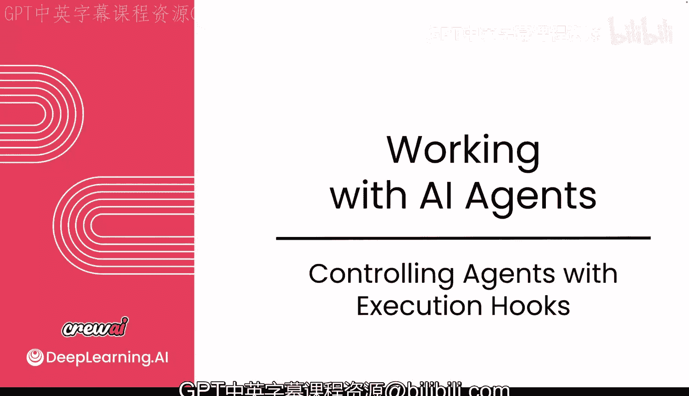
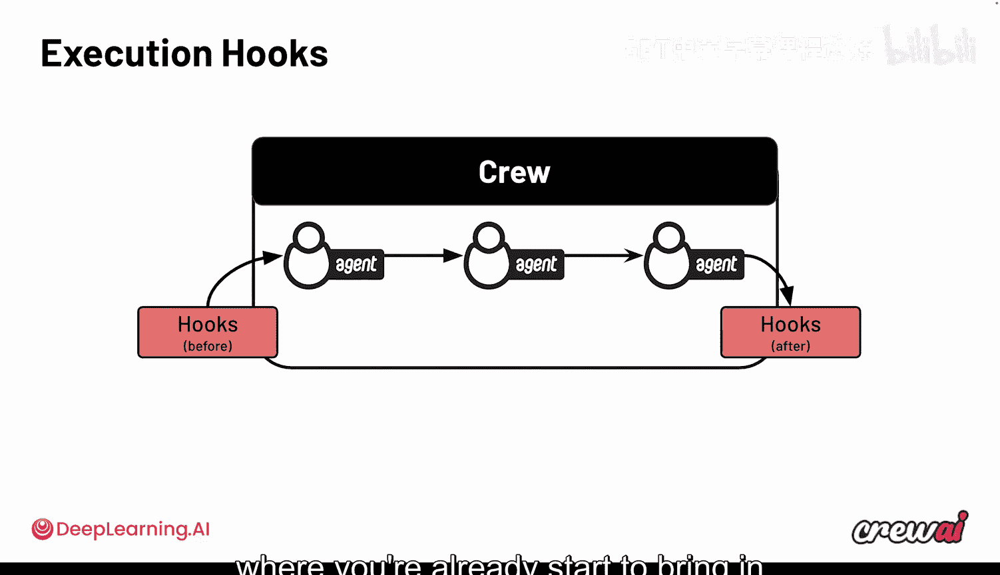
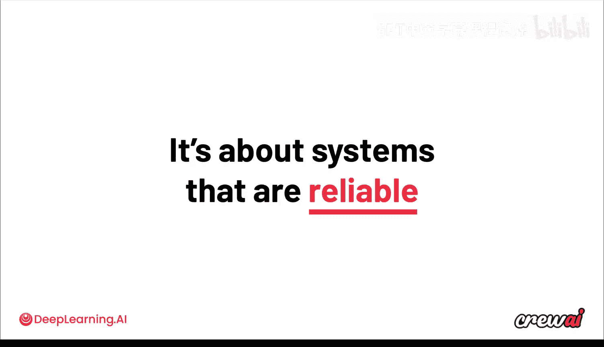
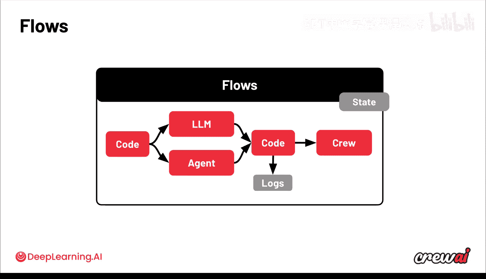

# 016：4. 使用执行钩子控制智能体

## 概述
在本节课中，我们将要学习如何使用执行钩子来控制智能体。执行钩子允许我们在智能体开始工作之前或完成工作之后运行自定义代码，从而实现对输入数据的预处理或输出数据的后处理，这对于构建可靠的生产系统至关重要。

## 正文
到目前为止，你已经了解到智能体非常强大。它们擅长动态决策并响应你提出的任何要求。

但有时你需要更多的控制权。有时你需要确保在智能体执行之前或之后运行实际的代码。

这正是执行钩子的用武之地。它允许你编写代码，这些代码将在智能体开始工作之前或刚刚结束之后运行，并利用这些代码向智能体输入数据，或从智能体中提取数据并发送到其他地方。

这是一种非常有趣的技术，根据你的使用场景，它可以发挥巨大的作用。

下面让我展示如何实现它。现在，你对 Crew 已经非常熟练了。你可能已经意识到，当你拥有一个 Crew 时，你可能希望在它开始工作之前或完成工作之后触发某些操作。

这些操作可以是多种多样的。很多时候，它涉及从某个地方加载数据，或者将数据卸载到某个地方。你可能希望利用这些数据来修改某些信息。

因此，在大多数情况下，你可能希望执行某些操作来修改进入智能体的输入，或修改从你的 Crew 输出的结果。

你可能希望在开始工作流之前以某种方式更改这些信息，或将其与其他内容结合。在工作流结束时，你可能希望将最终结果推送到 Salesforce 等系统，甚至是你的电子邮件中。

这就是钩子的作用，因为前置钩子或后置钩子允许你在相应位置编写你想要执行的代码。这就像在工作流中加入一个额外的步骤，让你可以将实际的编码逻辑引入到智能体流程中。

例如，前置钩子可能用于获取输入数据、清理输入数据、检查个人身份信息并确保将其剔除。而后置钩子则用于验证输出、审核内容、移除个人身份信息，或者仅仅是将输出记录到某处以供后续检查。

以下是一个良好的前置钩子函数示例。假设输入的一部分是一个电话号码，你需要确保其格式正确。

你在这里所做的是提取这些信息，并使用常规的 Python 代码将其分解为特定格式，然后重新将其引入到输入中。这样做可以确保进入 Crew 和智能体的数据格式正确。

以下是一个良好的后置钩子函数示例。现在你获取到了输出。假设输出中也包含电话号码，但你想将其隐藏起来。那么，你可以实现一个功能，隐藏部分数字，只显示最后四位数字，即对输出的部分进行模糊处理，然后返回处理后的输出。

现在，如果你想将这些前置钩子和后置钩子添加到你的任务中，在代码中你只需要添加这两个新属性：`prehook` 和 `posthook`。你可以看到它们都以列表作为值，这意味着你可以添加许多不同的钩子，无论是在执行前还是执行后运行，从而让你拥有很大的控制权。

归根结底，你可以看到钩子，无论是前置还是后置，在帮助你构建可靠系统方面都能发挥巨大作用。如果有一件事你会反复听到我提及，那就是：为了让系统能够投入生产，它们必须是可靠的。

你绝对可以非常轻松地使用 Crew 构建它们，无论是无代码还是专业代码方式。但当你部署它们时，你需要确保它们能提供一致的输出，并且能够控制任何进出系统的信息。

因此，归根结底，钩子的很多重点都围绕着构建可靠系统这一理念。现在，你能获得的最高级别的控制是在你使用 C eye flows 时，我们将在模块三中详细讨论这一点。

这里的理念是，Flows 允许你将实际代码与单个 LLM 调用、单个智能体或整个 Crew 融合在一起。这是能将一切整合在一起的终极支柱。

在接下来的几节课中，我们将深入探讨 Flows。我已经开始为你整合一些这方面的背景和概念。Flows 可以极其强大，因为它们允许你创建完全不涉及 LLM 的简单自动化，也能构建像我们在这里看到的更复杂的东西。

希望到目前为止你享受这个过程。下一课，我们将讨论 AI 智能体如何使用外部工具。工具是你的智能体完成工作的核心部分，因为它们使你的智能体能够做很多事情。

它们将能够接入外部资源，能够推送外部数据并在不同系统中执行操作。我相信你会对此非常感兴趣。你一定不想错过。让我们直接进入下一课。

## 总结
本节课中，我们一起学习了执行钩子的概念与应用。我们了解到，前置钩子可用于在智能体执行前预处理输入数据，后置钩子则用于在智能体执行后处理输出结果。通过向任务添加 `prehook` 和 `posthook` 属性，我们可以插入自定义代码逻辑，从而增强对智能体工作流的控制，这对于确保系统在生产环境中的可靠性和一致性至关重要。