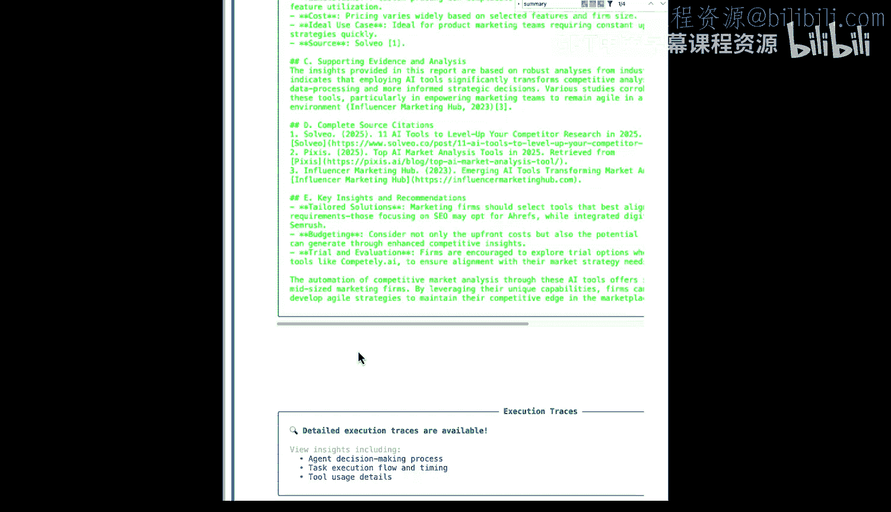

# 017：5. 改进深度研究智能体组

在本节课中，我们将把之前学到的知识付诸实践。我们将对之前构建的深度研究智能体组进行改进，为其加入记忆功能和执行钩子，使其能力得到进一步提升。让我们开始吧。

## 概述


上一节我们介绍了智能体组的基本构建。本节中，我们将把深度研究智能体组提升到一个新的水平。我们不仅会优化已有的组件，还会应用一些新学到的概念，例如防护策略和回调钩子，以确保生成更高质量的报告。


## 从代码到配置文件

首先，我们像往常一样加载必要的模块和类，包括智能体、任务、智能体组以及搜索工具。同时，我们也会加载API密钥。

```python
# 加载模块和工具
from crewai import Agent, Task, Crew
from tools import A_search_tool, scrape_website_tool
import os

# 加载API密钥
os.environ["OPENAI_API_KEY"] = "your_openai_key"
```

接下来，我们创建工具的实例，这与之前的工作方式相同。

```python
# 创建工具实例
search_tool = A_search_tool()
scrape_tool = scrape_website_tool()
```

现在，我们将采用一种新的方式来定义智能体和任务：使用YAML配置文件。这样做可以将智能体的定义（如角色、目标和背景故事）与核心代码分离，使代码更清晰，也便于非技术人员参与修改。

以下是配置文件的示例结构：

**`agents.yaml`**
```yaml
research_planner:
  role: 研究规划师
  goal: 制定高效的研究计划
  backstory: 你是一名资深研究策略专家...

internet_researcher:
  role: 网络研究员
  goal: 根据计划搜集详细信息
  backstory: 你是一名善于从网络获取信息的专家...
```

**`tasks.yaml`**
```yaml
plan_research:
  description: 为给定的研究主题制定详细计划。
  expected_output: 一份包含步骤和资源的研究计划文档。

gather_info:
  description: 执行研究计划，搜集具体信息。
  expected_output: 一份包含原始数据和初步发现的信息汇总。
```

在代码中，我们可以轻松加载这些配置来创建智能体：

```python
# 从YAML文件加载配置并创建智能体
import yaml

with open(‘config/agents.yaml‘) as file:
    agent_configs = yaml.safe_load(file)

agents = []
for key, config in agent_configs.items():
    agent = Agent(
        role=config[‘role‘],
        goal=config[‘goal‘],
        backstory=config[‘backstory‘],
        tools=[search_tool, scrape_tool], # 工具可以单独配置
        verbose=True # 启用详细输出日志
    )
    agents.append(agent)
```

通过`verbose=True`参数，我们可以在执行过程中看到智能体的思考过程，这对于调试和理解工作流非常有帮助。

## 实施防护策略

在创建任务之前，我们先建立一个“防护栏”。这是一个代码函数，用于在任务最终输出前检查其内容是否符合我们的格式和质量要求。

```python
def report_guardrail(task_output):
    """
    检查最终报告是否包含必要部分。
    """
    output_lower = task_output.lower()
    checks = [
        ‘summary‘ in output_lower,
        ‘insight‘ in output_lower or ‘recommendation‘ in output_lower,
        ‘citation‘ in output_lower or ‘reference‘ in output_lower
    ]

    if all(checks):
        # 所有检查都通过
        return True, task_output
    else:
        # 检查失败，返回错误信息指导智能体重做
        feedback = “报告必须包含以下部分：1) 摘要（Summary）， 2) 见解或建议（Insights/Recommendations）， 3) 引用或参考文献（Citations/References）。请补充缺失的部分。”
        return False, feedback
```

这个函数会检查报告是否包含摘要、见解和引用。如果任何一项缺失，它会返回`False`和具体的反馈信息，这些信息会被传回给智能体，让其修正工作。

## 创建任务与分配防护栏

现在，我们从YAML文件加载任务配置并创建任务。关键的一步是将上面定义的防护栏函数分配给最终的报告撰写任务。

```python
# 从YAML文件加载任务配置
with open(‘config/tasks.yaml‘) as file:
    task_configs = yaml.safe_load(file)

tasks = []
for key, config in task_configs.items():
    task = Task(
        description=config[‘description‘],
        expected_output=config[‘expected_output‘],
        agent=assign_appropriate_agent(key), # 需要根据逻辑分配智能体
        async_execution=False
    )
    # 如果是最终报告任务，则添加防护栏
    if key == ‘write_final_report‘:
        task.guardrail = report_guardrail
    tasks.append(task)
```

## 添加执行钩子

接下来，我们创建一个执行后钩子。钩子是在智能体组执行特定阶段（如启动前或结束后）自动运行的函数。这里我们创建一个简单的钩子，用于在智能体组运行结束后将最终报告保存为Markdown文件。

```python
def save_report_hook(output):
    """
    将最终输出保存为文件的钩子函数。
    """
    filename = “final_research_report.md”
    with open(filename, ‘w‘, encoding=‘utf-8‘) as f:
        f.write(output)
    print(f“报告已保存至：{filename}”)
```

## 组装并运行智能体组

最后，我们将所有组件——智能体、任务、记忆功能和钩子——组装成智能体组并运行它。

```python
# 定义智能体组
deep_research_crew = Crew(
    agents=agents,          # 我们创建的智能体列表
    tasks=tasks,            # 我们创建的任务列表
    memory=True,            # 启用记忆功能，允许跨轮次学习
    verbose=True
)

# 添加上面定义的保存报告钩子，在智能体组执行后调用
deep_research_crew.after_kickoff_callback = save_report_hook

# 定义输入并运行智能体组
research_topic = “研究用于自动化竞争性市场分析的前五大新兴AI工具”
result = deep_research_crew.kickoff(inputs={“topic”: research_topic})
print(result)
```

运行后，我们可以观察智能体的执行流程。研究规划师首先制定计划，研究员根据计划搜集信息，事实核查员验证信息，最后报告撰写员生成报告。如果最终报告因缺少“摘要”部分而被防护栏拒绝，报告撰写员会收到反馈并重新生成包含摘要的报告，直到通过所有检查。

## 总结



本节课中，我们一起学习了如何改进一个深度研究智能体组。我们引入了YAML配置文件来管理智能体和任务定义，使项目结构更清晰。我们实现了一个代码防护栏，用于自动检查输出质量并引导智能体自我修正。我们还创建了一个执行后钩子，用于自动保存工作成果。最后，我们为智能体组启用了记忆功能。通过这些改进，我们的智能体组变得更强健、更易维护，并且能产出更符合要求的成果。请尝试修改任务定义、防护栏规则或模型，亲身体验这些概念如何在实际中发挥作用。