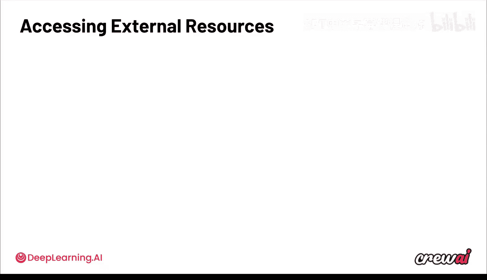
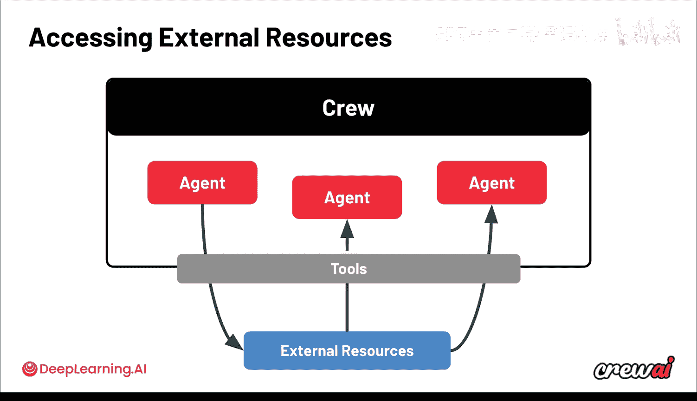
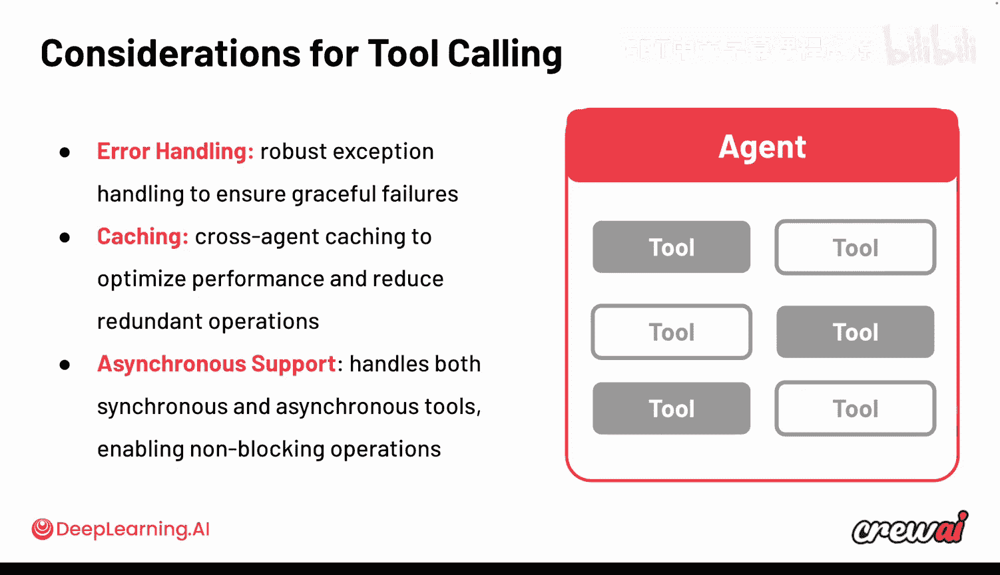
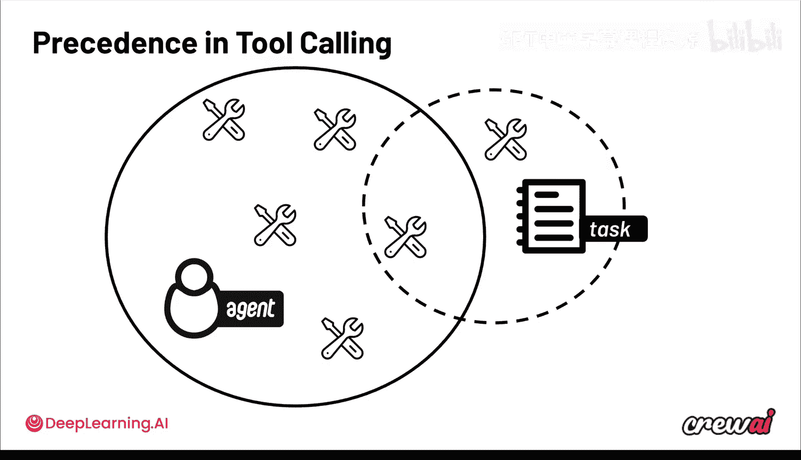
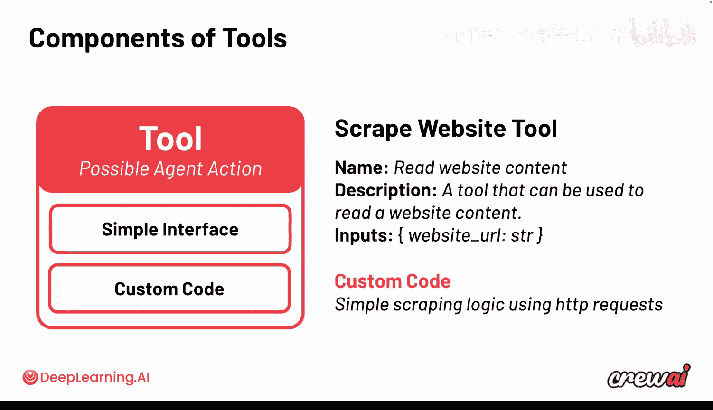
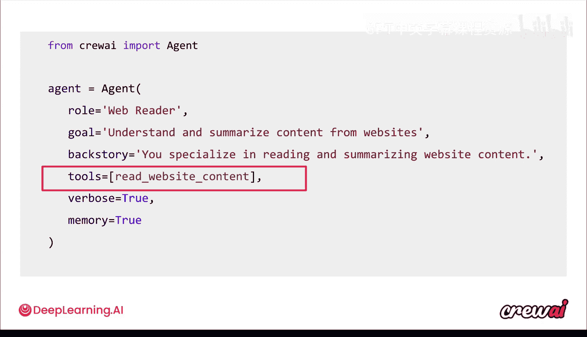
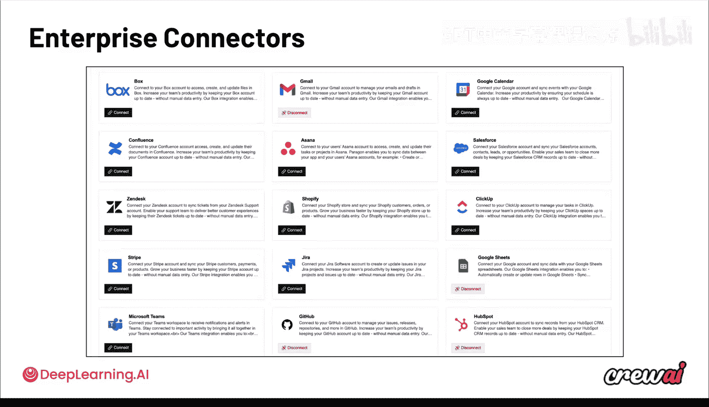
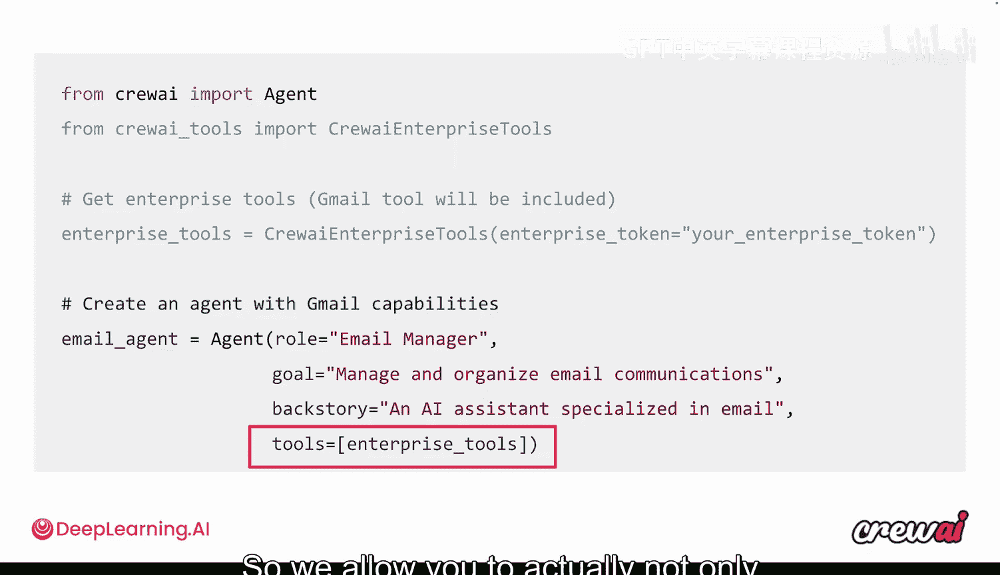
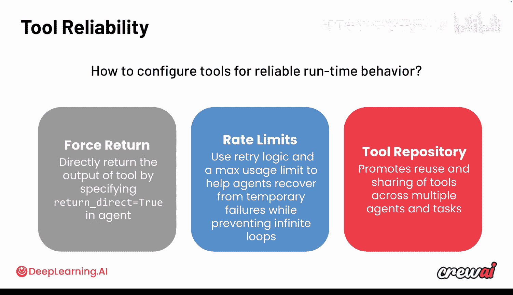

# 018：6. 在智能体中使用工具 🛠️


在本节课中，我们将要学习智能体（Agent）的核心组成部分之一：工具（Tool）。工具是智能体与外部世界交互的桥梁，它们极大地扩展了智能体的能力，使其能够执行更复杂、更实用的任务。

## 概述：什么是工具？

智能体的一个重要特性是工具，我们之前对此讨论不多。工具允许你的智能体与外部世界进行交互，无论是发送数据、拉取数据，还是执行某些操作。当智能体拥有可支配的工具时，它们能完成许多不同的事情。这是使用智能体最酷的部分之一，也非常重要，因为它们实现了与外部世界的交互，并极大地扩展了你能构建的用例范围。



现在，让我们深入探讨工具的世界，理解如何使用它们。这非常令人兴奋，因为工具能让你的智能体完成更复杂的工作，并与外界系统进行交互。

## 工具的作用与形态

上一节我们介绍了工具的基本概念，本节中我们来看看工具具体能做什么。

我们已经知道，你可以在一个“团队”（Crew）中组织你的智能体，并且这个团队可以包含多个智能体。现在，这些智能体将能够利用外部资源。利用这些资源可能有几种不同的形式。



以下是几种常见的工具形态：
*   **发送数据**：例如，将数据写入数据库、CRM系统或ERP系统。
*   **拉取数据**：例如，从互联网上搜集信息、进行网络爬取、执行谷歌搜索等。
*   **执行操作**：例如，运行代码或在外部系统上执行某些动作。

在许多用例中，总是涉及与数据交互的元素，无论是拉取数据、更新数据还是介于两者之间的操作。而实现这一切的方式就是通过工具。工具正是允许智能体利用这些资源的关键。

## 为智能体配置工具

一个智能体可以拥有多个工具。如果你仔细观察，会发现你可以为智能体提供任意数量的工具。

但是，为智能体提供过多工具可能会适得其反，特别是当工具数量太多，导致智能体不知道应该使用哪个工具时。因此，根据模型大小、任务的复杂性甚至工具本身的复杂性，过多的工具可能导致智能体迷失方向，无法理解何时使用正确的工具。这又回到了将工作分解为多个智能体、多个任务和多个工具的思路。你需要确保为智能体提供足够的工具，但也要确保是合适的工具，不仅要允许智能体进行这些调用，还要记住，过多的工具可能会影响性能。

以下是一些最常见的工具类型示例：
*   涉及文件和文件夹的工具
*   查看当前文件系统的工具
*   网络爬取和浏览工具
*   数据库连接工具
*   代码执行工具

这些只是我们看到的一些例子，但还有更多可能。你甚至可以创建自己的自定义工具，以集成到内部系统中，连接公司内部运行的其他服务。

## 工具调用的优势与特性

关于工具调用，有几个方面需要理解。首先是它的**效用**：它通过将智能体与外部系统集成来扩展其能力，同时也提供了灵活性，因为你可以创建自定义工具来连接自有的系统。

其次，工具调用有一些特定的优势，特别是以下几点：
1.  **错误处理**：CrewAI 已经内置了强大的异常处理机制，确保失败更优雅，智能体可以自我修复。
2.  **缓存机制**：在整个团队执行过程中，当智能体使用工具时，系统会缓存针对特定参数的工具调用结果。这意味着如果智能体反复使用同一个工具，它不会再次调用相同的API。这不仅节省了时间、金钱和令牌，还有助于应对外部系统的可用性问题。
3.  **同步/异步支持**：系统同时支持同步和异步工具。这意味着你的工具可以立即返回结果，也可以有一个异步端点，允许非阻塞操作，这样智能体在等待某个工具返回时，其他智能体可以继续工作。



## 工具在智能体与任务中的分配

在给智能体分配工具时，有一点需要特别注意：在 CrewAI 中，**工具既可以分配给智能体，也可以分配给任务**。

这意味着，智能体将拥有属于其“武器库”的工具。当它们去执行任务时，将能够使用这些工具。但是，如果你为某个任务单独设置了一套工具，那么智能体在执行该任务时，其可用的工具选择将被限制在这套任务工具内，而不是它自身拥有的所有工具。



换句话说，即使一个智能体有能力写入你的CRM系统，但对于某个特定任务，如果你希望确保这不是一个可选项，你可以给这个任务分配另一套工具，而这套工具将优先于智能体自身的工具。因此，你可以通过多种不同的层级来控制智能体的实际能力，无论是直接给智能体分配工具，还是给任务分配一个用于完成该任务的工具池。

我知道这听起来可能有点复杂，但当你重用一个智能体来执行一系列不同任务，并且可能希望为它执行的每个任务都配备一个工具子集时，这实际上非常有帮助。

## 工具的构成：接口与代码

现在，让我们快速了解一下工具的构成，看看它有哪些组件。工具基本上由两个主要部分组成。

第一部分是一个**非常简单的接口**。这个接口向智能体描述如何使用它。因此，它需要有一个名称、一个描述，以及一系列关于如何使用它的输入参数。

第二部分是**自定义代码**。这是你可以为工具做任何事情的地方。你可能希望它与外部服务进行身份验证，可能希望它进行API调用，或者可能希望它通过其他某种协议进行服务连接。这里的核心思想是，通过这两部分的结合，你得到了一个非常简洁的包，可以传递给智能体，不仅教会它们如何使用，还告诉它们在调用后要做什么。

让我们看一个例子，例如一个“爬取网站”的工具。它的名称可能是 `read_website_content`。你可以看到名称可以非常具有描述性。描述本身说明了何时应该使用这个工具。在这个例子中，它“使智能体能够读取网站内容”。输入参数是网站URL。每当你的智能体尝试爬取网站时，它都会传递这个网站URL参数。然后是一些自定义代码，这是一个简单的爬取逻辑，基本上使用了HTTP请求。



在这里，你不仅可以看到这个例子，还可以构建自己的自定义工具。请记住，自定义代码可以是任何东西。事实上，我们已经为你构建了许多预制的工具，不仅用于爬取，还用于许多其他事情。如果你考虑更复杂的外部工具，例如需要适当身份验证的电子邮件、日历或文档访问工具，我们在CrewAI平台上提供了许多这样的预制工具，你可以在线查看。

## 如何创建自定义工具

让我展示一下自定义工具的样子。这是一个构建自定义工具的示例代码：

```python
from crewai_tools import tool



@tool("获取天气")
def get_weather(city: str) -> str:
    """
    获取指定城市的当前天气信息。
    参数:
        city (str): 城市名称。
    返回:
        str: 该城市的天气描述。
    """
    # 这里是自定义代码，例如调用天气API
    # 示例：模拟返回
    return f"{city}的天气是晴朗的，25摄氏度。"
```

你可以看到，它完全基于注解。你需要做的就是创建这样一个单一的函数，并用 `@tool` 注解来装饰它，这个注解会为你提供工具的名称。然后，你在函数定义中放入的描述将用于向智能体描述这个工具，而其中的代码可以是任何你想要的内容。我们保持这个例子非常简单。



现在，你可以通过设置一个名为 `tools` 的属性来将这些工具分配给你的智能体，这个属性实际上接受一个数组作为值，因为你可以为智能体提供多个工具。

如果你需要更多企业级连接器，比如日历、电子邮件、Salesforce、Stripe、Jira等，你实际上可以在CrewAI平台上找到它们。

对于执行操作的工具，例如写入数据库、更新CRM、生成报告，自定义代码可能涉及许多不同的事情，比如API调用、直接连接数据库、接入RAG系统或外部API等。在这里，可能性是无限的，从使用我们在开源中提供的预制工具，到编写连接现有系统的自定义工具，再到使用我们通过CrewAI平台提供的现成连接器，你有多种选择。



## 工具仓库与可重用性

我们还为你提供了所谓的**工具仓库**。以可扩展的方式构建智能体的一个重要部分是能够使用构建块来实现。可以把它想象成乐高积木，你可以在许多不同的用例中重复使用。例如，你可能希望重用同一个智能体来执行许多不同的任务，跨越许多不同的用例。对于工具也是如此，你可能构建了一个对你来说极其重要，并且可以在许多不同用例中发挥作用的工具。

因此，我们不仅允许你使用我们的CLI工具 `crewai create-tool` 来构建这些工具，你还可以发布这些工具，以便组织内的其他人通过执行 `crewai publish` 来使用。你的同事和其他人可以通过执行 `crewai install` 来下载这些工具。这非常重要，因为当你构建这些自定义工具时，特别是当它们触及内部系统时，你肯定希望有一种简单的方式来分发它们，以便许多人可以使用并构建其他用例。

## 工具的可靠性与最佳实践

你可以看到工具非常强大。我还想在工具的背景下谈谈可靠性，我认为有三个方面值得强调：

1.  **强制返回**：这意味着你允许智能体自动将工具的输出作为任务的最终输出。当你不想让智能体对工具返回的内容进行额外处理，只想确保智能体执行一系列步骤，并在执行到该工具时，其输出就是任务的最终结果时，这可能很有用。
2.  **速率限制**：其中一些工具对你可以发出的请求数量，或在特定时间段内可以发出的请求数量有严格的要求。因此，你实际上可以设置重试逻辑和最大使用限制，以确保你的智能体不会过度使用同一个工具，从而防止可能出现的故障。
3.  **工具仓库**：这个概念促进了跨多个智能体和任务重用和共享这些工具的想法，这对于公司来说非常有帮助，尤其是在扩展到多个用例并试图找到标准化采用这些工具的方法时。

## 总结与下节预告



到目前为止，你可能已经掌握了工具的重要性和强大功能。你可以用它做很多事情。但在下一节课中，我们将讨论一些能将此提升到新水平的东西，那就是 **MCP**。MCP正在改变集成的世界，因为它允许智能体接入许多其他公司提供的集成。你将直接进入那个主题，在实践中理解MCP，以及如何将其与你的团队和智能体一起使用，以构建更复杂的集成。我非常期待这个内容，你肯定不想错过。我们下节课见。