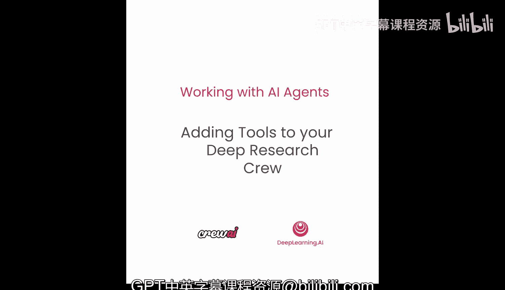
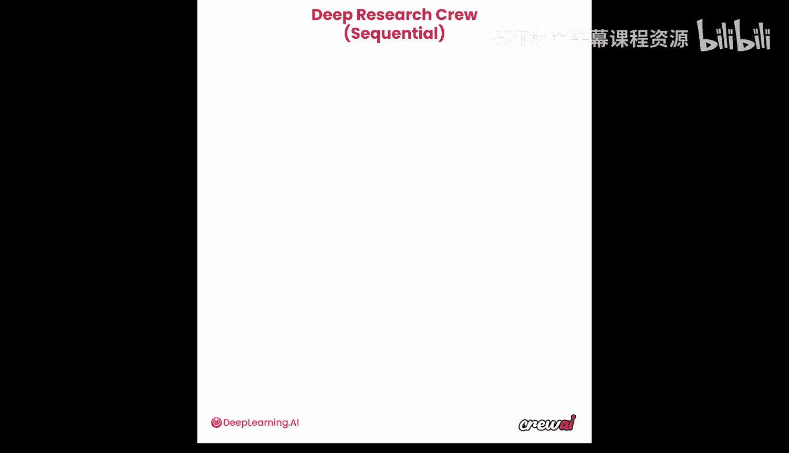
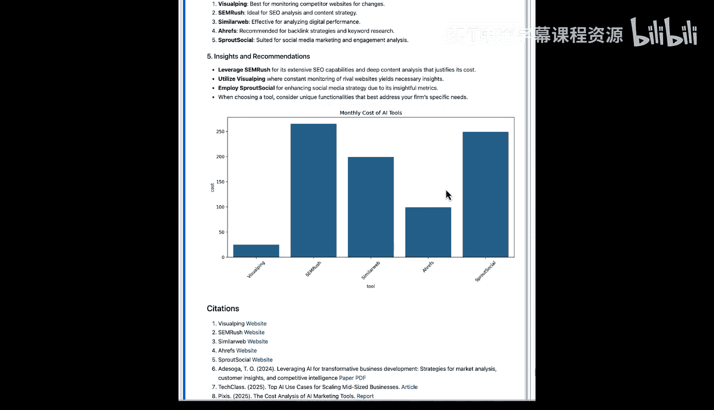
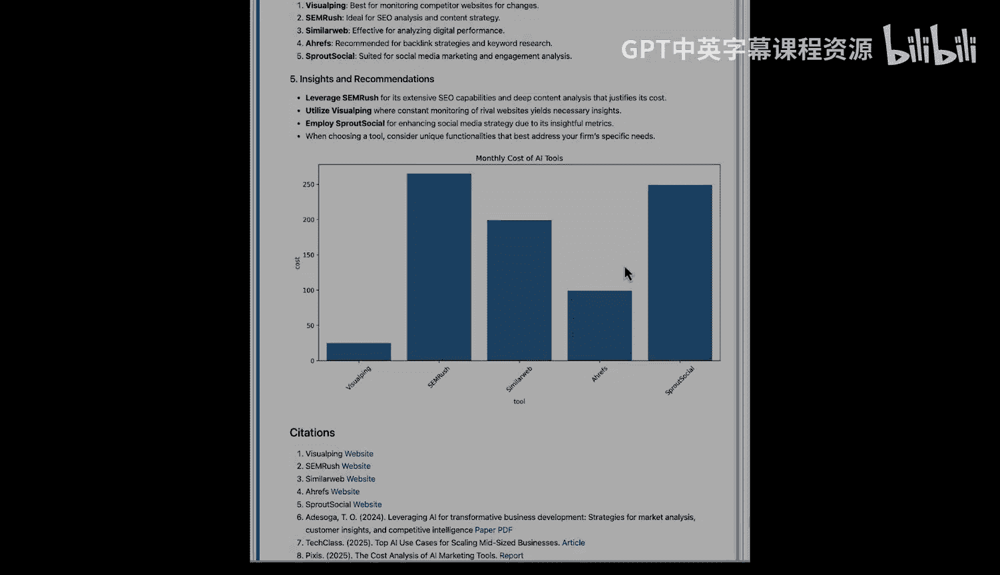

# 019：7. 为深度研究团队添加工具

在本节课中，我们将学习如何为我们的深度研究智能体团队添加自定义工具。我们将创建一个能让报告撰写智能体生成并嵌入图表的工具，从而丰富最终报告的内容。

## 概述



上一节我们深入了解了工具的概念。本节中，我们将把这些知识应用到我们的深度研究团队中，为其添加自定义工具。你将看到这会让团队的能力变得多么强大，我们能做的事情也更多了。这非常令人兴奋，让我们直接开始吧。




## 创建自定义工具

首先，我们将首次使用一个自定义工具。这非常令人兴奋，因为我们将开始理解如何通过自定义工具为你的智能体添加任何能力。你可以使用自定义工具连接到外部系统、内部系统（如数据库）或任何你可能拥有的系统。因此，在这方面你可以做很多事情。

对于本节课，我们将创建一个自定义工具，允许你的最终智能体绘制图表。这意味着它将利用为报告收集的信息来绘制某种可视化图表，并将其嵌入到最终报告的 Markdown 文件中。这个自定义工具的目的是让你的报告内容更丰富。

以下是创建自定义工具的基本结构。自定义工具通过使用 `BaseTool` 类来创建。我们需要确保导入这个类。然后，你的自定义工具可以像下面这样简单：你定义类名、工具名称和一些模式描述。

```python
from crewai.tools import BaseTool

class MyCustomTool(BaseTool):
    name = "工具名称"
    description = "工具描述"
    def _run(self, argument):
        # 你的逻辑代码
        return "工具执行结果"
```

你可以将所有逻辑放在这个 `_run` 函数中，在这里你可以做任何你想做的事情，比如连接 API、连接外部系统，只需确保最后返回一个字符串作为工具的最终结果。

## 实现图表绘制工具

现在我们已经理解了自定义工具的结构，让我们来创建我们自己的工具。这个自定义工具将用于绘制 Seaborn 图表。

```python
import seaborn as sns
import matplotlib.pyplot as plt
from crewai.tools import BaseTool

class PlotSeabornChartTool(BaseTool):
    name = "绘制 Seaborn 图表"
    description = "根据提供的数据和信息，使用 Seaborn 和 Matplotlib 库绘制自定义图表。"
    def _run(self, data_info):
        # 使用 data_info 中的数据绘制图表
        # 例如：sns.barplot(data=data_info)
        plt.savefig('chart.png')
        return "图表已生成并保存为 chart.png"
```

如果你熟悉 Python，你可能已经知道这些库了。Seaborn 和 Matplotlib 都是 Python 中用于创建自定义图表的知名库。这基本上是一个自定义绘图工具，允许智能体创建自定义图表。它在描述中提供了一些使用说明。在 `_run` 函数的定义中，你可以看到它从参数中获取一个名为 `data_info` 的参数，然后使用数据绘制一个完整的 Seaborn 图表，并将该图像提供给我们的智能体，以便它可以将其合并到最终结果中。

我们希望确保为我们的智能体提供这个工具，以便我们的报告也能获得更丰富的视觉效果。让我们创建这个工具，然后继续设置智能体。

## 设置工具与智能体

现在，我们将创建 `SerperDevTool` 和 `ScrapeWebsiteTool` 的实例，确保这两个工具准备就绪，并可以分配给我们的智能体。

到目前为止，你应该更熟悉工具本身的概念了，即工具是允许你的智能体与外部或内部系统交互的一种方式。请记住，这些工具可以有很多不同的形式和形态。我们在这里使用了几个由 CrewAI 预置的工具，你可以基本上将它们部署到智能体中，它们就可以工作了。

但你也正在创建我们自己的自定义工具。我们最终也会讨论如何将 LLM 用作工具，这在未来的课程中会非常令人兴奋。但这里的核心思想是，通过工具，你允许你的智能体真正接入外部世界，无论是从中提取信息、向其中推送信息，还是在其他系统中执行操作。

我们在这里所做的是接入 Serper API 在互联网上进行搜索，并使用 `ScrapeWebsiteTool` 来实际访问一些网站并从中获取信息。我们设置特定 Serper URL 的原因仅仅是由于我们在大多数用例中使用的学习环境。如果你在自己的电脑上使用，例如在你自己的终端中，除了设置 Serper API 密钥的环境变量外，你通常不需要这样做。

## 加载智能体与任务

接下来，我们加载 `agents.yml` 文件，并确保创建我们所有的智能体。这与上次的做法相同，这里没有什么特别之处。其基本思想是从 YAML 文件加载所有提示词，并使用它们再次实例化我们所有的智能体，非常简单直接。这里的整体思路仍然是关注点分离，你将提示词或智能体定义、任务定义放在单独的文件中，然后是智能体和任务本身。

请记住，我们仍然保留了到目前为止使用的所有功能，包括我们在上一个笔记本中实现的 `Guardrails`。我们要确保在这里引入那个 `Guardrails`，以检查最终输出和最终报告是否包含摘要部分、建议部分和引用部分。

我还想指出的一点是，在我们的报告撰写智能体上，我们正在分配我们的自定义工具。在这里你可以看到我们是如何实际操作的：基本上创建了我们刚刚在上面几个单元格中创建的那个工具的实例。就这么简单。一旦你创建了自定义工具，你需要做的就是将其分配给一个智能体，你的智能体就可以使用了。我们将在未来的课程中讨论如何确保你可以在许多不同的团队和智能体之间分发你的工具，以便于维护，并让你团队中的其他人也能使用它。但现在，你只需要担心创建一个实例并将其交给你的智能体就可以了。

接下来我们要做的是创建我们的任务，这与我们设置智能体的方式非常相似，我们现在从 YAML 文件加载这些任务，并使用数据再次实例化所有不同版本的任务。请记住，我们仍然保持上一个笔记本中的相同结构，我们仍然有那个 `write_report_guardrail` 来确保在实际完成之前检查最终报告。

## 组装并运行团队

我们从上一个笔记本带来的另一个功能是能够将最终报告保存为文件，它也将是一个 `after_hook`。我们保持这一点不变。让我们确保创建那个函数，以便我们可以使用它。

现在，只需将整个智能体组和任务组集合到一个单一的团队中。你可以看到我们仍然在使用记忆功能，并且我们仍然设置了那个 `after_kickoff` 回调函数。

现在创建完成后，剩下要做的就是实际启动团队并查看结果。现在我们有了输入，我们需要做的就是启动团队，看看我们实际从中得到了多好的结果。

## 查看运行结果与报告

现在，如果我们跟踪执行过程，我们可以看到相同的流程仍然有效。我们试图在这里保持简单，以确保我们能向你展示如何在我们学习这些概念的同时，将它们中的一些实现到我们的团队中。但在本节结束时，我们将看到，通过所有课程，我们将能够构建一个非常强大的系统。

现在，让我们专注于添加这个自定义工具，看看它是如何工作的。你可以看到研究规划器仍然在做它的主要工作。它试图找到一个角度，来了解这些工具以及从那时起要研究什么。然后，互联网研究员开始工作。它再次使用 `SerperDevTool` 来查找信息，并根据它找到的网站中的数据，然后开始抓取这些网站，以确保获得所需的所有信息。

最后，它整理出一份报告的早期草稿，其中包含所有这些公司的信息，然后传递给我们的 `FactCheckerAgent`。现在我们可以暂时跳过它，直接进入我们的最终报告，看看它是什么样子。

如果你在这里查看报告，会发现很有趣，因为它从事实检查器获取了所有信息，但现在它使用了我们的自定义工具来创建自定义图表。你可以看到它分享了一些信息，然后绘制了一个特定的 PNG 文件，该文件将被注入到最终报告中。然后，同一个报告撰写智能体构建了整个报告，并实际将图像嵌入其中，你可以在“视觉数据表示”部分看到。

但随后 `Guardrails` 启动，并注意到缺少一个“见解”部分。然后智能体需要返回进行编辑。从那时起，智能体决定绘制一个不同的图表并再次编辑其报告。`Guardrails` 发现缺少“引用”部分。所以智能体又回去添加。在这里，你可以看到我们讨论的所有不同部分汇集在一起，从自定义工具到实际的 `Guardrails`，以及介于两者之间的一切，共同构建了这份最终报告。

现在，如果我们继续向下滚动，我们实际上得到了这份最终报告，并且我们可以实际将其输出，因为请记住，我们使用一个 `after_hook` 将其保存为 Markdown 文件。我可以进入一个新单元格，直接输出那份研究报告。我们可以看到整个报告。你可以浏览所有报告内容。你可以看到它发现的那些新兴工具。你可以看到功能和局限性，甚至它能够绘制的图表，基本上显示了这些工具的每月 AI 成本。

## 总结

本节课中，我们一起学习了如何为深度研究智能体团队添加自定义工具。我们创建了一个图表绘制工具，并将其集成到报告撰写智能体中，从而让最终报告包含了可视化数据。这个过程展示了如何通过工具扩展智能体的能力，使其不仅能处理文本信息，还能生成和嵌入图表，极大地丰富了输出内容。





我们看到了从研究规划、信息搜索、事实核查到报告撰写和 `Guardrails` 检查的完整流程。随着我们不断添加新功能，这个团队的能力正在逐步增强。在接下来的课程中，我们将添加更多功能，以确保报告内容真实可靠，并遵循特定格式。