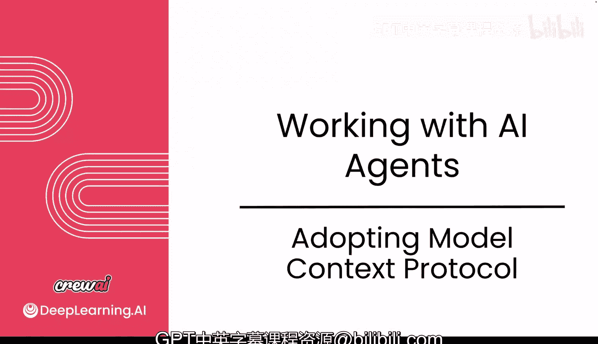
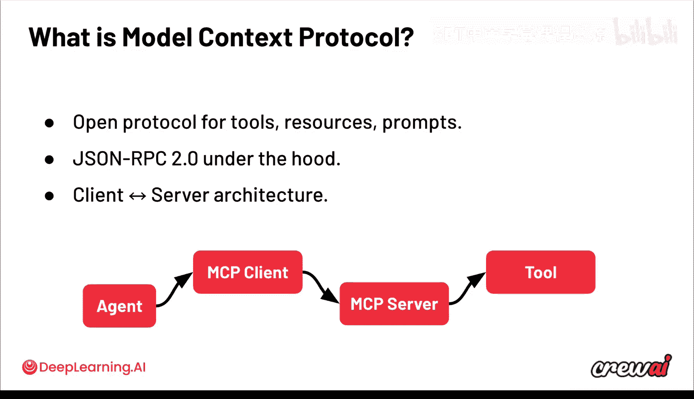
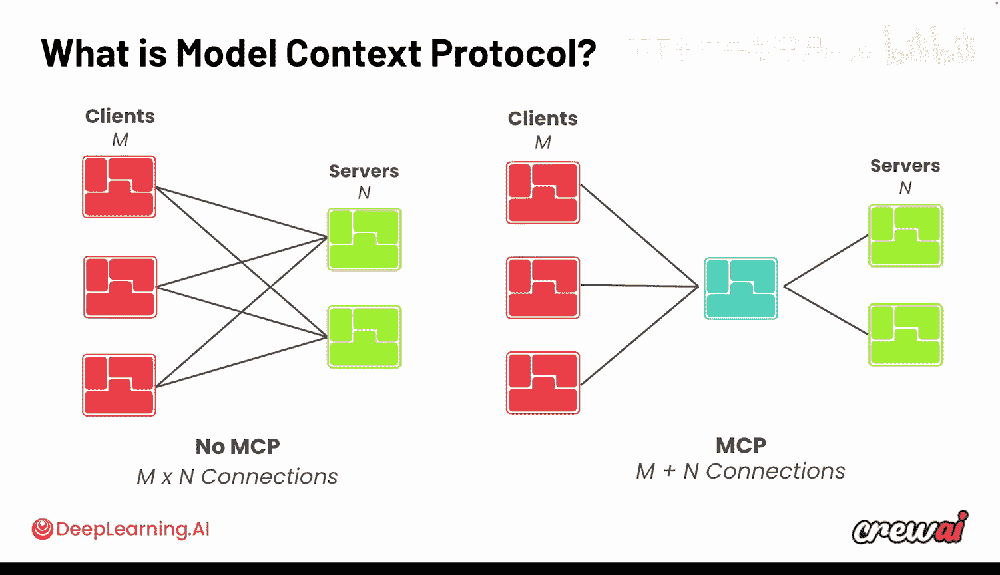
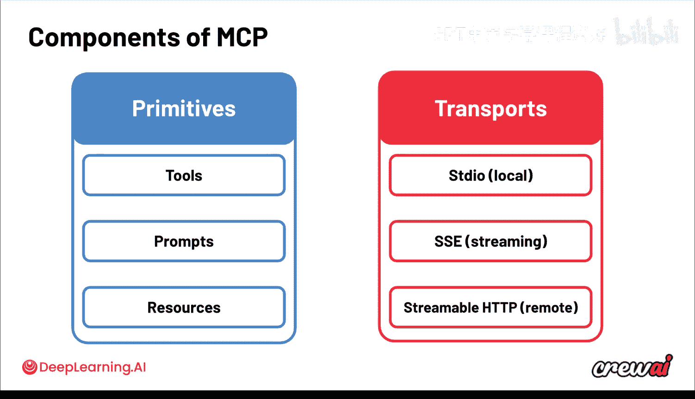
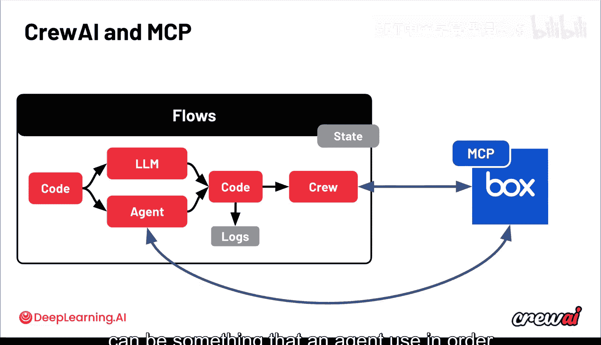
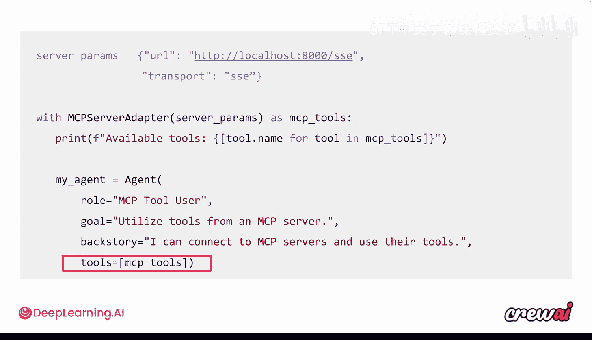
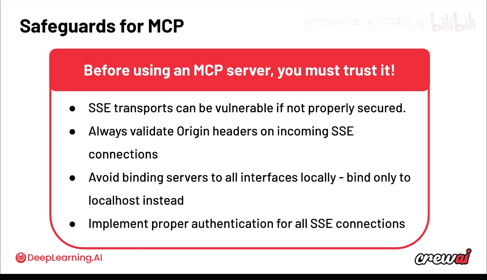
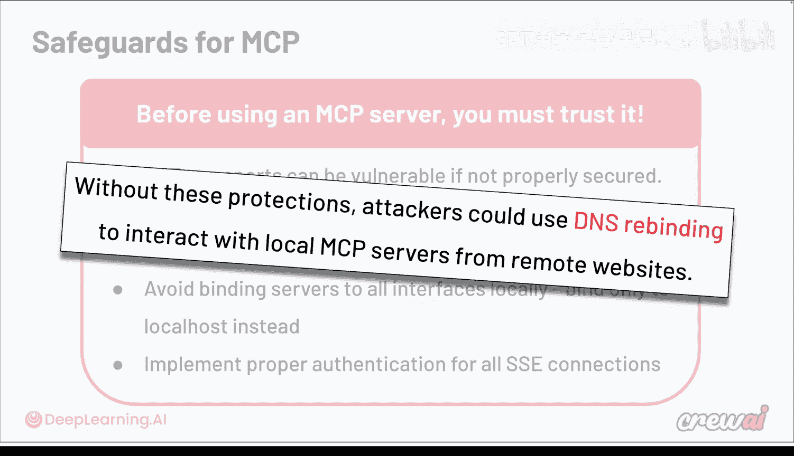
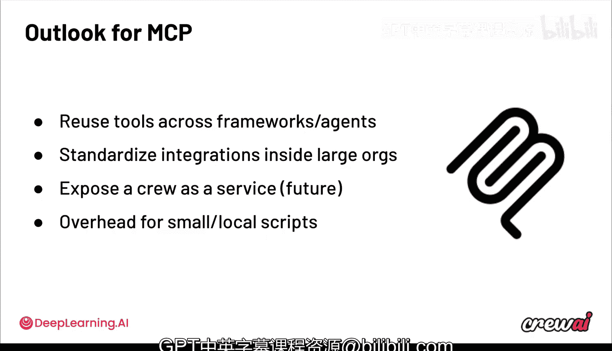

# 020：采用模型上下文协议（MCP）🚀

## 概述
在本节课中，我们将学习一个当前非常热门的话题：模型上下文协议（MCP）。我们将了解MCP是什么、它如何工作，以及在采用它之前需要考虑的一些事项。MCP可以非常强大，是智能体技术栈中的重要组成部分，但理解其幕后工作原理至关重要。

---

## 什么是MCP？🤔
上一节我们介绍了MCP的重要性，本节中我们来看看MCP的具体定义。

MCP是一个开放协议，由社区开发并由Anthropic发起。其核心思想是建立一个通用层和通用约定，规定智能体如何访问工具、资源和提示。MCP正变得相当知名，特别是因为它建立在一些已经非常成功的技术之上。



**核心概念**：MCP = 一个基于JSON-RPC 2.0的开放协议，用于标准化智能体对工具和资源的访问。

---

## MCP解决的问题：集成碎片化🧩
在深入MCP的细节之前，了解它要解决什么问题很有帮助。现有的系统和工具暴露其功能的方式各不相同。

以下是现有集成方式面临的一些挑战：
*   **方式多样**：有些应用通过OAuth集成暴露，有些使用常规API，有些则使用套接字。
*   **阻碍开发**：这些不同的模式和方式可能会阻碍系统启动和运行，因为开发者可能陷入“集成地狱”，忙于构建集成而无法完成有意义的任务。
*   **适配器复杂**：这些集成通常需要大量定制的适配器，以确保以正确的方式使用正确的工具。
*   **工具共享困难**：在不同智能体之间共享工具变得非常困难，从一个智能体或工具切换到另一个时，使用方式可能截然不同。

历史上，甚至有整个公司（如Zapier、IFTTT和Make）的业务核心就是为用户管理和构建这些集成之间的“粘合层”。这种碎片化使得构建集成的人更加困难，也使得依赖这些集成的客户更加困难。这就是MCP和协议整体成为AI领域热门话题的主要原因。

---

## MCP的工作原理：客户端-服务器架构⚙️
理解了问题所在，现在我们来看看MCP是如何通过其架构来解决这些问题的。

使用MCP时，你的智能体可以调用一个MCP客户端，该客户端随后将其路由到一个MCP服务器，从而让你能够访问另一端的工具。在CrewAI中，你无需担心设置客户端或服务器，这非常简单。

**核心流程**：
```
你的智能体 -> MCP客户端 -> MCP服务器 -> 外部工具/资源
```

你需要做的就是启动你的智能体，并将其指向一个特定的MCP服务器。基于此，智能体就可以访问该服务器提供的所有不同资源。你只需要知道特定的服务器配置和要使用的协议，并在你的Crew或智能体上进行设置，智能体就能够利用所有这些工具。

这一切都发生在一个众人皆知的、用于工具的开放协议之后，底层使用JSON-RPC 2.0。这种客户端-服务器架构的思想允许你构建一个单一的层来将所有这些东西连接在一起。

---

## 有MCP与无MCP的世界🌍
为了更直观地理解MCP带来的改变，我们可以对比一下有MCP和没有MCP的集成世界。

*   **没有MCP的世界**：可以看作是一种 **M x N** 的复杂性。为了将你的解决方案与已有的工具集成，你需要为每个工具组合构建自定义连接器（如果它们尚不存在）。
*   **有MCP的世界**：你可以连接到任何遵循该协议的工具。这是一种 **M + N** 的抽象，允许你更快地移动，尤其是当你将更多工具纳入囊中时。

---

## MCP的核心组件🔧
现在，让我们具体看看MCP由哪些基本构件组成。



MCP包含三个基本原语（Primitives）：
1.  **工具（Tools）**：智能体可以执行的操作或函数。
2.  **提示（Prompts）**：可重用的提示模板。
3.  **资源（Resources）**：智能体可以读取或访问的数据源。

此外，还有暴露或传输这些数据的方式，主要有三种：
*   标准I/O
*   SSE（服务器发送事件）
*   流式HTTP

本质上，这些只是访问那些服务器和调用那些工具的不同方式。真正重要的是你在这样做时使用的格式。

---





## CrewAI 中的 MCP 支持🤖
了解了MCP的构成，我们来看看如何在CrewAI中实际应用它。

CrewAI原生支持MCP。Crew内部和外部的智能体都可以使用MCP。这允许它们在运行时动态发现和聚合这些工具。

此外，Crew本身也可以成为MCP服务器。当你在CrewAI平台上部署一个Crew时，可以自动将其导出为服务器，允许其他智能体像使用工具一样使用它们。

---

## 实战示例：连接Box MCP服务器📦
理论需要联系实际，下面我们通过一个具体例子来演示如何使用MCP服务器。

Box公司开发了一个MCP服务器，将其部分功能提供给智能体使用。如果你使用CrewAI运行一个智能体，可以通过声明你希望智能体如何连接以及想要使用什么协议，轻松连接到Box。你可以在智能体级别或在包含智能体的Crew内部进行设置。

使用起来极其简单，只需要为AI工具安装一个具有特定依赖项的特定扩展来设置你的服务器。设置完成后，只需用MCP服务器适配器包装你的智能体定义，或者赋予你的智能体访问MCP工具的权限。

这意味着你的智能体现在可以自动接入这些集成，并在执行过程中自动利用Box所暴露的那些操作和功能。例如，从文件中提取特定功能是Box暴露的功能之一，智能体可以利用它来提取信息以构建最终报告。

**代码示例**：
```python
# 导入MCP服务器适配器
from crewai_tools import mcp



# 设置服务器属性（URL，传输层）
server_config = {
    “url”: “your_mcp_server_url”,
    “transport”: “sse” # 或 “http”, “stdio”
}

# 用适配器包装你的智能体或Crew
@mcp.server(**server_config)
def define_my_agent():
    # 这里是你的智能体定义
    agent = Agent(
        role=“数据分析师”,
        goal=“从Box文件中提取数据并生成报告”,
        tools=[], # 工具会自动从MCP服务器注入
        verbose=True
    )
    return agent

# 然后像使用常规工具一样使用这些工具
```
通过这样做，你就自动将你的智能体暴露给该服务器中所有可用的内容。在这个代码块中，你还可以过滤掉一些MCP工具，以便更精确地控制你想要发生的事情。

---



## MCP 采用前的安全考量⚠️
在兴奋地使用这些MCP功能之前，必须讨论一些安全防护措施。

在使用任何MCP服务器之前，你需要确保你信任它。这是一个重要的免责声明，因为这是一个全新的协议，尚未经过多年实战考验。这意味着现在有很多人正试图破解它，对于不熟悉协议的人来说，已经证明存在一些需要关注的问题。

所有这些问题都在被快速解决，但在使用服务器前，请务必确保你信任它。请记住，MCP服务器返回的信息会传递给你的智能体和LLM，这创造了它们进行提示注入的可能性——即返回信息试图对你的智能体进行提示注入。传输层本身也可能存在漏洞。

**安全建议**：
*   确保SSE传输得到妥善保护。
*   始终验证任何传入SSE连接上的来源头（Origin headers）。
*   避免将服务器绑定到所有本地接口，必要时仅绑定到localhost。
*   为所有SSE连接实施适当的身份验证。



没有这些保护措施，攻击者可能使用DNS重绑定来与本地MCP服务器进行远程网站交互。因此，在采用这些尖端技术时，请务必注意这一点。



---

## MCP 的前景与总结✨
尽管存在上述担忧，MCP在特定条件下确实大放异彩，特别适合重用工具。

MCP的前景非常广阔。它允许你在不同的框架、工作流和智能体之间使用工具。它为大型组织的集成提供了标准，甚至允许你将你自己的Crew作为服务暴露出来。当然，目前对于小型和简单的脚本来说存在一些开销，但MCP正在帮助解决这个问题。因此，MCP有很多优势。

在本模块中，我们讨论了许多内容：工具仓库、MCP。现在是时候讨论如何以以前无法做到的方式来构建这些智能体了。我将在下一课中通过使用无代码UI构建智能体来展示这一点。这不仅使不会编码的人受益，也使工程师受益，因为他们可以更快地行动，极其迅速地构建出Crew的初版，然后在此基础上快速迭代。

我对下一课要展示的内容感到非常兴奋。完全不写代码就能构建一些智能体，而且它们可以如此复杂，这简直令人难以置信。它们甚至可以自己编写自定义工具，或与极其复杂的应用程序集成。请务必关注下一个视频，因为它将深入探讨无代码构建智能体，我对此非常期待。

---



## 总结
本节课中，我们一起深入学习了模型上下文协议（MCP）。我们从MCP的定义和它要解决的集成碎片化问题开始，了解了其客户端-服务器架构的工作原理，并对比了有MCP和没有MCP的集成世界。我们剖析了MCP的核心组件（工具、提示、资源），并学习了如何在CrewAI中实际使用MCP，包括通过Box示例进行实战演示。最后，我们强调了在采用MCP时必须考虑的安全问题，并展望了其未来前景。MCP作为一个标准化协议，为智能体生态的互联互通和快速发展奠定了重要基础。