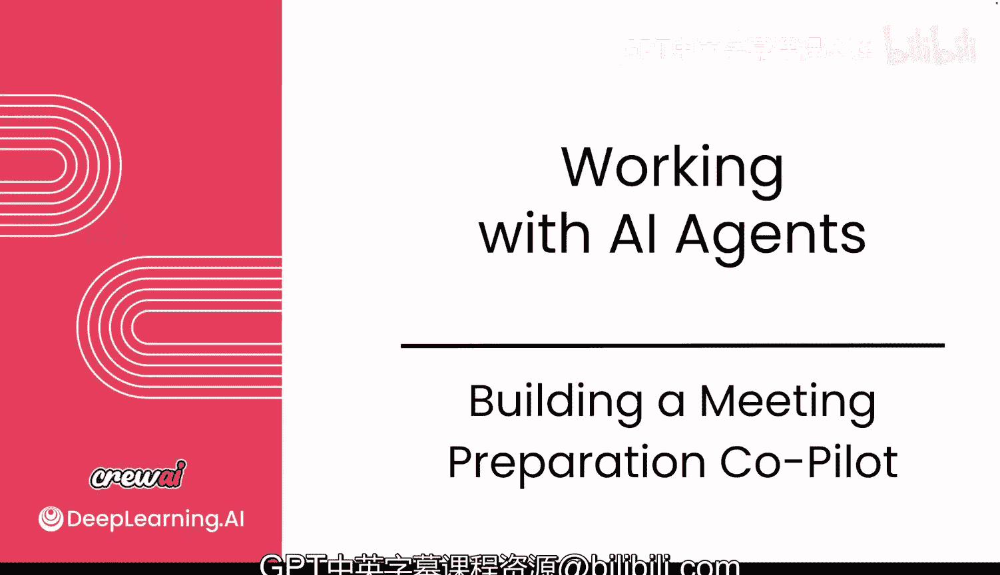
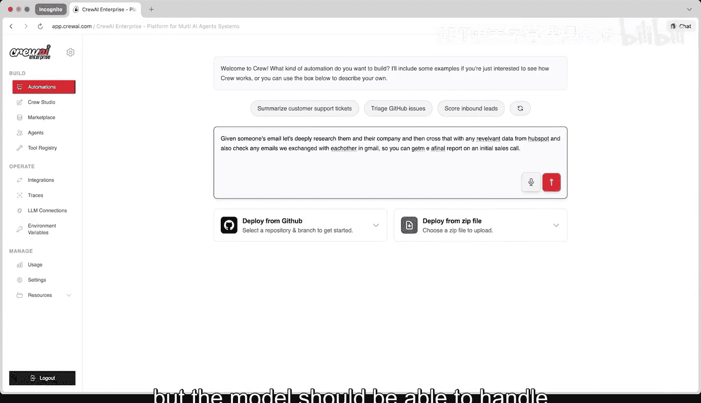
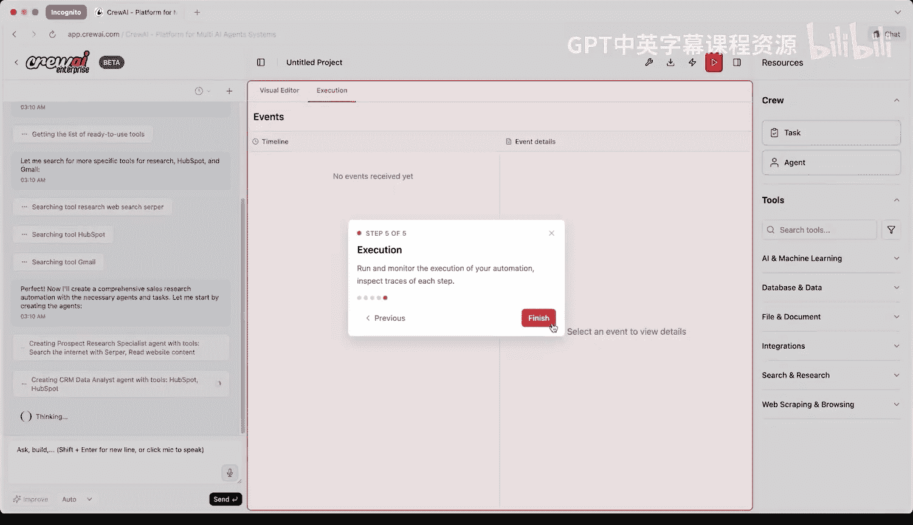
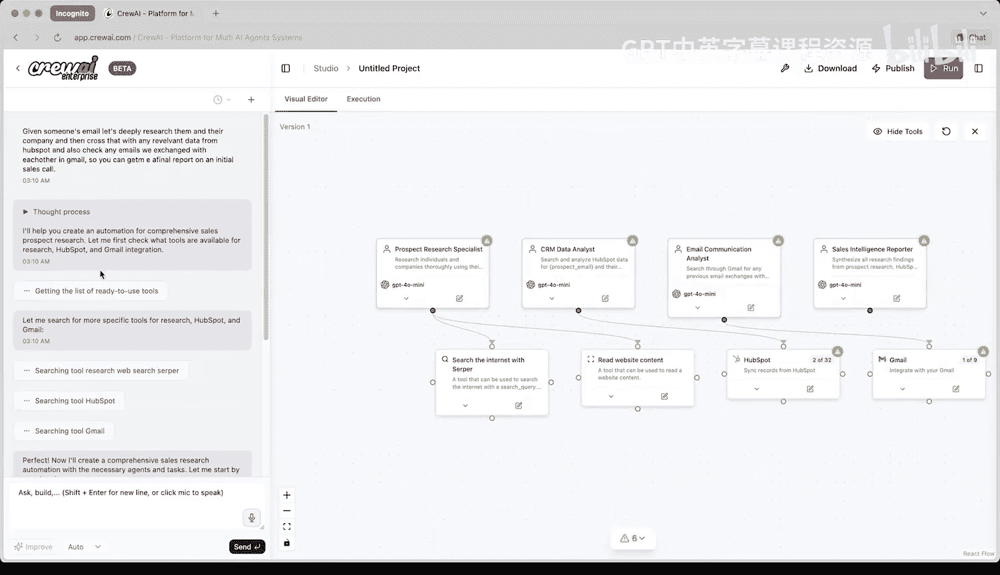
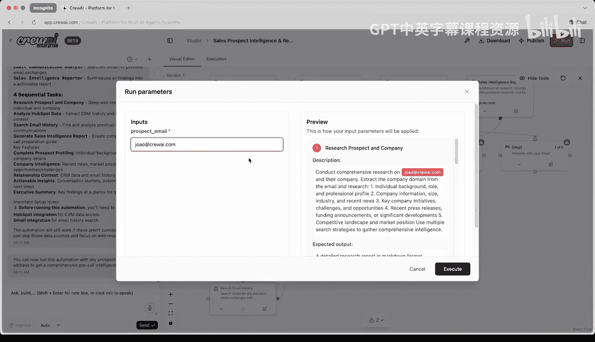
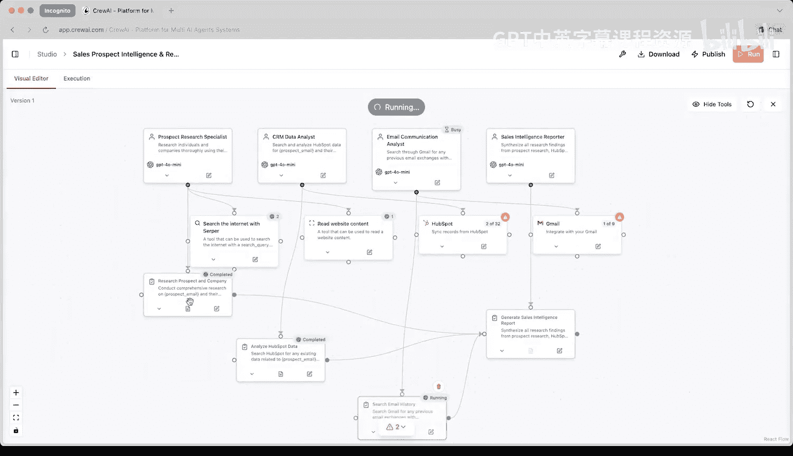
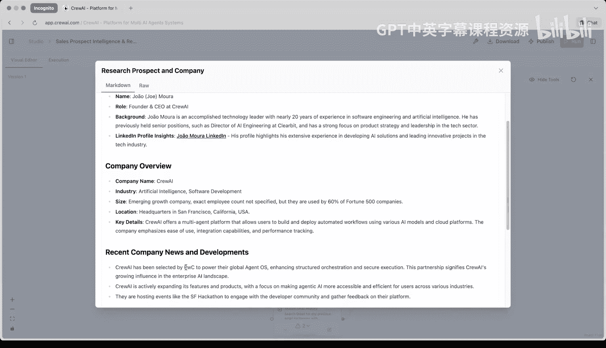
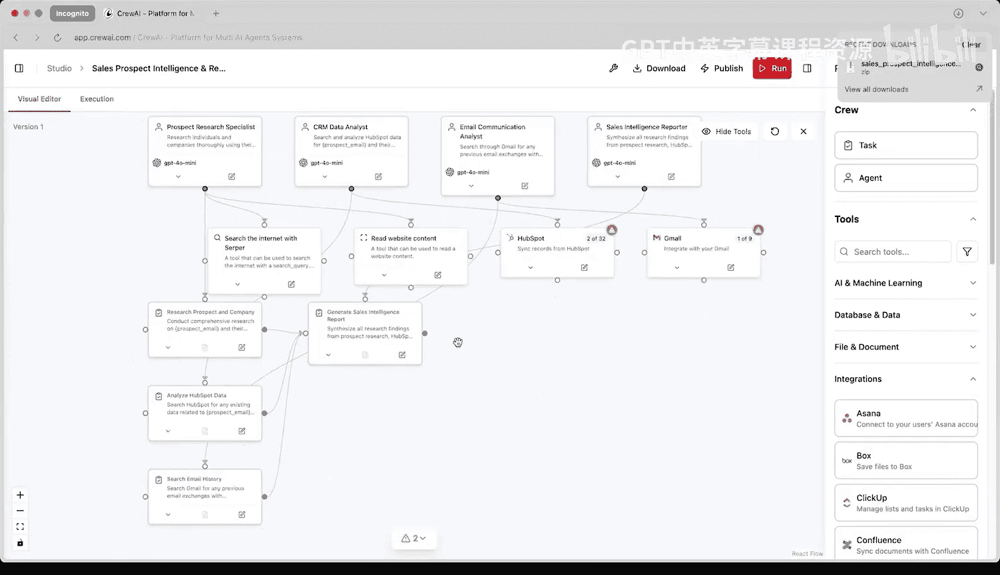

# 021：9.构建无代码智能体 🚀

在本节课中，我们将学习如何从编写代码转向使用无代码方式构建智能体。我们将通过简单的提示来创建自动化流程，并最终将其导出为代码，以便进行更深入的定制和开发。

---

## 概述

上一节我们介绍了通过代码构建智能体系统的基础。本节中，我们将探索一个强大的无代码平台，它允许我们仅通过自然语言描述来设计和部署多智能体工作流。这种方法能极大地加速从概念到实现的过程。

## 平台入门

首先，我们需要访问平台。以下是初始步骤：

1.  访问 `app.query.com`。
2.  如果你是首次使用，点击“注册”创建新账户。
3.  登录后，你将看到主界面，可以直接开始通过聊天构建用例。

这个平台的核心是，你可以通过对话描述你想要的功能，系统会自动将其转化为一个可视化的智能体工作流。

## 构建一个销售用例

让我们尝试构建一个对销售团队非常有用的自动化流程：销售会议准备助手。

我输入了以下提示：
> “给定某人的邮箱，深度研究此人及其公司，并结合HubSpot中的相关数据以及我们在Gmail中往来的邮件，为我生成一份初次销售电话的最终报告。”

尽管提示中有一些拼写错误，但系统能够理解并开始构建。

提交提示后，界面会切换到“工作室”视图。左侧是聊天记录，右侧是自动生成的自动化流程图。你可以在此拖放组件进行自定义，顶部则有运行自动化和查看日志的选项。

## 系统自动构建的流程

关闭教程弹窗后，我们可以看到系统已经自动为我们创建了完整的智能体工作流：

*   **智能体1**：负责搜索互联网和阅读网站内容。
*   **智能体2**：负责研究HubSpot数据。
*   **智能体3**：负责查看Gmail邮件。

所有智能体和工具都已配置完毕。对于一个全新账户，这无需任何自定义设置。当然，要使用HubSpot和Gmail，我需要点击相应区域进行授权认证，但整体构建过程非常简单。

## 运行与验证

系统会继续完善流程，验证一切是否就绪，并为流程命名。虽然我的HubSpot和Gmail尚未连接，但我们仍然可以测试运行。

点击运行按钮后，系统会询问目标邮箱地址。为了演示，我输入了自己的邮箱，模拟即将与自己进行会议的场景。

随后，我们可以看到第一个智能体开始执行任务。在“执行”页面，我们可以查看每一次调用的详细追踪记录，包括：
*   内部使用的提示词。
*   原始数据。
*   工具调用情况。
*   所有中间结果，甚至包括爬取的网站信息。
*   最终答案。

## 查看结果

回到可视化编辑器，点击查看最终任务输出。例如，研究我的智能体发现我是CrewAI的创始人兼CEO，找到了我的背景信息、LinkedIn资料，以及关于公司的许多信息，包括近期发展与和PwC的合作关系等。

这展示了我们能够多么轻松地搭建起这样一个系统，而这仅仅是自动化可能性的冰山一角。

## 从无代码到代码

重要的是，你不仅限于聊天构建。你随时可以拖放自定义的智能体、任务和工具，并以任何你喜欢的方式连接它们。

更强大的是，假设你已经设置好一切，你可以将整个工作流下载为代码。例如，在清理掉未连接的智能体和工具后，点击下载按钮，你将获得一个包含全部代码的ZIP文件。这意味着你可以继续在Python环境中修改和扩展它。

这不仅让非技术人员和工程师都能构建自动化流程，也帮助工程师更快地构建原型、更快地实现价值，因为你无需从头搭建基础框架，可以直接进入MVP（最小可行产品）阶段并进行后续优化。

## 总结

本节课中，我们一起学习了如何使用无代码平台快速构建多智能体系统。我们通过一个销售准备用例，演示了如何用自然语言提示生成完整工作流，如何运行和调试，以及最终如何将无代码项目导出为可进一步开发的Python代码。这种方法显著提升了开发效率，是快速验证想法和实现自动化的强大工具。

如果你想尝试这个工作室，请访问 `app.query.com`。我们下节课再见。