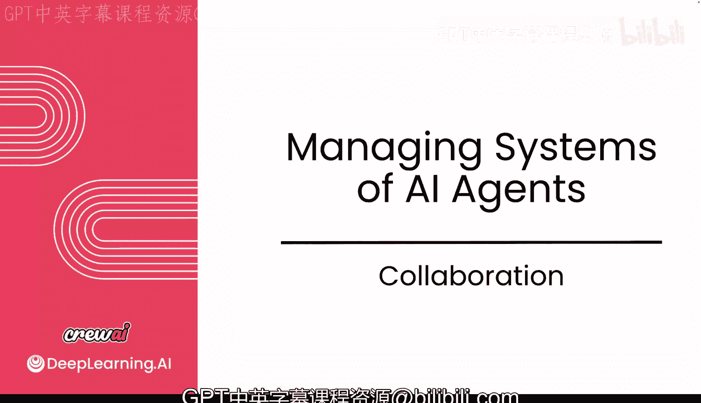
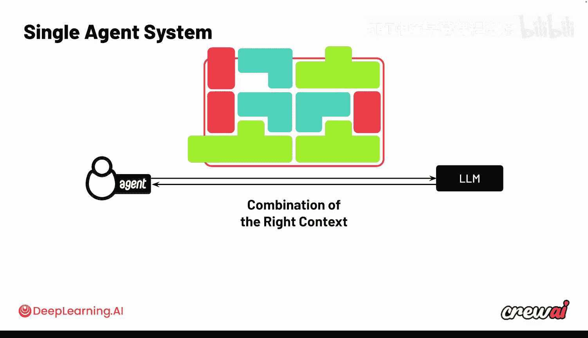
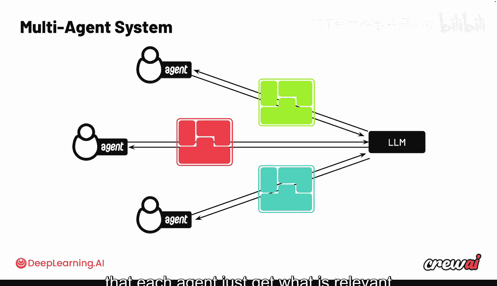
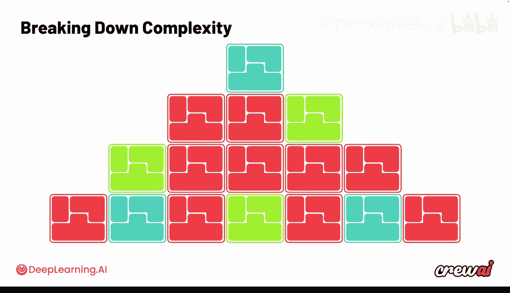
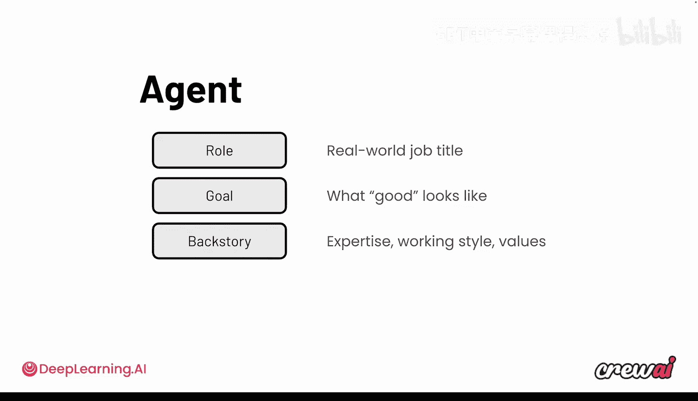
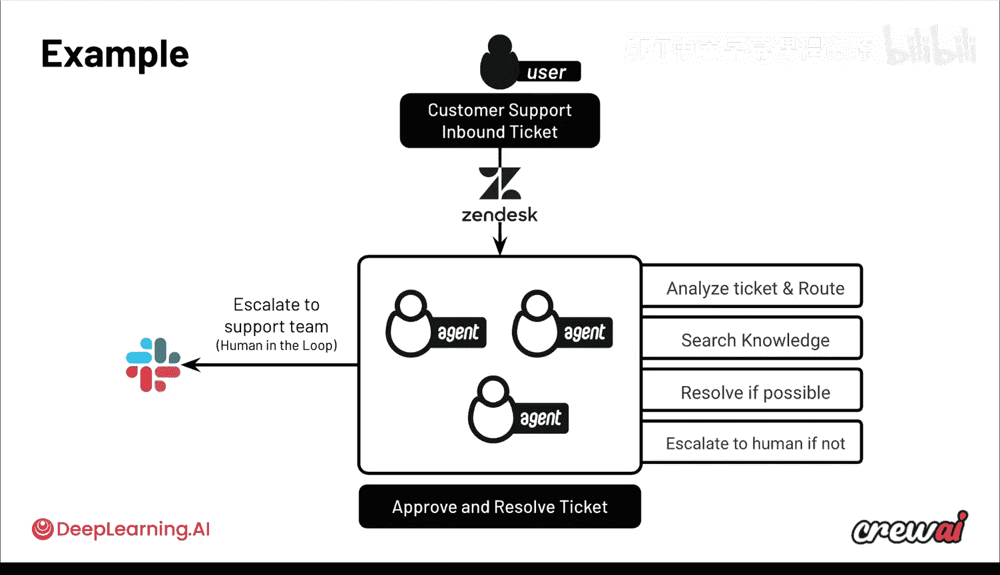
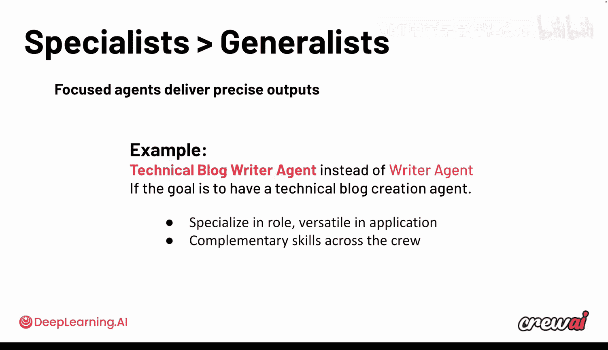
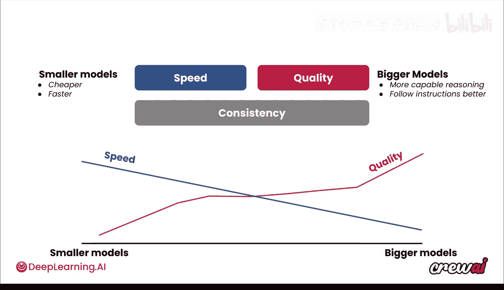

# 022：协作模式设计 🧩

## 概述
在本节课中，我们将学习如何设计多智能体系统中的协作模式。我们将探讨为何将复杂任务分解给多个专业智能体，比使用单一通用智能体能产生更高质量的输出，并了解如何通过配置角色、目标和模型来优化每个智能体的表现。

---

## 智能体协作的核心挑战

上一节我们介绍了如何将任务分解给不同的智能体和任务。本节中我们来看看控制它们协作与工作方式的不同方法。

每个智能体本质上都在与其背后的大语言模型进行交互。所有不同的组成部分，例如系统提示词、角色定义、聊天历史记录，以及所有数据，每一次对大语言模型的请求都经过优化，以适配智能体及其模块的上下文。



这一切会整合成一个完整的请求包。然而，随着智能体持续工作，其上下文范围开始扩大。你可能开始为其添加更多工具并赋予更复杂的任务。

```python
# 示例：智能体上下文随工具和任务增加而扩展
agent.add_tool(tool1)
agent.add_tool(tool2)
agent.assign_task(complex_task)
```

这会增加大语言模型可访问的选项、想法和过往对话的数量。所有这些信息在某个时刻将突破大语言模型的上下文长度限制。

问题不仅在于上下文长度本身，还会导致性能下降。一些更精细的信息可能无法放入模型上下文，同时越来越多不相关的信息被包含进来。智能体开始偏离其核心职责，出现目标模糊的情况，导致智能体难以决定何时使用何种工具。

这里的核心观点是：**扩展智能体的职责范围，可能会因上下文控制不够精确而降低输出质量**。



---

## 解决方案：专业化优于通用化

因此，正确的组合方式不是让一个智能体做太多不同的事情，而是让每个智能体专注于自己的任务，拥有自己的上下文、系统提示词和角色设定。

通过使用多个专业化的智能体，而非一个通用型智能体，你可以分解上下文，使每个智能体只获取与其目标和目的相关的信息。这些结果的总和，将远优于让单一智能体处理所有事情。

将所有智能体的输出整合起来，你将获得前所未有的高质量输出。



需要明确的是，生成式系统的后端由多个智能体分解处理，但这并不意味着用户体验也必须如此。用户体验可能仍然是与单一智能体对话的界面，但在幕后，是多个智能体在协同完成工作。



---

## 构建高效智能体的要素

以下是构建高效智能体的三个核心要素：

1.  **角色**：明确智能体的专业身份。
2.  **目标**：定义智能体需要完成的具体任务。
3.  **背景故事**：提供上下文，帮助智能体理解其职责范围。

其核心理念是：通过提供高质量输入，帮助智能体塑造其专业角色。





回顾经典的客户支持用例，那些智能体可以专门化于分析工单、检索知识库，并在可能时尝试自行解决工单。

例如，其中一个智能体可以是工程师智能体，如果问题是一个程序错误，它可以尝试编写代码来修复。通过明确定义每个智能体的单一职责，你可以取得惊人的效果。

如果要用一句话总结：**优先选择专家型智能体，而非通才型智能体。专注的智能体能提供更精确的输出**。

一个好的命名示例是：将智能体命名为“技术博客写手智能体”，而不是笼统的“写手智能体”，如果其目标是创建技术博客内容。这样，你在角色上实现了专业化，同时在整个智能体团队中保持了功能的多样性。

---



## 模型选择：平衡速度与质量

除了角色、目标和背景故事，另一个可以定制智能体的关键因素是其所使用的大语言模型。

在这里，你不仅可以选择角色、目标和背景故事，还能选择每个智能体使用的模型。例如，如果你发现Claude在撰写技术博客方面比GPT-4表现更好，你可以专门指定该智能体使用那个模型。

因此，根据每个智能体的角色和目标，你可能还需要为其选择最合适的大语言模型。你需要在速度和质量之间取得平衡。较小的模型通常更便宜、更快，因此在需要速度的场景下表现出色；而较大的模型通常具备更强的推理能力，能更好地遵循指令，并且通常拥有更大的上下文窗口。

当质量对你至关重要时，你可能会选择更大的模型。在你的智能体团队中，可以混合使用不同模型的智能体，这正是使用CrewAI的优势之一。

最终，你始终要确保获得一致、可靠、可重复的结果。为了实现这一点，你需要进行规划，理解在质量、速度和你期望的正确结果之间取得何种平衡。

例如：
*   处理客户评论并在将问题转交正确部门后撰写回复时，你可能会选择更大的模型以获得高质量的回复。
*   进行股票分析时，可能选择较小的模型来研究和抓取网页数据、提取关键数字，而使用更大的模型来制定交易策略。

---

## 总结

本节课中，我们一起学习了将工作分解给多个智能体和任务如何能带来比单一智能体更优的结果。我们探讨了如何不仅通过角色、目标和背景故事进行优化，甚至可以通过为不同智能体选择不同的大语言模型来提升整体表现。利用多个模型提供商，你可以获得更好的综合结果。



在下一个视频中，你将看到可以为智能体设置的多种不同通信模式。这将是一个非常有趣的话题，可能会为你解锁更多的应用场景。