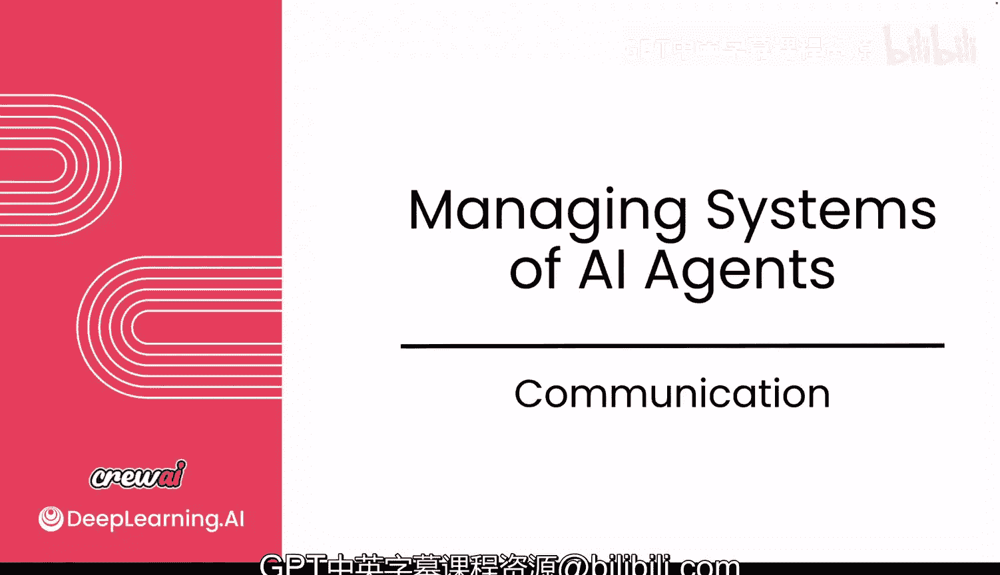
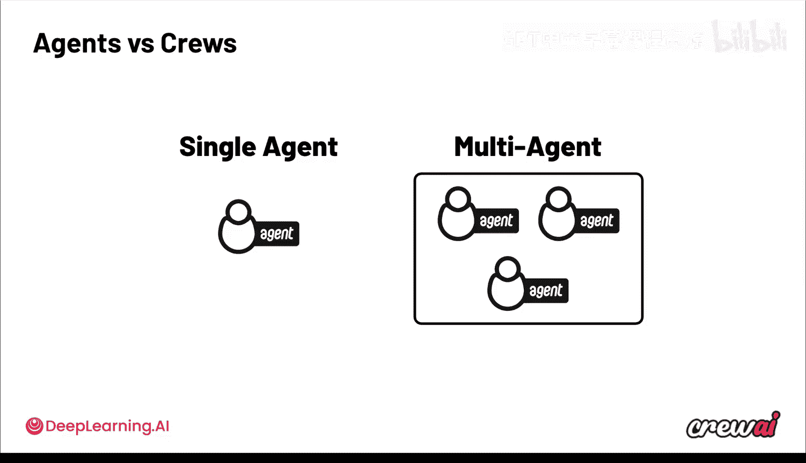
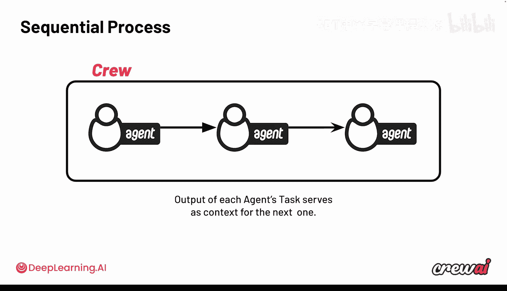
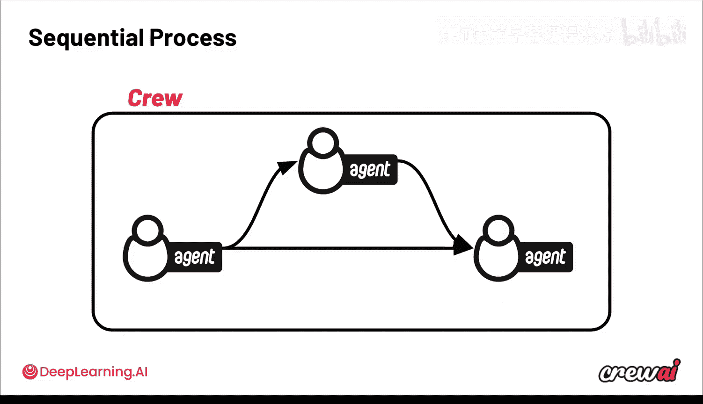
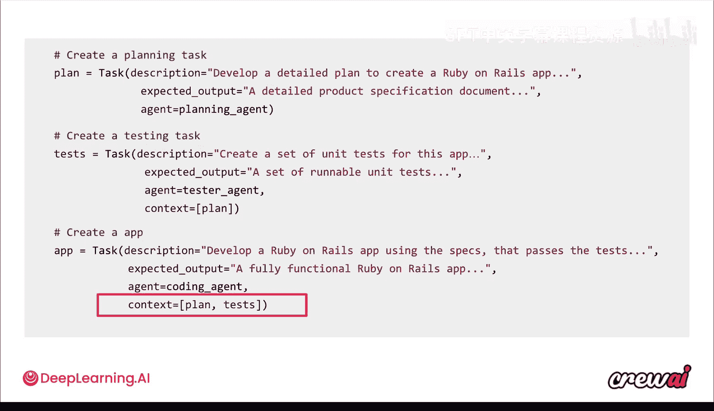
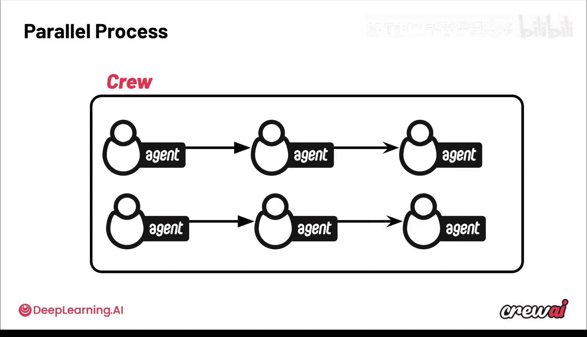
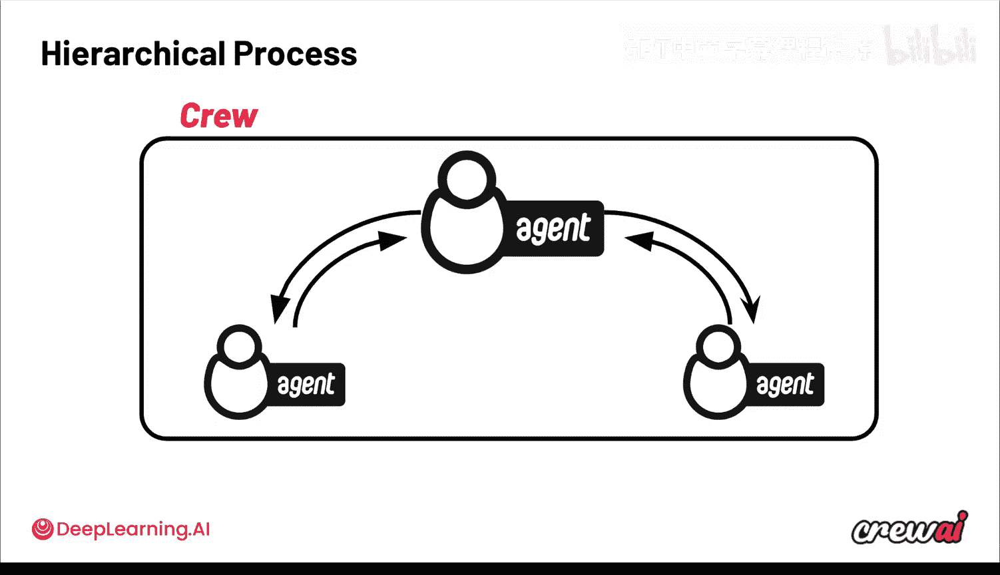
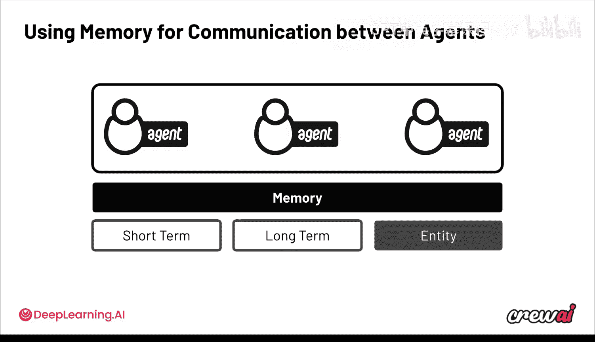
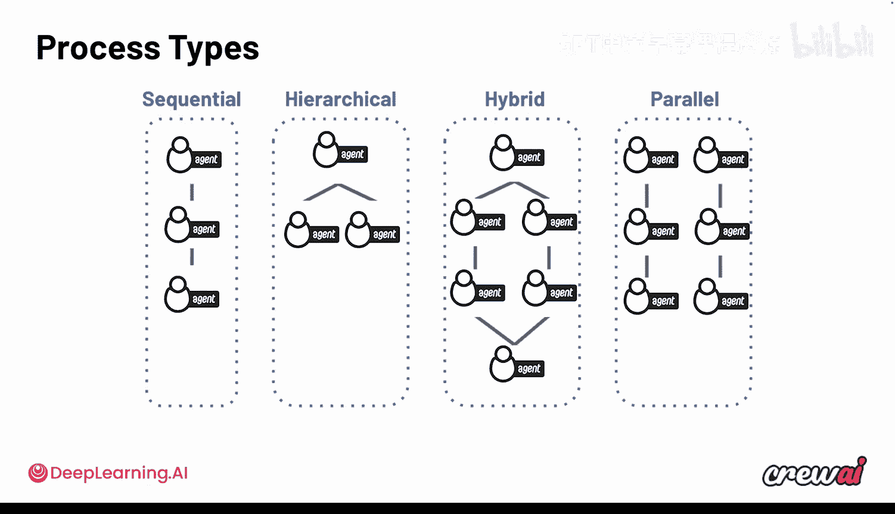

# 023：多智能体通信模式

在本节课中，我们将学习多智能体系统中的通信模式。我们将探讨智能体如何协作、交换信息，以及如何通过不同的流程设计来优化系统性能。

上一节我们介绍了智能体之间的协作，本节中我们来看看它们如何进行通信。

多智能体系统没有一种通用的解决方案，就像任何技术生态系统一样。设计系统架构需要深入思考。这非常令人兴奋，让我们直接开始。

你已经了解了单智能体甚至多智能体的强大功能，也知道了在设置智能体的各个方面，甚至它们将使用的工具时，你拥有多大的控制权。但多智能体系统的一个挑战在于，你必须定义它们之间如何协作，而这会变得非常有趣。

## 顺序流程

CrewAI 的默认行为是智能体以**顺序方式**工作。这意味着你定义智能体，任务将定义处理事务的顺序。

一个很好的例子是股票交易分析：第一个智能体挑选一支股票，第二个智能体获得挑选结果后进行深入研究，提取大量信息，最后一个智能体将报告整合在一起。

在这种情况下，一个任务的输出会作为下一个任务的输入。

除了顺序流，你还可以让智能体相互委托工作和提问。例如，在某个时刻，最后的报告智能体如果对为何选择某支股票有疑问，它可以回头询问最初的智能体选择的原因。

这里的核心思想是，在整个执行过程中，每个智能体的任务为下一个智能体提供上下文。这意味着它的输出将被注入到下一个智能体的提示中。

## 聚合上下文

有时，你需要更多的控制，确保将一个智能体的任务输出提供给多个不同的任务。编码团队就是一个很好的例子。

这些智能体旨在创建软件。你可能有一个初始的规划智能体、一个任务分解智能体，然后是一个编码智能体。

规划者会思考规范以及如何实现最终目标。任务分解者会接收该计划，并用来编写一系列单元任务。但编码者是实际完成大部分工作的智能体，它需要同时访问计划本身和分解后的任务。

在 CrewAI 中，这非常容易实现。你可以看到，对于任务分解任务，我们通过 `context` 参数明确指出其上下文是规划任务的输出。然后，最终的创建应用程序任务可以汇集之前两个任务（规划和测试）的结果，你可以在其 `context` 参数中精确指定这一点。

## 并行流程

顺序流程只是冰山一角，还有许多其他流程模式。**并行处理**是另一种选择。当然，对于其他用例，你不必局限于顺序流程。

在并行流程中，可能有许多智能体同时工作，执行各自的任务。它们可能会在进展过程中传递任务结果，但核心思想是它们有能力并行完成工作，从而显著减少延迟，加快最终输出的获取速度。

## 分层流程

你还可以使用**分层流程**，其中一个单独的智能体将工作委托给其他智能体。这种管理型智能体不仅会分配工作，还会在工作完成后进行审查。

这个第一个智能体基本上是其他智能体的“老板”，决定谁做什么，并检查输出以确保其符合标准，如果不符合则要求改进。这种策略可能会因为额外的 LLM 调用而略微增加处理时间，但尽管存在来回通信，它在设计上对于完成更复杂的任务非常有用。

## 内存与通信

无论你选择哪种流程（顺序、并行或分层），每个 Crew 中都始终存在一个**内存层**。这个内存层由我们在上一个模块中讨论过的三种内存类型组成：短期记忆、长期记忆和实体记忆。我想花些时间谈谈它们如何影响智能体之间的通信。

**短期记忆**是非常短暂的，意味着它在每次 Crew 执行后都会被清除。其核心思想是，Crew 中的所有智能体都贡献并共享同一个短期记忆存储。智能体会自动将此短期记忆作为 CrewAI 上下文管理的一部分，因此它们知道其他智能体一直在做什么，以及是否有任何相关信息可供使用。需要注意的是，在并行执行期间，任何给定的智能体可能在任何给定时间都未完成其任务，因此其输出可能尚未进入共享的短期记忆。

**长期记忆**也是共享的，但更具持久性。智能体可以在多次不同的执行中使用此记忆。因此，智能体在完成任务的过程中会进行自我批判，并从彼此的错误中学习。如果一个智能体犯了错误，其他智能体也可以通过访问这个长期记忆来使用和学习。

**实体记忆**的工作方式类似，Crew 不必反复了解相同的对象、人物或地点，因为它们会将这些信息写入实体记忆，所有智能体都可以访问。例如，当一个智能体研究了一个特定人物后，其他智能体可以看到这一点，如果它们可以直接从实体记忆中检索，就不会再要求研究同一个人。

## 常见协调问题与解决方案

在通信模式中，有一些常见的协调问题，你在构建自己的用例时应该注意。我们经常看到的主要有几个问题。

**冗余工作**：智能体重叠并执行相同的任务或非常相似的任务，使用相同的工具并进行相同的搜索，导致效率低下。如果智能体相互干扰，你应该界定每个任务的范围，使它们不重叠。你也可以尝试从并行流程开始，然后在需要时转向更复杂的分层流程。但我确实看到顺序流程完成了大部分工作。

**决策链延迟**：当你有一系列高延迟的逐步决策链时，会出现另一个问题。这通常发生在你添加更多智能体和任务，但没有区分哪些可以并发运行与哪些必须顺序运行时，从而拖慢整个自动化过程。这是因为你让智能体依赖于早期发生的任务，而它们可能甚至不需要那些任务的结果来完成自己的工作。

为了避免这种情况，请确保识别可以**异步运行**的任务，并用 `async_execution=True` 标记它们。这将确保所有这些执行并行完成。如果你想引用这些任务的输出，可以像我们之前看到的那样使用 `context` 参数，将上下文引入不同的任务。

## 总结与展望

现在，让我们稍微退一步。你确实有很多选择。我们讨论了顺序流程、分层流程、混合模式（一个智能体将任务发送给多个智能体，然后将上下文汇集回一个智能体），以及通过并行实现同步执行。这里面有很多内容。

因此，确实有很多不同的方式可以将系统组合在一起，这不仅允许你定义智能体如何协同工作，还允许你定义它们之间交换多少信息，从而让你对每个智能体完成任务所拥有的上下文有更精细的控制。

在下一节中，我们将分享一些非常令人兴奋的内容，因为我们将使用 CrewAI 来实现其中一些新的协调模式。顺便说一下，CrewAI 是我最喜欢的工具之一，所以我对此感到非常兴奋，我现在就迫不及待想开始了。

本节课中我们一起学习了多智能体系统中的多种通信与协调模式，包括顺序、并行、分层流程，以及内存系统如何支持智能体协作。我们还探讨了常见的协调问题及其解决方案，为设计高效的多智能体系统奠定了基础。