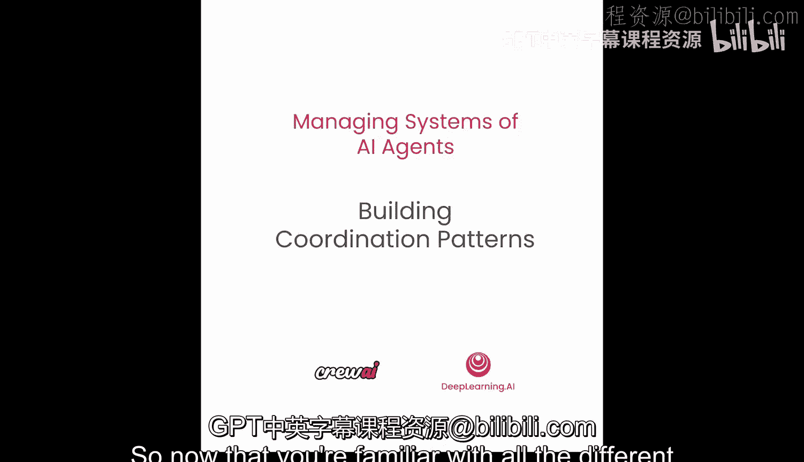
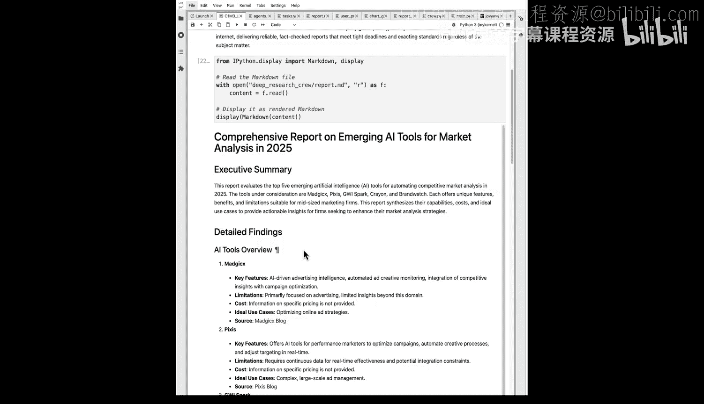

# 024：构建协调模式 🧩

在本节课中，我们将学习如何将之前介绍的智能体协作与通信方式整合到一个实际用例中。我们将从顺序流程转向混合流程，并探索如何让单个智能体异步执行多个任务。




---

## 概述

上一节我们介绍了智能体间的各种协作方式。本节中，我们将通过一个实际代码案例来应用这些知识。我们将构建一个“深度研究”智能体团队，其中单个智能体会同时处理多个研究任务，并最终生成一份综合报告。

---

## 从顺序流程到混合流程

首先，我们将从顺序执行流程转向更灵活的混合流程。这意味着我们将改变智能体、任务和团队的工作方式。

以下是核心变化：
*   从单一顺序执行，变为部分任务可并行执行。
*   单个智能体将能够同时处理多个任务。

---

## 构建项目结构

我们将采用一种新的CrewAI方法来创建项目结构，它会自动为我们搭建好整个框架。

你无需立即在Jupyter Notebook中运行此命令，因为相关文件夹已预先设置好。但为了演示，我们将从头开始创建。

运行以下命令来创建名为“deep_research_crew”的团队：

```python
crewai create crew deep_research_crew
```

运行后，CrewAI会引导你进行一系列选择来设置整个项目脚手架。例如，它会询问你想使用的模型。为了简单起见，我们选择OpenAI和GPT-4o模型。

完成后，你会看到项目生成了完整的文件夹结构，包括：
*   `knowledge` 文件夹：存放智能体的背景知识。
*   `src` 文件夹：存放源代码。
*   `tasks` 文件夹：存放任务定义。
*   `pyproject.toml` 文件：管理项目依赖。

在`src/deep_research_crew`目录下，你会找到核心的`crew.py`文件，以及`config`和`tools`文件夹。`config`文件夹用于存放智能体和任务的YAML配置文件，`tools`文件夹用于存放自定义工具。

---

## 配置智能体与任务

现在，我们需要配置具体的智能体和任务。

首先，进入`config`文件夹，打开`agents.yaml`文件。系统已预生成了一些示例智能体，我们需要将其替换为我们实际需要的智能体配置。

以下是我们的智能体配置示例：

```yaml
research_planner:
  role: 研究规划师
  goal: 为研究任务制定清晰、可执行的计划
  backstory: 你是一位经验丰富的研究项目经理，擅长分解复杂主题并规划高效的研究路径。

top_researcher:
  role: 顶级研究员
  goal: 进行深入、准确且全面的主题研究
  backstory: 你是一位孜孜不倦的研究专家，擅长从海量信息中提取关键洞察。

fact_checker:
  role: 事实核查员
  goal: 确保所有研究信息的准确性和可靠性
  backstory: 你是一位严谨的编辑，对细节有着敏锐的洞察力，致力于消除错误信息。

report_writer:
  role: 报告撰写员
  goal: 将研究发现整合成结构清晰、内容翔实的最终报告
  backstory: 你是一位技术作家，擅长将复杂信息转化为易于理解的格式。
```

接下来，配置任务。打开`tasks.yaml`文件，同样替换为我们的任务配置。

我们的任务发生了一些变化。请注意，`creative_research_plan`任务现在需要处理一个主主题和一个次主题。随后，这两个主题的研究将由同一个智能体`top_researcher`并行执行。

```yaml
creative_research_plan:
  description: 为“{main_topic}”和“{secondary_topic}”制定详细的研究计划。
  agent: research_planner

research_main_topic:
  description: 根据研究计划，深入研究主主题“{main_topic}”。
  agent: top_researcher
  context: [creative_research_plan] # 依赖前一个任务的输出

research_secondary_topic:
  description: 根据研究计划，深入研究次主题“{secondary_topic}”。
  agent: top_researcher
  context: [creative_research_plan] # 依赖同一个研究计划
```

关键点在于，`research_main_topic`和`research_secondary_topic`这两个任务将**同步执行**（即并行），因为它们都依赖于同一个`creative_research_plan`任务的输出。

---

## 添加背景知识与工具

为了让智能体在任务开始时就了解一些背景信息，我们可以使用`knowledge`文件夹。在`user_preferences.md`文件中，可以添加任何内部政策或用户偏好。

例如：
```
用户姓名：Joe Doe
职业：AI工程师
兴趣：对智能体技术感兴趣
所在地：美国加利福尼亚州旧金山
```

接下来，我们需要将之前用过的图表生成自定义工具集成进来。将工具代码复制到`tools`文件夹下的`chart_generator_tool.py`文件中。

此外，我们还需要设置防护规则（Guardrails）。在项目根目录创建一个`guardrails`文件夹，并在其中创建`report_guardrail.py`文件，用于存放检查最终报告内容的防护规则代码。

---

## 整合团队代码

现在，让我们查看并理解主文件`src/deep_research_crew/crew.py`中的代码。

该文件使用了装饰器来简化配置。`@crew`装饰器标注了整个团队类，`@agent`和`@task`装饰器用于标注智能体和任务。这样，我们可以直接引用YAML配置文件中的设置，而无需手动加载。

在智能体定义部分，我们可以指定每个智能体使用的模型。例如，可以让`research_planner`使用更快的`gpt-4o-mini`，而其他智能体使用`gpt-4o`。

我们还需要导入之前创建的图表生成工具，并将其分配给`report_writer`智能体使用。

在任务定义部分，我们通过`context`属性设定了依赖关系。最重要的是，我们通过配置实现了`research_main_topic`和`research_secondary_topic`这两个任务的**同步执行**。

团队配置部分将智能体、任务、内存（Memory）和流程类型（此处为混合流程）整合在一起。我们还使用了`output_file`属性来替代之前的回调函数，用于直接保存任务输出。

最后，我们通过`knowledge_sources`参数加载了用户偏好知识。

---

## 运行团队并查看结果

一切就绪后，我们可以在终端运行以下命令来启动整个团队：

```bash
crewai run
```

执行过程中，你会观察到：
1.  `creative_research_plan`任务首先执行，并利用了`knowledge`中的背景信息。
2.  随后，`research_main_topic`和`research_secondary_topic`两个任务**同时启动、并行执行**。
3.  两个研究任务完成后，事实核查任务开始。
4.  最后，报告撰写任务整合所有信息，并应用防护规则，生成最终报告。

报告生成后，我们可以在Jupyter Notebook中渲染其Markdown格式，查看详细的研究发现、信息来源链接以及生成的图表。

---

## 总结

本节课中，我们一起学习了如何构建一个协调模式复杂的多智能体系统。我们从顺序流程演进到混合流程，实现了单个智能体并行处理多个任务。我们利用CrewAI的项目结构、装饰器配置、背景知识注入和自定义工具，构建了一个高效、可扩展的深度研究团队。你可以基于此结构，进一步尝试批判性测试或训练，以优化结果。



我们已涵盖了多种流程类型和智能体连接模式。接下来，我们将探讨智能体与外部智能体通信的一种新兴且备受关注的协议：A2A（智能体对智能体）协议。