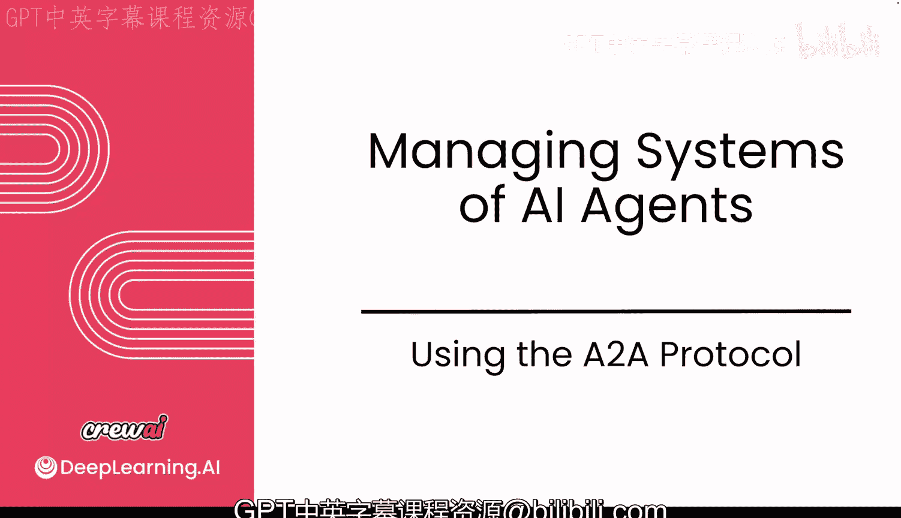
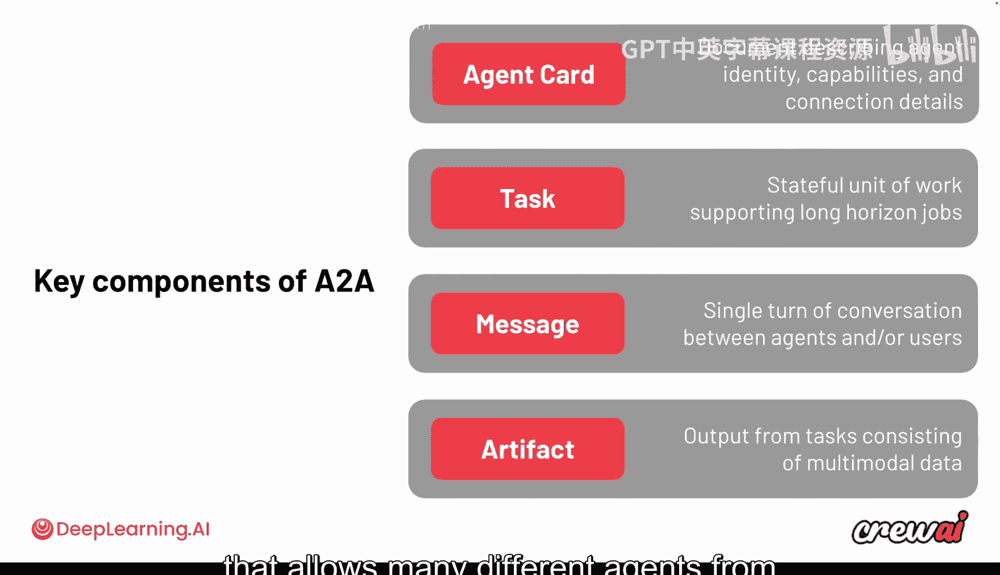
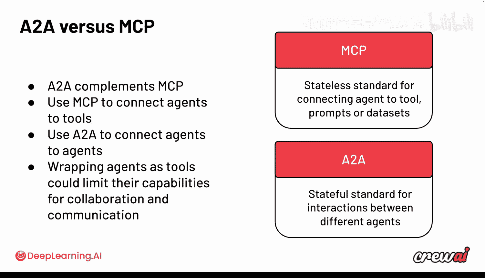
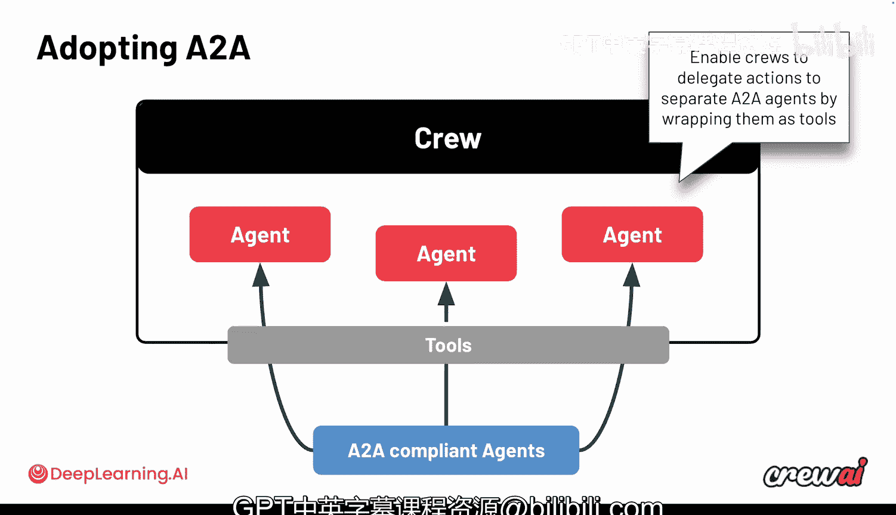

# 025：4. 使用 A2A 协议 🚀

## 概述
在本节课中，我们将要学习 A2A 协议。这是一个新兴的协议，旨在让不同的人工智能智能体能够在网络上相互通信与协作。我们将探讨它的核心概念、工作原理，以及它如何与 CrewAI 框架集成。

---

## A2A 协议简介
目前，全球范围内有大量的智能体正在运行，其中许多已经在线。有时，你的智能体需要与网络上的其他智能体进行协作。A2A 协议正是一个为此目的而设计的协议，它获得了广泛的关注，并且越来越多的人开始使用它。

上一节我们讨论了 MCP 协议，现在让我们来看看 A2A。当我们讨论 MCP 时，我们提到了一种允许智能体调用外部工具的方法。而 A2A 则更进一步，它允许智能体调用外部的其他智能体。

这是一个相对较新的协议，但已经开始获得关注，并且已经被 CrewAI 以及许多其他框架和供应商所支持。与 MCP 一样，它也是一个开放标准，并围绕几个关键原则构建。

## A2A 的核心原则与组件
A2A 协议的核心思想是让智能体间的通信变得极其简单。它采用了与 MCP 类似的 gRPC 和 SSE 技术，并确保遵循严格的安全和监控准则。

该协议的核心是让智能体之间能够交换消息、分配任务并共享成果。以下是 A2A 协议的主要组成部分：

以下是 A2A 协议的核心组件：

*   **智能体卡片**：用于标识一个智能体，描述其能力、可以执行的任务以及可能需要的任何要求。
*   **任务**：这是一个有状态的工作单元，你将某项工作委托给智能体去完成。这与 CrewAI 中任务的概念非常相似。
*   **消息**：这是智能体之间进行交互的载体，它们通过消息进行对话。
*   **成果物**：这是任务执行后产生的具体、有形的输出。

你可以看到，这些概念与我们目前在 CrewAI 中讨论的许多内容都能对应起来。这也解释了为什么 A2A 协议能获得如此多的关注。它创建了一个通用层，使得来自不同技术栈的智能体能够相互通信。

## A2A 与 MCP 的区别
现在，我们需要明确区分 A2A 和 MCP 协议。

*   使用 **MCP**，你允许你的大语言模型或智能体连接到外部的**工具**和**无状态数据集**（例如，提示词等）。
*   使用 **A2A**，你实际上是在让一个智能体**触发另一个智能体**。它们不仅可以相互对话，还能协作完成任务并最终汇报结果。

关键区别在于，将智能体包装成工具会从根本上改变其能力。如果你试图在 MCP 中包装一个智能体，可能无法充分发挥该智能体的全部潜力。而 A2A 则是从底层设计上就原生支持智能体，而不是将它们视为工具。两种方式都可行，但目前 A2A 正获得更多关注。

## A2A 与 CrewAI 的集成
A2A 协议与 MCP 是互补关系，并非二选一。根据你的外部集成需求，你可能会在多种用例中同时使用两者。

将 A2A 与 CrewAI 集成有两种主要方法：

以下是两种集成方法：

1.  **将 CrewAI 智能体暴露为 A2A 服务器**：这种方法让你的 CrewAI 智能体可以被外部智能体发现和调用。
2.  **将外部 A2A 智能体作为工具使用**：这种方法允许你的 CrewAI 智能体将任务委托给其他符合 A2A 协议的智能体。

**第一种模式**非常简单。你基本上是将你的 CrewAI 智能体包装在一个支持 A2A 协议的 HTTP 接口后面。其架构组件非常直观，使用了我们在讨论 MCP 时提到的相同 HTTP 和 JSON-RPC 结构。

**第二种模式**则是允许你的 CrewAI 工作流中的智能体调用远程的 A2A 智能体。这使你能够创建一个自定义工具，直接调用远程的 A2A 服务器，这个过程也非常直接。

## 行业标准与展望
通过 A2A 协议，我们可以看到整个行业正在共同努力，试图确定我们应遵循的标准。目前有多种选择，这是一个全新的领域，许多公司、开发者和团队都在探索最负责任、最高效的方式，让智能体能够相互通信并跨网络使用工具。

A2A 是一个非常实用的协议，它正在不断扩展并获得采用，以实现智能体在互联网上的互操作性。目前尚不确定未来是否会出现一个统一所有智能体的单一协议，但 A2A 无疑是当前获得大量关注并与 CrewAI 良好集成的协议之一，这一点值得强调。

## 总结
本节课中，我们一起学习了 A2A 协议。我们了解了它如何作为智能体间通信的新兴标准，探讨了其核心组件（智能体卡片、任务、消息、成果物），并明确了它与 MCP 协议的区别与互补关系。最后，我们介绍了将 A2A 与 CrewAI 集成的两种方法。你可能已经开始思考可以将哪些智能体连接起来了，这非常令人兴奋。

在下一节课中，我们将更深入地探讨这些概念，敬请期待。