# 026：5. 使用 Flows 编排智能体 🧩

在本节课中，我们将要学习 CrewAI 中的 **Flows**。这是一个用于编排智能体和任务流程的低层级、模块化框架。通过 Flows，你可以精确控制执行顺序，并灵活决定在何处引入多少“智能体”能力。

---

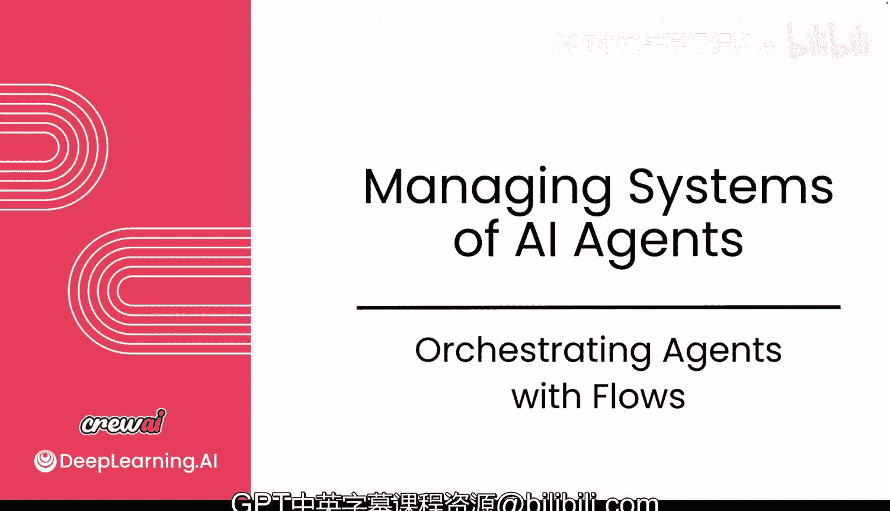

## 概述：理解智能体系统的不同心智模型

上一节我们深入探讨了智能体本身。但在智能体系统领域，存在几种不同的心智模型。

AI 智能体通常通过三种主要心智模型来理解：**智能体**、**图** 和 **事件**。到目前为止，我们主要关注的是智能体模型，并看到了它们的强大能力。

另一种逐渐兴起的心智模型是**图**，它使用更传统的图架构（如节点和边）。但由于图的概念较为复杂，日常接触较少，其采用速度较慢，门槛也较高。

而目前非常流行的一种高级心智模型是**事件**模型。它更类似于常见的 Web 开发模式（如事件驱动），对于大多数已经熟悉 Web 应用开发的工程师来说，这个概念更容易理解和上手，并能快速投入生产。

无论采用哪种心智模型，它们都共享一些模式，例如围绕使用大语言模型、决定何时使用它们，以及如何谨慎地向它们添加上下文。

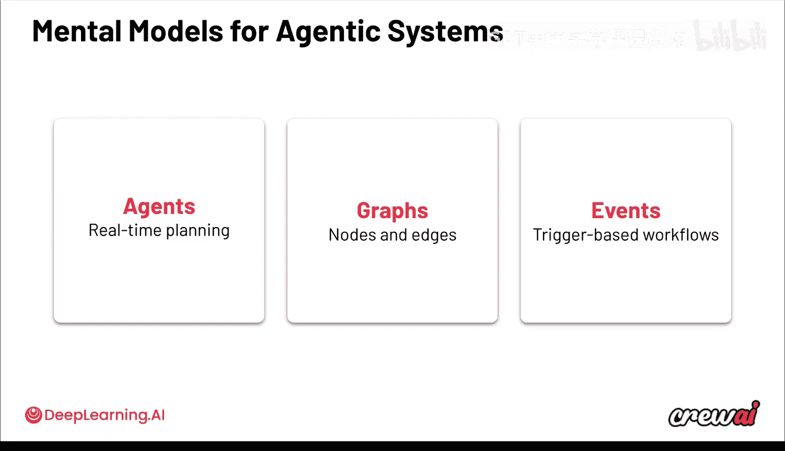

鉴于当前趋势，CrewAI 社区的许多成员在构建智能体系统时，特别关注**事件**和**智能体**模型。我们已经详细讨论了智能体和 Crews，现在让我们更多地关注基于事件的结构，看看这个心智模型如何应用，以及如何将其与智能体和 Crews 结合使用，发挥强大威力。

---

## 什么是 Flows？🚀

Flows 是一个模块化的编排层，你可以将其视为定义智能体或 Crews 行为的主干。

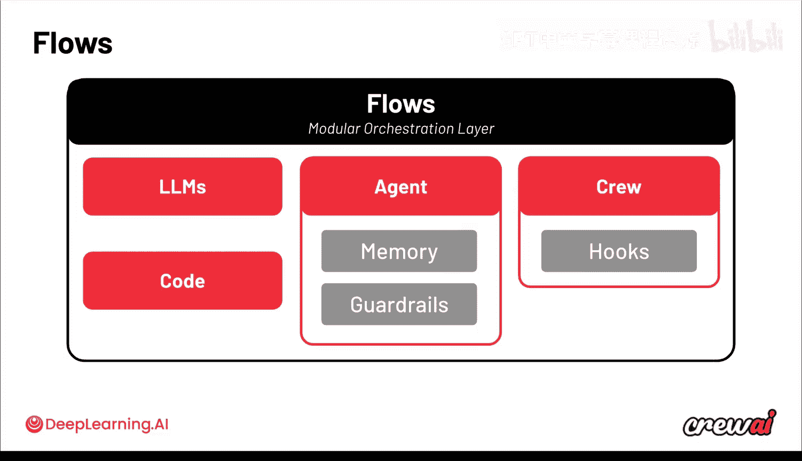

这意味着它允许你在非常低的层级上，定义**所有你想要发生的事情及其顺序**。你可以在 Flow 中引入多种不同的组件：
*   你可以引入 **LLM 调用**。
*   你可以引入**常规的 Python 代码**。
*   你可以引入**单个智能体**（可使用记忆和护栏）。
*   你甚至可以引入**整个 Crew**。

本质上，你可以将到目前为止学到的所有组件都放入 Flow 中。Flow 将为你提供主干和结构，以定义执行内容和顺序。当流程变得复杂时，这种控制能力显得尤为重要。

以下是一个 Flow 的示例：


1.  首先执行一段初始代码（常规 Python），可能用于从某处拉取数据或检查特定行为。
2.  然后，该代码触发**两件并行执行**的事情：
    *   信息流入一个**单一的 LLM 调用**，该 LLM 可能用于过滤信息、提取上下文或判断是否已拥有所需信息。
    *   同时，一个**单独的智能体**也在工作，它可能拥有记忆和护栏，并基于信息产生某种输出。
3.  并行执行结束后，流程汇合到一个**单一的函数**中，执行更多代码来处理信息。
4.  最后，该代码可能触发两个不同的操作：将日志记录到特定数据库，并**启动一个完整的 Crew** 作为下一步。

通过这个例子，你可以看到如何结合代码、LLM、智能体和 Crews，获得极大的控制力。Flows 成为了定义整个执行过程的自动化控制层和主干。

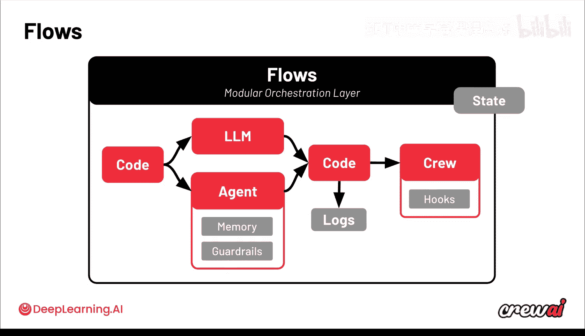

Flows 是一个低层级的编排框架，让你完全控制将要发生的事情，并允许你决定在整个执行过程中引入多少智能体能力。你不仅控制顺序，还拥有一个在整个 Flow 中共享的**状态**。这意味着在不同的代码块、函数和 LLM 调用中，你可以将数据存入该状态，并在后续步骤中复用。

---

## 两种构建方式：Agency 与 Control 🔄

退一步看，构建智能体系统主要有两种方式：


1.  **优化于 Agency（自主性）**：使用智能体、工具、任务、记忆等我们目前所学的组件。你优化的是让智能体在运行中自行解决问题。
2.  **提供结构化主干**：使用 Flows，它为你提供结构化的主干，你仍然可以在其中引入智能体、LLM 和整个 Crews，但你对如何设置拥有更多控制权。

它们各有其适用的场景：
*   **Crews**：拥有更多协作性智能体，因此更自主、动态。它们更适合探索性、非确定性的任务，例如撰写剧本、制定营销策略或构思落地页创意。
*   **Flows**：是更低层级、事件驱动的控制层。它们非常适合于**结构化的、可重复的步骤**，并要求严格的控制。例如，用于响应电子邮件、作为会议助手（在保存会议记录文档时触发，生成任务并通过 Slack 发送）等。

将两者结合可以创建非常复杂的用例。我们观察到企业和个人工程师中一个日益增长的模式是 **“按需引入 Agency”模型**，或者我喜欢称之为 **“最小可行方案”方法**。它遵循“保持简单”的工程原则。

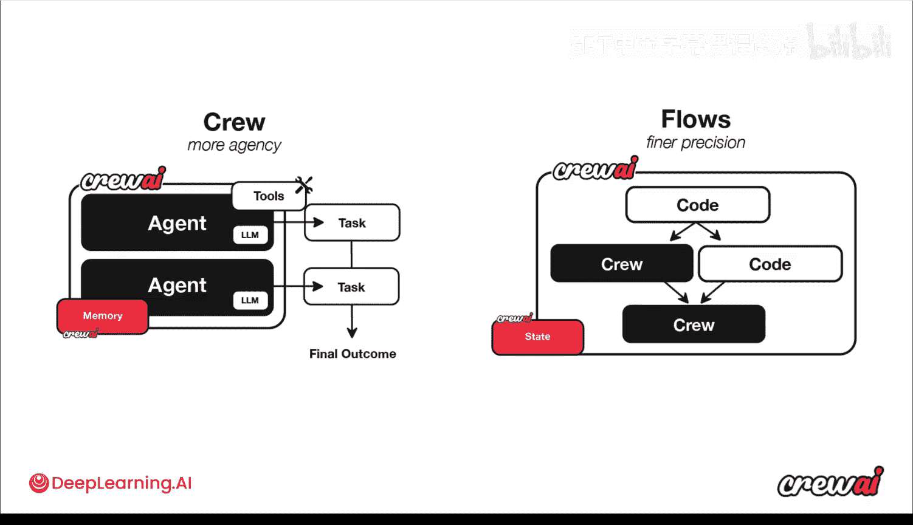

这个思路是：从一个结构化的主干（如 CrewAI Flows）开始，然后只在每个步骤需要时才添加 Agency。如果一段代码能解决问题，就无需引入 LLM 或智能体带来的成本、延迟和潜在复杂性。你应该将智能体和 Crews 保留给它们真正能增加价值的复杂任务。如果确实需要 LLM，可以从单一 LLM 调用开始，再逐步引入智能体或整个 Crew。

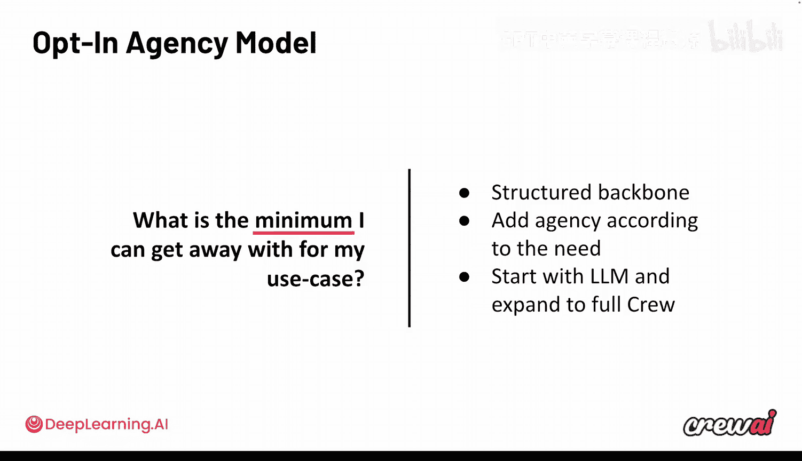


这允许你选择在 Flow 中引入多少 Agency，确保你构建的系统既高效又有效。

---

## Flows 的核心构建模块 🧱

让我们看一个真实 Flow 的结构示例：


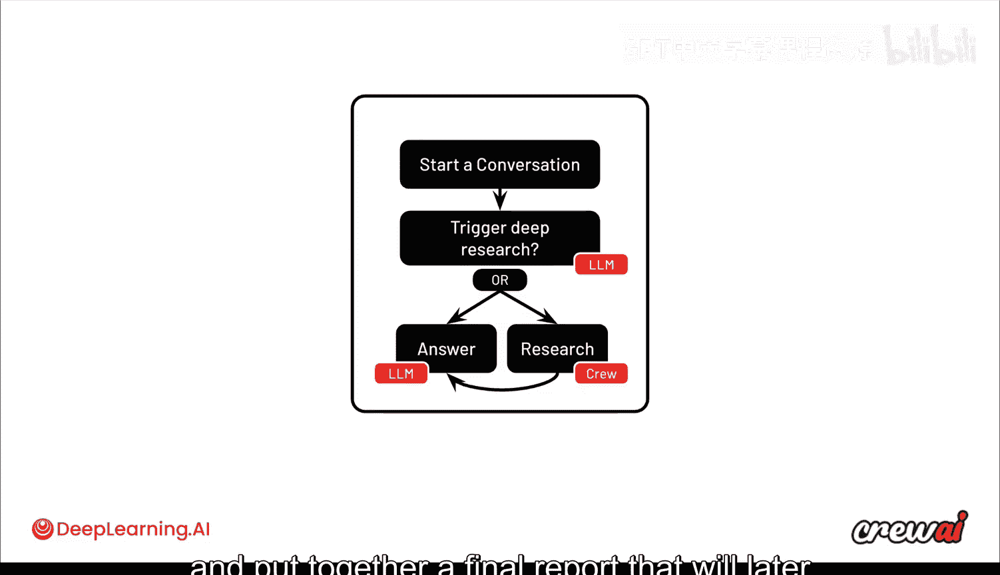

在这个 Flow 中：
1.  一个 `start_conversation` 函数启动对话。
2.  它触发一个 `router` 函数。该函数基本上执行一次 LLM 请求，以决定是否需要进行深度研究。
3.  **如果不需要深度研究**（例如，对话已有大量上下文），则直接进入 `answer` 函数（另一个 LLM 调用）来回复答案。
4.  **如果需要深度研究**，则进入 `research` 函数，该函数内部包含一个完整的 Crew。这个 Crew 会像我们之前看到的那样，外出进行研究、抓取网页并最终生成报告，该报告随后被用来给出答案。

仔细观察 Flows，它有一套构建模块，允许你构建这些复杂用例，但这些模块本身非常简单，因为 Flow 只是一个很薄的层。以下是三个主要的构建模块（都是装饰器）：

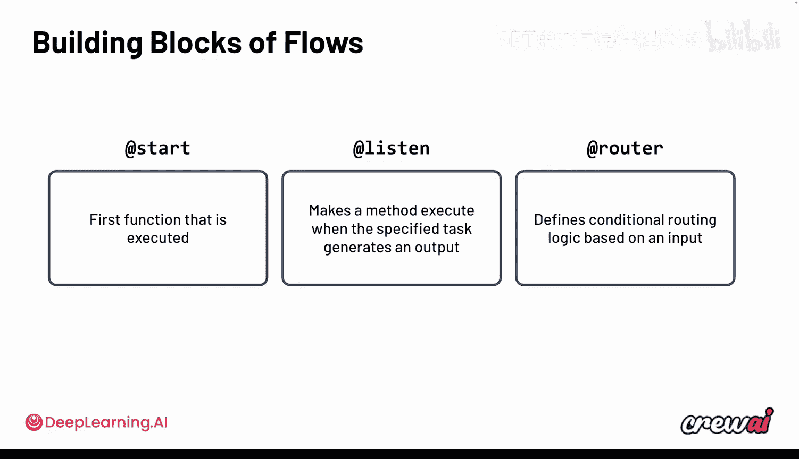


1.  **`@start` 装饰器**：标记哪个函数将作为第一个执行的函数。
2.  **`@listen` 装饰器**：标记一个函数，它将在另一个函数完成后执行。
3.  **`@router` 装饰器**：定义一个条件函数，它将根据函数内部发生的情况，将请求路由到不同的路径。

仅凭这三个简单的构建模块，你就能做很多事情。随着组合更多模块，能力会更强。

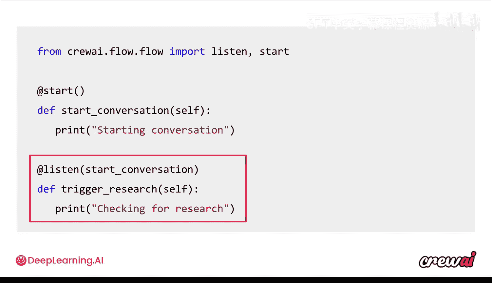

以下是一个利用这些构建模块的简单 Flow 代码示例：


```python
# 导入装饰器
from crewai.flow import listen, start

# 使用 @start 标记流程的起点
@start
def start_conversation():
    # ... 你的代码 ...
    pass

# 使用 @listen 标记此函数在 start_conversation 完成后执行
@listen(start_conversation)
def trigger_research():
    # ... 你的代码 ...
    pass
```

你可以看到，这只是常规的 Python，非常 Pythonic。你只需编写函数，并使用装饰器来注解它们。`@start` 标记起点，`@listen` 用于建立事件链。

---

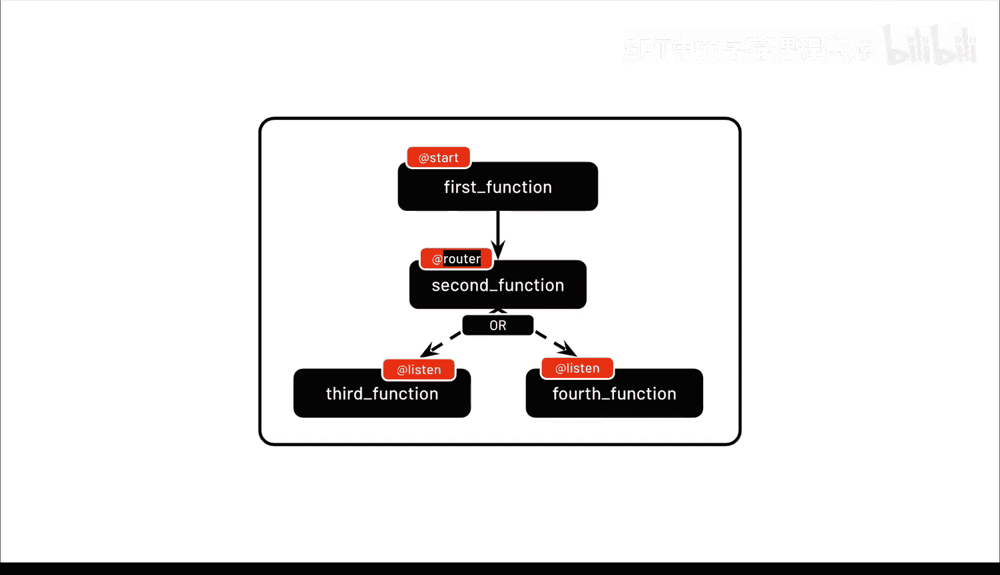

## 高级模式与可视化 🗺️

通过组合这些模式，可以构建真正有趣的流程。例如：
*   一个使用 `@start` 的函数可以触发两个同时监听它的函数，从而实现**并行执行**。
*   你可以设置第四个函数，仅在第二和第三个函数**都完成**后才执行（使用 `@listen` 并配合 `and` 条件）。
*   你也可以设置第四个函数在第二**或**第三个函数完成时执行（使用 `or` 条件）。
*   结合 `@router` 装饰器，可以让一个函数根据条件触发两个不同分支中的一个。

这些抽象组合可能难以想象，但当应用于真实用例时，它们能带来极大的清晰度和能力。

让我们回到之前提到的“对话与深度研究”的 Flow 示例，并快速回顾一下：

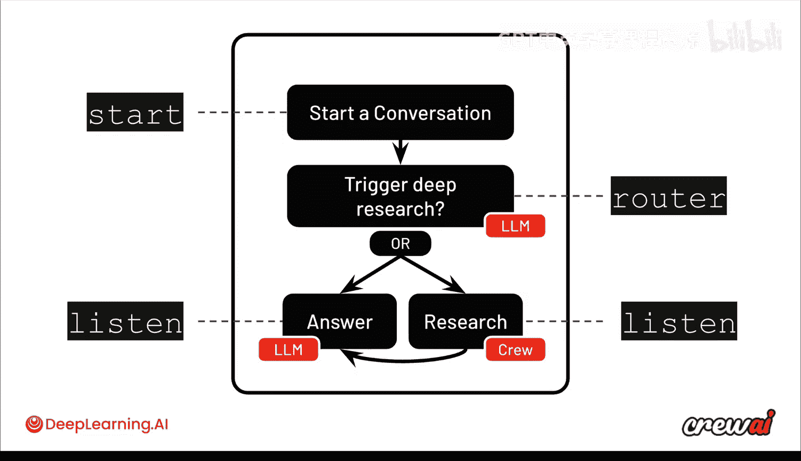


*   `start_conversation` 函数使用 `@start` 装饰器。
*   `trigger_deep_research` 函数使用 `@router` 装饰器，内部通过 LLM 调用（例如函数调用）决定路由方向。
*   如果路由到 `answer`，则执行相应的监听函数；如果路由到 `research`，则执行另一个监听函数，并可能在其中启动一个完整的 Crew。

CrewAI 的一个很酷的功能是，它可以**自动绘制你的 Flow 图**。你只需在终端输入 `crewai flow plot`，它就会自动分析你的函数和装饰器，并为你生成可视化图表。


这对于理解复杂的 Flow、文档记录以及发现流程中的问题非常有帮助。上图就是一个由 CrewAI Flow 自动绘制的“深度研究检查”流程图示例，清晰地展示了从开始到路由，再到研究 Crew 和最终报告生成的整个过程。

---

## 项目结构与状态管理 📁

要开始一个 Flow 项目，可以使用一个简单命令创建完整的文件夹结构：
```bash
crewai create flow <你的流程名称>
```

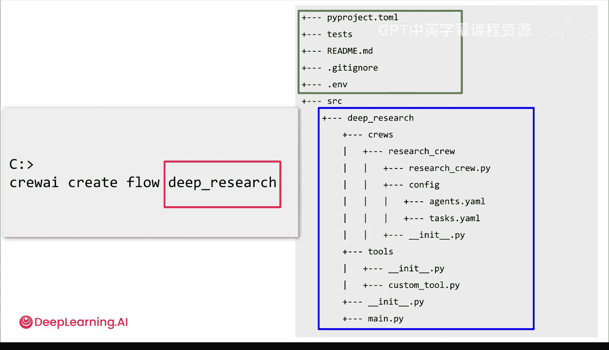

这会自动为你创建一个标准的 Python 项目（使用 `pyproject.toml` 管理依赖），并包含以下结构：
*   一个专门用于存放 **Crews** 的文件夹（例如 `research_crew`）。
*   一个用于存放可在整个项目中复用的 **Tools** 的文件夹。
*   主要的流程代码通常位于 `main.py` 或类似文件中。由于 Flow 是很薄的一层，且是纯 Python，你可以按喜好将代码拆分到不同文件中，以确保可维护性。


Flows 另一个非常有趣的特点是**状态管理**。每个 Flow 都有自己的状态，你可以将其想象成一个数据库，可以在 Flow 执行期间存储任何数据。

例如，从第一个函数开始，你通过 LLM 调用、执行代码或智能体/Crew 的输出产生了一些数据，并希望将其存储起来供以后使用。你可以将其写入 Flow 的状态中，然后在其他函数中读取它。这为你在不同函数间共享数据提供了极大的灵活性。

不仅如此，你还可以**持久化**这个状态，将其存储到实际的数据中。这样，当你再次运行该 Flow 时，状态会自动从保存的地方预加载，你可以从上次停止的地方继续。实现这一点非常简单，只需使用 `@persist` 装饰器来注解整个 Flow 或特定的函数。

在我们的深度研究对话示例中，随着发送新消息，我们希望确保将所有消息和输出持久化到一个单一状态中，以便在对话过程中复用。这样，每次从顶部运行 Flow 时，它会自动预加载之前的对话历史，让你可以持续聊天。

你可以在每个函数上使用 `@persist` 装饰器，来定义哪些函数执行后应该将状态持久化到数据库。在后续执行中，状态会被自动重新加载，你也可以选择覆盖其中的部分数据。

---

## 总结 🎯

本节课中，我们一起学习了 CrewAI 中的 **Flows**。

*   Flows 是一个**低层级、模块化的编排框架**，用于定义智能体任务的执行顺序和逻辑主干。
*   它允许你**灵活混合使用 Python 代码、LLM 调用、单个智能体和完整 Crews**，实现高度可控的自动化流程。
*   我们探讨了构建智能体系统的两种主要思路：优化自主性的 **Agency 模式**和提供精确控制的 **Flows 模式**，并介绍了 **“按需引入 Agency”** 的最佳实践。
*   Flows 的核心是三个简单的装饰器：**`@start`、`@listen` 和 `@router`**，通过它们可以构建复杂的事件驱动逻辑。
*   CrewAI 提供了 **`crewai flow plot`** 命令，能自动将代码可视化为流程图，极大方便了理解和调试。
*   Flows 拥有强大的**状态管理**功能，支持在流程内部共享数据，并能将状态**持久化**到数据库，实现跨执行会话的连续性。

Flows 感觉非常实用，许多人已将其用于日常开发，并作为将用例推向生产环境的首选方式，因为它提供了坚实的结构和所需的控制力。通过应用“按需引入 Agency”模型，你可以精确决定在自动化中引入多少智能和能力。

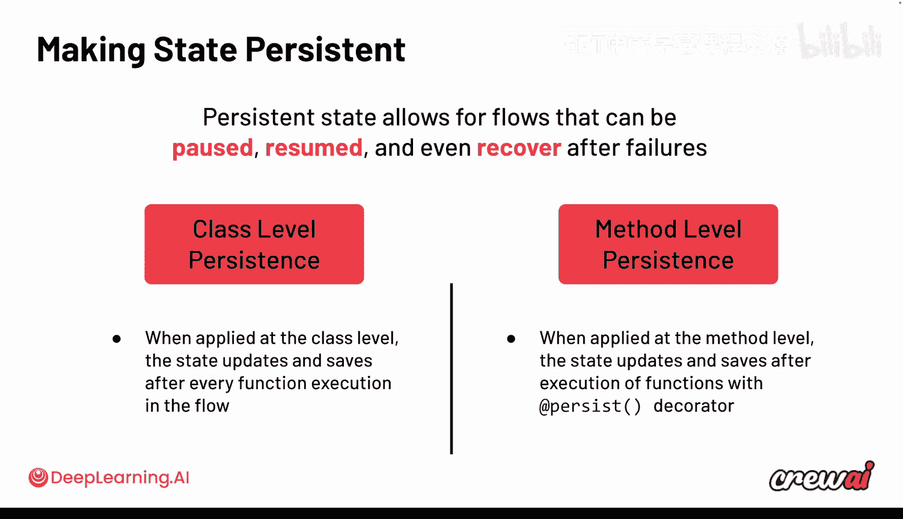

当然，它们需要良好的设计和可靠的构建。在接下来的视频中，我们将动手构建一个完整的 Flow，这将会非常精彩！