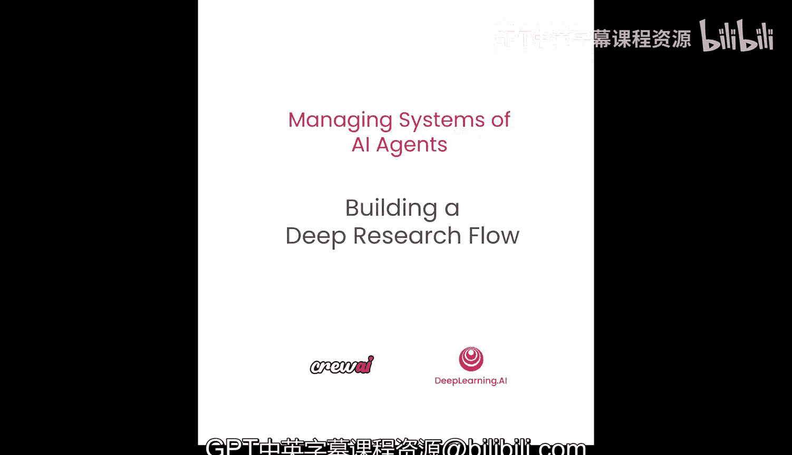
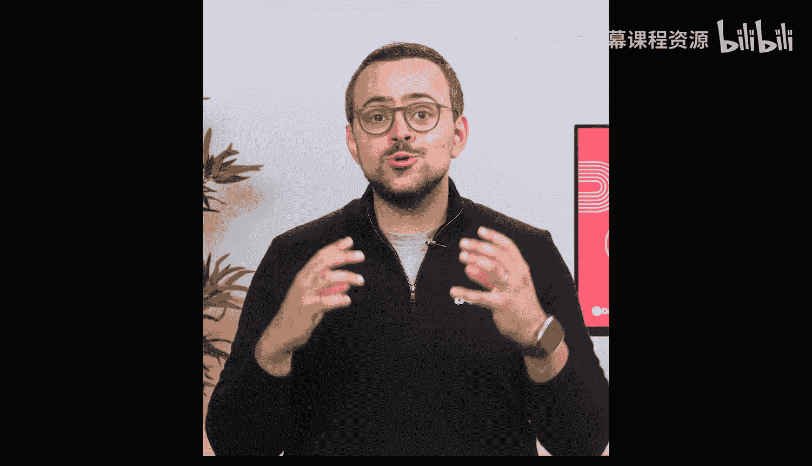
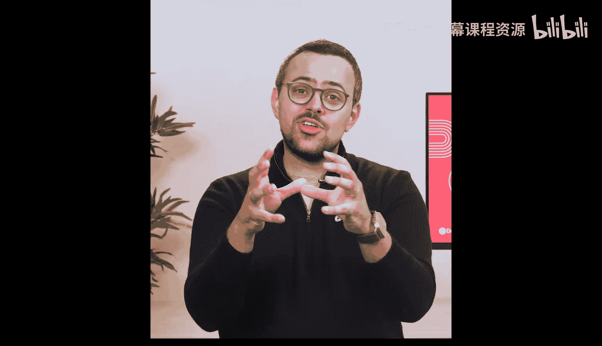
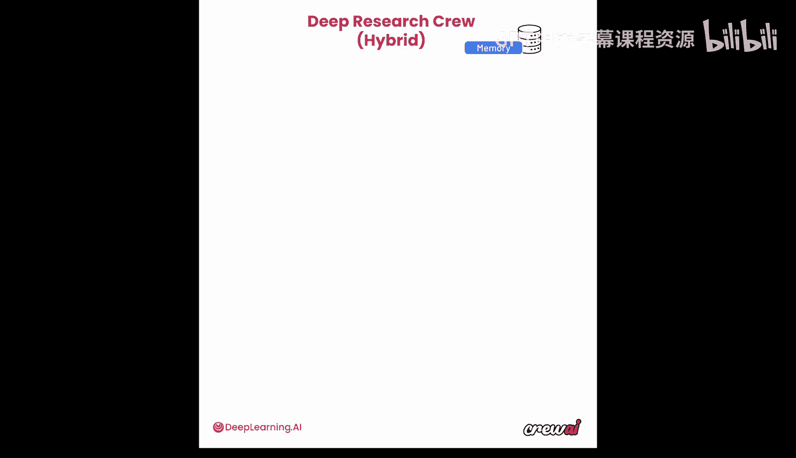
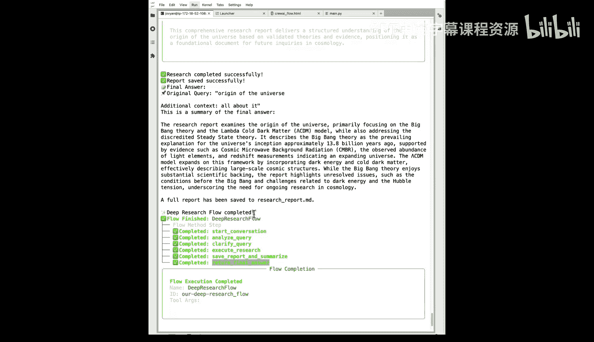
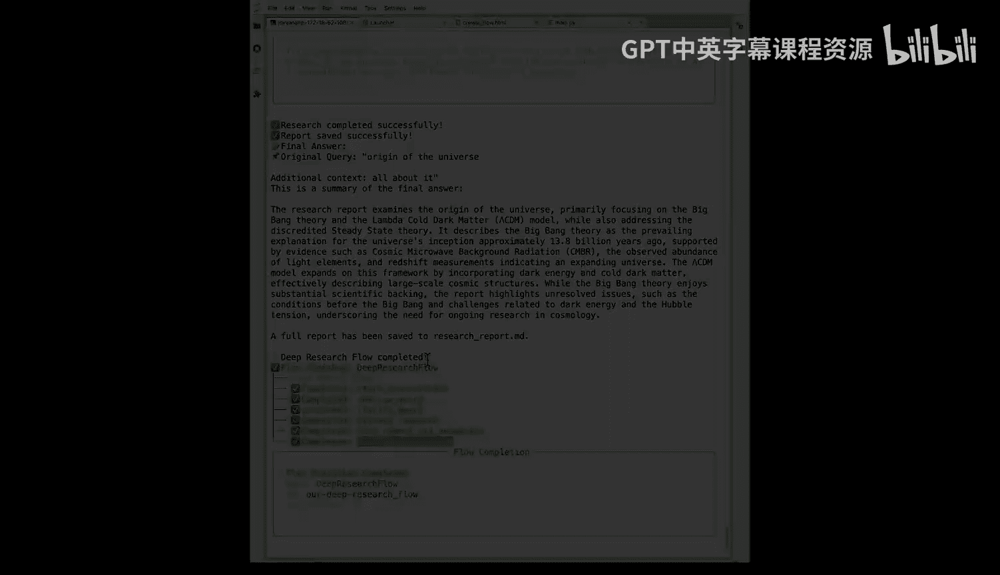

# 027：6. 构建深度研究流程 🚀

在本节课中，我们将学习如何将之前构建的深度研究智能体团队（Crew）升级为一个更强大、更可控的深度研究流程（Flow）。我们将看到如何利用流程来编排决策、管理状态，并在简单的语言模型调用和复杂的多智能体研究之间无缝切换。





---





## 概述

到目前为止，我们已经了解了流程（Flows）的强大功能和重要性。现在，我们将把之前构建的深度研究智能体团队（Deep Research Crew）转化为一个深度研究流程（Deep Research Flow）。通过这个升级，我们将整合所有已学的知识，使这个用例变得更加强大，并解锁更多应用场景。

## 从智能体团队到流程

上一节我们介绍了如何构建一个混合型的研究团队。它包含一个研究规划员，负责提出假设并分解研究问题，然后触发两个并行任务（研究主主题和次主题），但由同一个智能体执行。之后，进入事实核查阶段，同样由一个智能体完成两项核查任务。最后，所有信息汇总到最终报告撰写员那里。

现在，我们将把这个过程提升到新的水平，使用 CrewAI Flows 来重构它。我们不会改变智能体团队内部的运作逻辑，而是改变触发和管理这个团队的方式。

## 流程的核心概念与结构

流程为我们提供了一个轻量级的编排层，它通过一系列装饰器（decorators）让构建自动化流程变得非常简单。一个典型的流程项目结构如下：

```
your_flow_project/
├── src/
│   └── your_flow/
│       ├── __init__.py
│       ├── main.py      # 流程的主要代码
│       ├── crews/       # 存放智能体团队
│       └── tools/       # 存放工具
├── pyproject.toml
└── README.md
```

你可以使用 `crewai create flow` 命令快速生成这个脚手架。

### 流程状态（State）

流程的核心是**状态（State）**，它是一个在流程所有函数间共享的数据结构。我们可以随时读写状态，以便在不同执行步骤间传递数据。

```python
from crewai.flow.flow import Flow, state

class ResearchState(Flow):
    query: str = state(default="")  # 用户查询
    needs_research: bool = state(default=False)  # 是否需要深度研究
    final_answer: str = state(default="")  # 最终答案
    # ... 其他状态字段
```

### 关键装饰器

流程通过装饰器控制执行顺序和逻辑：

*   `@agent`：标记一个函数由智能体执行。
*   `@task`：标记一个函数为任务。
*   `@flow`：定义一个流程。
*   `@on_start`：标记流程的起点函数。
*   `@on_event`：监听特定事件，触发函数执行。
*   `@router`：根据条件将流程导向不同的分支。
*   `@persist`：持久化状态，使其在多次流程执行间保留。

## 构建深度研究流程

以下是深度研究流程的主要步骤分解，每个步骤都对应流程中的一个函数。

### 1. 开始对话

这是流程的入口点，使用 `@on_start` 装饰器。它会检查是否存在之前持久化的状态，并向用户询问研究主题。

```python
from crewai.flow.flow import Flow, on_start

class DeepResearchFlow(Flow):
    @on_start
    async def start_conversation(self):
        print("🤖 欢迎来到深度研究助手！")
        # 检查并加载持久化状态
        if self.state.previous_query:
            print(f"我记得上次您想了解: {self.state.previous_query}")
        # 获取用户输入
        self.state.user_query = input("您今天想了解什么？\n")
```

### 2. 分析查询

此函数使用 `@router` 装饰器，分析用户查询的复杂性。它调用一个轻量级语言模型来决定是直接回答，还是需要进行深度研究。

```python
from crewai.flow.flow import router

    @router
    async def analyze_query(self):
        # 调用LLM判断查询复杂度
        analysis = await self.llm_call(f"分析查询复杂度: {self.state.user_query}")
        if analysis == "SIMPLE":
            self.emit("simple_event")  # 触发简单回答路径
        else:
            self.emit("research_event") # 触发深度研究路径
```

### 3. 简单回答路径

如果查询简单，流程会直接进入此函数，生成即时回复。

```python
from crewai.flow.flow import on_event

    @on_event("simple_event")
    async def simple_answer(self):
        answer = await self.llm_call(f"请友好地回答: {self.state.user_query}")
        self.state.final_answer = answer
        self.emit("final_answer_ready")
```

### 4. 深度研究路径

如果判断需要研究，流程会先进入澄清问题环节。

#### 4.1 澄清问题

此步骤会询问用户，以获得更具体的研究方向。

```python
    @on_event("research_event")
    async def clarify_query(self):
        clarifying_q = await self.llm_call(f"针对‘{self.state.user_query}’，生成一个澄清问题以获得更具体方向。")
        user_context = input(f"🤔 {clarifying_q}\n")
        self.state.additional_context = user_context
        self.emit("query_clarified")
```

#### 4.2 执行研究

这是流程的核心，在此加载并运行我们之前构建的**深度研究智能体团队**。团队会并行研究主次主题，进行事实核查，并生成详细报告。

```python
    @on_event("query_clarified")
    async def execute_research(self):
        print("🔬 启动深度研究团队...")
        # 动态配置团队任务
        self.research_crew = DeepResearchCrew()
        self.research_crew.set_topic(
            main_topic=self.state.user_query,
            context=self.state.additional_context
        )
        # 执行团队任务
        final_report = await self.research_crew.kickoff()
        self.state.research_report = final_report
        self.emit("research_complete")
```

#### 4.3 保存与总结报告

研究完成后，流程将报告保存为文件，并生成一个简洁的总结。

```python
    @on_event("research_complete")
    async def save_and_summarize_report(self):
        # 保存详细报告到Markdown文件
        with open("research_report.md", "w") as f:
            f.write(self.state.research_report)
        # 生成总结
        summary = await self.llm_call(f"请总结以下报告的核心发现: {self.state.research_report[:1000]}...")
        self.state.final_summary = summary
        self.emit("report_saved")
```

### 5. 返回最终答案

这是流程的终点，它监听来自两条路径（简单回答或研究总结）的事件，并向用户呈现最终结果。

```python
    @on_event({"simple_answer_done", "report_saved"})
    async def return_final_answer(self):
        print("\n" + "="*50)
        print("📝 最终答案:")
        print("="*50)
        print(self.state.final_answer or self.state.final_summary)
        print("="*50)
        # 持久化状态，供下次对话使用
        self.persist_state()
```

## 可视化与运行流程

CrewAI 提供了一个强大的工具来可视化你的流程。

```bash
# 在项目根目录运行，生成流程可视化图
crewai flow plot
```

这将生成一个 HTML 文件，清晰地展示流程的所有步骤、分支和事件触发关系。这对于理解复杂流程和调试非常有帮助。

运行流程只需一个命令：

```bash
crewai run
```

流程启动后，你可以与它交互。例如：
*   输入“你好”，它会直接调用LLM生成问候回复。
*   输入“宇宙的起源”，它会触发深度研究路径，可能先询问你具体想了解科学的还是历史的视角，然后启动整个研究团队，最终给你一份详细的报告和总结。

## 总结

本节课中，我们一起学习了如何将智能体团队（Crew）集成到流程（Flow）中，从而构建出更灵活、更强大的自动化系统。我们掌握了：

1.  **流程的核心价值**：在简单的LLM调用和复杂的多智能体协作之间提供精细化的控制层。
2.  **关键组件**：包括**状态管理**、**装饰器**（如 `@router`, `@on_event`, `@persist`）的使用。
3.  **构建模式**：从开始对话、分析路由、执行不同路径（简单回答/深度研究），到最终汇总输出的完整模式。
4.  **可视化与持久化**：使用 `crewai flow plot` 可视化流程，利用 `@persist` 实现跨对话的状态保持。





通过深度研究流程这个案例，你看到了如何把之前所学的智能体、任务、工具、记忆和护栏等概念，通过流程优雅地串联起来，形成一个端到端的、可交互的AI应用。现在，你可以尝试修改这个流程，添加更多步骤或处理更多边缘情况，利用这些基础模块去构建属于你自己的自动化用例。