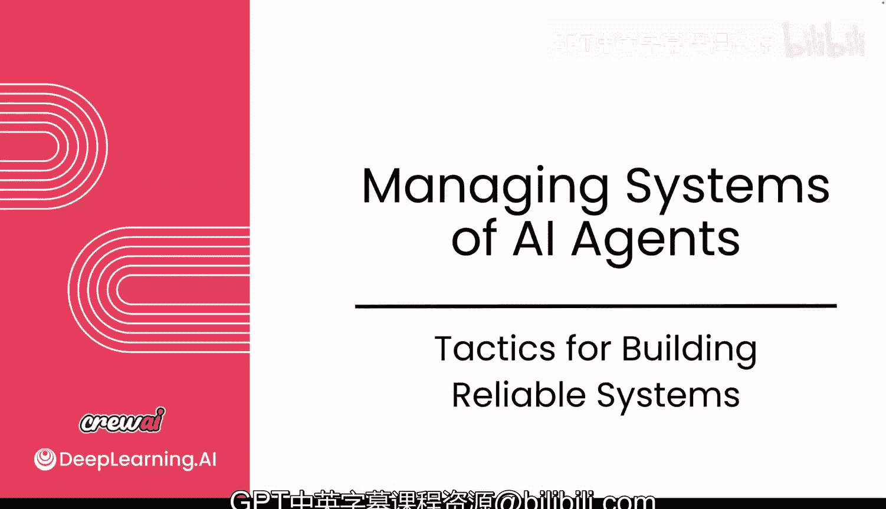
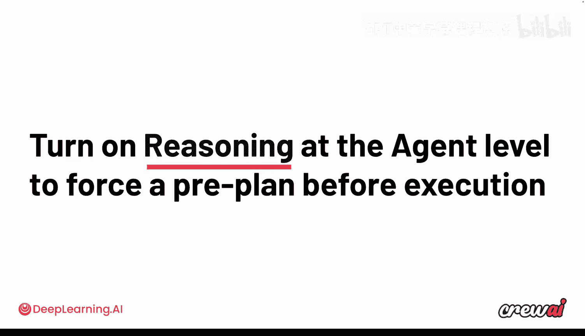
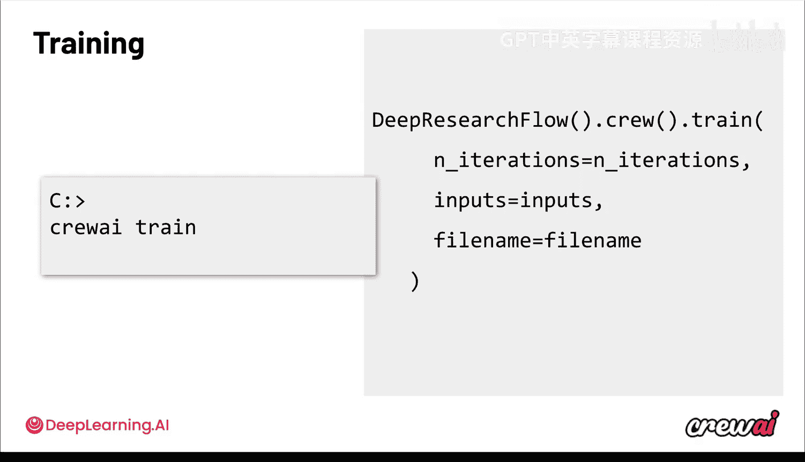
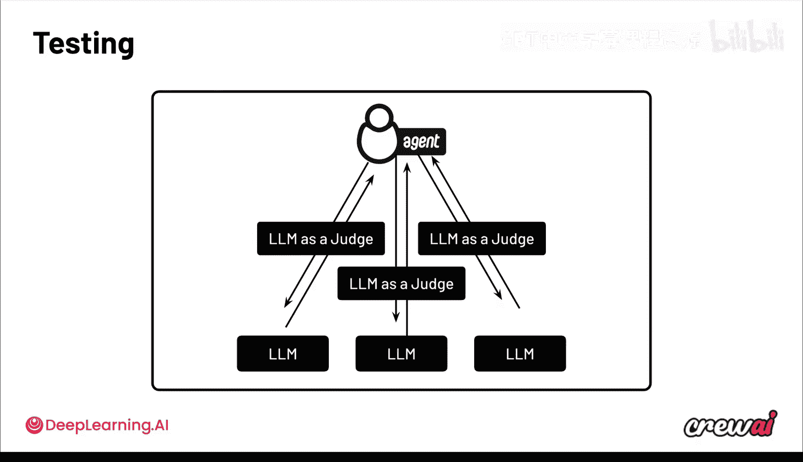
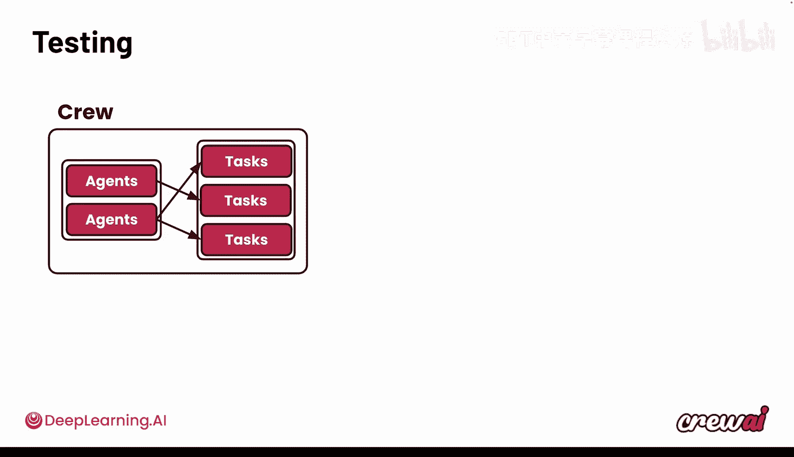
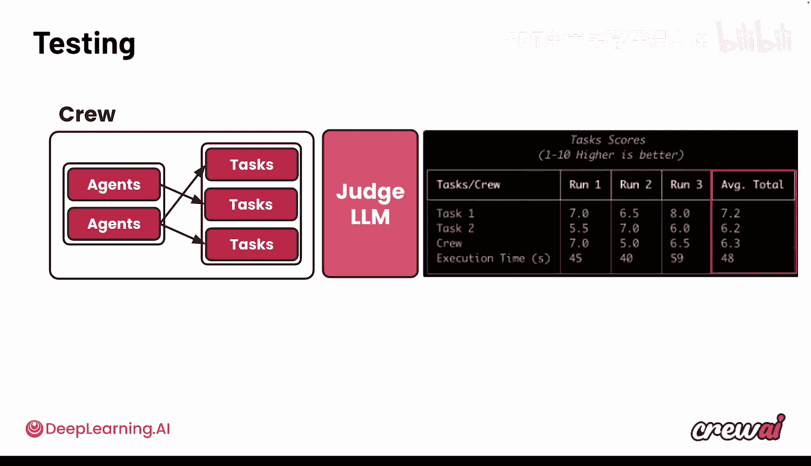
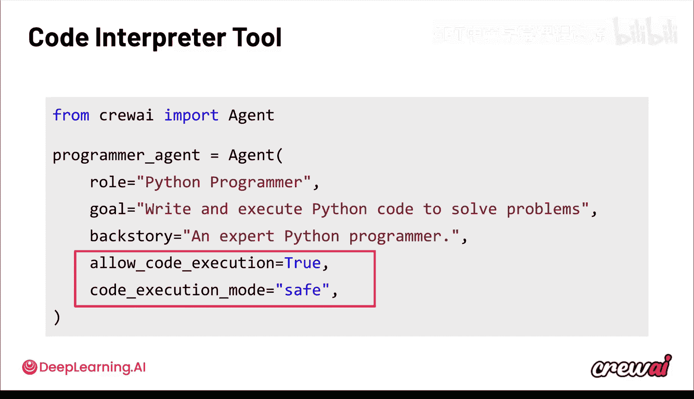

# 028：构建可靠系统的策略 🛠️

在本节课中，我们将学习如何确保您构建的多智能体系统能够可靠、稳定地运行。我们将探讨一系列策略和技巧，从测试、训练到代码执行和推理智能体，旨在帮助您将系统自信地部署到生产环境中。

## 概述



通过本课程的学习，您应该已经非常熟悉如何构建智能体。无论是在 Jupyter Notebook、本地计算机还是 CrewAI 平台上，创建智能体都已不是难事。然而，核心问题在于：您能否可靠地运行它们？它们能否持续产出高质量的结果？最终，一切都关乎**信任**。您能否信任这些智能体，并自信地将它们部署到生产环境？如果不能，我们就需要解决这个问题。本节将介绍如何构建值得信赖的智能体系统。

## 构建可信智能体的核心策略

为了获得可靠、可重复的结果，从而建立对智能体的信任，我们需要为系统引入一些确定性控制。其中一些控制手段您可能已经熟悉，例如之前课程中深入讨论过的**流程**和**护栏**。流程为智能体提供了结构化的任务执行骨架，而护栏则用于检查特定的输出。

除此之外，还有一些我们尚未深入探讨但非常有价值的控制策略，包括：
*   **推理智能体**：强制智能体在执行任务前进行思考和规划。
*   **人工介入监督**：在智能体完成任务前，要求其与您核对，以便提供额外反馈。
*   **测试**：比较不同大语言模型，以在质量、速度等方面做出最佳选择。
*   **训练**：通过记忆机制，训练智能体以特定方式行为，强制其遵循特定格式。

接下来，我们将逐一详细探讨这些策略。

## 启用推理智能体 🤔

上一节我们介绍了为系统引入控制的重要性，本节中我们来看看如何通过**推理智能体**来提升输出的质量。

推理智能体的核心思想是，要求智能体在执行任何操作或完成任务之前，先思考并规划出达成目标的步骤。通过这种方式，智能体会草拟并自我检查一个计划。您可以限制其尝试制定满意计划的次数，之后它才会真正开始执行工作并遵循最初草拟的计划。



启用此功能非常简单，只需将一个名为 `reasoning` 的标志设置为 `True`。这将自动为您的智能体开启推理步骤。

```python
agent.reasoning = True
```

此外，您还可以设置 `max_reasoning_attempts` 参数，以定义智能体在实际开始工作前可以尝试创建计划的次数。这是一种简单有效的方法，可以确保您的智能体在执行工作前进行额外思考，从而根据具体用例获得更好的输出。

## 实施人工介入监督 👤

我们已经在前面的模块中讨论过护栏，但我想谈谈终极护栏——**人工介入监督**的能力。这使您能够在智能体工作过程中验证、检查其输出是否合格，并为其提供反馈。

其工作原理是：智能体完成任务后，在最终确认工作完成前，会向您请求输入，询问您对其工作的评价。您可以根据需要提供额外反馈，智能体将根据这些反馈重新执行工作。

例如，在执行的最后，您的终端会出现类似这样的提示，要求您提供反馈。您可以输入具体指令（如“生成15项而不是10项”），也可以不输入任何内容，智能体会默认一切正常。输入反馈后，该信息将传回给智能体，它会重新工作以满足您的要求，并在完成前再次请您确认。

人工介入监督在需要对智能体进行特定监督时极为有用。当您部署此类智能体时，特别是使用 CLI 时，这套人工介入逻辑会变成一个 API。该 API 允许您将其与 Slack、Teams 或其他您可能使用的通信系统集成，从而无需人员守在终端旁即可提供反馈。

## 训练您的智能体团队 🧠

接下来，我们谈谈如何**训练**您的智能体团队。这里的训练指的是通过交互式反馈过程，让智能体记住做对和做错的事情，这些记忆将在后续的所有执行中被复用，以确保它们遵循既定标准。

回顾本课程第一个模块的内容，在训练模式下，智能体会正常启动，但在产生初始输出后会暂停并向您征求反馈。然后，它们会尝试利用该反馈改进答案，并基于此生成学习记忆存入其记忆库。

系统会为团队中的每个智能体记录：初始输出是什么、您给出的人工反馈是什么、改进后的输出是什么，以及执行过程中的关键信息。在训练结束时，这些反馈会按智能体进行整合，成为有价值的建议来源。这些建议是从您的反馈以及初始输出与改进输出之间的差异中提炼出的清晰、可操作的指令，并为生成的每条记忆附上质量评分。

在正常执行期间，每个智能体会将其整合后的建议作为上下文的一部分加载，确保将其考虑在内。您的文件系统中会有一个物理文件来存储这些建议、质量评分和最终摘要。

要启动训练，您可以在终端中运行 `crewai train` 命令，也可以在 Python 中使用 `train()` 函数，这将自动为您启动训练过程。执行后，您将看到运行过程、反馈提示出现，最终您会得到一个基于您反馈而变得更好的智能体。



## 测试与选择合适的大语言模型 📊



除了训练，您可能还需要**测试**您的流程和智能体，以获取其性能指标，判断它们表现如何，甚至可以比较几个不同的大语言模型。

在测试 AI 智能体时，系统会多次运行同一任务（执行指定次数）。您还可以指定一个特定的大语言模型作为“裁判”，该模型可以是执行任务所用的同一个，也可以是另一个专门用于评判的模型。



测试结束后，系统会为每项任务生成一系列关于输出质量的图表。您可以通过 CLI（在终端输入 `crewai test`）或 Python（使用 `test()` 函数）来触发测试。

其背后的流程是：智能体团队执行所有任务后，这些任务的输出和预期输出会被提交给“裁判”大语言模型。“裁判”模型会以 0 到 10 的分数对这些任务进行评分，告诉您输出质量如何，以及实际任务输出与您在任务定义中设定的预期输出的匹配程度。



测试报告会按不同任务进行分解，显示每次运行（例如3次）的得分，并给出包含质量和运行时间的平均分。这非常强大，因为当您更改智能体、任务或使用的大语言模型时，您需要一种方法来公平地比较（“苹果对苹果”），以了解这些更改是否带来了积极影响。

通过测试结果，您可以自行判断该分数是否满足您的用例要求，或者是否需要采用不同的策略来改进。您可以从课程中学到的众多策略中进行选择，包括训练、启用推理智能体、改进上下文，甚至选择不同的流程来观察其对团队输出的影响。

## 安全代码执行 💻

我们已经涵盖了许多提升输出的方法，但还有一个重要话题没有讨论：**安全代码执行**。代码执行对智能体来说极其强大，堪称终极工具，因为它允许智能体编写代码来完成任何他们想做的事情，例如生成图表、创建 Markdown 文件等。一旦智能体进入编码模式，它们（以及背后的大语言模型）在这方面尤其擅长。

有几种方法可以为您的智能体启用安全的代码执行，市面上也有许多工具支持智能体编码。但需要注意的是，一旦智能体开始编码，其能力边界将大大扩展。因此，您需要确保以安全的方式进行，并且只在确实需要时才允许编码。大多数智能体实际上可以使用您预先创建的自定义工具来完成大量工作，不一定需要触及代码。

但如果您确实需要，CrewAI 提供了一个自动嵌入到智能体中的代码解释器工具。它为您提供了几个设置选项，包括一种安全执行模式。您可以启用或禁用此代码执行功能，因此无需担心智能体自动编写代码，除非您明确允许。如果以安全模式运行，代码将在使用 Docker 镜像的容器中执行，从而与您的计算机隔离，更加安全。

在代码中启用代码执行非常简单：
```python
agent.allow_code_execution = True
agent.code_execution_mode = "safe" # 确保代码在容器中运行
```



## 总结

本节课中，我们一起学习了构建可靠多智能体系统的关键策略。

可靠的智能体不仅仅是准确的，它们还需要是**可预测的、可衡量的和可恢复的**。我们涵盖了大量的信息，从护栏、大语言模型选择、基于代码的工具、推理机制、人工介入监督，到流程中的前后钩子，您现在拥有了许多工具来控制您的智能体，以确保获得理想的结果。

在开发智能体时，请专注于使用这些功能来持续获得良好的输出，即使在参数变化或输入意外时也是如此。当您优化了智能体，对其工作方式充满信心，并准备好投入生产时，下一步需要考虑的就是如何实际跟踪和监控您的智能体团队，如何确保其性能保持高位、延迟保持低位，以及如何跟踪幻觉等问题。通过综合运用这些方法，确保最终用户获得良好的体验。


在接下来的视频中，我们将深入探讨生成式 AI 系统的监控与可观测性，这对于将系统真正投入生产环境至关重要。