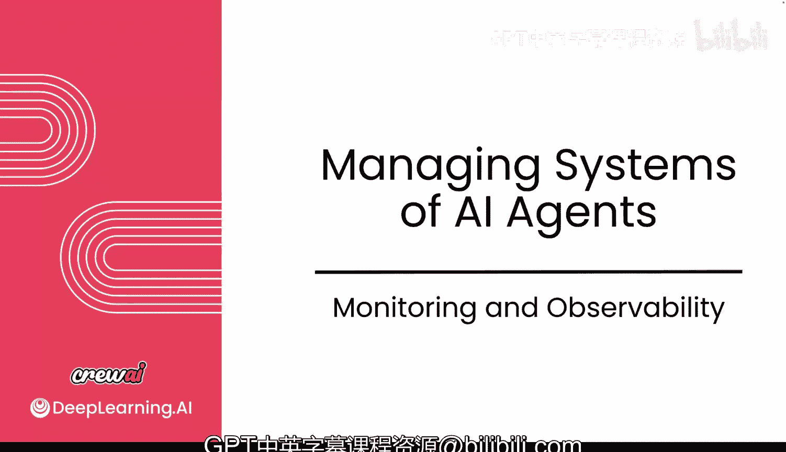
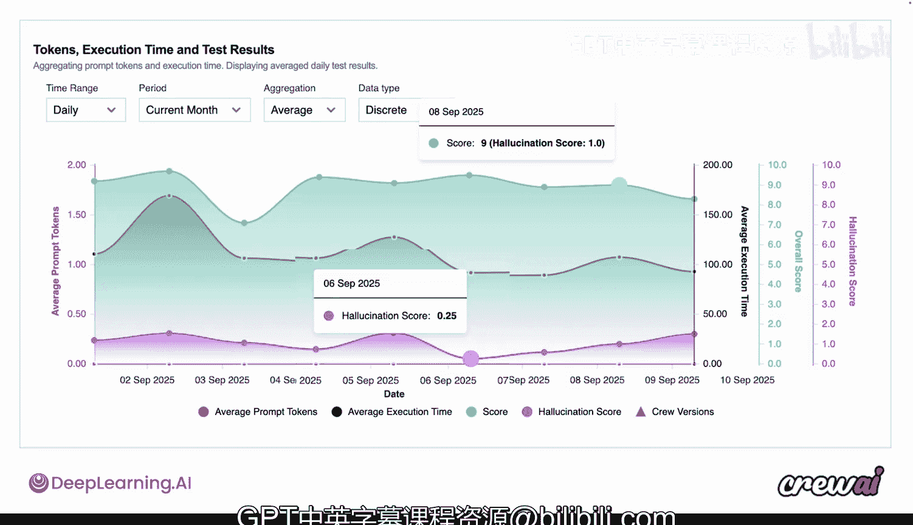

# 029：监控与可观测性 👁️

在本节课中，我们将要学习如何确保你的多智能体系统在生产环境中稳定运行。我们将探讨监控的重要性，并介绍 CrewAI 提供的工具，帮助你观察、理解和改进智能体的行为与性能。

---

上一节我们介绍了如何为智能体添加防护栏和钩子。本节中，我们来看看当智能体进入生产环境后，如何对其进行持续的监控与观察。

现在，你对你的用例充满信心。你构建了智能体，添加了钩子，应用了防护栏，并运用了本课程中学到的许多知识。然而，当它们真正进入生产环境时，工作并未停止。你需要确保对它们进行监控。这一点尤其重要，因为一旦智能体在规模化环境中运行，它们将以机器速度执行任务。因此，你需要确保所有监控措施到位，以观察它们的表现。我们将讨论如何暴露这些指标，以及如何真正了解系统中发生的情况，以便利用这些指标来推动改进。CrewAI 为你提供了许多工具来实现这一点。让我们开始讨论这些工具。

我们一直在讨论各种不同的功能和不同的方法，试图强制执行某些行为，并确保从智能体获得可靠的输出。但归根结底，可靠的输出意味着你正在努力构建值得信赖的智能体。上一课我们简要提到了这一点。建立对智能体的信任需要几个要素。例如，它需要**可调试性**，因为在原型设计阶段，你需要理解智能体在做什么、它如何得出结论以及如何做出选择。这样你就能更好地理解，并对如何改进它做出更明智的决定，使其表现更好。同时，你还需要确保**监控质量**，保证输出的一致性、可重复性，避免幻觉，并符合你期望的任何格式。

**治理**也是一件大事，因为对许多公司来说，思考和关注这一点至关重要，以防止个人身份信息或个人数据泄露，并从根本上将其过滤掉。这不仅是为了保护这些信息不被外部暴露，很多时候也是为了确保它们不会在内部暴露。如今，个人身份信息保护甚至个人信息保护已成为全球主要关注点，不仅在欧洲，在美国和许多其他国家也是如此。因此，在构建这些用例时，你需要确保考虑到这一点，尤其是在准备投入生产时，以确保不会暴露你不希望暴露的信息。

**提示注入**是迄今为止在智能体和大型语言模型中被利用最多的技术之一。有人可能向你的提示词中注入某些内容，从而危及你的用例或可能导致安全风险，这个问题必须作为智能体问题来解决。特别是那些生成代码的智能体，如果它们没有被适当地沙盒化或验证，可能会开辟新的攻击途径。最终，你需要确保我们的智能体在规模化运行时值得信赖，这不仅关乎它们所做的工作和它们访问的数据，也关乎整个基础设施能否承担起执行你的用例所需部分的负载。

不过，这些主题通常分为三个领域。考虑到我们到目前为止讨论的所有不同方面，它们总是可以归结为三个主要领域：**可观测性**、**安全性和合规性**。许多适用性和质量监控都属于可观测性范畴。因此，当你考虑调试、监控质量、监控幻觉时，所有这些都属于这个范畴。**安全性**涵盖诸如代码生成检查、提示注入检查、数据治理等领域，这个领域有很多内容，特别是现在随着 MCP 服务器的引入。**合规性**将更侧重于监控与个人身份信息或个人数据相关的问题。公司可能还有其他合规性指南。但在所有这些领域中，最重要的是能够看到和识别问题。这是它们之间共同的根本基础。无论你是为了保护个人身份信息，还是为了监控质量，都是如此。

正如许多工程师所知，如果你没有可见性，就像没有单元测试一样，你很快就会对你正在构建的东西失去信心，这会降低你快速前进的能力。你看不到的东西就无法修复。这就是为什么在 CrewAI，我们花费大量时间让每个人都能轻松理解智能体在做什么。到目前为止，你已经在本机终端的日志中看到过一些这样的信息。还有一种更深入的方式。你可以追踪智能体所做的每一个动作，无论是 Crews、Flows 还是工具调用，你都可以看到幕后发生的事情。这个功能我们称之为**追踪**。

以下是几种不同的方式，你可以利用数据来理解你的智能体在做什么。

第一种方式，我们在构建的所有示例中一直在使用，基本上就是在你的智能体上设置 `verbose=True`。这样做会在你的终端中打印出整个思考链以及你的智能体采取的一系列动作。

但是，如果在创建智能体后，你在你的 Crew 中设置 `tracing=True`，你将获得一个更高级别的视图。通过简单地启用这一个标志为 `True`，我们会在你的执行结束时提供一个最终 URL，你可以立即在浏览器中加载它，深入观察智能体的每一个步骤。你将能够看到按智能体及其执行的单个任务分解的内容，还可以展开大型语言模型调用，查看实际返回的响应，甚至可以深入查看正在使用的工具，了解这些工具是如何被使用的，一路追溯到你的智能体和大型语言模型之间交换的原始数据。这对于处于原型设计阶段的人来说具有巨大的价值，因为他们可以完全理解正在发生的事情。同时，它也非常适合调试，以防你遇到某些情况导致程序中断或出错，你需要追溯以理解是如何进入那个奇怪状态的。

现在，我想确保我们退一步，也讨论一下当你同时运行成千上万个智能体时，如何跟踪它们。生产中的智能体以机器速度运行。我的意思是，这不一定是以人类速度可以同时观察的东西。因此，可观测性变得更加被动，而主动告警则成为更大的优先事项。为了实现这一点，我们也为你提供了一些功能，比如 **Crew 质量采样**，你可以设置想要对总执行量的多少百分比进行采样，用于为你的 Crew 创建质量分数和自动幻觉分数。一旦我们设置好这个，你将看到一个完整的图表为你绘制出来。

这里有很多内容。让我们花点时间深入了解一下。在 X 轴上，你有时间。因此，跨越许多不同的执行和许多不同的日子，你可以看到你的智能体表现如何。在 Y 轴上，你有几个不同的选项。你不仅可以看到它们使用的平均提示词令牌数，还可以看到它们获得的平均分数以及它们获得的幻觉分数。归根结底，我们利用你的智能体执行过程中的集体数据，包括实际输出、预期输出以及你的智能体采取的所有不同动作，为你提供一个关于智能体系统正在发生的一切的总体概览视图。通过查看图表，你应该能够快速掌握任何质量或幻觉方面的问题，并追溯到你可能做过的任何具体更改。

这非常令人兴奋，但这只是冰山一角。还有许多其他工具可以让你在可观测性方面走得更远。例如，你可能想看看像 Arize 或 Galileo 这样的前沿工具，或者其他许多可观测性工具，它们可以深入检查你的智能体，了解它们的表现和性能，并围绕你的特定用例提供更具体的告警。我们当然推荐市面上许多不同的工具，而这两个是首先想到的。

在下一个视频中，我们将开始讨论如何在这个方向上更进一步，即当你真正开始部署这些你信任的智能体时，如何确保随着时间的推移你继续保持对它们的信任，如何确保在你不断为它们添加新功能时它们不会崩溃。这将是一个非常令人兴奋的话题。希望在那里见到你。希望你到目前为止真的很享受这门课程，结尾部分将会非常精彩。我们下节课再见。

---

**本节课总结**

本节课中，我们一起学习了多智能体系统投入生产后监控与可观测性的重要性。我们了解到，监控是确保系统可靠、安全运行的关键，主要涉及**可观测性**、**安全性**和**合规性**三大领域。CrewAI 提供了强大的工具来支持这些需求，包括通过设置 `verbose=True` 在终端查看日志，以及通过启用 `tracing=True` 获得一个详细的 URL 来深入追踪智能体的每一步执行过程。此外，我们还介绍了**质量采样**功能，它可以通过图表直观地展示智能体在一段时间内的性能、质量分数和幻觉分数，帮助你快速发现问题。最后，我们认识到，除了 CrewAI 内置工具，还可以集成如 Arize、Galileo 等专业可观测性平台，以获得更深入、更定制化的监控能力。通过这些工具，你可以建立对智能体系统的信任，并持续推动其改进。