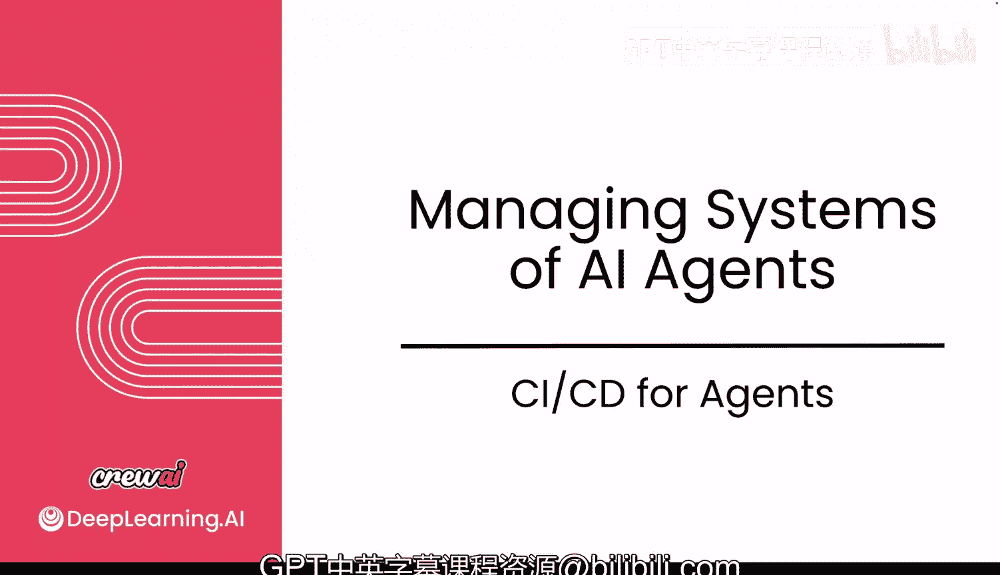
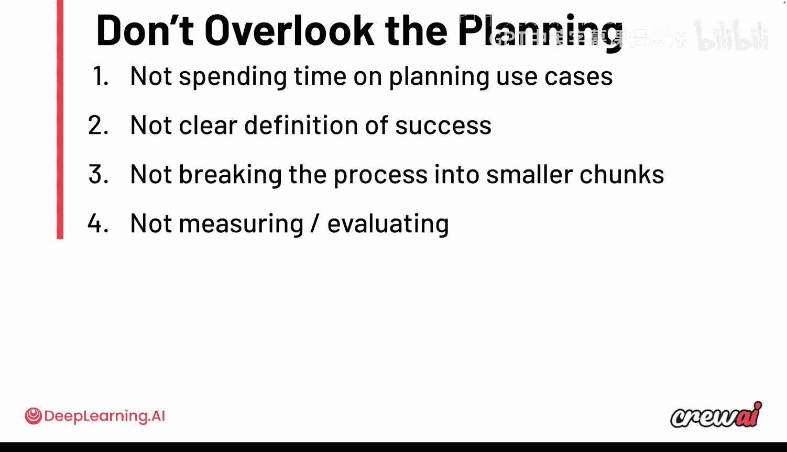
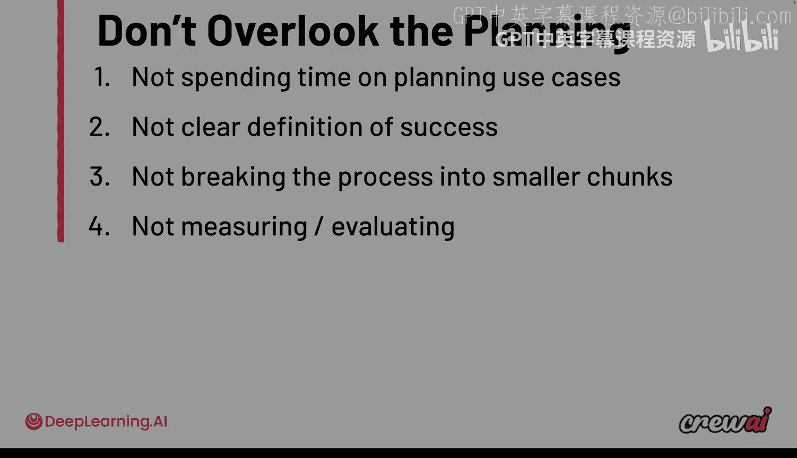

# 030：为智能体实施CI/CD 🚀

在本节课中，我们将学习如何为投入生产的AI智能体建立持续集成和持续部署流程。我们将探讨如何确保智能体在持续改进的过程中保持稳定运行，以及如何像传统软件工程一样，为AI智能体构建可靠的CI/CD工作流。

当智能体投入生产环境后，你需要确保它们持续运行，不会崩溃，并且你的修改不会破坏它们。

如果你是一名工程师，可能对CI/CD非常熟悉。

现在我们将讨论AI智能体的CI/CD流程是怎样的。

你需要确保在改进智能体的同时，它们不会崩溃，并且在发布后能够可靠地运行。

以思考传统软件开发中CI/CD流程的方式来思考这个问题会很有帮助。

让我们深入探讨，看看CI/CD如何应用于AI智能体。

接下来我们将讨论大规模部署AI智能体。尽管部署很重要，但它并非主要挑战。真正的难点在于智能体上线后如何保持其可靠运行。

因此，以工程师处理CI/CD流程的方式来思考这个问题是有益的。

以下是你需要考虑的一些问题。

例如，如何支持新模型？这一点很重要，因为每周都有大量新模型发布，模型策略、变体和微调方面也有许多新进展。

能够真正试验这些不同模型并尝试使用它们，对你构建系统的方式会产生巨大影响。不仅如此，你还需要思考系统如何随时间演进，以确保它们变得更好而不是更差，确保它们仍在工作而不会开始崩溃。

一旦系统上线，你会不断对它们产生疑问。

你会想知道是否在使用更新、更便宜、更快的模型，会想知道它们是否按预期工作。当你开始思考这些挑战时，事情会变得更加复杂，以更深入的规划和考量来对待生产中的智能体非常重要。

因此，如果你真正思考从确定要自动化的流程，到让智能体被监控和部署的整个过程，你希望从以下步骤开始。

## 理解问题

我知道这听起来不是什么了不起的顿悟时刻，但让我告诉你，大多数公司失败不是因为技术。技术就在那里，而且相当令人印象深刻。它们失败是因为没有真正思考自己的用例，没有真正规划用例，没有思考如何衡量它们，也没有定义用例成功的标准。

从规划流程开始，然后你想实现第一个版本，这里的想法是极速前进。你希望再次快速获得从0到1的胜利。

## 建立验证集

从第一个版本到建立验证集，其理念是你不仅仅想要一个最小可行产品，你希望事情能运转起来。不要担心完美，你稍后会完善它。一旦你有了第一个版本，你就可以开始建立什么是好、什么是坏的标准，以及该自动化流程的“好”是什么样的，这将成为你的**验证集**。

这将为你提供一个清晰的基线，用于衡量你的更新是在提高还是降低性能。

当我在这里谈论验证集时，我试图做的是建立一个你可以对照衡量的基线。在实施过程中的某个时间点，你需要一组用例或一组已完成的运行，来确立“好”的标准。

这之所以重要，是因为当你实施护栏、更换LLM、进行训练或测试时，你需要有可以对照检查的东西，你需要知道你是否在推动改进。唯一能做到这一点的方法就是建立一个基线。

因此，尽早建立验证集很重要。随着进展不断更新它则更为重要，以确保当你改变这些内容时，它们不仅保持工作，而且持续变得更好。

## 实施护栏与监控

在建立验证之后，你可以开始实施**护栏**，以确保你的智能体在某些事件发生时行为得当。

这就是我们之前看到的许多内容发挥作用的地方，不仅是护栏，还有任务、训练以及其间的一切。

但这里的关键是尽早建立这个验证集，并在系统工作后实施护栏和触发器，然后保持持续的监控。

这个循环将帮助你更快地构建更好的版本，其基础是相对于你实际基线的可衡量进展。

在构建这个验证集时，请确保你不仅仅存储提示，还要记录实际的指标，如质量评估、运行时间、成本。随着时间的推移收集和分析这些数据，可以帮助你做出关于模型选择、权衡和性能改进的明智决策。

现在，我想确保我们正确地思考了这些事情。

你已经注意到，在构建这些智能体的过程中，我们可以通过两个改进向量来推动。

你需要确保所有内容都得到适当的版本控制，并且清楚地了解每个版本的变化。在CrewAI，我们非常注重将提示（包括角色、目标、背景故事、描述和预期输出）与实际智能体逻辑本身分离开来。

通过保持提示分离，允许你独立于代码调整它。由于提示存储为YAML文件，即使是非技术团队成员也很容易添加和维护。

你还可以为这些提示创建存储库，以便在不同的智能体或项目中重用，甚至可以使用智能体存储库来存储智能体，我们稍后会讨论这一点。

另一方面，智能体逻辑则更定制化，涉及更多传统代码，尤其是当你使用工具、钩子和护栏时。即便如此，其中大部分仍然可以重用。

这种关注点分离使得重用设计良好的智能体成为可能，特别是那些具有强大提示和工具的智能体，只需最少修改即可应用于许多任务和用例。

## 利用CrewAI CLI与存储库

假设你想创建你的Crew。你可能已经看到过一点，但你实际上可以使用CLI为你创建整个结构。

你只需要输入命令 `crewai create crew` 并给你的Crew起个名字，然后你就可以进入那个文件夹。你会发现整个Crew结构已经为你创建好了。

你会看到你的智能体和任务都映射到了YAML文件，这些文件包含了智能体的角色、目标、背景故事以及任务描述和预期输出。

假设你在一个智能体上投入了大量精力，设计了正确的工具和提示，它运行良好，以至于你可以重用它来完成许多不同用例的许多任务。

好消息是，我们实际上为你提供了能力，不仅可以在项目中使用这些智能体YAML文件，还可以在你的智能体存储库中使用它们，以便跨多个用例重用它们。

现在，你可以在线创建这些智能体到你的存储库中，并在本地重用它们，而且你可以免费这样做。你只需要按照流程创建你的智能体，我们有专门的UI界面。

一旦你想在本地计算机上使用它，你可以直接从该存储库加载。

这很重要，因为它允许你拥有这些智能体并随时间重用它们。对于工具也是如此，你可以有一个单一的存储库，在那里存放你所有的工具（公开或私有），并跨多个用例重用它们。

如果你想创建一个工具，再次使用相同的CLI，输入命令 `crewai create tool` 并给你的工具起个名字。从那时起，你将看到一个自定义工具的结构，你可以修改它以执行任何你想要的操作。它可以连接到特定系统、外部系统，甚至可以构建视频，任何你能想到的都可以做成这个工具，它都是常规的Python代码。

当你运行发布命令时，该工具不仅对你的团队中的其他人可用，他们可以通过CLI安装并访问该工具，并在许多不同的用例中使用它，甚至在我们课程一开始看到的那个无代码UI构建器中，你也可以使用这些工具。

因此，你可以使用这两个发布和共享工具的方法，在你的组织内提供一个集中的内部库。

这些工具可以包括自定义代码、MCP服务器或介于两者之间的任何东西。这种方法不仅提高了Crew和用例级别的可观察性和指标，还创建了可重用的乐高积木式组件，可以应用于许多不同的项目和工作中。

## 回顾与规划的重要性

现在，我想确保我们退一步，谈谈这些用例。对我们来说，不忽视规划阶段很重要。

我在本课开始时简要提到了这一点，但我想回过头来详细谈谈。许多人跳过这一步，直接开始编写代码，这可能令人兴奋并能快速产生结果，但仔细规划能带来更好的结果。

一个常见的陷阱是未能明确定义成功，以及没有将流程分解成更小、可管理的、可以成为独立任务的块。一些团队也忘记了衡量或评估结果，因为他们一开始就没有建立这些指标。

当你走向生产环境时，花时间进行周密的规划，可以使你的系统结构良好、可衡量，并能随时间有效演进。

你需要记住的四件事是：花时间规划、有明确的成功定义、确保将流程分解成更小的块、确保有衡量和评估的方法。

## 总结与展望

在本模块中，我们从协作、智能体协调、不同模式、构建流程、实施推理智能体、训练、测试、结构化输出等方面学到了很多。现在，我们掌握了所有这些工具，可以构建更多东西。

接下来，我们将完成本模块的计分测验和计分实验，在那里你将使用在本模块中学到的所有技能创建一个代码审查流程。这将非常令人兴奋，因为这是一个非常实用的用例，我相信作为一名工程师，你会欣赏它。

你即将完成本课程。完成后，你会看到在下一个模块中，事情将进入一个新的层次，因为我们不仅要讨论如何构建AI智能体，还要讨论其实际的商业价值。这是一个非常特别的模块，因为我会尝试一些不同的东西，邀请一群正在生产中构建AI智能体的公司，他们是拥有实践经验的实际从业者，正在领导他们的团队进行这项工作。

我希望你在我与他们交谈时，听听他们的声音：他们面临哪些挑战？哪些方法对他们有效？他们遇到了哪些问题？这将非常令人兴奋。所以我希望在你的计分课程之后能在那里见到你。

请继续关注，这将非常有趣。我们稍后在那里见。