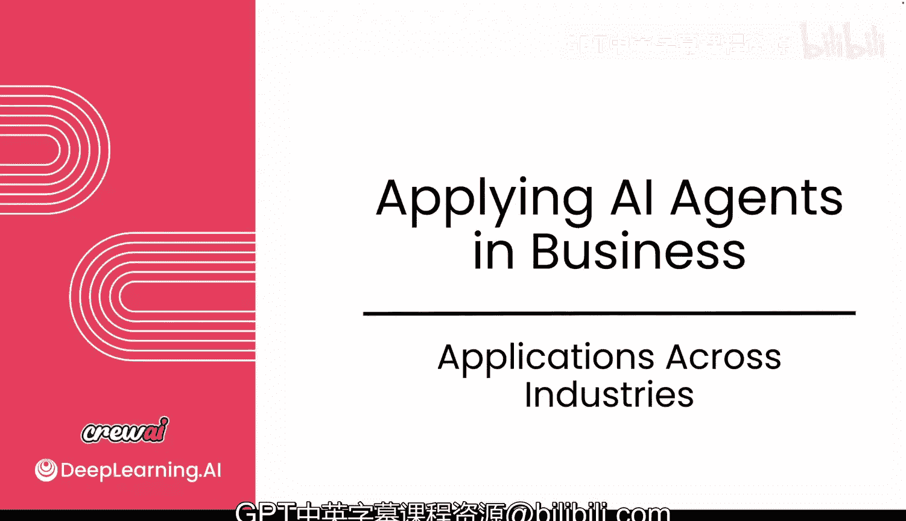
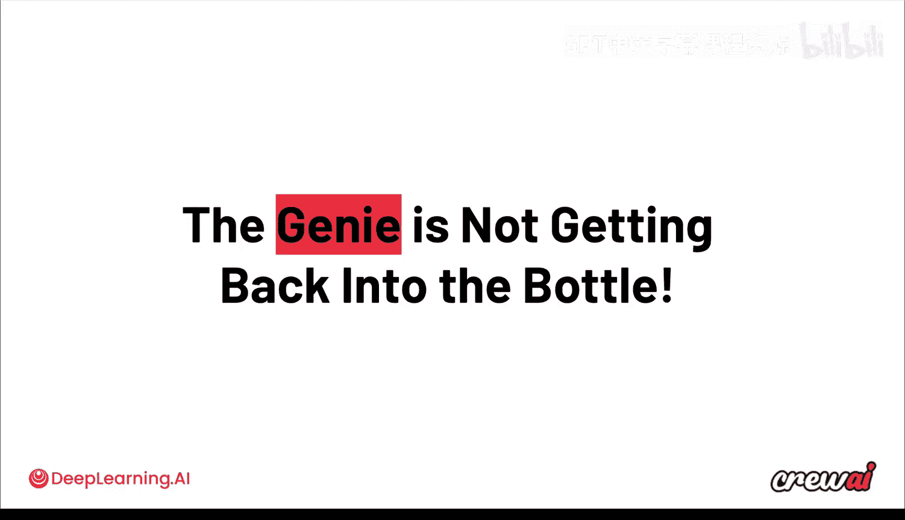
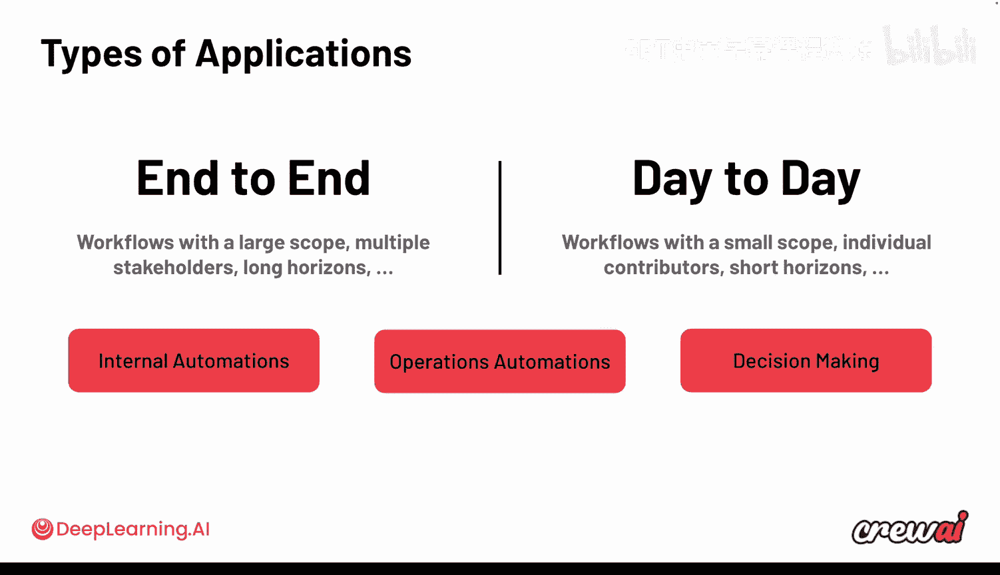
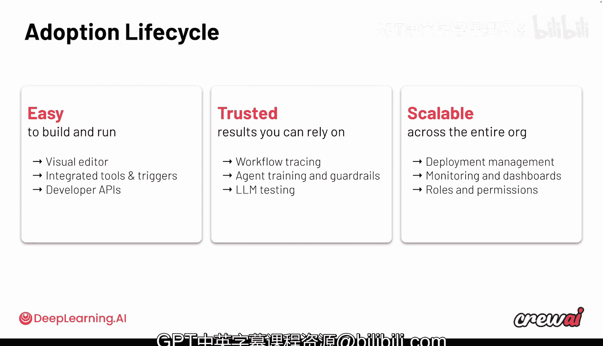

# 031：跨行业应用案例

## 概述

在本节课中，我们将探讨AI智能体在不同行业和组织中的实际应用。我们将看到，从提高效率的后台自动化到创造新收入来源的创新用例，智能体技术正在深刻地改变工作方式。通过分析真实公司的案例，我们将理解智能体如何落地，以及如何评估和规划自己的智能体项目。

---

## 智能体应用的必然趋势

上一节我们探讨了智能体的技术基础，本节中我们来看看它们在实际业务中的表现。首先需要明确一个核心观点：**智能体的广泛应用是不可逆转的趋势**。

这仅仅是新型劳动力形态的开端。AI智能体只会从此刻起不断改进。不存在未来组织停止使用AI智能体的场景。自动化以及利用AI的自动化将持续演进和改进。

一旦接受这个现实，你就会发现AI智能体在许多领域都存在机会。智能体本身具有巨大潜力，能够影响我们的工作方式、运营效率以及业务开展模式。

## 两类核心自动化用例

回顾本课程中讨论的用例类型，它们主要分为两大类。

以下是两类主要的自动化用例：

1.  **端到端流程转型**：这类流程跨越不同的业务单元，范围广，涉及多个利益相关者，周期长。例如，将原本需要数周的任务缩短到几天、几小时甚至几分钟。例子可能包括后台办公或某些前台运营工作。这类自动化始于智能体，也终于智能体，通常涉及多个业务单元，中间可能有人类参与，构建更复杂，需要一定精度，但能带来巨大价值。
2.  **日常任务优化**：这类优化更侧重于个人效率提升。它们让你更高效，也更容易实现价值。例子不仅包括会议准备，还包括生成报告或自动化特定工作任务。虽然范围限于个人，但一旦在整个组织内采用，这些日常自动化会累积成惊人且可观的影响。这类自动化最终能极大提高效率。

## 市场应用全景

纵观全局，你会发现一些全新的前沿用例。

例如，人们称之为**APA（Agent Process Automation）**，基本上是用智能体流程自动化取代机器人流程自动化。你还会看到智能体被用于新型的智能体ETL管道，即在摄取数据时，智能体基于该数据推断新数据或即时修改数据。此外，还有一些**智能体原生功能**，即产品中新增的功能，使你的产品能够实现以前不可能的事情。

目前，应用智能体最多的前九大垂直行业包括金融服务、健康与生命科学、保险、高科技公司、媒体与娱乐、客户服务、CPG（快速消费品）、零售和电信。在这些公司内部，许多职能部门或横向领域都在探索智能体的用例。

我们观察到销售和市场营销用例的趋势，同时也包括开发人员自动化、网络安全、供应链、定价用例和人员管理。放眼全局，你会看到一个巨大的机会版图，横跨不同公司及其内部的不同横向领域。这有助于你在思考自己的用例时，了解可以借鉴哪些资源。

## 重温用例评估框架

这让我们回到了课程开始时讨论的用例矩阵，即从复杂性和精度两个维度来思考你的用例。

几节课前，我们讨论过这个框架。鉴于其重要性，在思考你的用例以及当今AI智能体如何在业务中执行操作时，我决定再次提及它。你需要理解你的用例在这个框架中的位置。

记住，你的用例可能具有**高复杂性和高精度**，也可能具有**低复杂性和低精度**，或者介于两者之间。这个框架上没有对错之分，它只是帮助你理解需要投入多少努力才能获得所需的价值。

低复杂性、低精度的用例可以节省大量时间，并对组织产生巨大影响。关键是要理解你的具体用例落在哪个位置，无论高低。

## 真实案例深度解析

现在，我想带你了解几个与CrewAI合作公司的具体真实用例。通过这些例子，我们将看到不同级别的复杂性、不同的分布情况，以及端到端和日常自动化的例子。这将使一些用例的价值变得极其具体，这些都是我们为真实企业运行的用例，可能会为你的一些决策提供参考。

### 案例一：全球500强金融机构

我想从一个金融机构开始。这是一家全球500强机构，一家大型银行，他们决定专注于其KYC流程。

**KYC**代表“了解你的客户”。这是一个涉及收集客户和潜在客户信息的过程，需要进行深入研究和分类以了解每个具体个体。银行需要这样做，以确保为该个体提供正确的产品和服务。

这家金融机构使用CrewAI来自动化他们的流程，并得到了一些非常有趣的惊喜。

*   首先，智能体生成的初始报告实际上比人类的第一稿更准确。
*   流程中某些原本需要一周工作的部分，现在总共只需15到30分钟。
*   由于所有这些智能体现在都在进行研究，执行“了解你的客户”尽职调查的整体入职时间减少了四倍。它们提取纳税申报表，在批准或不批准之前通过API及其金融机构验证这些数据。

这对于像这样的大型组织的底线产生了巨大影响。这是一个端到端的自动化流程，侧重于减少时间和提高效率，完全是关于效率增益。它证明了高度监管的业务也能从此类自动化中受益，只要它们从底层开始构建以确保支持治理，并专注于那些可以快速行动、在开始扩展之前获得早期胜利的用例。

### 案例二：全球财富500强快速消费品公司

现在，我想切换一下话题，因为我们的下一个用例是一家全球财富500强CPG公司。

CPG代表**快速消费品**。我们过去也讨论过，这是智能体潜力巨大的行业之一。这些公司生产你可以在超市和商店购买的产品，比如零食或消费品。这些公司着手改进他们的退款流程。

每当客户发现产品缺失或有问题时，他们想要回自己的钱。可以想象，这对客户来说是一个非常令人沮丧的处境。他们希望问题能尽快得到解决。但由于法规要求，这些公司需要进行一系列检查。他们需要确保自己没有上当受骗，产品确实有问题。因此，有一个完整的流程来验证不仅是个人的凭证和历史，还包括围绕该产品的许多内部流程。

为此，他们决定使用CrewAI的AI智能体来自动化整个退款流程，从而显著缩短处理退款请求的时间，取代了涉及多个团队的高度手动流程，将整个过程从三天减少到不到10分钟。这对于这样的公司来说创造了非常有趣的投资回报。你可以看到这是另一个端到端自动化的例子，但范围更集中于特定流程。同样，这也是一个后台自动化用例，我们看到了很多这样的案例。

### 案例三：全球1000强电信公司（收入生成用例）

现在，我想引入第三个用例。这个用例不同，因为它不是关于效率增益，而是关于**收入生成**。我对此感到非常兴奋。

这是一家全球1000强公司，意味着它是世界上最大的千家公司之一，是一家电信公司。他们决定采取完全不同的方法。正如我告诉你的，我们之前关注效率增益，他们开始思考可以探索哪些业务线，而这些业务线在以前需要巨额投资才能确保将其作为一个实际想法进行探索。但现在，通过利用智能体，他们可以在更可控的环境中测试这些概念，并最终投入更多资金。

他们决定使用智能体来分析客户的行为和数据，例如客户是预付费手机还是后付费手机，以及他们拥有的关于该特定客户的所有数据。通过使用智能体分析这些行为，发现该客户具有的模式，并利用这些模式给他们一个特定的信用评分。通过拥有这个信用评分，他们可以开启一项新的业务线：提供贷款服务。

由于这一切都使用智能体，从客户提出请求起，他们可以在两天内将钱存入客户的银行账户，因为一切都是尽可能自动化的。他们实现这一点的方式是分析客户的消费模式，例如他们的手机使用情况，并使用智能体大规模处理这些数据。他们发现，他们找到的模式与他们认为的客户信用价值之间存在高度相关性。他们在这方面取得了显著的成功，花费的资金远少于在没有智能体的情况下启动整个业务线所需的资金。

在这里，你可以看到这是一个完全不同的用例。它更像是一个创收用例，而不是效率展示。这非常有趣。

## 智能体采用生命周期的演变

除此之外，我们还想讨论智能体的采用生命周期在过去几年中是如何变化的。

回顾过去，我们几乎经历了几个不同的阶段。市场一直在持续过渡和演变。因此，组织在接受教育方面变得更好、更成熟，理解智能体如何帮助他们的业务，并且有几个不同的阶段展开。

*   **第一阶段：聊天机器人**：大约两年前，你看到公司做了很多聊天机器人。这些聊天机器人很大程度上是通用机器人，背后是所谓的单一智能体，仅使用常识，具有一定交互性，但非常专注于聊天用例，无论是内部还是外部。这些并不是在ChatGPT出现后才出现的，聊天机器人已经存在了十多年。
*   **第二阶段：AI副驾驶**：最近，我们更多地看到了AI助手或AI副驾驶的概念。你可能有一个智能体，或者感觉像是有多个智能体，存在一些委托，具有更具体的领域知识，无论是通过集成RAG实现还是更具交互性。这里的想法是，许多公司现在采用这种模式来帮助完成从编码到撰写文档等不同的事情。
*   **第三阶段：智能体协作工作流**：现在我们正在进入第三阶段，你实际上开始看到智能体工作占据主导地位。这是最新、最前沿的阶段，你看到多个智能体协同工作。这包括流程特定或任务特定的智能体，但也包括更广泛的智能体，并与许多工具集成，包括我们提到的MCP和记忆系统。这可以自动或单独触发，不仅更注重效率，而且正如我们刚刚看到的，也为更多机会打开了创收用例的大门。

## 构建智能体工作流的核心原则

现在，无论你选择如何构建智能体工作流，有一件事你必须明白：无论你做什么，它都必须**极其易于构建和运行**。

你可以使用代码或无代码来实现，但要以一种能帮助你快速构建从而获得价值的方式来实现。并且它必须是**可信的**，这样你才能真正依赖其输出。因此，追踪记录必须存在，训练必须存在，防护措施必须存在，选择正确的模型必须存在。

不仅如此，它还需要是**可扩展的**。这里的可扩展不一定意味着每月运行一百万个智能体（我们有一些客户正在这样做），也意味着以可重用的方式构建它们。这种**乐高积木**的概念，你可以通过智能体或工具等重用的乐高部件。退一步看，这些基本上是你构建这些用例时需要牢记的三个支柱，这也是我们构建CrewAI的基础。

## 总结

在本节课中，我们一起学习了AI智能体在不同行业的实际应用。我们从智能体应用的必然趋势出发，区分了端到端流程转型和日常任务优化两类核心用例。通过分析金融服务、快速消费品和电信行业的三个真实案例，我们看到了智能体在提升效率、改善客户体验乃至创造新收入流方面的巨大潜力。我们还回顾了智能体采用生命周期的演变，从早期的聊天机器人到当前的智能体协作工作流。最后，我们强调了构建智能体工作流时，易用性、可信赖性和可扩展性三大核心原则的重要性。

我非常兴奋我们在这一点上涵盖了这么多内容，并希望在这个最后的模块中，当我们深入探讨这些AI智能体的细节时，我们开始更好地理解它们如何不仅能为你服务，而且你实际上应该如何思考这些用例，以及如果你确保从一开始就做对哪些主要事情，它们将在你的整个旅程中帮助你。

我对下一课感到非常兴奋，我们将研究成功实施之间的模式，探索这些公司内部的采用模式，以及它们在采用这些技术时的样子。我对此感到非常兴奋，因为你有机会看到如何将其应用到自己的公司、团队或用例中，所以你一定不想错过，我们稍后见。