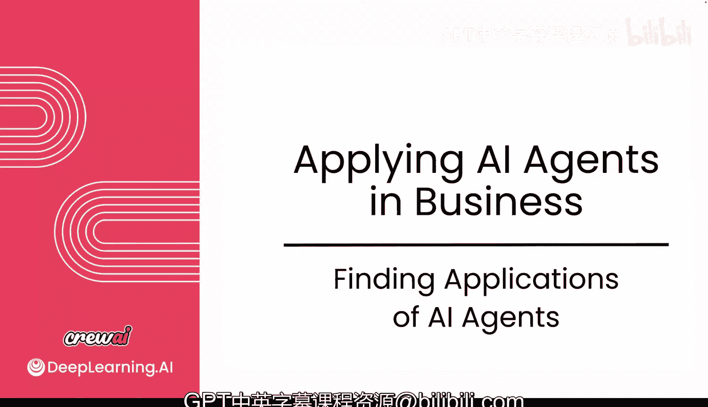
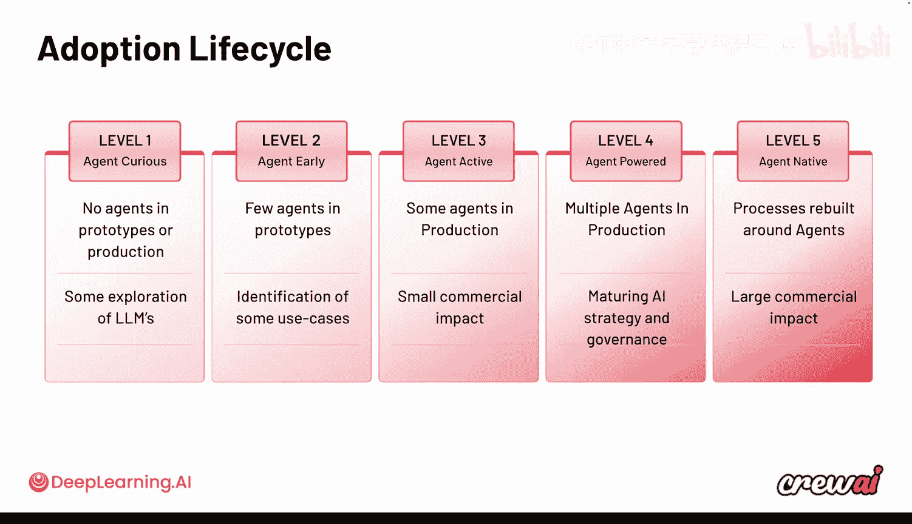
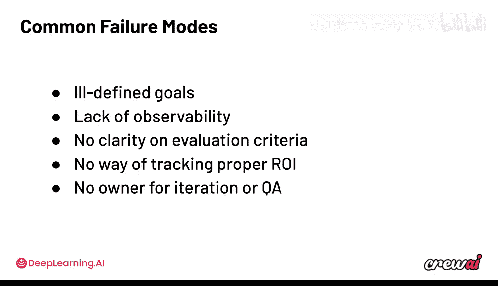

# 032：AI智能体用例优先级排序 🎯

在本节课中，我们将学习如何为AI智能体项目选择和确定高优先级的用例。我们将探讨成功实施AI智能体的关键驱动因素、常见的成功与失败模式，以及如何从零开始规模化地推进智能体应用。

---

在上一节中，我们探讨了AI智能体的各种潜在用例。本节中，我们来看看如何从众多想法中筛选和确定应优先实施的用例。

根据我们目前所学，你可能对众多用例以及如何将AI智能体应用到日常工作感到兴奋。即使在你的公司和团队内部，你们可能也在讨论其中一些用例。但如何对这些用例进行优先级排序？其他公司是如何做的？不同领域的成功实施有哪些共同点？让我们探索这些成功驱动因素，以便理解如何将其应用到自己的用例中。

你将学习AI构建者如何从零到一地推进智能体应用。不仅如此，他们还能以可扩展的方式进行。让我们深入探讨。

本模块主要关注公司在采用AI智能体时会发生什么。让我们探索成功的多智能体系统的驱动因素。那些成功部署AI用例的公司有哪些共同点？你将学习团队如何从0进展到1。我们不仅要讨论这一点，还要讨论具体方法。

---

AI智能体的采用在这些团队内部迅速传播，并扩展到整个组织。我们已经识别出几个常见的成功模式。

以下是成功实施AI智能体用例的四个关键模式：

1.  **高频用例**：当智能体每周或每月运行多次时，通常能带来非常成功的实施。这能产生复合回报或规模化投资，使公司更容易决定投资这类用例。因此，你需要确保至少在一些早期胜利中寻找高频用例。
2.  **清晰的成功标准**：拥有可衡量的清晰成功标准至关重要。你需要理解何时成功，并且在项目早期定义这些指标非常有帮助。围绕评估标准达成共识，能真正影响你的用例。
3.  **合理的后备路径**：这意味着必要时可以通过人工介入、设置护栏、LM护栏或使用查询流程为自动化添加更多结构。这允许你更有意识地处理后备方案，能产生巨大影响。这也是我们注意到的一个模式。
4.  **衡量结果**：你需要有追踪、可观测性和监控机制来跟踪性能。当你的用例具备这些特征时，很可能就是一个适合AI智能体的强力候选者，前提是该用例首先能从智能体中受益。

这意味着你需要寻找一个高频用例，在该用例上你能就评估方式达成共识，能通过使用查询流程或我们学到的其他功能来规划合理的后备路径，并且需要确保使用我们在课程中展示的一些方法来衡量结果。

现在，如果你做到了这些，就能获得惊人的成果。有些公司已经在某些用例上实现了80%到超过90%的效率提升。这些收益是可能的，你实际上可以实现它们。但你必须真正理解你正在优化什么。

---

让我们谈谈如何理解你的优化目标，因为我们在上一课中讨论了一些用例，有些团队优化效率提升，而另一些则优化收入生成。处理这些不同目标的方法以及在每种情况下衡量的内容将大不相同。

让我展示一个例子，一个我们客户如何采用查询流程的真实案例，他们是如何做的，在整个过程中学到了什么，他们推进的速度有多快，以及这对他们来说是什么样子。

这将引用我们之前看到的一些内容。这家公司最初与我们接触是关于一个价格运营用例。他们在几周内就让第一个用例上线了。你已经知道这基本上是一个用于更改价格、查看优惠券和折扣的定价操作。他们从中获得了惊人的准确性和效率提升。

从那时起，我们实际上扩展到了三个新用例。然后我们制定了一个联合用例路线图。根据该路线图，我们在一个月内与其他业务部门一起扩展到了五个新用例。这最终导致了跨多个不同区域的扩展。

请记住，这并非一帆风顺。当我们首次部署他们的价格运营用例时，准确率大约在60%左右。因此有几周时间，我们基本上是在改进那个基线，改进我们已有的验证集，以确保我们达到了97%的准确率。这对我们来说是一个非常值得注意的时刻，因为我们和客户都看到了从零到一的过程，看到了采用智能体时的实际样子。

如果你观察这在他们的智能体运行数量上是如何体现的，你可以从他们的第一个用例中看到，他们从初始规模开始扩展，直到公司内部开始传播这个消息，他们开始扩大使用范围。然后我们在一个月内为他们部署了那五个用例，最终实施扩展到全球多个不同区域，并与他们签订了主协议服务。

此时，这个看起来一直很漂亮的柱状图变成了一条平坦的线，因为他们在大约15天内从零执行到了10万次。因此，随着时间的推移观察这家公司的采用模式非常有趣。如果你看公司的查询执行次数，它开始时非常温和。随着消息开始传播，你部署了更多用例，你可以开始看到价值，开始看到模式，开始看到人们对此投入，采用的扩展真正获得了动力，并从此开始适当扩展。

这是一个非常令人兴奋的用例，也是我们在不同公司以各种形式看到的情况。如果你现在观察这个行业，我会说采用生命周期至少有五个不同的级别。我想指出的是，这里的第5级对于大公司来说是非常理想的。一些新的初创公司可能一开始就是第5级，因为它们是从头开始为AI智能体构建的。但许多公司实际上处于第1或2级。而我们帮助他们从那里一路提升到第4级，并最终也达到第5级。

但这里的想法是，你必须开始测试，开始尝试，开始构建这些用例。当你这样做时，你对这些用例如何帮助你以及你如何实际构建它们的信念和理解会不断增长。

---

现在，我想确保再次指出，并非一切都是完美的。实际上也存在一些常见的失败模式。接下来让我们谈谈这些。

我们已经看到并了解到智能体在哪些情况下会失败。这通常发生在你定义了目标的情况下。

智能体失败不仅可能是因为你没有正确定义目标，还可能是因为缺乏可观测性，意味着你无法理解你的智能体如何工作或它们是否在工作。然后它还有我们已经讨论过的问题，那就是没有明确的成功定义，或者不清楚你将如何评估这一点。有时，由于目标不明确，无法跟踪或适当监控你在这方面的投资回报。

最重要的是，没有迭代的所有者，没有关键人物来持续改进，没有团队来负责这些未来的实施。你可以看到许多公司试图定义AI卓越中心或特定团队，或者让许多团队挑选自己的工具。我不会说这样做是对是错。但你肯定要确保有人对这个倡议负责，有人推动，有人真正在这方面取得进展。

因此，如果你所在的团队正试图弄清楚如何启动和部署自己的用例，这些都是你应该注意的事情。确保你没有陷入这些陷阱，同时要理解，在推出智能体和随时间改进它们之间存在一个过程，这个过程会带来更好的结果。

我非常高兴我们有机会讨论这个问题，特别是因为如果你投入时间完善这些用例，你可以取得惊人的成果，但这需要你付出一些努力。

---

现在，我想确保我们进入下一课，我对此也非常兴奋，因为我们花时间研究了一些公司，并且我们实际上要把这些公司带到课程中来。我想和他们交谈，和他们聊聊他们实际上在用AI做什么，以及他们如何构建AI智能体。他们帮助我们理解他们如何取得成功，他们面临了哪些困难，以及他们做对了什么。我想确保你不仅从我这里听到，而且直接从构建这些智能体并使用你技术的人那里听到。所以我想在下一课见到你，这将与我们迄今为止所做的完全不同，你不想错过这一课。那么，我们到时见。

---

本节课中，我们一起学习了如何为AI智能体项目确定高优先级用例。我们探讨了成功的四个关键驱动因素：**高频使用**、**清晰的成功标准**、**合理的后备路径**以及**结果衡量**。同时，我们也分析了常见的失败模式，如目标不明确、缺乏可观测性和迭代所有权缺失。通过一个真实客户案例，我们看到了从概念验证到规模化部署的完整路径。理解这些模式将帮助你在自己的组织中更有效地启动和扩展AI智能体应用。