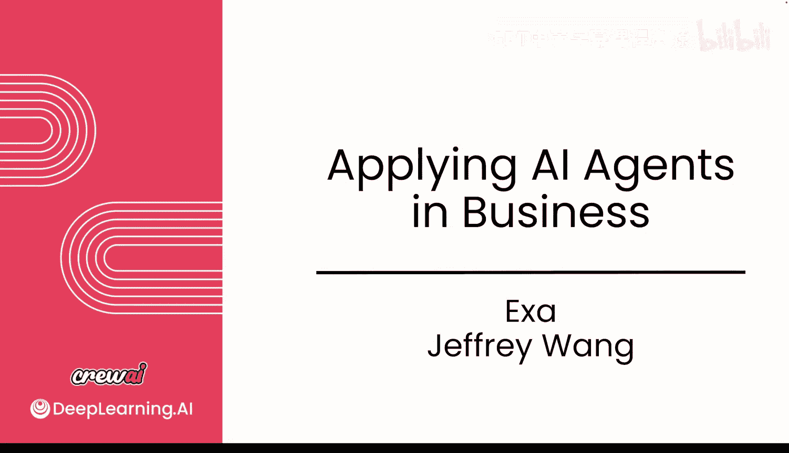
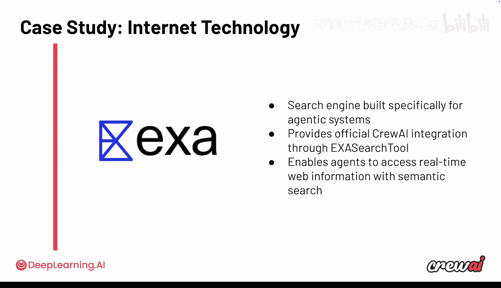

# 033：与 Exa 的对话

## 概述
在本节课中，我们将与正在现实世界中构建AI智能体的从业者进行对话。我们将了解他们如何使用查询AI来构建智能体，探讨他们感到兴奋的方面以及面临的挑战。通过这次对话，我们希望学习他们如何扩展智能体应用、发现新机会，以及总结出可供我们借鉴的经验教训。

---

## 与行业实践者的对话

现在，我们希望与在现实世界中构建AI智能体的从业者进行交流。我们将讨论这些人如何使用查询AI来构建智能体，他们对此感到兴奋的方面，以及他们在整个过程中遇到的挑战。在本节课中，我们将与这些项目的领导者聊天，他们正在推动AI智能体在其公司中的采用，并取得了惊人的成果。

因此，让我们深入了解，以便更多地了解他们如何扩展使用、发现新机会，以及他们学到了哪些可以应用到我们自身用例中的经验。现在，让我们加入这场对话。

接下来，你将听到来自Exa的分享。Exa是CrewAI的主要合作伙伴。Exa正在进入搜索领域，构建自己的搜索引擎，专为AI和AI智能体优化，使构建用例的人们能够更容易地在正确的时间获取所需信息。

Exa通过我们构建的官方集成与CrewAI集成，你在整个课程中一直在使用它。它为数百万AI开发者处理请求，其中许多请求由CrewAI智能体驱动，并使智能体能够通过真正的语义搜索访问实时信息。

现在，让我们听听他们的联合创始人之一Jeffrey关于他们如何看待AI智能体，特别是CrewAI在该领域所扮演角色的看法。

Jeff，非常感谢你今天抽出时间。我知道谈论AI智能体非常令人兴奋，因为目前正在发生很多事情。随着智能体经济空间的不断发展，从你的角度来看，以及从你所见的广泛工具和资源生态系统中，不断扩展的重要性如何？

我认为过去一年发生的事情确实令人难以置信。在过去某个时间点，大型语言模型在使用工具方面非常糟糕，然后它们变得勉强能用，而现在它们在使用工具方面已经非常出色了。像Claude、GPT-4o、Sonnet和GPT-4o Codex这样的模型，它们简直太棒了。

如果大型语言模型没有输入任何有趣的数据，或者无法与外部世界互动，那就像一个人坐在房间里，没有电脑，没有任何可用资源。你很聪明，有大脑，但你只是坐在那里。因此，从根本上说，大型语言模型能够与外部世界互动、读取信息并写入信息是至关重要的。

根据我对AI实验室正在研究的内容以及他们希望在未来几年启用的能力的理解，重点很大程度上集中在工具使用和外部数据上。

你提到这一点很有趣。实际上，在录制这门课程时，我与Andrew讨论过这个问题，他提到，如果你回顾2024年，就像十年前在AI档案中一样，这些模型真的不那么好。你需要搭建大量的脚手架才能确保它们以某种方式运行，你必须描述每一个细节以保持所有控制。但现在，模型在使用工具方面越来越好，这确实导致人们移除了很多脚手架，并更加专注于智能体本身。

那么，具体到Exa，因为你拥有关于实时网络搜索的非常有趣的视角，这解锁了许多不同的用例——如果智能体能在正确的时间输入真实和正确的数据，它们就能做很多事情——你如何看待这些自主智能体的演变，特别是考虑到它们现在能够访问并与实时网络搜索API配对？

当GPT-3.5出现时，如果你给它几千个令牌并告诉它“嘿，根据这个网页回答这个问题”，大约30%的时间它会幻觉。它会告诉你网页上的错误答案。然后在某个时间点，也许是GPT-4，它开始减少幻觉。但即便如此，如果你给它多个选项，比如给它两个工具使用，它仍然表现不佳。

而现在，你可以构建能够访问十几个工具的复杂智能体，并以各种疯狂的方式组合使用这些工具。例如，Claude Code就是这样做的。Claude Code有大约10,000个令牌的工具，它有文件I/O工具、网络搜索工具等等，它能够将这些工具串联起来，产生非常有用的输出。

网络搜索是该工具链中一个根本重要的部分，因为大型语言模型本质上不是搜索引擎。它们知道很多东西，但那只是它们记忆的东西。有时它们会产生幻觉，因此它们依赖于包括网络搜索在内的工具。

是的，我认为你说得很好，因为这不仅仅是网络搜索的能力。你关于幻觉的观点，几乎就像是**答案的锚定**。事实上，你现在可以赋予这个智能体能力，让它不仅能给你答案，还能自我事实核查，或确保它们使用最新的数据，并找到所需的一切来检查所有条件。我认为这很有趣。

围绕“锚定于真实数据并从实时网络数据更新确实能产生巨大差异”这一理念，你有没有看到任何具体的用例？

我们看到的其中一个用例是：让我们思考一下大型语言模型没有记住什么。首先是近期事件。所以，如果你问大型语言模型“今天世界上发生了什么”，除非它查找信息，否则它什么都不知道。其次是长尾信息。例如，假设你正在构建一个AI市场工具，比如销售勘探工具，大型语言模型没有记住像1000家生物技术公司或1000家AI初创公司这样的列表。这只是它们不知道的信息。

这种不常见、不是每个人都知道的长尾信息——它知道Stripe，但不知道最近一家从事支付业务的YC公司。因此，在这些情况下，它需要查找信息。

最后，我认为我们Exa一直关注的一个非常有趣的事情实际上是编码。目前大型语言模型的一个巨大限制是，对于它们记住的东西，它们可以编写非常好的代码。它们可以编写完美的Next.js代码，可以编写完美的Express代码等等。但是，假设上周我发布了一个Agent SDK，还有其他一些SDK，即使是OpenAI自己的大型语言模型也不知道这些SDK的任何信息。因此，从根本上说，需要进行网络搜索来查找有关如何编码的信息。

所以我们实际上在几周前推出了名为Exa Code的产品，这是专门为编码智能体设计的搜索。

我很喜欢这一点。你提到这一点很有趣，因为这是我们与客户PwC的一个主要用例。当他们使用这些模型进行SAP和Salesforce编码时，模型可能知道一些，但不知道PwC的特定方式或他们在许多应用程序构建中设定的条件。所以，是的，这是一个很好的用例。

我的意思是，对于大多数人来说，编码可能不是首先想到的事情，但你是对的——如果你不使用像Next.js这样大多数开发者都了解的东西，你需要利用真正锚定的数据。

从技术和公司的角度来看，你认为最大的摩擦点是什么？人们真的在尝试添加这种嵌入搜索或进行爬虫以获取数据。你认为工具方面已经解决了吗？还是输出质量？你认为目前主要的障碍是什么？

我认为限制智能体使用搜索工具和爬虫工具的一个正确答案是**上下文窗口管理**，也就是上下文工程。今天，如果你使用很多流行的工具，会发生什么？例如，今天如果Claude Code使用其原生的fetch工具而不是使用Exa MCP进行网络搜索，它会下载数百KB的文件，完全淹没上下文窗口。

我认为人们可能已经忘记了上下文窗口是多么脆弱，因为模型感觉更小了。然后当模型停止工作时，你的客户可能会想“好吧，它没工作，也许我再试一次”，但实际上模型只是开始表现不佳。即使是最新、最强大的模型，在数万个令牌级别，如果你用1000个原始HTML令牌淹没上下文窗口，它也不会表现良好。

因此，我认为这些工具自行执行一些令牌效率步骤至关重要。例如，Exa Code有一个理念，我们总是尝试只返回几百个令牌。我们实际上尝试只返回代码示例，因为代码示例是完成编码任务所需知识在令牌方面最密集的表示形式。如果没有，我们会提取文档，但即使那样，我们也尽量将其控制在几千个令牌以内。

这对于你创建的任何工具都适用。如果你正在某个地方摄取巨大的文档，它会淹没上下文窗口，所以你可能必须使用子智能体之类的东西。例如，Crew Code现在有子智能体，这非常酷。

这是一个很好的观点。这很有趣，就像回到谷歌时代，当谷歌是人们搜索事物的默认方式时，有一个指标是“我们希望成为人们花费最少时间的网站”，而所有其他网站都在优化参与时间，谷歌只是想让你超级快地找到一切。

听起来你告诉我的是，在新时代，Exa现在成为智能体搜索的主要提供者，新版本的理念是：我会用最少的令牌返回最多的信息，所以真的是物超所值，不仅在金钱方面，而且在上下文窗口方面。因为归根结底，上下文工程是你真正必须考虑的事情。这些东西毕竟是AI模型，垃圾进，垃圾出。因此，你进行有效上下文管理的能力会产生良好的影响。

我知道时间快到了，我还有一个最后的问题。关于你看到的CrewAI和Exa的结合，有没有任何具体的用例让你印象深刻？或者你对AI智能体领域整体有什么看法，以及事情的发展方向？

考虑到大型语言模型能力的不断增强，那些具有最大灵活性的产品和框架变得越来越重要。因此，我认为我看到的涉及CrewAI和Exa的最酷用例，都体现了Crew和Exa共有的哲学：你有一个非常聪明的大型语言模型，尽可能赋予LLM智能和行动的能力，让它自由发挥，为它构建好用的工具，但不要过度干预或试图以非常具体的方式控制它。

因此，我在Exa上看到的所有最酷的东西都是这样的：你可以使用一些具有非常狭窄定义用例的产品，或者也许你想为自己构建类似的东西，但请赋予LLM力量，让它呼吸，灵活地使用工具。

“赋予LLM力量”，我很喜欢这个说法，我会更多地使用它。Jeff，非常感谢你，真的很感谢你今天抽出时间。这非常有帮助，我相信人们对在本课程中使用Exa感到超级兴奋，我敢肯定在这之后他们会更多地使用它。

是的，非常感谢邀请我，这很棒。

---

## 总结
在本节课中，我们一起学习了与AI智能体实践者Exa的对话。我们探讨了实时网络搜索对于AI智能体的重要性，它如何通过提供**锚定于真实世界的数据**来减少幻觉并增强智能体的能力。我们了解到，**上下文窗口管理**是当前智能体工具链中的一个关键挑战，高效的令牌使用至关重要。最后，我们认识到，赋予大型语言模型灵活性和权力，让它们能够自由地与强大工具（如精准搜索）交互，是构建下一代高效、实用AI智能体的核心哲学。