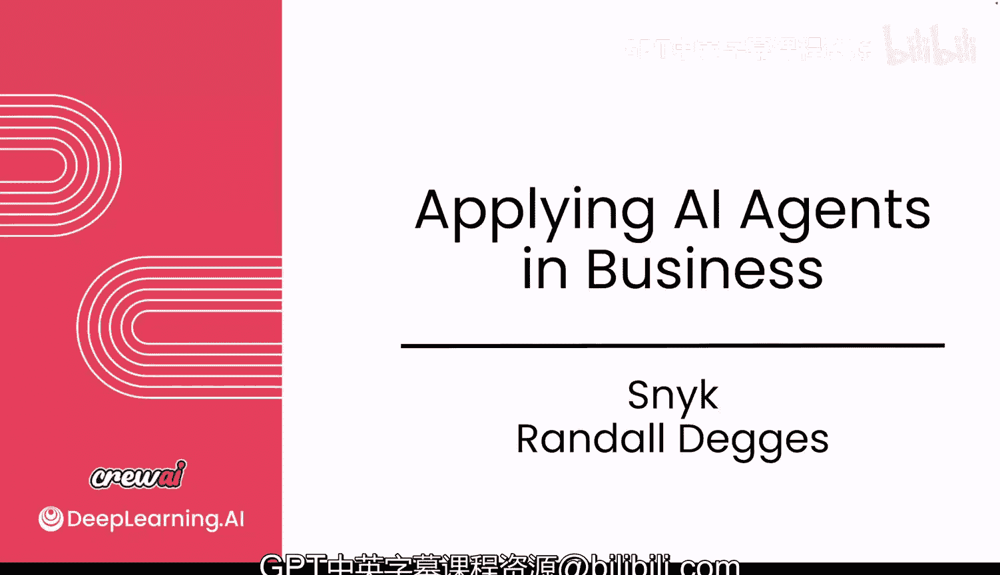
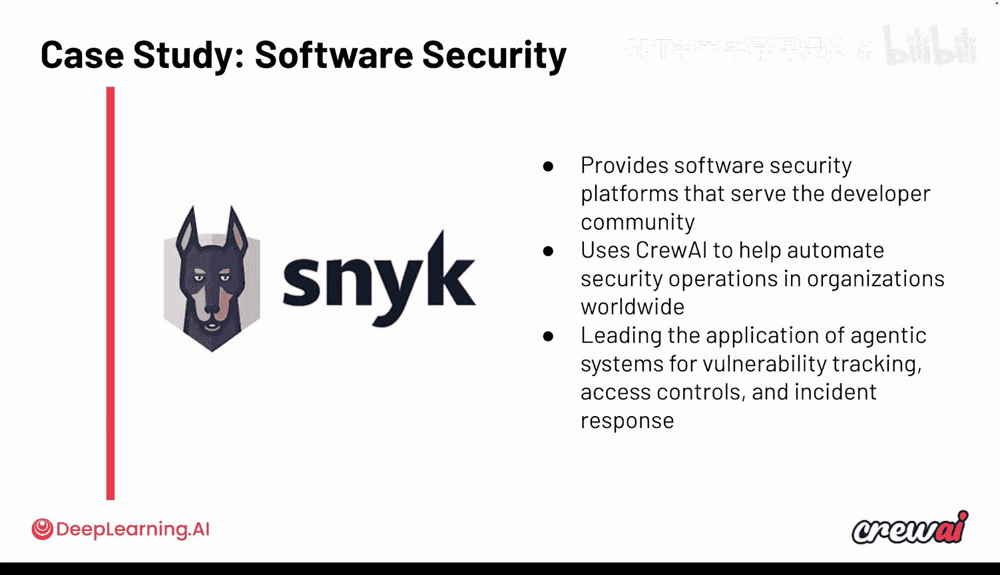

# 034：与Snyk的对话

在本节课中，我们将学习Snyk公司专家分享的关于多智能体系统安全性的见解。我们将探讨在设计和部署基于CrewAI等框架的智能体系统时，需要考虑的关键安全挑战、最佳实践以及未来的发展趋势。

---

## 引言：Snyk与安全

接下来，我们将听取Nick的分享。Snyk是一家专注于安全的软件公司。

Snyk是一个平台，服务于超过250万开发者，确保他们构建安全的代码。

他们正在使用CrewAI来驱动安全流程的多智能体自动化。

他们还将自己的平台与CrewAI智能体集成，以便使用CrewAI的开发者能够确保其代码安全并可用于生产。

他们在多智能体系统以及如何追踪这一正在推动软件行业发展的新趋势中的漏洞和安全问题方面，正在取得重大进展并进行大量投资。

我非常期待听到他们的分享。让我们直接开始。非常感谢您的加入。

我们对此感到兴奋。我们正尝试总结并与像您这样的行业专家交流，从您的视角看到了哪些趋势。

我认为您拥有独特的视角。

---

## 安全在多智能体生态系统中的重要性

因为您与Snyk合作，多年来一直思考安全问题，所以我希望问您几个问题。特别是随着智能体领域的不断发展，安全对整个生态系统的重要性在您看来如何？

首先，感谢邀请，很高兴来到这里。是的，Snyk的整个业务都围绕着帮助人们构建安全的应用程序。我认为，现在我们拥有了像使用CrewAI构建的这类智能体系统，这一点比以往任何时候都更加重要。我们是CrewAI的忠实粉丝，我个人也经常使用它，它非常棒。

但正如你们所有正在学习本课程的学生可能想象的那样，当你们构建智能体系统时，有很多事情需要考虑。你们可能会使用像CrewAI这样的框架，它对于组织智能体、让它们彼此通信、赋予它们访问不同工具的能力等方面非常出色。但这确实会带来需要考虑的全新类型的风险。

因此，当一个智能体执行某项任务并将信息传递给另一个智能体时，你们必须思考一些在过去的确定性世界中相对简单的事情。例如，这个智能体在与另一个智能体交互时，是否可能做出导致问题的行为？在我们的领域，我们实际上称之为“有毒流程”。

Snyk所做的工作之一，就是提供工具来分析你们的智能体、MCP服务器以及连接到应用程序中的所有工具。我们会查看工具定义，弄清楚每个工具在做什么，然后在后端使用生成式AI来应用一系列防护栏和过滤器，以帮助更好地理解当某些工具暴露给某些智能体时，可能发生什么类型的风险。

这只是需要考虑的新型安全问题之一，但显然这是一个非常广阔的领域，涉及很多方面。

---

## 安全部署工作流的关键挑战

这非常有趣，因为我认为这正是经验发挥作用的地方。为了能考虑到所有这些边缘情况，你们在实际中看到的一般性关键挑战有哪些？

从我们作为安全开发者、安全公司的角度来看，我们基本上会审视几个不同的方面来构建安全框架。首先，我们会查看应用程序的实际代码。多年来，我们一直拥有进行静态代码分析的工具。因此，首先我们会分析你们正在构建的自定义代码，寻找非常明显的安全问题。例如，像SQL注入攻击或跨站脚本攻击这类众所周知的问题，可以使用确定性逻辑轻松检测出来。你们不一定需要LLM来检测这些，并且可以用非常确定性的方式修复它们，因为修复SQL注入有100%明确的方法。这些问题可以说是已解决的问题。

因此，静态分析是现代应用安全的基本构建模块之一。但除此之外，当你们谈论构建更复杂的、自主工作的系统时，显然仍存在许多未知数。我们内部的工作方式是做两件事：首先，我们保持警惕，实际上我们有一个威胁情报源，当其他公司发生涉及智能体的有趣漏洞和安全事件时，它会让我们保持更新。每当有这样的事件公开，我们的安全研究团队基本上会收到通知，它可能链接到一些GitHub文章或其他公司的安全研究员。我们会让安全研究员仔细研究并分析它，思考“这是一种非常有趣的新型攻击吗？作为一家安全公司，我们能从中学习到什么，然后应用到我们的产品或研究中，以帮助客户以更安全的方式构建应用程序吗？”实际上，我们这样做已经有一段时间了。

因此，我们今天推出的许多产品，比如我们的MCP扫描工具（用于查找有毒流程等），最初都是受到我们遇到的新型漏洞的启发。我们对它们进行了大量研究，然后发现“嘿，这实际上是一些以前没有被真正讨论过的新东西，让我们围绕这个构建产品，比如构建防护措施和教育材料，让人们更容易在未来防止这种情况发生。”

---

## 实际案例与安全思维模式

这太有趣了。我想其中一个漏洞是那次大型的GitHub漏洞，你们实际上能够自己检测到，对吗？

是的，没错。今年早些时候，我们的一位研究员发表了一些非常有趣的研究，基本上发现GitHub正在使用大型语言模型，并对GitHub Issues进行一些自动化处理。攻击者通过GitHub Issue进行一些巧妙的提示注入操作，能够泄露仓库的敏感信息。

因此，在你们构建东西的过程中，在脑海中建立这类威胁模型是非常有用的。所以，我想告诉正在学习这些东西并构建他们第一个自主系统的学生们：当你们构建这些东西时，在脑海深处不必感到害怕，但要记住可能会出什么问题，以及我将如何解决这些问题。只要你们正确地思考这些事情，你们就处于开发专业人员的前1%。因为思考风险，并将其记在脑中，确保以良好的方式架构事物，这不仅是你们能为应用程序做的最好的事情之一，也是为你们的职业生涯做的最好的事情之一。拥有良好的安全实践和安全思维模式，是成为现代圈子里优秀工程师的关键部分。

我喜欢您的表述方式，即“安全思维模式”。如果从一开始就采取这种方法，当你们构建每一个功能时，只需问自己：我在这里可能暴露了哪些攻击面？我该如何保护它？仅这一点就已经能改变局面，因为大多数人不会这样做。因此，作为工程师，你们能够这样思考，我认为这可能是一个巨大的差异化优势。

---

## 将智能体集成到现有工作流中的挑战

您提到了几个要点，比如AI生成的代码，MCP是另一个大问题。你们看到人们在尝试将这些智能体集成到现有CI/CD管道中时，遇到了哪些挑战？人们是在为此挣扎，还是已经解决了这个问题？

这是一个非常好的问题。我觉得在回答这个问题时有些矛盾。一方面，我觉得将智能体工具和功能添加到应用程序中从未如此简单。以Snyk为例，我们公司已经存在相当长一段时间了，我们有很多旧项目，可能是内部项目，已经有一段时间没有维护了。有时我甚至会直接进去，用AI重写它们，或者在管道中添加一堆新功能。凭借我们今天可用的工具，你们能够以我甚至在四年前都认为不可能的速度完成这些工作，这完全令人难以置信。

但与此同时，对人们来说，这也可能非常可怕。我认为这是最大的担忧，尤其是在大公司工作的人们。我认为人们在将这类工具和实践引入现代工作场所时，最大的担忧是存在一些恐惧和不确定性。人们会想：“嘿，如果我把这个智能体放在这里，使用它安全吗？这会以某种方式暴露客户信息吗？”人们担心的组件很多，即使是一个非常简单的例子。

从生成式AI开始流行之初，你们在文章和网络帖子中最常听到的事情之一就是对提示注入的恐惧。提示注入仍然是一个大问题，而且不一定已经解决。没有100%万无一失的方法来完全解决提示注入，因为生成式模型是非确定性的，幕后发生的事情有很多神秘之处。

因此，对于每个模型，可能有不同的最佳实践方法来避免或修复它。也许这意味着让其他生成式AI审查提示，然后尝试查看其中是否有任何可疑之处；也许意味着在扫描工具或安全应用程序中设置一些确定性逻辑来检查它；或者也许意味着拥有良好的运行时工具和可观察性，以便当你们的智能体和工具实际执行操作时，你们可以让人或另一个智能体回顾这些操作的运行时历史记录，并寻找可疑模式。有很多方法可以解决这些问题，但根本上，我认为这又回到了拥有良好的安全思维模式并在工程工作中积极主动。

---

## 自主AI与安全的未来关系

这是一个非常好的观点，我同意您的看法。提示注入是您重新提及的一个很好的话题，因为很多人再次谈论它，但现在人们谈论得没那么多了，但问题并没有消失。是的，它仍然存在。你们可以找到一些方法来让LLM识别它们，可以尝试主动预防，但归根结底，没有100%的保证，没有“启用这个标志，一切就都解决了”的方法。

这让我想知道，我很想听听您对这个问题的看法：您如何看待自主AI与安全之间的关系？这是一个难题，因为市场变化太快了。但您如何看待这种结合在未来三年内的发展？

我认为有几件事非常有趣。首先，AI模型的改进速度总体上快得惊人。即使是一个非常基础的提示，你们得到的很多软件在结构和内容方面都可以非常好。那么安全如何融入其中呢？我认为我们正接近一个点，即安全可以成为一个完全自主的事情。我的意思是，将LLM和智能体以及非确定性应用程序与一个确定性的安全工具配对，这个工具可以100%确定地告诉你们这里是否存在问题或是否发生了不好的事情，并将其作为反馈来帮助智能体改进和引导它。我认为这正迅速成为我们领域的制胜策略。

如果你们曾经使用过Snyk的任何工具（可以免费使用，只需注册即可试用），你们会注意到一件事：假设你们正在使用Cursor之类的工具编写软件，你们可以将Snyk的工具插入到Cursor规则中。当你们提示Cursor并要求它构建一个新的CrewAI流程或类似的东西时，每次Cursor向项目添加一些代码时，它都会在后台使用Snyk自动扫描并查找许多常见类型的问题，利用Snyk提供的上下文，然后Cursor本身实际上会发布修复程序，重新测试以确保这些问题得到解决。这就创建了一个非常有趣的自主循环，我们已经从中看到了非常显著的效果。

因此，在我看来，安全领域在这个自主未来的演变方式是，它正成为使用生成式AI的一个迭代部分。我个人的希望是，在未来三年内，我们将达到这样一个点：典型的工程师甚至不需要考虑安全方面的努力。他们将能够直接说：“嘿，Cursor或Claude，或者任何工具，帮我构建这个应用程序。”安全将通过这种迭代过程在幕后处理，最终结果是我们作为用户将拥有更好的软件，我们不必过多担心这些事情。这有点像梦想。

---

## CrewAI在生态系统中的角色

我喜欢这个观点。您说得完全正确。如果LLM在编写代码方面越来越好，它们也应该在预防和修复代码方面越来越好。这是一个有趣的愿景。

在我们结束之前，我知道您提到过您自己也在使用AI，并且我们一直在讨论CrewAI如何帮助人们使用它。您如何看待CrewAI在这个生态系统中的角色？它是如何集成的？我知道我们也有一些合作正在进行，但您对此有何看法？

当你们最初推出时，我想我是通过Hacker News发现你们的，当时我一直在关注你们的教程，构建一些系统，并在Python应用程序中进行一些编排，非常喜欢。我认为你们的一个优势是在工程方面有一个非常清晰的框架，使得构建智能体变得非常可重复和可靠。例如，拥有像AML文件中那样漂亮的智能体定义，拥有流程、Crew和编排组件，我认为这些都是我们可能认为理所当然但你们已经主流化的东西。因此，我是它的忠实粉丝。

实际上，在Snyk内部，我们构建并运行了大量项目，直接在生产中使用CrewAI，它们非常棒。我们用它来做任何事情，从帮助自动化员工社交媒体，到为我们正在推出的新产品构建产品框架和参考文档。这些工具内部驱动的自动化数量巨大，而且它们感觉非常稳定，我认为这主要归功于CrewAI框架。所以，谢谢你们。

谢谢您的使用。我对未来的发展感到兴奋。我认为智能体领域正在发生很多事情，我想我们正一同前行。

非常感谢，Nick。我真的很感激您抽出时间，非常高兴您能来到这里，也希望所有学习者有所收获。我不知道您是否对所有的学习者有什么临别赠言，但我的问题就这些了。

我只想说，对于所有正在学习这门课程的你们，你们很棒，继续构建，享受乐趣。这就是这一切的意义所在：使用AI让生活更愉快。它确实为我做到了这一点，希望对你们也是如此。

我喜欢这个说法。非常感谢，Nick。下次再聊，祝您一切顺利。

---

## 总结

本节课中，我们一起学习了Snyk专家分享的关于多智能体系统安全的核心观点。我们探讨了在构建自主系统时，安全思维模式的重要性，以及如何识别和防范如“有毒流程”、提示注入等新型风险。我们还了解了将智能体集成到现有工作流中的挑战与机遇，并展望了未来安全与自主AI协同演进的愿景。最后，我们看到了像CrewAI这样的框架在提供清晰、可靠的工程基础方面所扮演的关键角色。记住，主动思考安全并采用最佳实践，是构建健壮、可信的多智能体系统的基石。