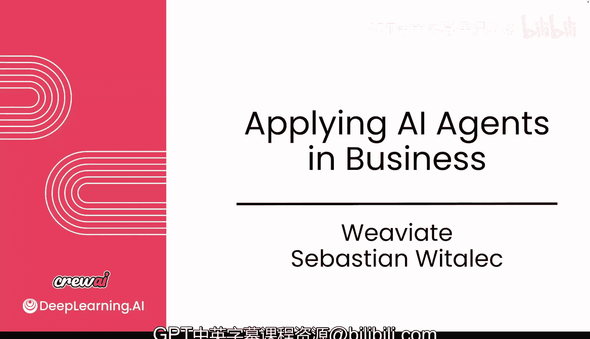
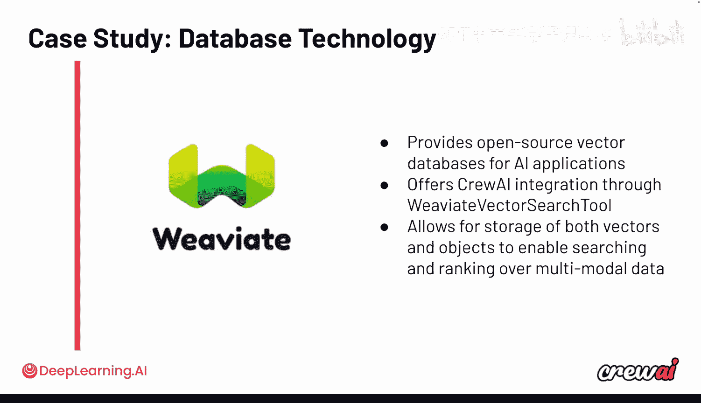

# 035：5. 与 Weaviate 的对话 🗣️💾

在本节课中，我们将聆听来自开源向量数据库 Weaviate 的分享。我们将了解向量数据库在多智能体系统中的重要性，以及它如何赋能智能体访问动态、相关的信息。同时，我们也会探讨开发者在集成向量搜索时常见的挑战和最佳实践。

---

接下来，我们将听到来自 Weaviate 的分享。Weaviate 是一个开源向量数据库。它不仅允许你存储信息，还能让你的智能体自行利用这些信息。当你需要进行向量搜索时，其强大的搜索能力可以驱动许多出色的应用场景。我们希望从他们的视角了解，作为目前被广泛采用的主流数据库之一，他们的看法。

让我们开始吧。

塞巴斯蒂安，非常感谢你今天与我们在一起。我们很高兴能邀请到 Weaviate 的成员参与本课程。我有几个问题想问你。随着生成式 AI 领域的持续发展，拥有包括 Weaviate 这样的向量数据库在内的更广泛的工具和资源生态系统有多重要？

我认为这绝对至关重要。这很像你可以有一个“10倍效率”的开发者，他似乎无所不知。

但你依赖的是这样一个单一故障点。同时，这个“10倍效率”的开发者能走多远也是问题。沿用同样的类比，如果你有一个更全面、技能甚至有时有所重叠的团队，你们可以取得更多成就。我认为这很好地转化到了 AI 生态系统中。我们可以一起做更多事情。如果我们想完全靠自己完成所有事情，我们将会失败。

这是最好的事情，因为我们每个人都可以专注于自己最擅长的事情。我们也总是在思考：如何集成、如何连接、如何与所有这些其他工具协同思考，以及我们如何作为一个生态系统来工作。我们可以像一个团队一样工作和协作，因为我们属于一个整体。我们不是试图独自取胜的独立团队。

“我们属于一个整体”这个说法我很喜欢，我会更频繁地使用它，说得很好。那么具体到 RAG 领域，现在很多人都在谈论，每个人都在做 RAG。你如何看待向量知识库角色的演变，特别是围绕 AI 智能体变得越来越自主这一理念？

向量数据库和向量嵌入在其中扮演着相当关键的角色。因为如果一个智能体只依赖大语言模型，那么你基本上依赖的是其固有的知识库。而如果你使用向量数据库，你就能访问动态的、可以在一分钟甚至一秒钟内变化的数据，并且总能获得最新的信息。

信息不仅是最新的，而且非常相关。你只获得相关的信息，因此信息量会小很多。你不会向你的大语言模型发送长达 100 页的 PDF，而只是发送相关的部分。

另一个方面是，你获得的信息可能对特定用户是相关的。也许你的智能体工作流服务于成百上千的用户，每个用户都有自己的数据。你不可能为每个用户都配备一个大语言模型，那将非常疯狂，而且更新每个模型也需要很长时间。

此外，你可以使用各种分区策略，将数据分离到不同的租户中。这样，我永远不会查询你的数据部分，你也永远不会查询我的。因此，数据库基本上可以增强智能体，提供更多你期望成熟数据库具备的保护和安全措施。

有你希望智能体访问的数据，并且你希望确保这些数据是新鲜的。有几种方法可以实现这一点，但我认为没有哪个像 Weaviate 这样的向量数据库能给你所有的控制权。因为你不仅需要最新的数据，还可以控制一切。

当你想到通过将智能体编排与向量检索紧密结合而成为可能的新一类应用程序和用例时，这确实令人兴奋。你是否经常听到关于智能体与向量检索紧密结合的具体用例？有哪些有趣的例子？

我经常思考的是，我们可以从数据库中提取什么信息返回给大语言模型。一个例子是，实际上一年多以前，我们重写了一些语言客户端，完全更改了 Python、TypeScript 和其他语言中的 API。我们今天面临的困境是，很多大语言模型是用旧的 API 训练的，所以当有人试图用大语言模型生成 Weaviate 代码时，他们得到的是旧代码。我们不希望人们使用旧代码，因为旧代码不够好，新代码很棒。

通过使用数据库，我们可以说：让我们删除所有提及旧 API 的记录，只使用新的示例。这样，我们不仅可以添加更多信息，甚至可以限制信息，比如“永远不要展示这部分”，因为我们可以删除它或将其过滤掉。

对我来说，智能体几乎就像是帮助人们获取最准确信息的人，这些信息也与你的数据相关。你不希望得到类似“这是一个 Weaviate 查询示例”这样的通用回答，而是希望得到“你有这三个集合，这是你如何用这些特定属性查询这个特定集合”的具体指导。这非常强大。

现在人们开始理解提示工程和数据如何工作，以及为什么这很重要。但随着人们转向使用智能体，会有许多与大语言模型的 API 调用，复杂性工程变得至关重要。我们在整个课程中都讨论过这个观点，即你需要尽可能优化。开发者应该如何思考向量数据库和复杂性工程的角色？

老实说，可以这样想：智能体对我来说就像人。如果你每次都将那 400 页的 PDF 发送给他们，并说“嘿，我有个问题”，有时问题可能很简单，比如“如何连接到数据库”，而这个答案可能就在第一页。但我认为大语言模型会尝试阅读整个上下文。最终你得到的是非常缓慢且效率低下的结果，你是在过度使用资源。

对我来说，这始终是关于：智能体需要什么？大语言模型需要什么来完成这项任务？

这是一个很好的观点。我们来谈谈挑战。当人们试图将向量和向量搜索引入智能体时，常见的陷阱或反模式是什么？人们通常做错什么，需要注意什么？

我认为其中一点是经典的数据问题：垃圾进，垃圾出。通常，嵌入模型在处理非结构化数据方面确实很好，但这并不意味着非结构化数据本身可以是垃圾，完全一团糟。我们常常对这类事情思考得不够。

例如，我是否应该基于特定字段创建我的向量嵌入？你真的需要作者姓名或电子邮件等所有其他信息吗？可能不需要。所以这又是一个“少即是多”的问题。

我经常注意到的另一点是，向量嵌入可能非常大。如果你想扩展到数十亿个对象和数十亿个向量怎么办？我不确定你能那么容易或便宜地获得那么多内存，那会很昂贵。这是一个常见的陷阱：你没有评估运行所需查询所需的资源。

你可以做一些事情来解决这个问题。你可以减少向量的大小，要么减少维度数量，要么将每个维度更改为一个字节甚至一个比特的大小。这样，你可以将所需的内存减少到四分之一。我们在 Weaviate 中内置了这个功能，只需两行代码即可启用量化，但它实际上非常强大。

我们最近发布了一个叫做“旋转量化”的功能。我们原以为量化会减慢查询速度，但事实恰恰相反，查询速度更快了。当我们测量其与未压缩向量的召回率时，差异大约只有 0.01%。你只能在类似实验室的环境中注意到这种差异。为什么不默认这样做呢？

这太不可思议了。所以这可能是两个常见的陷阱：一是在生成向量嵌入时发送太多不精确的信息；二是在运行整个系统时没有考虑向量嵌入可能有多大。

这是一个有趣的视角。作为一家向量数据库公司，你们处于这场革命的核心，观察着各种不同的搜索方式、不同的公司、不同的框架和不同的智能体。你对 CrewAI 有什么看法？你看到 CrewAI 如何与 Weaviate 协作？请与我们分享更多。

我喜欢 CrewAI 的一点是，我们团队之间有这种协同效应。你们真的在考虑开发者体验。我对开发者体验充满热情，所以这对我来说已经表明你们关心那些试图构建东西的开发者。这也是我们得到的反馈。

当我们在一些研讨会上尝试使用 CrewAI 时，反馈总是：我可以轻松地跟着前几步走，我已经知道该做什么了。你们也有非常相似的“快速实现价值”的理念：我花了半小时完成快速入门，阅读了一些示例。

但还有一个非常清晰的部分是：如何进入生产环境？当出现问题时，你会得到一个可以采取行动的错误信息。而有些框架每三个月左右就会改变它们的语法和 API，这每次都让我抓狂，因为我想用这个框架演示，结果发现“哦，我的演示不工作了”，原因是“我不应该更新我的 NPM 包或 Python 库”。

但使用 CrewAI 我还没有遇到过这个问题。你们在这一点上相当负责。我喜欢有充分理由的重大变更，但不喜欢那种破坏一切、甚至让我无法连接的变更。我认为这非常棒，因为你们关心我们这些使用你们框架和 API 的开发者。而且，我能读懂代码。

感谢你的美言。塞巴斯蒂安，你还有什么想留给我们的观众吗？我知道我们谈了很多事情，不知道你是否有什么最后的想法想留给学习者。

对我来说，我最关心的性能类型实际上是开发者的性能，即“如果你拥有这套工具，你能多快地交付解决方案”。我认为这绝对超级重要。

在我们所处的这个 AI 生态系统中，要始终思考“实现价值的速度”：你能多快完成概念验证，多快进入生产环境，以及多快地增长和扩展。有些解决方案可能是企业级的，有些可能是开源项目，有些可能只是你为自己构建的东西。这应该是同一套技能，不应该为企业级和你的个人项目使用完全不同的解决方案。你构建的技能和解决方案应该整合在一起，成为一件事、一套技能，这将使你变得非常强大。

然后，选择合适的工具。你已经有了两个，比如 CrewAI 和 Weaviate。选择其他工具时，要选择那些不会锁定你的工具。它们应该因为你喜欢而让你留下，而不是因为你没有其他选择。这就是我的建议。

这是一个有趣的建议。塞巴斯蒂安，非常感谢你加入我们的课程。我相信所有学生都会很感激。祝你一切顺利，大家也祝你好运，构建一些非常棒的东西。

说得好，保重。再见。

---

在本节课中，我们一起学习了向量数据库 Weaviate 在多智能体系统中的核心作用。我们了解到向量数据库如何为智能体提供动态、相关且安全的数据访问，从而克服仅依赖大语言模型的知识局限性。同时，我们也探讨了在集成向量搜索时需要注意的常见陷阱，如数据质量和资源规划，并看到了 CrewAI 与 Weaviate 在提升开发者体验和实现价值速度方面的协同效应。选择合适的工具并关注开发效率，是构建强大 AI 应用的关键。