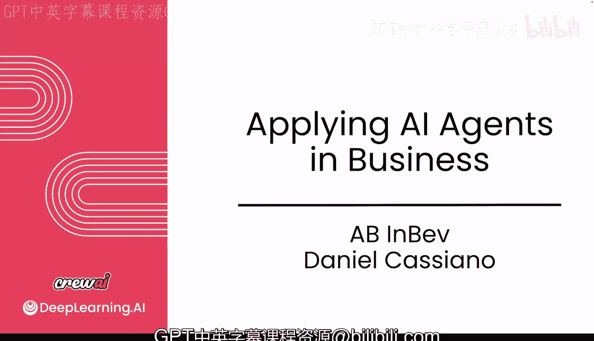
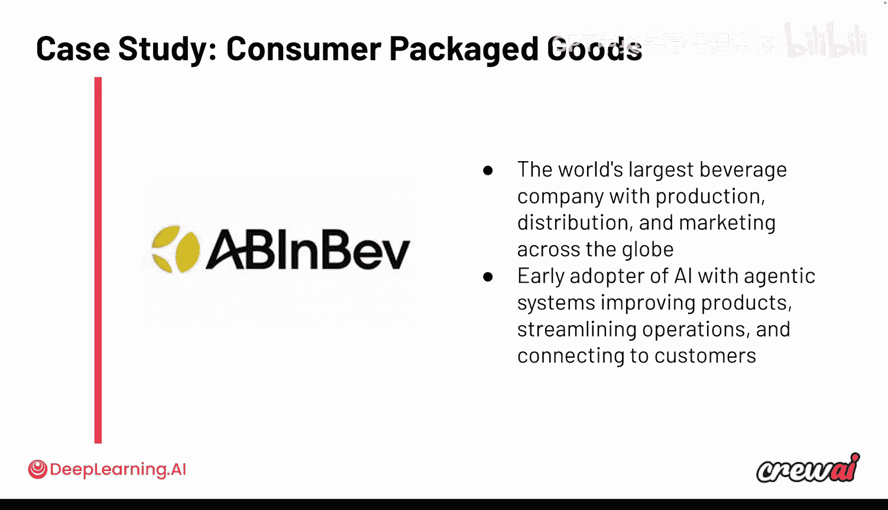

# 036：与百威英博的对话

在本节课中，我们将学习全球最大饮料公司之一——百威英博（AB InBev）如何在其业务中应用CrewAI构建多智能体系统。我们将了解他们面临的挑战、采用的策略以及取得的初步成果。

接下来，你将听到关于百威英博的介绍。他们在全球拥有超过500个标志性品牌。作为全球最大的饮料公司之一，他们正在整个业务中使用CrewAI构建多智能体系统，范围从商业数字平台到自动化后台办公用例。他们是一家规模庞大的公司，在使用AI智能体方面拥有巨大潜力，并且是我们利用AI智能体重塑劳动力这一旅程中的重要合作伙伴。接下来你将听到他们的分享。让我们开始吧。

## 探索AI智能体的动机与挑战

上一节我们介绍了百威英博的背景，本节中我们来看看他们决定探索AI智能体的主要动机和初期挑战。

Daniel分享了他们最初使用CrewAI开源版本的经历，并指出一个重要的注意事项：CrewAI实际上帮助他们制定了智能体策略。起初，他们更多地是尝试理解和学习如何以智能体为导向构建流程。

**“智能体团队”**和**“工作流”**的概念对他们帮助很大，并促使他们创建了一个内部框架。这个框架现在正帮助他们进行流程映射。

Daniel认为，**流程是最大的挑战**。关键在于如何将业务流程进行映射，并转化为具体的行动步骤，进而确定需要创建哪些智能体，以及这些智能体需要使用哪些工具来执行这些行动。将流程转化为“智能体团队-工作流”的视角，这一转变对他们非常有帮助。

## 早期部署的影响与收益

了解了挑战之后，我们来看看部署智能体系统带来的早期影响和收益。

首先是在开发智能体方面的生产力提升。初期，由于团队缺乏相关知识，他们在如何构建智能体、设计最佳架构以及将其集成到现有系统中遇到了困难。

对他们而言，一个超级重要的原则是**不创建新系统**，而是将智能体嵌入到现有系统中。这样才能真正改造流程并提升效率。

从技术角度看，随着时间推移，他们获得了巨大的生产力收益。当团队熟练使用CrewAI构建智能体后，速度变得非常快。在升级到企业版并使用Studio后，甚至连业务部门的同事也开始使用CrewAI。

Daniel提到，他的生活已经变成了“Crew生活”，因为不仅是技术团队，业务团队也在使用。这非常有益，因为他们相信创建**智能体网络**的价值。如果一个智能体可以被创建、复制，并跨职能、跨内部团队、在业务与技术团队之间使用，那么就能实现生产力提升。这一点对他们来说非常强大。

Sean总结道，将智能体嵌入现有系统有两个好处：一是便于分发，用户无需改变习惯即可获得更好体验，从而更容易采纳；二是可以建立**智能体知识库**，避免重复劳动，实现“一次构建，全球部署”，确保在所有不同业务单元中使用。

## 规模化扩展的挑战与应对策略

看到了初步收益，接下来面临的挑战就是如何将成功经验规模化。Daniel提到了团队培训是一个大挑战。

他们通过在全球范围内举办研讨会和培训课程来解决这个问题。这对他们来说规模很大，因为他们要覆盖大约40个国家。百威英博有六个大区，目前已有三到四个大区在使用CrewAI，并计划在明年年中前让所有六个大区都用上。

最大的挑战之一就是**规模化**。当CrewAI启动并运行后，他们需要培训团队。Daniel内部称之为“季前赛”，即先与团队进行内部演练，然后再进入“正式比赛”。这是他们与CrewAI合作创建的内部框架的一部分，包括在内部平台和工具上进行培训。

从技术挑战来看，**上下文管理**是最大的挑战，特别是对于他们这样业务遍布全球的碎片化公司。但另一方面，全球各地的用例却几乎相同。无论是供应链、采购还是物流，挑战都大同小异。

真正的挑战在于系统差异。例如，在构建自动化任务的薪资智能体时，他们在全球有超过15个不同的薪资系统。虽然可以复制**智能体模板**，但每个国家都有特定的需求。因此，他们需要构建能够全球扩展的解决方案，这是一项庞大而复杂的工程工作。然而，由于整个公司都在使用相同的CrewAI智能体框架，这使得全球扩展智能体变得容易得多。这条路并非一蹴而就，而是从初期错误中摸索出来的。

## 消费品行业的应用洞察与建议

上一节讨论了规模化，本节我们聚焦于消费品行业应用AI智能体的关键考量。

Daniel分享了他们最大的经验之一：**深入聚焦，而非广泛铺开**。他们定义了几个优先改造的流程。消费品公司通常涉及庞大的运营体系，包括繁重的运营、物流、分销中心（对他们而言是酿酒厂）以及巨大的销售运营网络，人员遍布全球，流程改造非常困难。

他们决定**深入某一个流程**，这带来了巨大改变。他们选择处理那些他们有一定知识储备、能够映射流程并最终评估的领域。评估因素包括技术的成熟度。例如，如果某个流程还在使用Excel（这在全球公司中很常见），那么将智能体集成到现有系统中的方式就会完全不同，需要不同的技术方案和流程映射方法。

目前，他们优先考虑那些可以在内部端到端控制的职能，例如法务、财务，而不是严重依赖现场合作伙伴的销售或分销职能。这些端到端可控的职能是他们起步的领域。

就挑战而言，现在熟练使用CrewAI后，最大的挑战更多在于**流程映射**和**智能体工作流设计**。另一方面，也要避免创造不必要的复杂性，因为工程师有时会因技术兴奋而构建非必需的东西。

Sean提到，每家公司都有相似的软件栈，如数据管理、ERP、CRM等，如何集成这些系统是每家公司都在思考的问题。Daniel认为，智能体可以扮演重要角色。他将其与大约15年前的**API网关**相类比。当时，API网关在数字转型中扮演了关键角色，公司需要处理遗留系统，同时构建未来。现在，他们构建的智能体以及由CrewAI驱动的整体智能体策略，加上内部工具和新流程，就类似于过去的API网关。但现在有了生成式AI和LLM的加持，使得生产力比过去提升了10到50倍。

## 总结与建议

在本节课中，我们一起学习了百威英博应用CrewAI构建多智能体系统的实践经验。

Daniel在最后分享了他们的关键收获，并与本课程内容相联系：**做好准备工作**，这对他们产生了巨大影响，因此他相信本课程对所有考虑使用CrewAI的人都会非常有帮助。

他最后的建议是：在当前AI市场日新月异的环境下，对于在公司做技术决策的人来说，**专注于某些技术并加倍投入**是明智的，要确保我们构建的东西能够规模化。他认为，CrewAI设计整个框架的方式非常强大。首先，做好“季前赛”准备；其次，至少加倍投入一项能够融入我们生态系统的优秀技术，这样才能实现规模化。

本节课到此结束。我们了解了从动机、挑战、早期收益到规模化策略和行业洞察的全过程，这些经验对于任何希望在企业中部署AI智能体的团队都具有宝贵的参考价值。