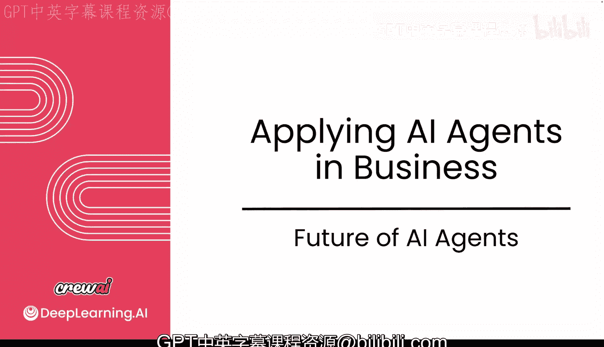
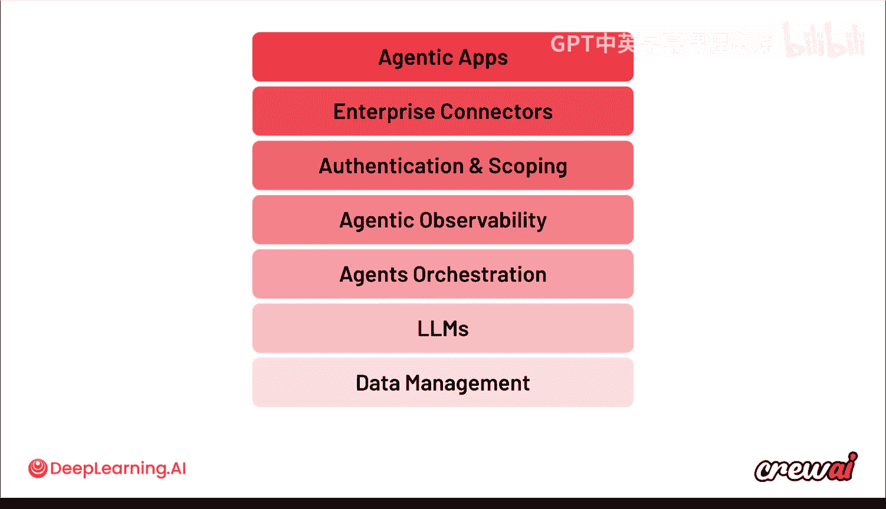
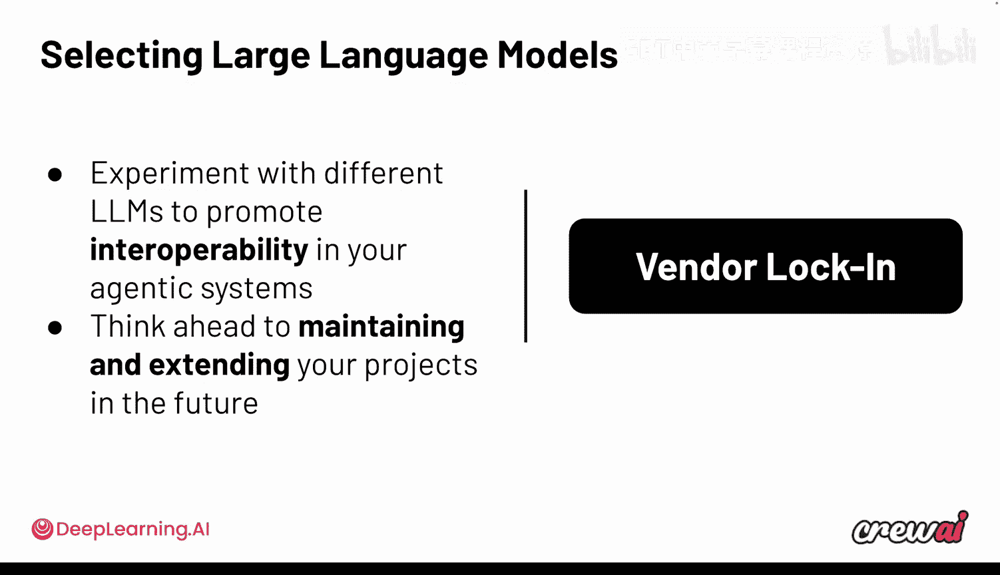
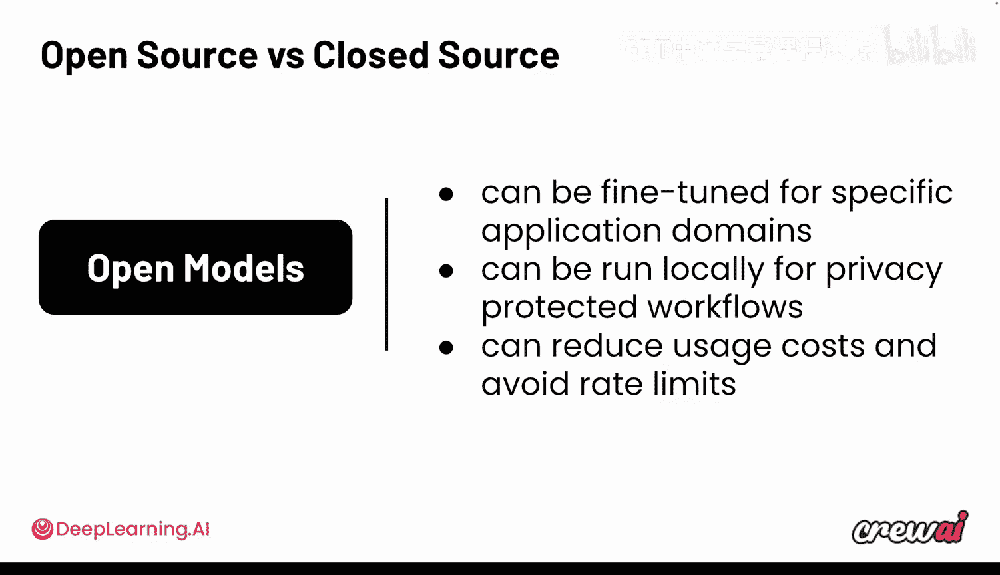
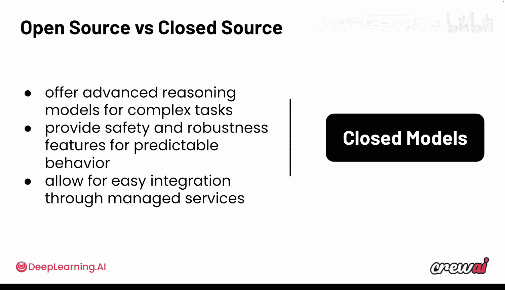
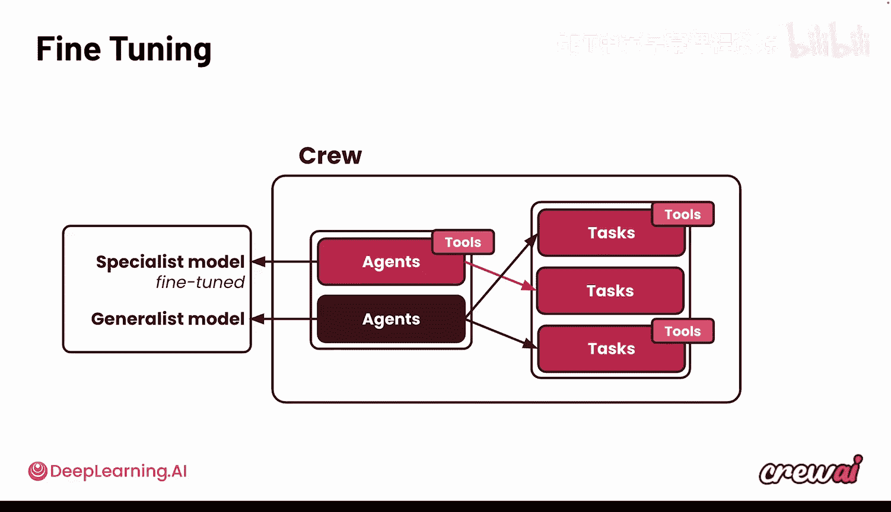
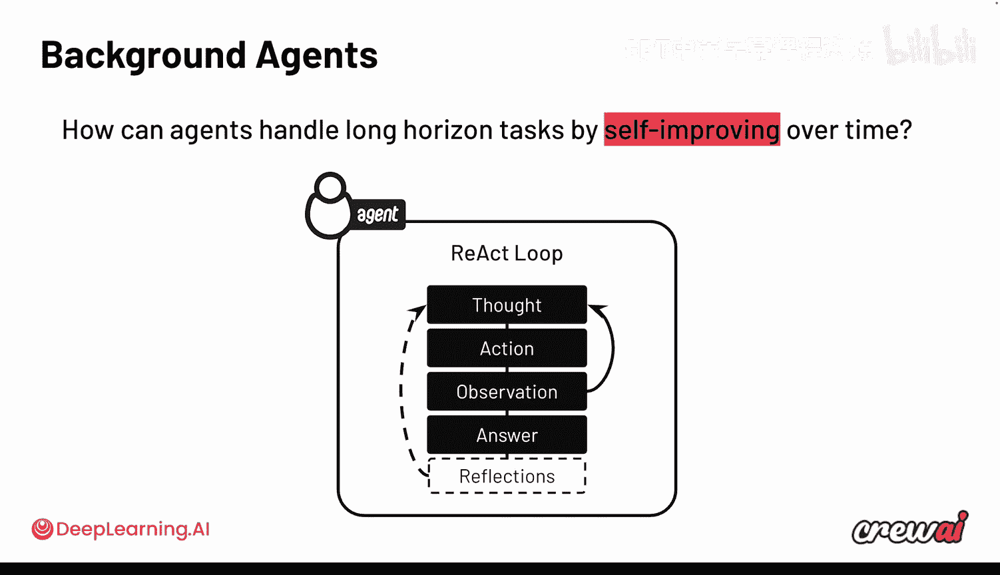
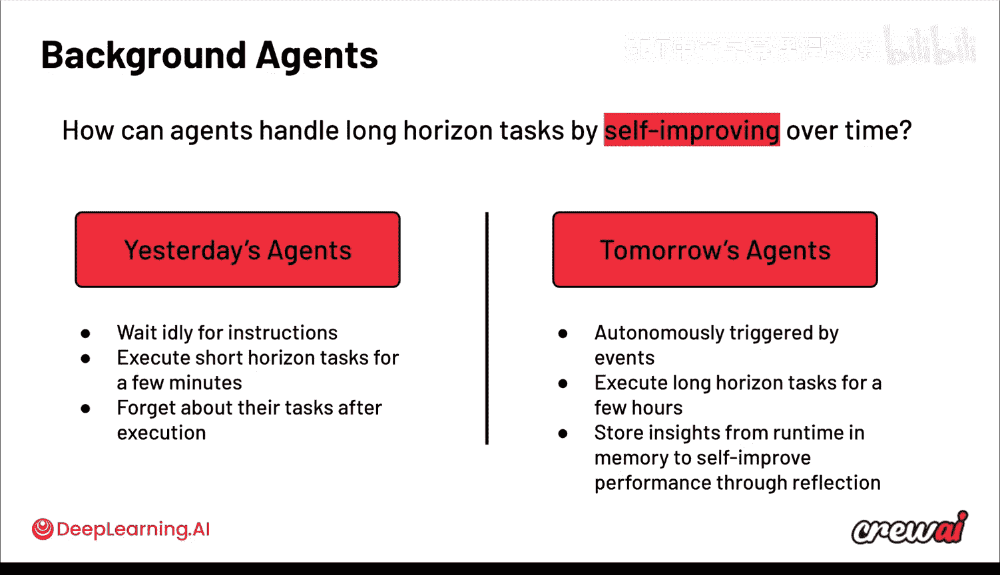
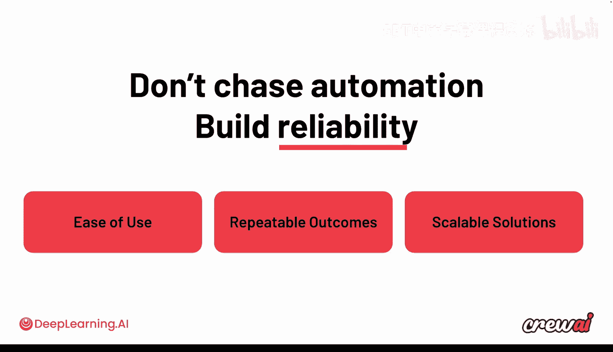

# 037：AI 智能体的未来 🚀

## 概述
在本节课中，我们将探讨 AI 智能体未来的发展趋势。我们将了解智能体管理平台的出现、开源与闭源模型的选择、模型微调的重要性，以及自我改进与长期运行智能体等前沿方向。理解这些趋势将帮助你更好地规划和构建未来的 AI 应用。

---

## 智能体管理平台的出现 🏢

到目前为止，你已经取得了巨大的进步。你几乎完成了这门课程，并学习了从设计、开发到部署 AI 智能体的全过程。现在，让我们探索 AI 智能体正在重塑未来的几种不同方式，以及你如何参与其中。

首先，我们需要花时间讨论一下 AI 智能体的未来，比如六个月或一年后会是什么样子。虽然我们无法完全控制其发展，但已经出现了一些模式，暗示了事物的发展方向。

第一个趋势是**智能体管理平台**的出现。根据客户或公司选择的目标，这种平台会呈现出不同的形态。但组织无疑需要一个管理层面来协调整个公司的智能体采用。

这些平台可以作为单一控制源，不仅管理可复用的用例，还提供集中的监控、功能增强和安全性。智能体管理平台将提供三个核心能力：
1.  **构建与集成用例的能力**：能够极其快速地启动。
2.  **在这些用例中建立信任的能力**：能够观察和优化运行中的用例。
3.  **交付价值的能力**：随着用例获得越来越多的关注，能够管理和扩展它们。

这个编排层位于运行中的智能体之上，让公司能够控制**发生了什么**、**如何发生**以及**何时发生**。这无疑是我们在人们讨论采用 AI 智能体时看到的一种模式。

---

## 平台的核心能力与软件工程模式 🔧

上一节我们介绍了智能体管理平台的概念，本节中我们来看看其具体的核心能力。

如果深入观察这些具体能力，你会发现它们细分为更小的功能。在编排方面，你会看到规划、推理、记忆、护栏和知识管理。在观察方面，则涉及我们讨论过的追踪、训练和测试，包括基于事件的自动化。

在构建和集成方面，你可能希望用代码构建，也可能希望像我们在 Studio 中那样进行无代码构建；你可能希望使用本地工具，也可能希望使用其他 AI 或外部触发器。在管理和扩展方面，你需要确保能够快速部署、邀请团队成员、控制权限，并拥有一些后台监控。

一些项目和公司处理端到端的整个工作流程，而另一些则专注于特定的能力。但关键在于，这里存在一个涵盖整个流程的编排层。

正如我们讨论过的，从观察到优化再到构建，你会发现很多共通之处。在传统软件工程和这里的智能体工程之间，你肯定能识别出一些模式。例如，观察层通常与构建和集成层是分离的，这体现了**关注点分离**的原则。这只是一个例子，但这里还有许多其他关注点。

---

## 新兴的技术栈与用户反馈 🧱

我们看到，随着世界的发展，一个新的技术栈正在形成。这个技术栈从数据管理延伸到大型语言模型，再到编排、可观测性、身份验证、连接器，最终汇聚成生成式 AI 应用（或称 Gen 应用）。

在最顶层，用户通过界面与智能体交互，这些界面可以是对话式的（如聊天界面），甚至是传统的基于按钮的设计。然而，从用户反馈中，有三个团队持续出现。我们在前面提到过，但这里想再次强调。在整个技术栈中，有许多最常见和最常被提及的担忧。

其中之一是我们在早期课程中简要提到的：**客户正在避免供应商锁定**。这种担忧可以追溯到云计算时代，当时迁移经验表明，公司变得依赖托管服务，随着成本增加，组织发现自己被锁定，难以将工作负载迁移到其他替代方案（例如使用 Kubernetes）。经历过这些挑战的领导者，在采用 AI 智能体时更加谨慎。

因此，公司确实需要灵活性。这不仅关乎供应商锁定（当你考虑超大规模云提供商或不同部署方法时，这确实是个问题），还关乎**为工作选择合适工具的能力**。因为你可以为不同的智能体使用不同的 LLM，实际上可以在其中建立一个优化层。这也为你使用开源模型甚至进行微调打开了空间。

这里的核心思想是，组织希望拥有在任何地方运行其工作负载的自由，无论是在本地服务上，还是在任何他们使用的超大规模云上。公司还希望使用许多不同的模型，不仅仅是 OpenAI 或 Claude，而是从他们已采购的任何供应商中进行挑选。

CrewAI 作为一个框架和平台，允许你下载在用户界面上生成的任何内容的代码。CrewAI 从设计之初就旨在让你利用这种互操作性，不仅在 LLM 层面，甚至在智能体群组本身。因此，即使在我们之前使用的无代码体验中，你也不会被锁定，因为你可以随时为你用户界面上生成的任何内容下载代码，并随身携带，因为那是你的知识产权。这解决了许多关于平台依赖性的担忧。

---

## 开源与闭源模型的选择 🤖

既然我们谈到了模型，那么理解何时使用开源模型、何时使用闭源模型以及这样做的一些好处就很重要。

公司通常会根据其需求，针对开源或闭源模型进行优化。例如，自行运行模型已经变得容易得多，特别是借助像 `llama.cpp` 或 TensorRT-LLM 这样的工具。这意味着你可以获取全球正在生产的这些优秀模型，自行托管，甚至微调它们以使其更好。

像 GPT-4 和 Claude Sonnet 4.5 这样的闭源模型，通常附带更好的内置功能，开箱即用，这给了它们优势。但开源模型在能力上已经迎头赶上，现在许多公司实际上开源了他们自己的模型。你不仅可以利用这些模型，还可以针对特定的应用领域对它们进行微调，使它们成为更适合你和你的用例的智能体。

你还可以在本地运行它们以确保隐私，并确保你仍然符合任何治理政策。此外，你可以大幅降低使用成本，并避免在使用这些试图服务全球用户的外部提供商模型时可能遇到的任何速率限制。

现在，如果你观察闭源模型，你会发现它们为复杂任务提供了更先进的推理模型，并为可预测的行为提供了许多安全性和鲁棒性功能，允许你通过托管服务轻松集成。

然而，你应该警惕在较小的模型上运行你的智能体。参数少于 140 亿或 200 亿的模型，当你试图将它们扩展到智能体行为时，通常效果不佳。它们只是无法像更大的模型那样遵循指令。因此，智能体通常需要更强大的模型才能有效执行。

话虽如此，随着新模型的推出，它们通常更先进。所以你现在看到了一整套新型模型，它们更小但也非常强大。例如，开源模型 Qwen2.5-20B 肯定可以用于一些智能体行为，但你会在更大的模型上发现更好的性能。

---

## 模型微调的重要性 ⚙️

现在，我想花点时间关注一下微调。微调在过去几年中被广泛讨论，但大多数公司仍未采用。这很不幸，因为微调在成本节约和性能改进（尤其是速度方面）提供了巨大的潜力。

然而，采用的障碍很高。没有丰富 AI 训练经验的公司发现很难自信地掌握模型微调。随着进入门槛的降低，以及微调对智能体变得更加容易，采用率可能会增加。公司确实希望获得微调带来的好处。

例如，你可以省钱，因为你可以运行更小的模型；而且它们运行得更快，因为效率更高。因此，构建这些 AI 智能体用例的公司，实际上想要微调的结果，但在执行上遇到了困难。随着摩擦减少，更多的公司将追求微调，而通过智能体微调模型是获得更好结果的一种非常有效的方法。

---

## 未来趋势：自我改进与长期运行智能体 🔄

展望未来，AI 智能体开发中有两个趋势正在融合。这是我们从智能体开发前沿听到的，即**自我改进**和**长期运行智能体**。

对于自我改进的智能体，我们不仅希望它们像现在这样随时间获取记忆，还希望确保它们在这方面变得更好、更有效。我们还希望这些智能体能持续评估自己的表现，并相应地调整行为，实现持续改进。在成千上万次执行中做到这一点，是人们努力追求的目标。这种自我改进能力已内置在 CrewAI 中，我们仍在大力投资以进一步增强它。

长期运行智能体是公司正在思考的另一个方向，即智能体可以在没有人类交互的情况下，持续运行很长时间（有时甚至数小时），并仍然取得出色的成果。持续时间取决于你的配置、智能体数量和系统设置。但可以肯定的是，业界正在积极优化自我改进和长期运行智能体，并探索如何有效地构建它们。

如果你想想昨天的智能体，你会发现它们会闲置等待指令，执行非常短期的水平任务（可能只有几分钟），并在执行后忘记任务。而明天的智能体则完全不同，它们能够被事件自主触发，执行更长时间（有时数小时），并且擅长存储运行时获得的所有洞察，以便随时间进行自我反思和改进。这是业界试图将 AI 智能体提升到下一个水平的主要驱动力。

---

## 核心原则：可靠性高于一切 🎯

最后，我想回到一个非常重要的原则。即使听完所有这些功能，如果你必须从这门课程中带走一样东西，那就是：当你构建智能体自动化时，**你不应该只追求自动化**。你应该将可靠性构建到你创造的每一样东西中。

这使你的 AI 智能体为生产环境做好准备。当你设计、构建和部署智能体时，时刻牢记这一点，你就能取得显著的成果。

## 总结
本节课中，我们一起学习了 AI 智能体的未来发展趋势。我们探讨了智能体管理平台的作用、开源与闭源模型的权衡、模型微调的价值，以及自我改进与长期运行智能体等前沿方向。最重要的是，我们认识到，在构建 AI 智能体时，可靠性是比单纯追求自动化更根本的原则。希望这些知识能帮助你在未来的 AI 项目中做出明智的决策。