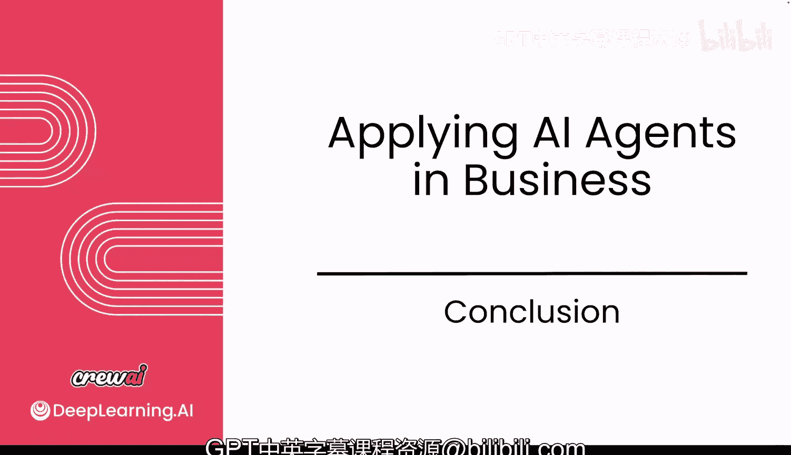

# 038：课程总结 🎉

在本节课中，我们将对《使用 CrewAI 设计、开发与部署多智能体系统》课程的核心内容进行回顾与总结。

恭喜你完成本课程。你学到了很多关于AI智能体的知识。

我们讨论了如何构建它们、如何部署它们以及其间的所有环节。

现在，你需要将所学的一切应用到日常工作和构建这些用例中。

如果你发现有任何遗漏，或者想了解更多关于AI智能体的信息，请联系我们。你可以在LinkedIn或Twitter上找到我，无论你选择哪个平台，我都非常期待与你交流所有关于AI智能体的内容。

你为此付出的所有努力给我留下了深刻印象。希望你已经看到了这对未来技术和AI智能体发展的意义。

期待不久后与你再见。祝你一切顺利。😊

---

本节课中，我们一起回顾了整个课程的学习历程，总结了关于AI智能体构建与部署的核心知识，并鼓励你将所学付诸实践。