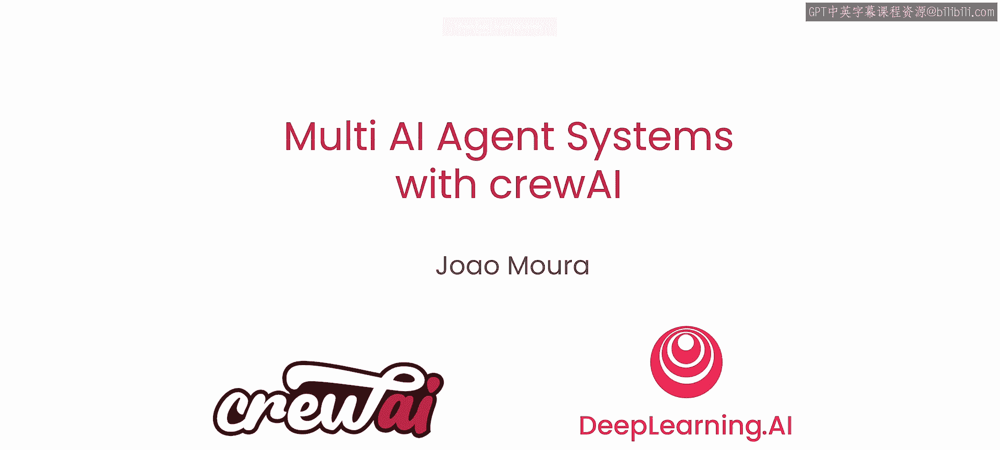
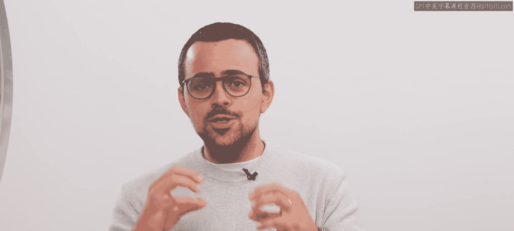
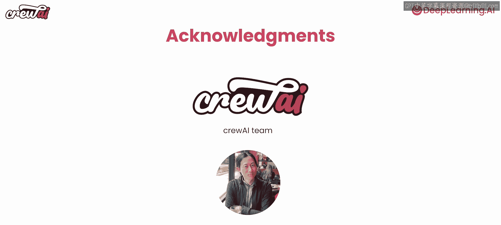
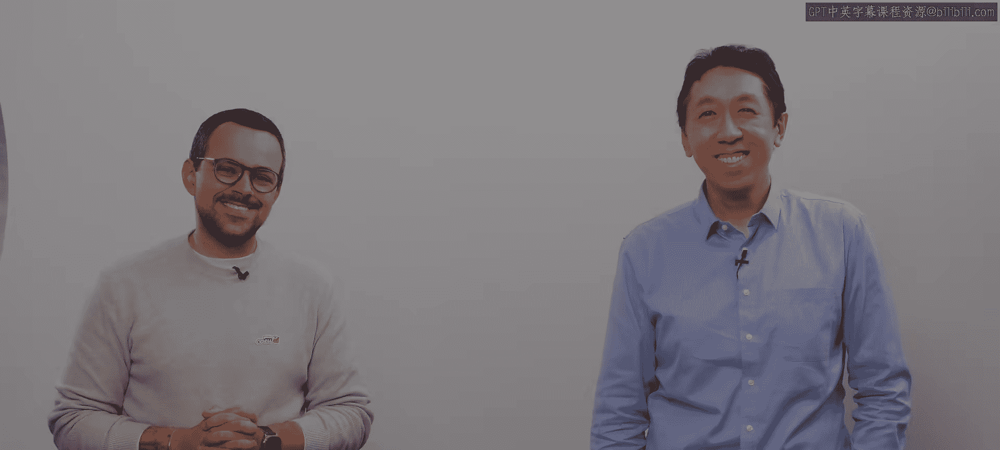

# 001：课程介绍

## 概述

在本节课中，我们将初步了解多人工智能代理系统及其核心概念，并预览整个课程的学习路径。课程由吴恩达与 crewAI 合作推出，并由 crewAI 创始人兼 CEO Joe Mora 亲自讲授。

## 课程背景与重要性

吴恩达认为，人工智能代理工作流将是近期推动 AI 进步的关键驱动力。多代理工作流允许你将复杂的任务分解为可以由不同代理执行的子任务，每个代理扮演一个特定的、定义明确的角色。

例如，如果你的目标是撰写一份研究报告，角色可能包括研究员、写作者和事实核查员。如果你想构建一个网站，角色可能包括网页设计师、软件工程师和测试工程师。

吴恩达分享了他个人使用 crewAI 的积极体验，并很高兴由创始人 Joe 来教授这门课程。Joe 创建 crewAI 的初衷，是为了构建更好的代理来帮助他撰写 LinkedIn 帖子，他在设计多代理协作工作流方面拥有丰富的经验。

## 课程内容与目标

在本课程中，你将学习构建代理系统，特别是多代理系统的主要组成部分。你将学到的核心构建模块包括：
*   **角色扮演**：定义代理的职责。
*   **使用记忆**：让代理能够记住上下文。
*   **防护栏**：确保代理行为的安全与可控。
*   **协作**：设计代理间的合作方式。

你将运用这些组件来构建一系列代理，以完成以下具体任务：
1.  根据职位描述定制简历。
2.  执行财务分析。
3.  进行活动策划。

在组装你的代理工作流时，你还需要定义这些代理如何协作。例如，哪些代理可以将特定任务（如研究）委托给其他代理执行，以及某些代理是应该并行、串行还是以分层方式（由管理代理委托给多个工作代理）执行它们的任务。Joe 将在课程中详细讲解这些概念。

## 课程价值与思维转变

这门课程旨在帮助工程师理解如何构建 AI 代理应用程序，以及它们与我们迄今为止构建的常规应用程序有何不同。学完本课程后，你将掌握构建多代理系统所需的知识，并能从中获益。

我们可以将设计优秀的多代理系统比作成为一名管理者。你现在被提升为这些代理的经理，需要确定目标、识别为实现这些目标而需要协同工作的各种角色，并定义清晰的成功标准。这与常规的工程思维相比，是一个非常有趣的心理转变。

## 致谢与课程预告

许多人为创建这门课程付出了努力。特别感谢整个 crewAI 团队，以及来自 DeepLearning.AI 的 Eddie Shu 所做的贡献。

接下来的第一课将为你概述 AI 代理的基本概念以及本课程的其余内容。请务必继续学习。

现在，让我们进入下一个视频，深入探讨 AI 代理的关键构建模块。

## 总结

本节课我们一起了解了多人工智能代理系统的潜力和应用场景，明确了本课程的学习目标与核心内容，并认识到从“工程师”到“代理管理者”的思维转变。准备好开始探索 AI 代理的构建模块了吗？让我们继续前进。