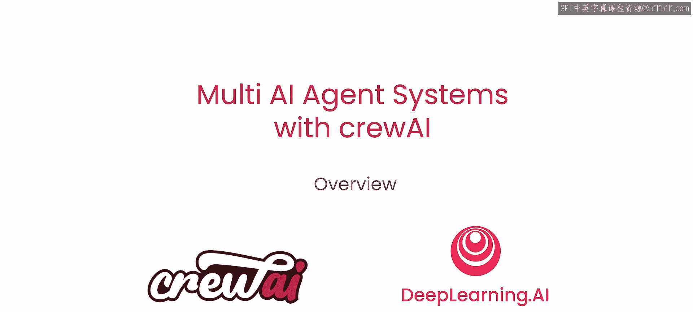
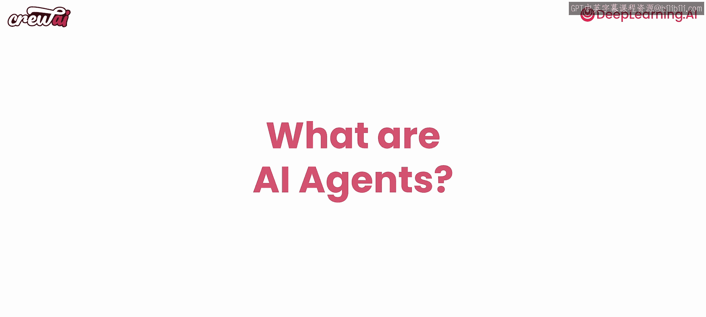

# 002：课程概述

在本节课中，我们将学习多AI代理系统的基础概念，并了解如何使用crewAI框架构建由多个AI代理协作完成复杂任务的系统。我们将从宏观视角理解代理、自动化以及本课程将要构建的项目。

---

首先，祝贺你注册本课程。我们将共同学习关于AI代理的一切知识。在第一课中，我们将理解如何构建代理、它们如何工作，并预览在整个课程中我们将一起完成的一些示例。

在课程中，我们将探讨许多有趣的概念。以下是几个重点，以便你了解将要学习的内容：
*   **角色扮演**：代理如何扮演特定角色。
*   **代理能力**：代理如何专注于任务、使用工具以及彼此协作。
*   **关键机制**：深入探讨如何通过**引导（guardrails）** 确保代理正常工作，以及**记忆（memory）** 如何提升其表现。
*   **协作模式**：代理不仅能够顺序和分层工作，还能异步协作，存在多种不同的协作选项。

请务必坚持学习，因为我们将在所有课程中构建许多不同的“团队（crews）”。一个**团队（crew）** 就是一组协同工作的AI代理，每个代理都有其定义好的角色。如果你还不明白这意味着什么，不用担心，这正是本课程要讲解的内容。

我们将从一个概述开始，构建一个简单的研究与写作团队。然后，我们将进一步构建更复杂的系统，例如：
*   客户支持团队
*   客户拓展团队
*   活动策划代理系统
*   财务分析代理系统

最后，作为总结，我们将构建本课程最复杂的团队：一个能够根据任何招聘信息为你量身定制简历的系统，从而增加你获得面试的机会。请务必坚持学习到最后，因为内容只会越来越有趣。

---

## 课程项目预览：AI简历优化器

我们将构建什么？让我们看看这个全栈工程师的招聘信息。招聘描述中寻找一位精通前后端的全栈开发者，要求具备编写API、数据库经验等技能。

这是Noah的个人资料。我们不逐字阅读，但可以突出一些内容。Noah试图强调他的领导能力，提到了领导远程和办公室团队的经验，也提及了数据科学、机器学习以及部署可扩展AI解决方案。这些与他申请的全栈职位并不直接相关。

但仔细挖掘，你会发现Noah也具备相关技能：他提到了Ruby、Python、JavaScript，并拥有18年软件工程师经验。其中肯定有足够的内容可以挖掘，使他能够胜任这个职位。

那么，我们如何确保帮助Noah在简历中突出这些内容，以增加他获得面试的机会呢？你可以使用AI代理来完成。在本课程结束时，你将能够组装一个多代理系统来实现这一目标。

我们将利用四个不同的代理：
1.  **技术职位研究员（Tech Job Researcher）**
2.  **个人资料工程师（Personal Profile Engineer）**
3.  **工程师简历策略师（Resume Strategist for Engineers）**
4.  **工程师面试准备员（Engineering Interviewer Preparer）**

这四个代理将能够使用一些工具，从搜索互联网到对你的简历进行检索增强生成（RAG），全方位帮助Noah（或你自己）确保为职位突出展示正确的技能。

这是优化后的个人资料。让我们对比一下前后两份资料。在第二份资料中，你可以看到它加倍强调了与他所申请职位更匹配的其他技能，提到了Java、Python、Ruby、UI/UX，以及他掌握的HTML和CSS知识。这仍然是同一份个人资料和同一组技能，但以更好的方式进行了呈现，从而帮助Noah获得了他期望的面试机会。

如果你想实现这个功能，请坚持学习。因为到最后，你不仅能构建这个系统，还能构建更复杂的多代理团队，为你完成大量的自动化任务。

---

## 理解自动化与AI代理

那么，什么是自动化？回想一下过去的自动化，它与现在完全不同。过去，你会说“我想从A点到达B点”，然后编写代码来自动化这个过程。随着边缘情况的出现，你开始让代码变得更复杂，添加许多条件和判断逻辑。

例如，代码中会出现类似 `if X then do C, if Z then do D` 的结构。你可以想象，随着添加越来越多的边缘情况，事情会变得相当复杂。在过去，尝试进行自动化时，你最终会得到一个包含许多不同条件和边缘情况的非常复杂的代码库，而且你永远无法覆盖所有情况。

**AI代理自动化**的美妙之处在于，你不需要绘制详尽的地图，你可以展示选项。这从根本上是一种编写软件的新方式。

在常规应用程序中，你有**强类型输入（strong inputs）**。你确切知道输入应用程序的数据是什么，清楚它是字符串、整数还是浮点数。然后，你也非常清楚要对这些数据执行什么数学运算或启发式算法。你知道是数字相乘还是字符串插值，完全掌控并理解整个过程。因此，你也知道输出会是什么，是另一个浮点数、整数还是字符串。你可以复现它，这就是常规工程的魅力。

但是，在这种新的AI应用程序中，情况有所不同。你拥有**模糊输入（fuzzy input）**，意味着你不知道用户向你的应用程序输入了什么。你知道它是一个字符串（因为我们在讨论大语言模型），但不知道这个字符串是代表表格数据、Markdown、普通文本还是数学运算。同时，**转换过程也是模糊的（fuzzy transformations）**，因为由大语言模型执行，你不知道它会决定将其转换为列表还是写成一个完整的段落。因此，你无法确切知道**输出（output）** 会是什么，因为它可能根据输入和转换过程呈现不同的形式和形态。

但这就是它的魅力所在。在当前世界中，存在一些场景，这些**模糊应用程序（fuzzy applications）** 比常规的现有软件应用程序更有意义。这也是人们如此喜爱ChatGPT的主要原因。想想ChatGPT，它是一个具有模糊输入的AI应用程序（你不知道用户在聊天中输入什么），具有模糊转换（你不知道大语言模型会如何处理数据），也具有模糊输出（你不知道最终的输出、对用户输入的最终回复会是什么）。人们喜爱它，是因为它与现实世界有相似之处。我们生活的世界本身就是一个模糊的地方。

AI应用程序的魅力在于，它开辟了一个新领域，让你可以在需要模糊应用程序和需要强类型应用程序的地方各自发挥其优势，具体取决于你试图构建的软件类型。

---

## 实例分析：从传统自动化到AI代理自动化

让我们看一个实际例子：数据收集与分析。如果你从事工程工作一段时间，可能对此很熟悉。你的公司可能有一个网站，通过表单捕获潜在客户数据，这些潜在客户最终会交给销售团队，试图将他们转化为客户。这对大多数企业来说非常普遍。

这些潜在客户转化为客户的方式是通过优先级排序，公司有多种方法来实现这一点。你通过表单捕获关于该公司的信息，然后通过一个自动化流程对这些潜在客户进行分类。你可能会设置一些数据点，例如：“这家公司是大公司吗（员工超过10人）？”、“这家公司位于美国还是其他地方？”。根据这些问题的答案，你可能会给这些公司不同的评分，或在销售流程中区别对待。这是常规的数据分析和收集。

但事实证明，现在你可以使用多代理系统，超越传统方法，走得更远。让我们尝试一些不同的思路，思考一个AI代理团队如何能在这里帮助我们，做出比过去几年更好的事情。

让我们在潜在客户生成流程中加入一个AI代理团队。你现在可以这样做：
*   **研究**：让AI代理进行研究，外出进行数据收集。这些研究可以是搜索Google、搜索网络、搜索内部数据库或你可能拥有的任何内部数据——任何你能找到关于这些公司更多信息的地方。
*   **比较**：让这些代理在你已有的数据中的公司之间进行比较，例如你正在洽谈的公司或最终成为优秀客户的公司。
*   **评分**：让这些AI代理进行一些评分，确保这家公司有一个你可以实际用来确定优先级并决定将其发送给谁的分数。
*   **生成谈话要点**：不仅进行研究、比较和评分，还要更进一步，确保你知道在与客户接触时应该提出哪些话题，以及对话应该是什么样子。

现在，你可以将这些信息发送给你的销售团队，你将拥有比以往更好的数据来开展工作。这是一个很好的例子，展示了**通过使用代理自动化，常规自动化如何可以变得更好**。

---

## 总结：什么是AI代理？

到目前为止，我们讨论了很多关于代理和不同类型自动化的话题。但归根结底，**代理（agents）** 究竟是什么？让我们退一步来谈谈。

AI代理是能够感知环境、自主决策并执行行动以实现特定目标的智能实体。在crewAI框架中，代理被赋予特定的角色、目标和工具，并通过协作组成“团队（crews）”来完成个人代理难以单独处理的复杂任务。

在本节课中，我们一起学习了多AI代理系统的基本概念、传统自动化与AI代理自动化的区别，以及本课程将如何通过实际项目（如AI简历优化器）带你掌握使用crewAI构建复杂多代理系统的技能。从下一节课开始，我们将动手构建我们的第一个AI代理团队。