# 003：AI 智能体

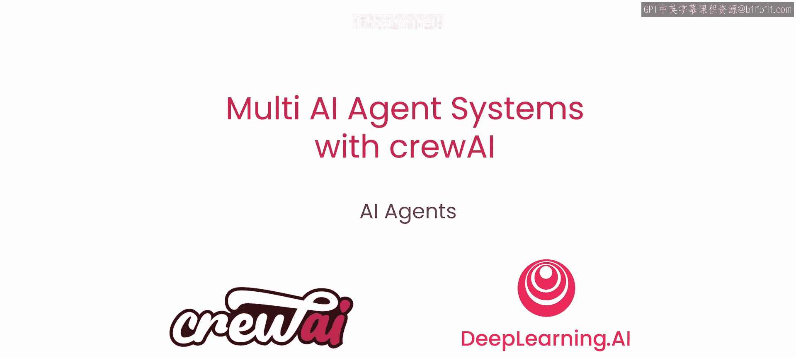

在本节课中，我们将要学习什么是大型语言模型、AI智能体以及多智能体系统。我们将探讨从基础的LLM交互到自主智能体的演变，并介绍一个强大的构建框架——crewAI。

## 从LLM到智能体

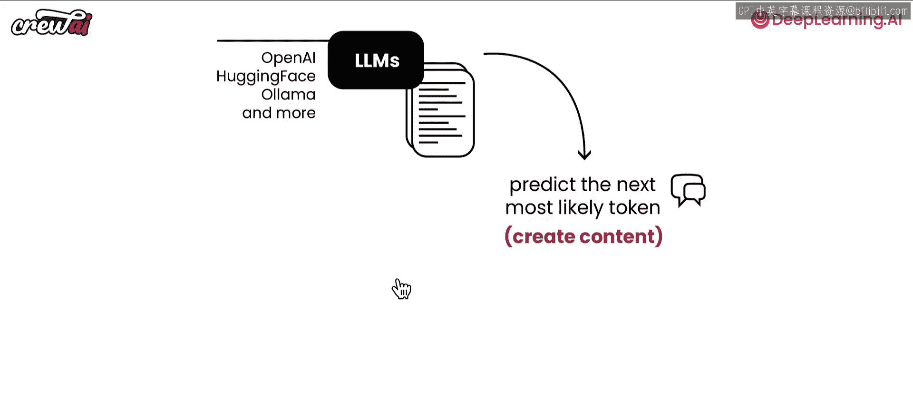

你可能知道大型语言模型。它们有各种不同的形态、规模和形式。有许多不同的供应商，例如 OpenAI、Hugging Face、Alema 等，提供了多种接入方式。

LLM 的核心功能是预测最可能的下一个词元。如果你尝试与这些 LLM 聊天，很快会发现你最终得到的是一种类似于与 ChatGPT 交互的常规提示体验。你需要通过你与 LLM 之间的互动来提供反馈，以确保获得所需的结果。

让我们通过一个例子来看看这种交互是如何工作的，以及为什么使用智能体可以做得更好。

假设我们请 ChatGPT 为构建 AI 智能体的平台 Cr AI 撰写一段营销文案。

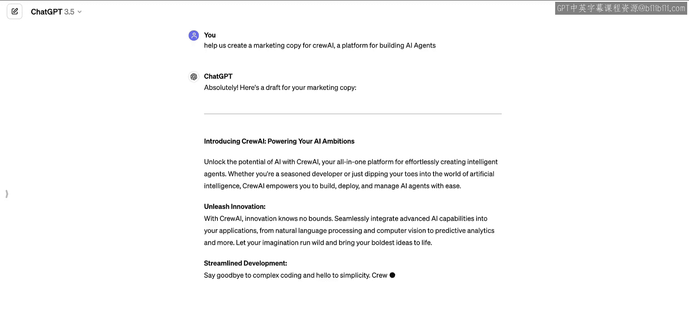

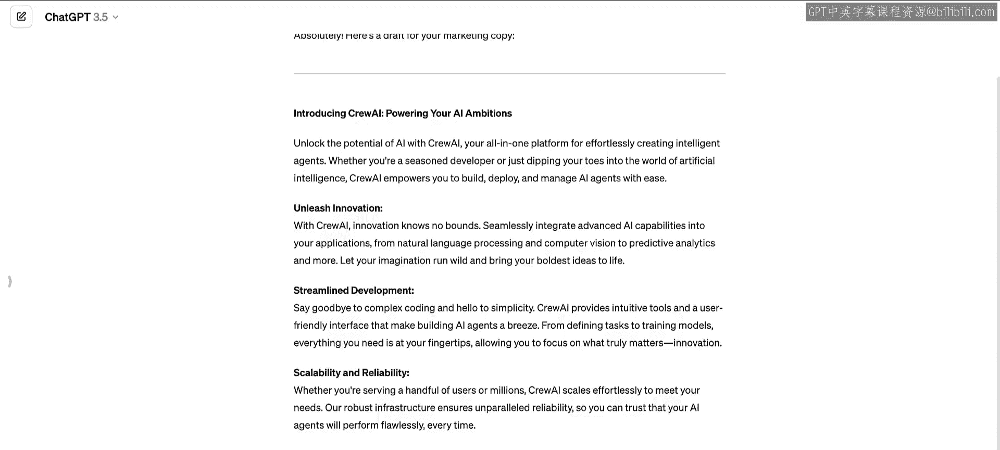

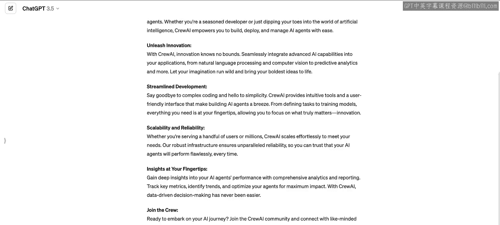

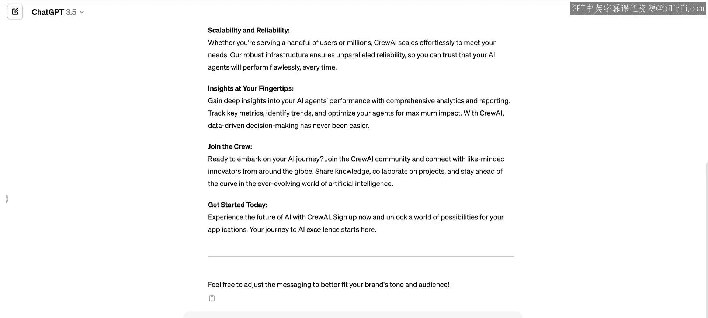

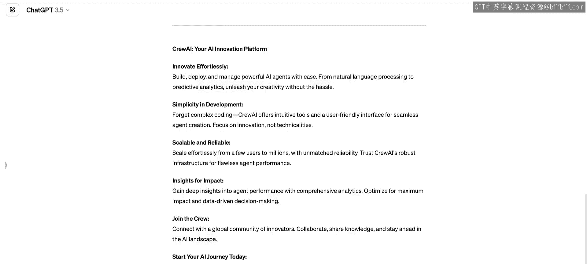

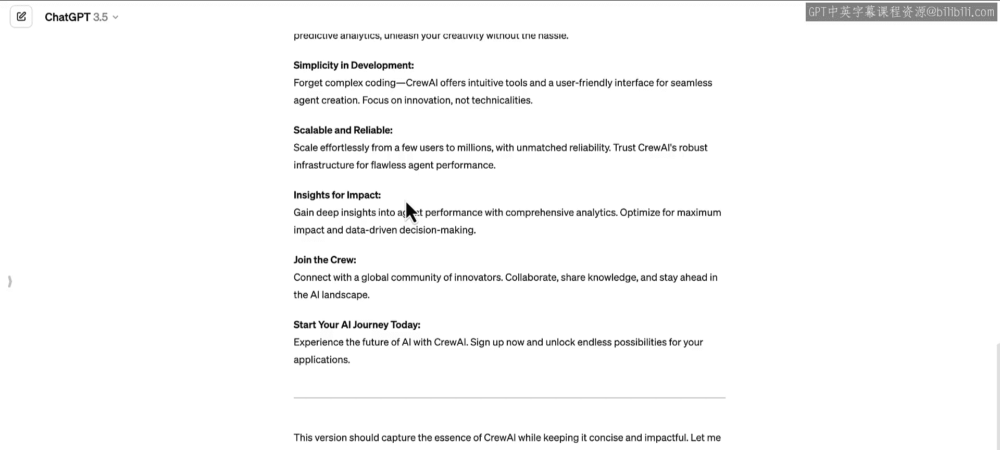

你可以看到，常规的 ChatGPT 会开始撰写文案，但结果可能太长。你可能不想要这么长的内容，而是希望得到一个更简短的版本，比如用于 Instagram 帖子。

这时，你可以提供反馈，例如：“这太长了，请总结一下。” 然后你会看到它开始改进。我们能让 ChatGPT 或任何 LLM 获得更好结果的唯一原因，就是用户与 LLM 之间的互动迭代，以及你提供的反馈，这使它能够纠正错误并获得更好的结果。

你很快会意识到，通过两次互动可以获得更好的结果。但你很快也会成为瓶颈。你必须在那里回答这些问题，才能获得好的结果。这并非完全自动化，你无法同时做其他工作。

## 智能体的诞生 🤖

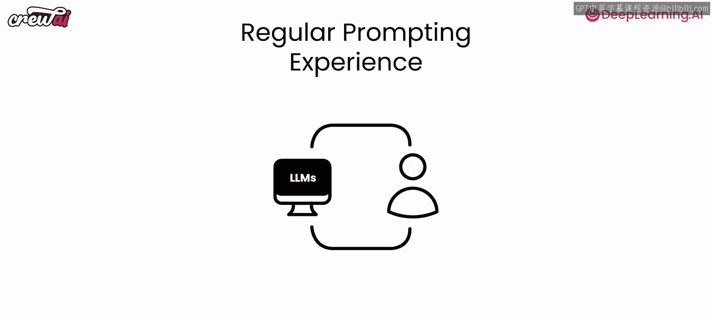

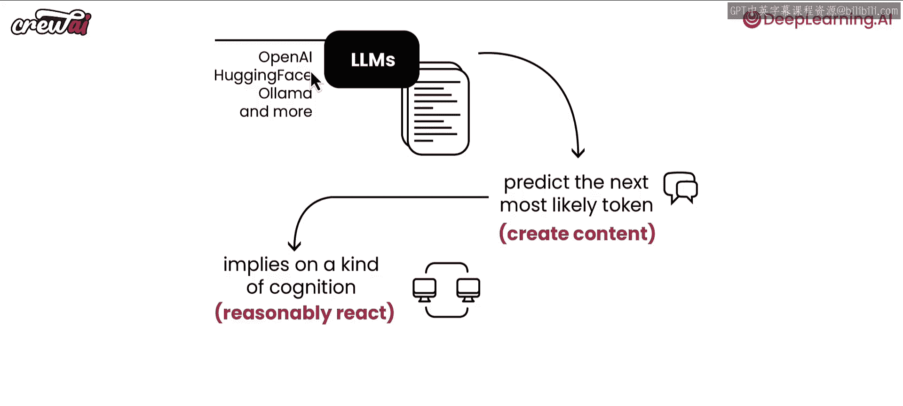

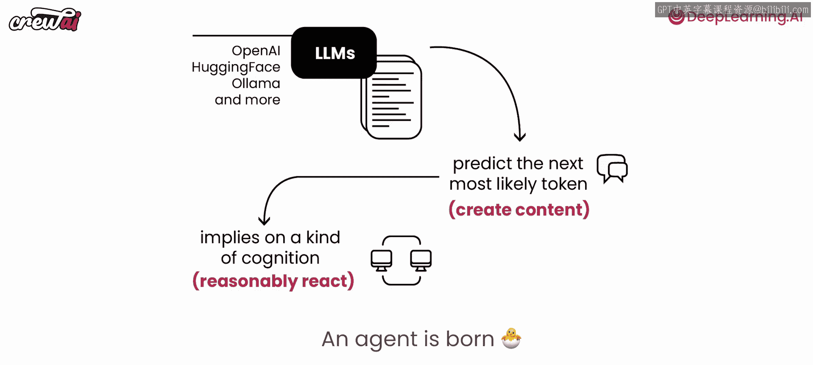

AI 智能体可以打破这种限制，让你在 LLM 自主运行的同时去做其他工作。我们能做到这一点，是因为这些 LLM 接受了大量文本训练，它们理解文本，从而产生了一种类似认知的状态。这意味着它们能够进行合理的反应，可以在选项 A 和 B、左和右之间做出选择，因为它们能够以有意义的方式组合词语。

当你达到这种状态时，如果你能让 LLM 回答一些问题，一个智能体就诞生了。当 LLM 参与到内部思考过程中，不断向自己提问并回答，直到它能够自主推进并获得更好的结果时，智能体就诞生了。

一旦进入这个阶段，你就可以将任务交给这个智能体。通过这个思考过程，智能体可以得出一个更好的答案。这不是它最初会给出的答案，但它可以通过思考来优化答案，直到自己满意，然后输出。

## 智能体的核心：工具 🛠️

但这里还缺少一个让智能体变得超级强大的 B 组件，那就是使用工具的能力。其他框架可能称之为技能或能力。工具允许你的智能体与外部世界互动，让它能够做更多原本无法独自完成的事情。这可以是调用 API、发布内容、收集数据点等等。拥有了工具，这才是一个功能完备的智能体。

## 多智能体系统

多智能体系统建立在上述智能体行为之上。你不再只有一个智能体，而是可以拥有多个。当你给一个智能体分配任务时，这个智能体也可以给另一个智能体分配任务，最终你会得到一个单一的最终答案。

你可能会想，与单个智能体相比，这样做有什么好处呢？以下是几个好处，我们将在后续课程中深入探讨。

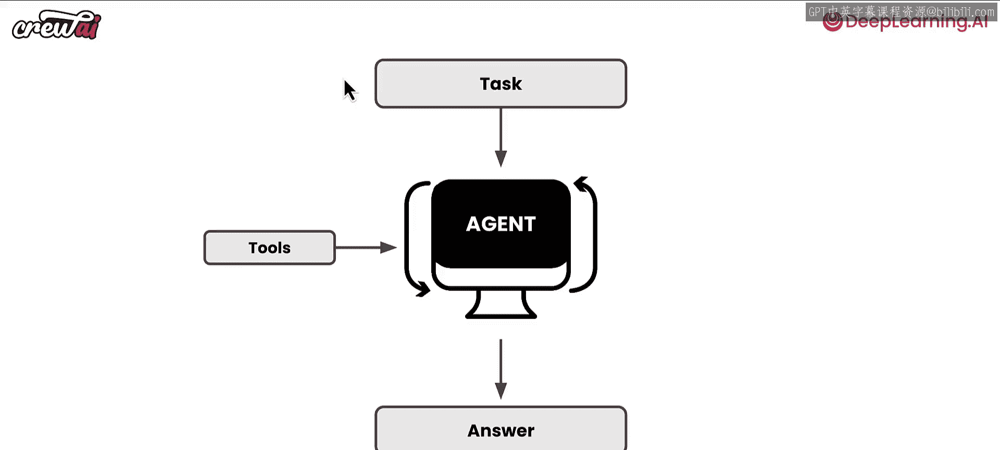

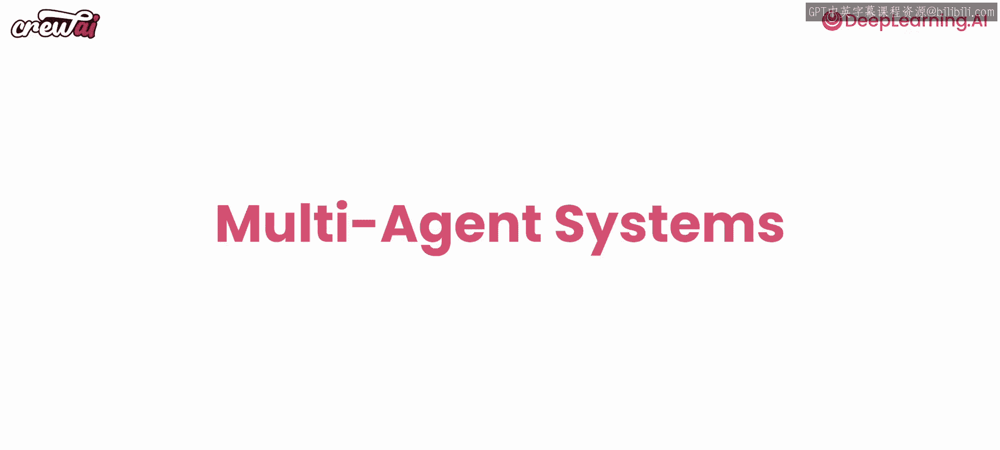

首先，你可以让每个智能体专门做一件事，并把它做好。例如，你可以让一个智能体担任研究员，另一个担任作家。这样，研究员智能体可以专注于查找和核实所有信息来源，而作家智能体则利用这些信息来创作出最出色的材料。

其次，因为你有多个智能体，你可以让它们运行在不同的 LLM 上。例如，你的研究员可以运行在 Llama 上，而你的作家运行在 GPT-4 上。你甚至可以使用自己微调的模型来驱动某些智能体。

由此可见，多智能体系统比单个智能体强大得多。它允许你拥有高度专注的智能体，它们能比试图自己完成所有事情时取得更好的结果，同时还能利用来自不同来源的不同模型的能力。

我们甚至可以更进一步，拥有多个多智能体系统，但这会变得非常复杂。让我们先退一步，首先理解多智能体系统。

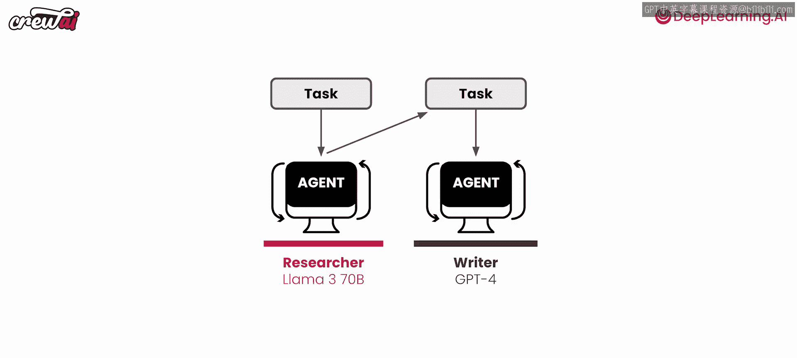

## 为什么选择 crewAI？ 🚀

在本课程的所有示例中，我们将使用一个超级强大的框架，叫做 crewAI。它是开源的，设计简单，并且适用于生产环境用例。它还提供了一个平台，可以将你的智能体投入生产。但我们将在这里讨论的所有概念，都适用于其他主流框架。

在我们深入示例之前，让我们谈谈什么是 crewAI。我想花点时间说明，在众多可选方案中，为什么本课程选择使用 crewAI。

crewAI 是一个框架和平台，它提供了一些特性，使其对我们来说非常容易使用且意义重大。

以下是它提供的主要特性：

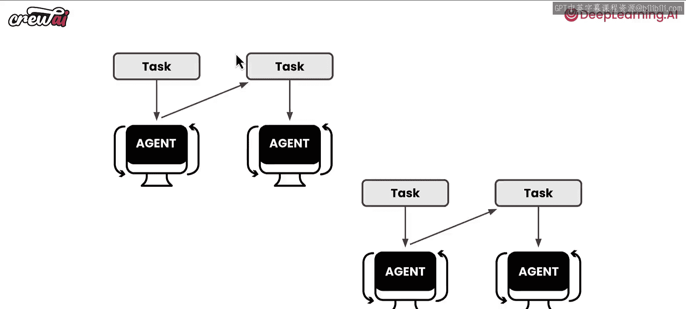

*   **简单的结构**：它将所有概念分解为非常简单的结构，让你能轻松掌握。
*   **系统构建模式**：它提供了一种将这些系统组合在一起的模式，你无需思考如何串联所有部分，因为它已经为此提供了成熟的方案。
*   **丰富的工具和技能**：它提供了许多现成的工具和技能，我们将在整个课程中使用它们。
*   **自定义构建模块**：它为你提供了构建自定义工具或智能体的模块。在我们的一些课程中，我们将构建一些自定义工具，你会看到这多么有帮助。
*   **生产部署平台**：作为最后的亮点，它还提供了一个平台，用于将这些智能体投入生产。因此，无论你在课程中构建什么，如果你选择这样做，都可以通过 crewAI 平台进行部署。

## 下节预告

好了，让我们开始看看一些初始的构建模块。在下一课开始时，我们将深入探讨智能体、任务和团队，并构建我们的第一个多智能体系统。

如果你喜欢到目前为止听到的内容，如果你对我们提到的任何例子感到兴奋，我建议你继续关注，因为从这里开始，事情只会变得更加有趣。

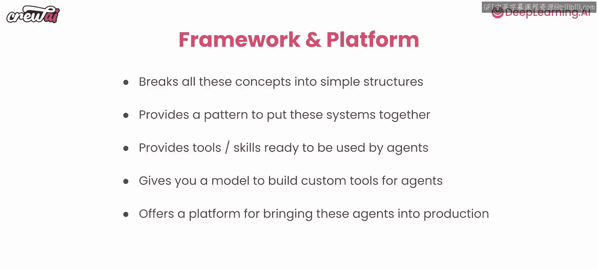

你将能够用 AI 智能体构建很多东西，我保证在本课程结束时你会感到震撼。它将允许你自动化生活中的部分环节，自动化工作中的部分任务，并真正释放巨大潜力。希望你继续关注我们的下一课，在那里我们将亲手构建我们的第一个多智能体系统，我将全程指导你。

非常感谢，我们下节课再见。

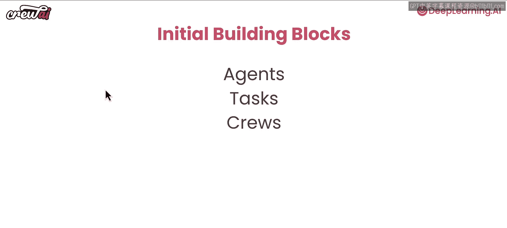

