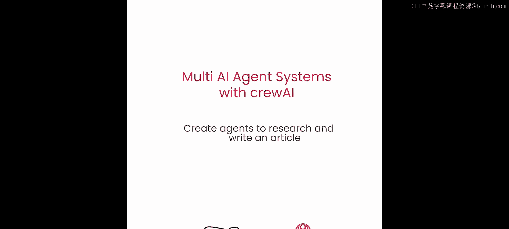
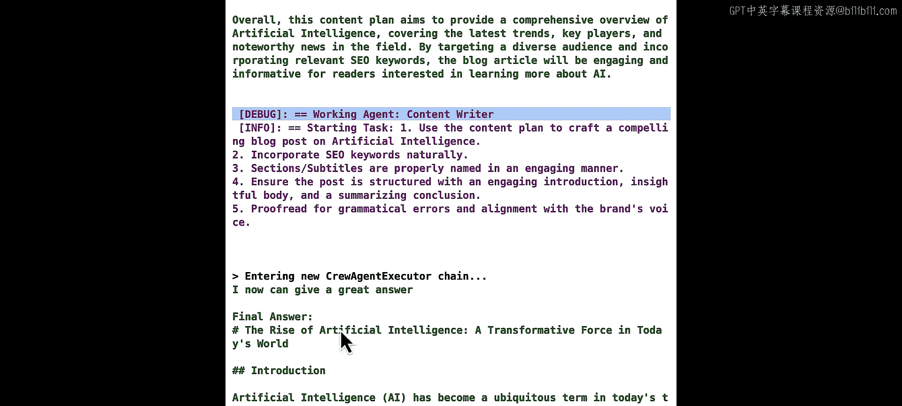
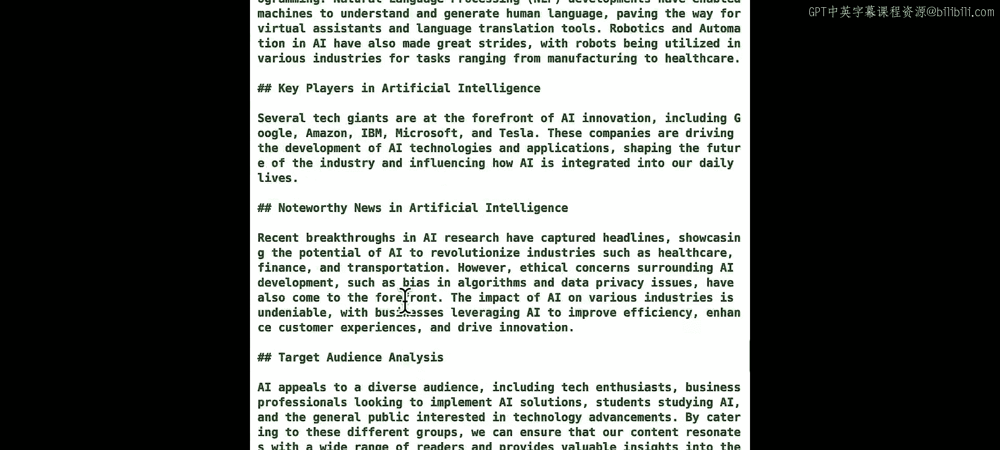
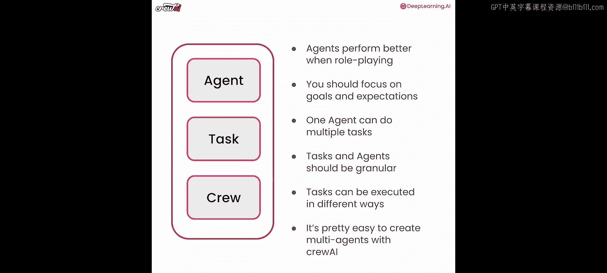
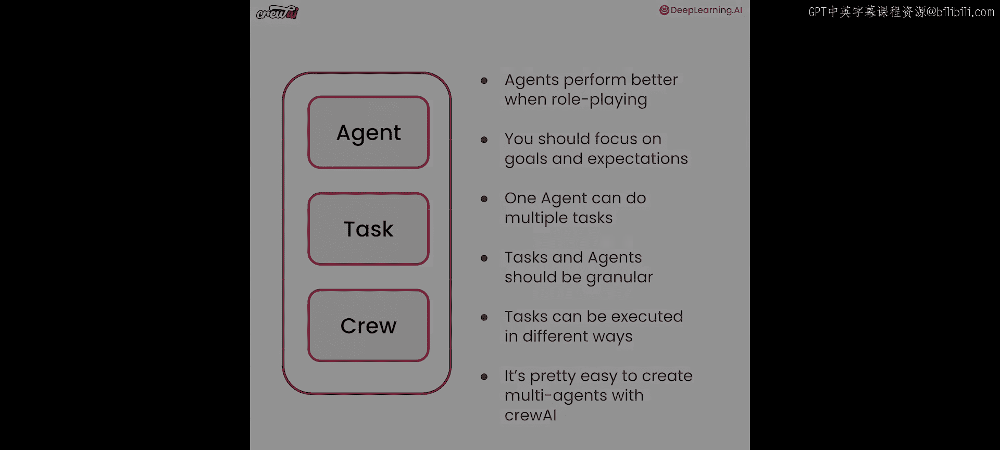

# 004：创建用于研究和撰写文章的智能体



## 概述


在本节课中，我们将动手实践，构建第一个多智能体系统。我们将创建一个能够进行研究和撰写文章的“团队”。你将看到智能体如何协同工作，以及如何创建具有真正协作价值的系统。

---

## 创建智能体

上一节我们介绍了智能体的基本概念，本节中我们来看看如何具体创建它们。智能体是构建多智能体系统的基石。

我们将为这个用例创建三个不同的智能体：一个**规划师**、一个**作家**和一个**编辑**。这三个智能体将共同帮助我们创作出优秀的技术文章。

创建智能体非常简单，基本上是实例化 `Agent` 类。创建实例时，有几个关键属性需要设置：`role`（角色）、`goal`（目标）和 `backstory`（背景故事）。

以下是创建规划师智能体的代码示例：

```python
from crewai import Agent

planner = Agent(
    role='内容规划师',
    goal='为给定主题规划引人入胜且内容准确的文章',
    backstory='你是一位经验丰富的内容策略师，擅长识别趋势并规划全面的内容大纲。',
    allow_delegation=False,
    verbose=True
)
```

*   **`role`**：定义了智能体的职能。这里我们设置为“内容规划师”。
*   **`goal`**：明确了智能体的具体目标。注意我们使用了变量 `{topic}` 进行插值，这允许我们在运行时动态指定主题。
*   **`backstory`**：为智能体赋予背景和上下文，这有助于其更好地进行角色扮演，从而提升表现。
*   **`allow_delegation`**：设置为 `False`，表示此智能体不能将工作委派给其他智能体。
*   **`verbose`**：设置为 `True`，以便在运行时查看其内部思考过程。

类似地，我们可以创建作家和编辑智能体：

```python
writer = Agent(
    role='技术作家',
    goal='基于研究撰写结构清晰、内容翔实的文章',
    backstory='你是一位才华横溢的作家，擅长将复杂的技术概念转化为通俗易懂的文字。',
    allow_delegation=False,
    verbose=True
)

editor = Agent(
    role='编辑',
    goal='审查和润色文章，确保其格式正确、质量上乘',
    backstory='你是一位一丝不苟的编辑，对语法、风格和内容连贯性有着敏锐的眼光。',
    allow_delegation=False,
    verbose=True
)
```

---

## 定义任务

有了智能体，我们需要为它们分配具体的工作，这就是任务。任务是指导智能体行动的具体指令。

创建任务同样直接，即实例化 `Task` 类。一个任务至少需要三个属性：`description`（描述）、`expected_output`（期望输出）和 `agent`（负责此任务的智能体）。

以下是规划师任务的创建示例：

```python
from crewai import Task

plan_task = Task(
    description='研究关于 {topic} 的最新趋势、关键参与者和重要新闻，并制定内容大纲。',
    expected_output='一份全面的内容计划，包含受众分析、SEO关键词和资源列表。',
    agent=planner
)
```

*   **`description`**：详细说明了你希望智能体执行什么操作。
*   **`expected_output`**：强制你思考并明确你希望从该任务中获得的具体成果。这有助于智能体更精准地工作。
*   **`agent`**：指定由哪个智能体来执行此任务。

接下来，我们为作家和编辑创建相应的任务：

```python
write_task = Task(
    description='基于 {topic} 的研究和大纲，撰写一篇完整的博客文章。',
    expected_output='一篇用 Markdown 格式撰写的博客文章，包含多个章节，每个章节包含2-3个段落。',
    agent=writer
)

edit_task = Task(
    description='审查并润色已完成的博客文章，确保其质量、格式和风格符合要求。',
    expected_output='经过校对和格式化的最终版博客文章。',
    agent=editor
)
```

---

## 组建团队并执行

现在，我们有了智能体和任务，需要一种方式将它们组织起来协同工作。这就是 `Crew`（团队）的作用。`Crew` 将智能体和任务组合成一个可以协同运作的整体。

以下是创建团队的代码：

```python
from crewai import Crew

crew = Crew(
    agents=[planner, writer, editor],
    tasks=[plan_task, write_task, edit_task],
    verbose=2
)
```

*   **`agents`**：一个包含所有智能体的列表。
*   **`tasks`**：一个包含所有任务的列表。**任务的顺序很重要**，因为默认情况下，任务会按列表顺序**顺序执行**。前一个任务的输出会成为后一个任务的输入的一部分。
*   **`verbose`**：设置日志详细程度。`verbose=2` 会显示最详细的日志，让你能看到幕后发生的一切。



如何让这个多智能体系统运行起来呢？非常简单，使用团队的 `kickoff` 方法。



```python
result = crew.kickoff(inputs={'topic': '人工智能'})
```

*   **`kickoff()`**：启动整个工作流程。
*   **`inputs`**：传入一个字典，其中包含你在智能体和任务中插值的所有变量。在这里，我们用“人工智能”替换了所有 `{topic}` 占位符。

执行 `kickoff()` 后，你将看到日志输出：规划师开始研究并制定大纲，作家根据大纲撰写文章，最后编辑进行审查和润色。

运行完成后，你可以获取结果并查看生成的文章：

```python
print(result)
```

---

## 总结

本节课中我们一起学习了如何使用 crewAI 构建一个基本的多智能体系统。我们完成了以下步骤：

1.  **创建智能体**：定义了具有特定角色、目标和背景的规划师、作家和编辑。
2.  **定义任务**：为每个智能体分配了具体、目标明确的工作。
3.  **组建团队**：将智能体和任务组合成一个 `Crew`。
4.  **执行工作流**：通过 `crew.kickoff()` 启动系统，并传入动态参数。

我们还了解到几个关键点：
*   角色扮演能提升智能体表现。
*   明确的目标和期望输出对任务和智能体至关重要。
*   任务可以顺序执行（默认），未来我们还将学习如何控制并行或更复杂的执行顺序。





恭喜你完成了第一个多智能体系统的构建！crewAI 的官方文档就是由类似的智能体团队撰写的，这展示了多智能体系统在实际工程工作中的强大潜力。