# 005：AI智能体的五大核心要素 🧠

在本节课中，我们将深入探讨构成一个优秀AI智能体的核心要素。理解这些要素不仅能帮助我们构建多智能体系统，更能让我们明白如何优化它们，使其表现卓越。

---

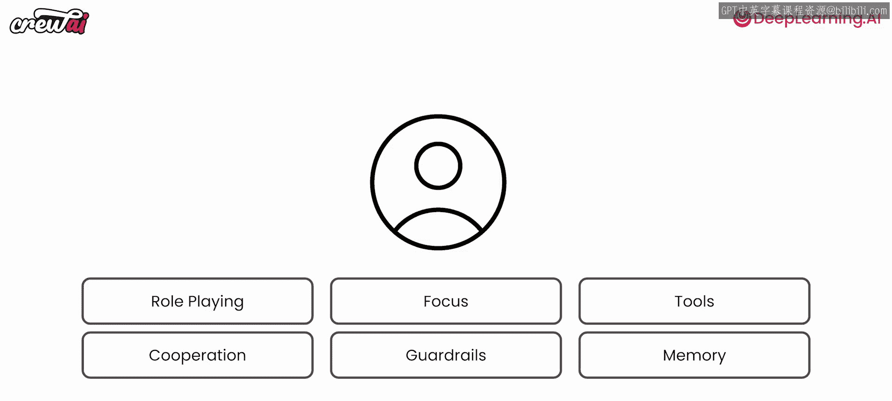

## 角色扮演 🎭

上一节我们介绍了构建多智能体系统的基础，本节中我们来看看第一个核心要素：角色扮演。角色扮演能极大地影响智能体给出的回答。让智能体“扮演”特定角色或承担特定功能，会直接决定你获得答案的类型和质量。

以下是一个简单的聊天场景示例，展示了角色扮演的作用。在更复杂的多智能体系统中，这种影响会更加显著。

*   我首先让ChatGPT分析特斯拉（TSLA）的股票。
*   然后，我让同一个ChatGPT再次分析特斯拉股票，但这次我为其设定了上下文，要求它“扮演”一名FINRA（美国金融业监管局）认证的金融分析师。

以下是两次回答的差异：
*   **第一次回答**：主要提及制造商，泛泛谈论财务表现。
*   **第二次回答**：则深入探讨了纳斯达克、TSLA股票本身以及电动汽车制造市场。在整个回答中（此处省略具体内容），角色扮演的影响清晰可见。

这只是一个微小的例子，并非评判优劣，但为你智能体设定的**角色**和**上下文**，确实会影响其响应方式。

我的建议是：在创建智能体时，请务必注意为其设定**恰当的角色、目标和背景故事**，因为它们将直接影响你获得的结果类型。

但请允许我稍作停顿，强调一点：在我们的上下文设定中，我们本可以只说“这个聊天机器人是一名金融分析师”。但通过选择“FINRA认证”这个关键词，我们是在引导大语言模型给出特定类型的答案。因此，谨慎地选择角色、目标、背景故事以及其中的**关键词**，能帮助你获得更好的结果。实际上，全球使用CrewAI的客户和用户都在应用类似的概念，以从其多智能体系统中获得更优结果。因此，在设定角色、目标和背景故事时，请务必使用那些能真正帮助你、带来更好结果的**关键词**。

---

## 专注度 🔍

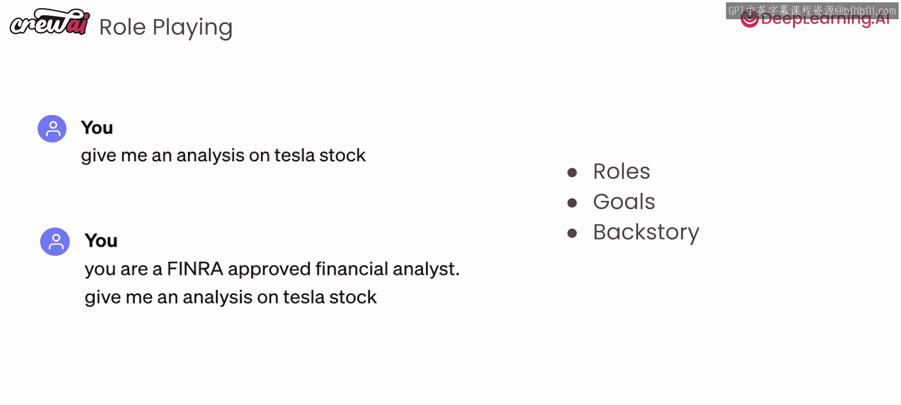

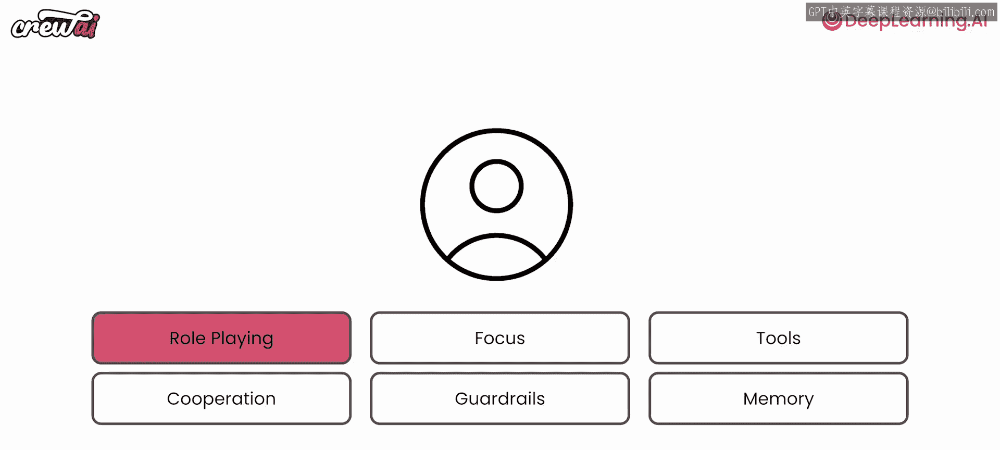

我们讨论了角色扮演，现在来谈谈专注度。专注度是另一个重要因素。

我指的不只是上下文窗口的长度。我们知道如今大语言模型的上下文窗口越来越长，你可以利用这一点来生成精彩内容或导入大量信息。但许多研究清楚地表明，如果你混杂了太多东西——无论是过多工具、过多信息还是过多上下文——你的模型都可能丢失重要信息，并增加产生幻觉（即生成不准确或无意义内容）的机会。

因此，使智能体优秀的另一个要素是它们的**专注能力**。我指的是：专注于它们所拥有的工具数量、专注于它们接收到的内容量，同时也专注于它们实际要达成的目标。你不应依赖一个智能体完成所有事情，而应让多个各司其职的智能体协同工作，效果更佳。在业界，我们看到使用CrewAI的用户，在多个不同垂直领域，使用多个智能体相比使用单一智能体，都获得了更好的结果。

---

## 工具选择 🛠️

我们知道智能体在角色扮演和专注时表现更好，那么工具呢？这是另一个常见问题。人们倾向于给智能体提供大量工具，但这可能导致混乱。给智能体加载过多工具会使其难以选择，可能最终没有使用本该使用的工具。如果你使用较小的模型，问题可能更严重，因为这些模型通常能力较弱，更难以区分工具、上下文和目标。

因此，我们给所有使用CrewAI的用户的一条经验法则是：**谨慎选择你提供给智能体的工具**。你需要确保只提供它们完成工作所需的**关键工具**，就像你雇佣某人或组建团队时一样。

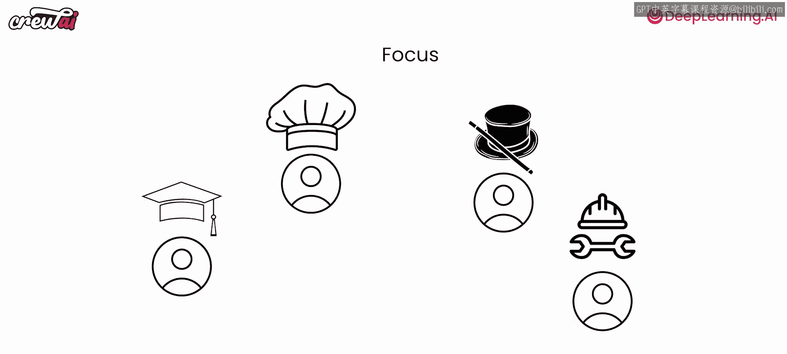

---

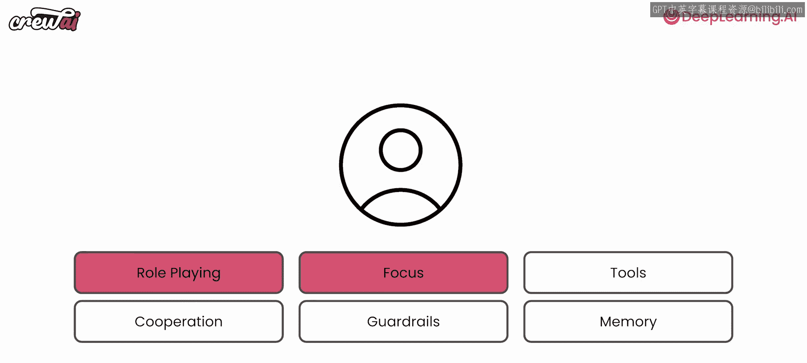

## 协作能力 🤝

我们已经知道，智能体擅长角色扮演、保持专注和使用工具。现在来谈谈协作能力，因为这也是对智能体产生巨大影响的另一个要素。协作和相互激发想法的能力，对于产生更好的结果至关重要。

这就像你与ChatGPT对话一样：进行对话并给予反馈的过程，有助于产生更好的结果。这些已经具备角色扮演能力的智能体，能够相互交谈并模拟这种聊天行为，从而产生更好的结果。它们可以相互获取反馈、相互委派任务，并由此产生更好的成果。

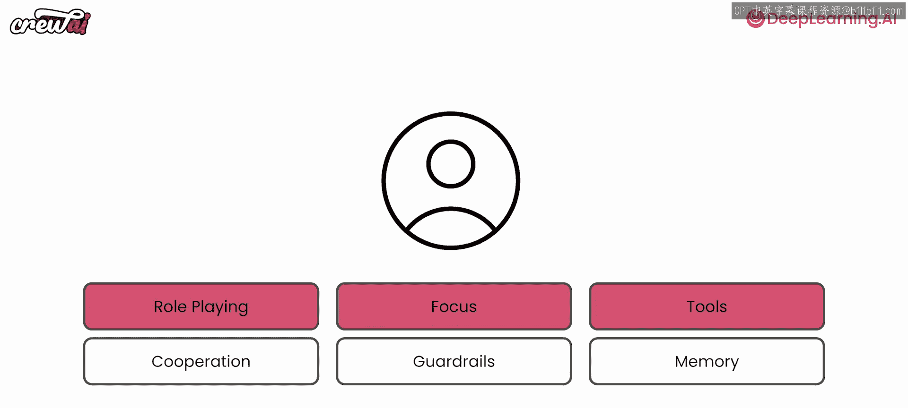

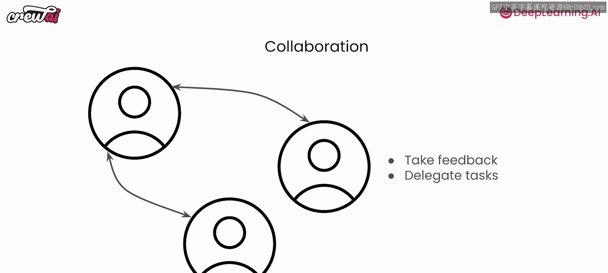

因此，无论你使用CrewAI还是其他任何框架，都需要确保你的智能体被设置为能够相互协作。

---

## 安全护栏 ⛑

下一个要素是安全护栏，这非常重要。请记住，我们现在讨论的是AI应用。我们过去讨论过，AI应用意味着模糊的输入、模糊的转换和模糊的输出。这意味着你不一定能得到强类型的结果，但这没关系，因为这是应用的一部分。然而，这并不意味着你希望出现幻觉，或者希望你的智能体陷入随机循环、重复使用相同工具，或花费过长时间才给出答案。

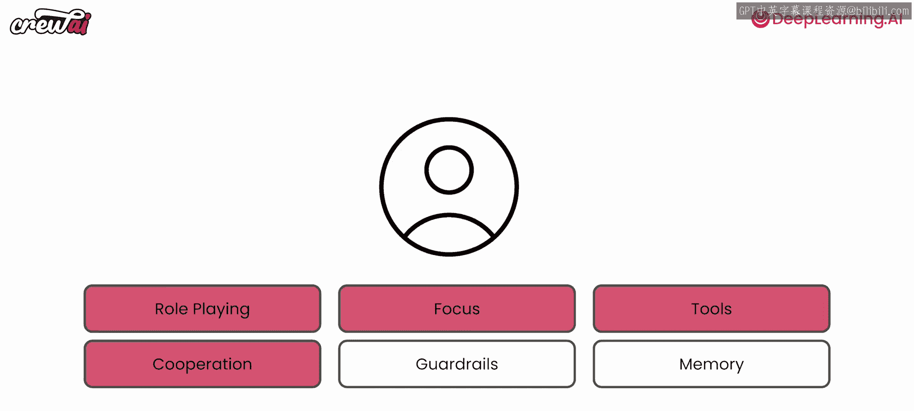

这实际上是我们早期CrewAI版本中遇到过的问题，智能体会卡住，反复尝试使用同一个工具，尤其是在使用开源小模型时。但通过多次迭代，我们修复了这个问题。我们实施了一系列**安全护栏**，以防止你的智能体偏离轨道，并引导它们回到正轨。其中大部分是在框架层面实现的。所以，请务必检查你使用的任何框架是否具备这些功能。我可以告诉你CrewAI有很多这样的护栏，但这也是你在构建自定义解决方案时需要考虑的事情，我们将在本课程后面讨论。这些安全护栏将确保防止幻觉，并确保你在整个多智能体系统中获得可靠且一致的结果。

---

## 记忆能力 🧠

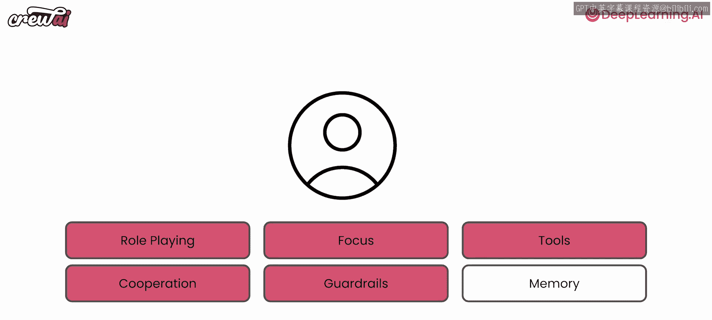

现在，还有最后一件事要讨论：**记忆**。记忆能力对你的智能体可以产生巨大的、不可估量的影响。可以说，它可能比其他所有要素加起来的影响还要大。

记忆是你的智能体**记住它做过什么**的能力，不仅如此，还能利用这些信息来指导新的决策和执行。回忆过去的行为、从中学习并将这些知识应用于未来的能力，至关重要。

一些框架会提供不同类型的内存及其实现。以CrewAI为例，因为我们使用了这些功能，你的智能体将免费获得三种类型的内存：**长期记忆**、**短期记忆**和**实体记忆**。

以下是不同类型记忆的说明：
*   **短期记忆**：这种记忆仅在智能体群组执行期间存在。每次你运行一个智能体群组并启动它时，它都从空白开始。这种记忆很有用，因为当不同的智能体尝试完成不同的任务时，它们会将自己学到的东西存储在这个记忆中。这个记忆在所有智能体之间共享，这意味着智能体二号或三号可以利用智能体一号的学习成果。因此，短期记忆有助于在执行期间共享上下文，从而获得更好的结果。
*   **长期记忆**：顾名思义，长期记忆在智能体群组执行结束后依然存在。这种记忆存储在本地数据库中，允许你的智能体从先前的执行中学习。每次你的智能体完成任务时，它都会自我反思，思考哪些地方可以做得更好，或者缺少哪些东西，并存储这些信息。这样，当它再次运行时，就可以利用这些知识来产生更好、更可靠的结果。
*   **实体记忆**：实体记忆也在这里发挥作用，它同样是短期存在的，仅在执行期间需要。它存储正在讨论的主题。例如，如果你的智能体正在学习关于某家公司的信息，它可能会将该公司作为一个实体及其理解存储在这个数据库中。

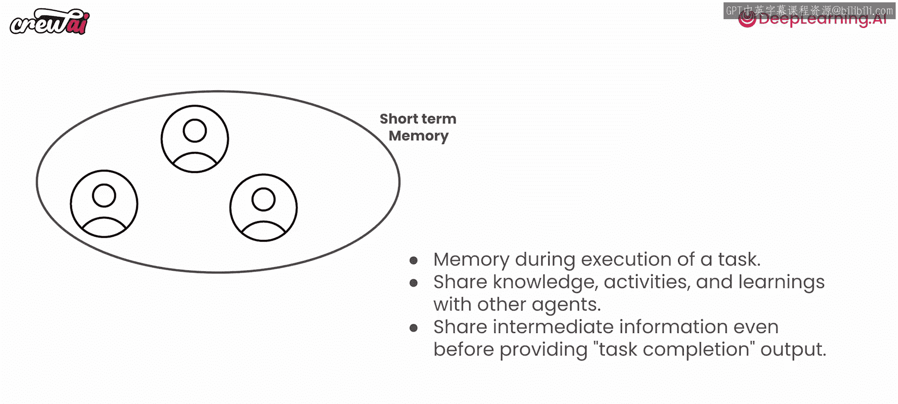

因此，实体记忆、短期记忆和长期记忆共同作用，帮助我们的智能体获得更可靠的结果。如果你的智能体没有记忆，每次运行时你可能会得到略有不同的结果。但正因为它们有记忆，你不仅能获得更可靠的结果，还能获得越来越好的结果，因为它们能从错误中学习。

---

## 总结 📝

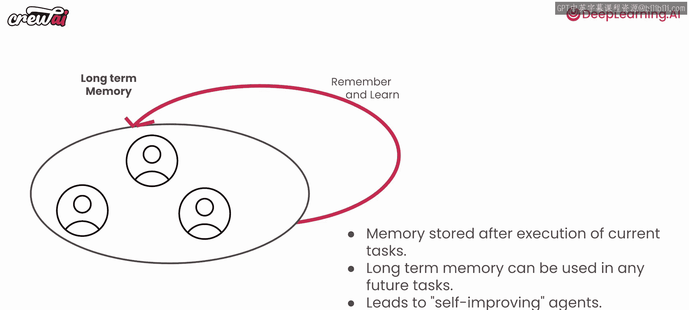

本节课中，我们一起学习了构成优秀AI智能体的六大核心要素：
1.  **角色扮演**：通过设定恰当的角色、目标和背景故事（含关键词）来引导智能体。
2.  **专注度**：避免信息过载，让智能体专注于有限工具、内容和明确目标，多智能体分工协作效果更佳。
3.  **工具选择**：仅提供完成工作所必需的**关键工具**，避免工具过多导致混乱。
4.  **协作能力**：智能体之间相互交流、反馈和委派任务，能显著提升输出质量。
5.  **安全护栏**：在框架或应用层面实施防护措施，防止幻觉、循环等异常行为，确保系统可靠。
6.  **记忆能力**：包括短期记忆（执行中共享上下文）、长期记忆（跨执行学习改进）和实体记忆（存储讨论主题），使智能体能够积累经验，输出更一致、更优质的结果。

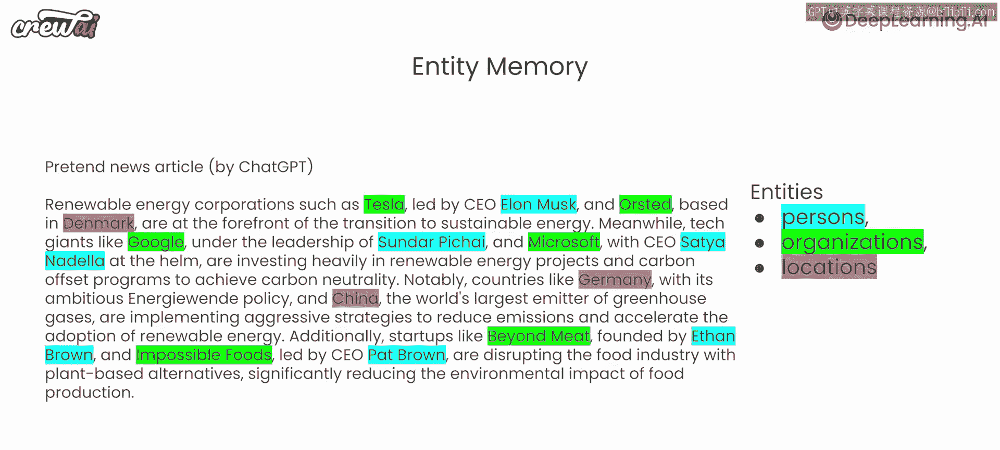

理解并应用这些要素，是构建高效、可靠多智能体系统的关键。