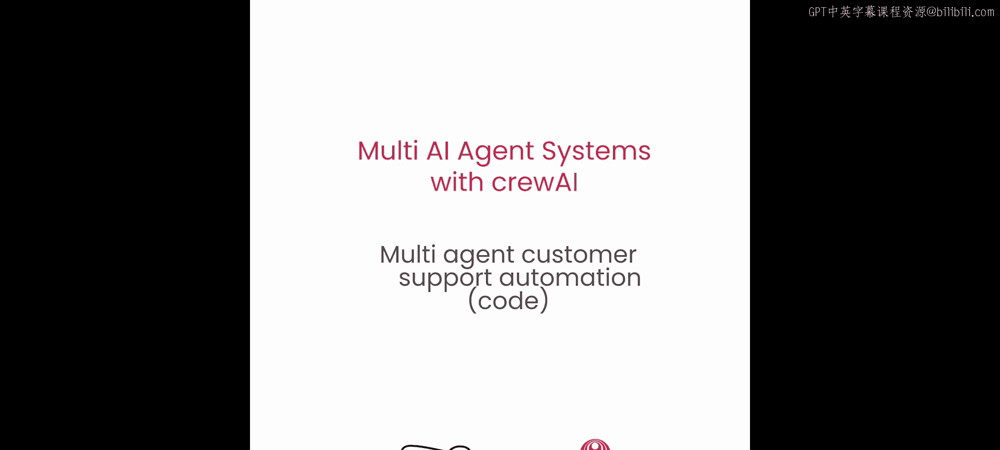
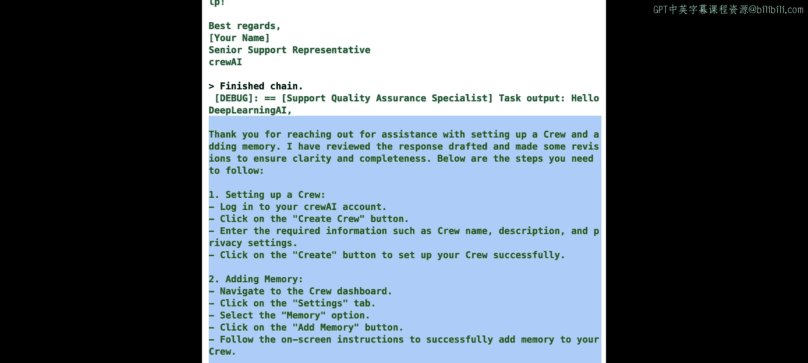
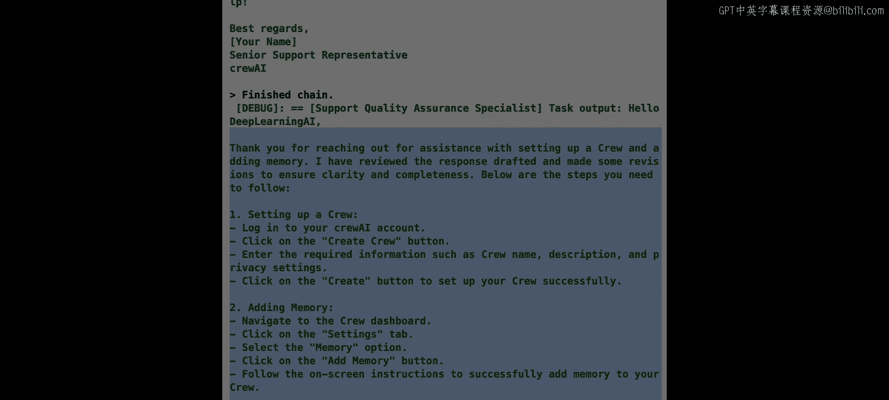

# 006：多智能体客户支持自动化 🤖



在本节课中，我们将学习如何使用多智能体系统来实现客户支持自动化。这是一个与之前不同的应用场景，但非常有趣且实用。我们将看到如何构建协作的智能体来高效、准确地处理客户咨询。


---

## 概述

到目前为止，我们已经了解了智能体的基本构建方式及其协作潜力。本节我们将扩展这些知识，探索一个具体的应用案例：客户支持自动化。我们将构建一个由两个智能体组成的系统，一个负责处理客户咨询，另一个负责质量保证，共同为“DeepLearning.AI”的“Andrew”提供关于设置 crewAI 和使用内存的帮助。

---

## 代码准备与导入

首先，我们进行一些基础设置，导入必要的组件并配置环境。

```python
# 导入必要的类
from crewai import Agent, Task, Crew

# 设置使用的语言模型环境变量（例如 GPT-3.5 Turbo）
import os
os.environ["OPENAI_API_KEY"] = "your_api_key_here"
os.environ["OPENAI_MODEL_NAME"] = "gpt-3.5-turbo"
```

---

## 创建智能体：角色扮演与协作

上一节我们介绍了智能体的核心概念，本节中我们来看看如何将这些概念应用到具体角色中。智能体的表现受到角色扮演、专注领域、协作方式、工具、安全护栏和记忆的影响。

以下是我们要创建的两个智能体：

**1. 支持专员智能体**
这个智能体扮演高级客服代表的角色，目标是提供友好且有用的帮助。

```python
support_agent = Agent(
    role='高级支持代表',
    goal='提供超级友好和有用的客户支持',
    backstory='你在 crewAI 工作，正在帮助一位特定客户解决关于产品的问题。',
    allow_delegation=False  # 此智能体不允许委派工作
)
```

**2. 支持质量保证智能体**
这个智能体负责检查支持专员的回答，确保其准确性和高质量。

```python
qa_agent = Agent(
    role='支持质量保证专员',
    goal='通过事实核查确保提供给客户的回答是最佳响应',
    backstory='你负责审查支持代表的回答，确保信息准确、完整且友好。',
    allow_delegation=True  # 此智能体可以委派工作
)
```

**关于协作与委派的说明**
你可能会好奇，智能体何时会决定将工作委派给另一个智能体或向其提问。这与传统编程不同，AI应用具有“模糊”的特性——输入、处理和输出并非一成不变。我们依赖大语言模型的认知能力，让它根据具体的客户咨询内容，自主做出合理的判断。例如，对于复杂查询，它可能决定委派以进行更多研究；对于简单问题，则可能直接回答。赋予智能体委派和提问的权限，并不意味着它每次都会这样做，而是给了它在需要时选择协作的选项。这是一种实现高质量协作的常见模式。

---

## 为智能体配备工具

为了让智能体能提供有意义的回答，我们需要为它们提供合适的工具。crewAI 提供了一个工具包，包含从简单到复杂的各种工具。

以下是本案例中我们将使用的工具：

```python
# 导入 crewAI 工具
from crewai_tools import SerperDevTool, ScrapeWebsiteTool, WebsiteSearchTool

# 创建工具实例
# 1. 网络搜索工具
search_tool = SerperDevTool()
# 2. 通用网页抓取工具
scrape_tool = ScrapeWebsiteTool()
# 3. 针对特定文档的抓取工具（限制只能抓取指定URL）
docs_scrape_tool = ScrapeWebsiteTool(website_url='https://docs.crewai.com')
```

**工具使用策略**
你可以将工具分配给智能体或任务，这有不同的含义：
*   **智能体级工具**：智能体在其所有任务中都可以使用这些工具。
*   **任务级工具**：智能体仅在执行该特定任务时才能使用这些工具。
**任务级工具会覆盖智能体级工具**。这意味着，即使一个智能体拥有10个工具，如果当前任务只指定了3个，那么它在该任务中就只能使用这3个。

---

## 定义任务与流程

现在我们来定义智能体需要执行的具体任务。每个任务都有明确的描述、期望输出和可用的工具。

**1. 查询解决任务**
这是支持专员的主要任务，用于直接解决客户咨询。

```python
inquiry_resolution_task = Task(
    description="""
    {customer} 的 {person} 提出了一个非常重要的请求。
    咨询内容：{inquiry}
    请运用你所知的一切，提供最好的支持。你必须努力提供一个完整的答案。
    """,
    expected_output='一份完整、准确、友好的回答，直接解决客户的咨询。',
    tools=[docs_scrape_tool],  # 此任务只能使用文档抓取工具
    agent=support_agent
)
```

**2. 质量保证审查任务**
这是QA智能体的任务，用于审查支持专员的回答。

```python
qa_review_task = Task(
    description="""
    审查支持专员对客户咨询的回复。
    确保回复准确、全面、友好，并且完全解决了客户的问题。
    如果发现任何问题，请提供修改建议或直接委派给支持专员进行修正。
    """,
    expected_output='一份经过核查和优化的最终客户回复，或明确的修改指示。',
    tools=[],  # QA任务通常不需要外部工具，专注于审查内容
    agent=qa_agent
)
```

---

## 组建团队并启用记忆

我们将两个智能体和两个任务组合成一个“团队”（Crew），并启用记忆功能。

```python
# 创建团队
support_crew = Crew(
    agents=[support_agent, qa_agent],
    tasks=[inquiry_resolution_task, qa_review_task],
    memory=True  # 启用记忆功能，包括短期、长期和实体记忆
)
```

启用记忆非常简单，只需设置 `memory=True`。crewAI 会自动处理短期、长期和实体记忆，无需额外配置。

---

## 执行任务并查看结果

最后，我们为任务中预留的变量（通过花括号 `{}` 表示）提供具体输入，并执行团队任务。

```python
# 提供具体输入并执行任务
result = support_crew.kickoff(inputs={
    'customer': 'DeepLearning.AI',
    'person': 'Andrew',
    'inquiry': '我需要帮助设置一个 crew 并启动它。同时，请确保它使用了内存功能。你能提供一些指导并帮助 Andrew 吗？'
})

# 打印最终结果
print(result)
```

**执行过程解析**
1.  **支持专员启动**：它读取任务，理解到需要帮助 Andrew 设置带内存的 crew。
2.  **使用工具**：它调用 `docs_scrape_tool` 访问指定的 crewAI 文档 URL，学习如何创建智能体、组建团队和启用内存。
3.  **生成初步回答**：它起草了一份包含安装步骤、代码示例的友好回复。
4.  **QA专员介入**：QA智能体审查这份回复。它可能觉得某些部分不够清晰或完整，于是将工作**委派**回支持专员，要求修订。
5.  **迭代改进**：支持专员根据反馈修改回答，使其更直接、更清晰。QA专员可能再次提问确认，确保没有遗漏。
6.  **生成最终答案**：经过几轮协作，QA专员汇总出一个最终版本，确认步骤清晰完整，然后输出。

通过这个过程，我们创建了一个能够**协作**（通过委派和提问）、**利用记忆**（跟踪对话上下文）并深入**角色扮演**的智能体系统，生动演示了理论概念的实际应用。

---

## 总结





本节课中，我们一起学习了如何构建一个用于客户支持自动化的多智能体系统。我们创建了具有特定角色（支持专员、QA专员）的智能体，为它们分配合适的工具，并通过任务定义工作流程。关键点在于利用智能体间的**协作**（允许QA专员委派工作）和**记忆**功能来提升回答质量。这个模式——使用一个主智能体和一个负责最终质量检查的QA智能体——是构建高效、可靠多智能体系统的常见且有效的方法。你可以将此模式扩展到其他需要高质量输出的场景中，如内容创作、数据分析等。