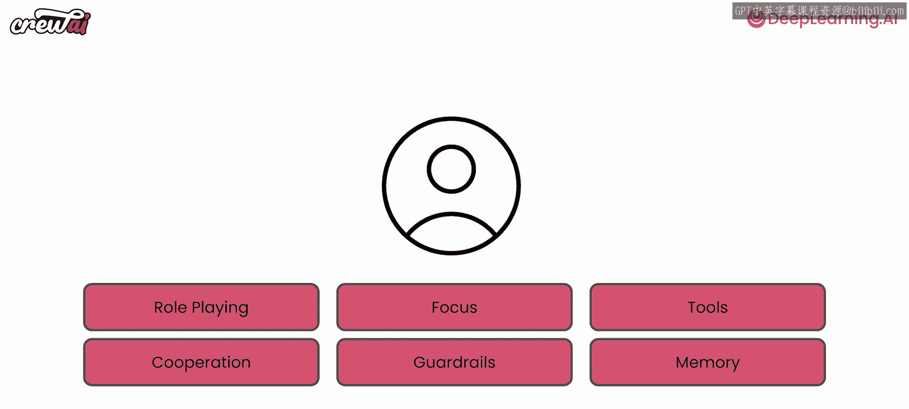
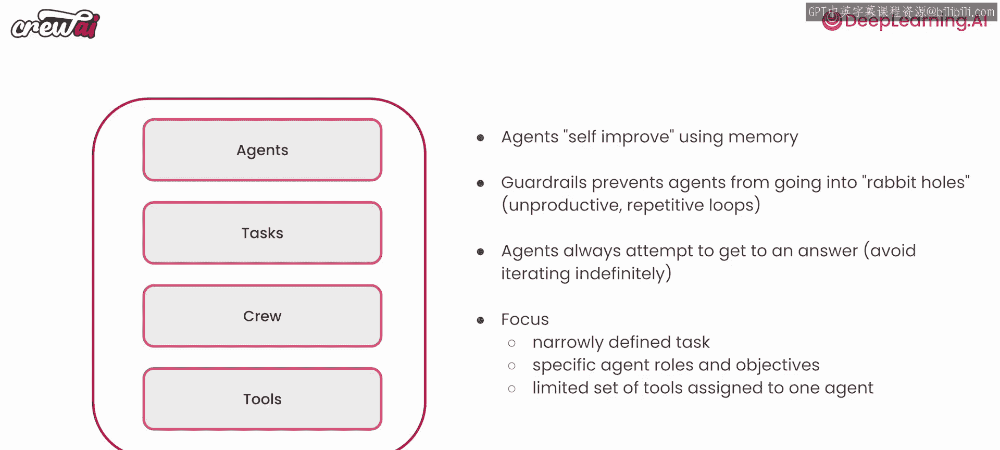

# 007：创建代理的心智框架 🧠

在本节课中，我们将学习一个用于创建高效人工智能代理的心智框架。这个框架的核心思想是**像管理者一样思考**，通过明确目标、规划流程和定义角色来构建强大的多代理系统。

---

上一节我们探讨了代理的基本概念，本节中我们来看看如何系统地设计和创建它们。

我想分享一个创建代理的心智框架。这个框架非常有帮助。目前我们组装的代理工作得很好。但当你决定组装其他代理和其他多代理系统时，如何确保你创建的是最优的代理？因此，我有一个心智框架想分享，我认为这对你非常有帮助。

这个框架就是诚实地**像管理者一样思考**。成为一名优秀的管理者与能够创建出色的多代理系统之间存在高度相关性。因为管理者习惯于思考**目标**和**流程**。因此，每当你创建多个代理、团队或多代理系统时，你应该思考你试图完成的**确切目标**，以及你希望它们遵循的**流程**。

如果你这样思考，你就会开始考虑：**我需要雇佣什么样的人来完成这项工作？** 这是你需要问自己的问题。如果我必须雇佣人来完成这个任务，我会雇佣什么样的人？一旦你得到答案，你就会知道需要什么样的代理。更重要的是，你会确切地知道它们的**角色**、**背景故事**和**目标**应该是什么，因为你知道你希望由谁来处理这些事情。

---

让我们讨论一些例子。以下是一些不一定是最佳的例子。例如，如果你想创建一个与人力资源相关的用例，你不一定只需要一个“研究员”，你需要一个“人力资源专家”。这个原则适用于我们将在整个课程中看到的所有例子。

因此，更好的例子应该是：
*   **人力资源研究专员**，而不仅仅是“研究员”。
*   **资深文案**，而不仅仅是“写手”。
*   **投资分析师**，而不仅仅是“财务分析师”。

我建议你认真思考：**关键词是什么？你实际会雇佣什么样的人来做这件事？** 一旦你心中有了这些人选，就思考他们的**目标**、**角色**和**背景故事**是什么。这些就是你想要构建的代理。

在使用CrewAI的社区中，我们注意到获得最佳结果的人正是以这种方式思考代理的人。他们思考的是：**我会雇佣什么样的人来为我做这项工作？**

---

好的，让我们快速回顾一下本节课学到的所有内容。

首先，我们了解到，如果具备以下几个要素，代理会表现得更好：
*   它们在进行**角色扮演**。
*   它们有**专注点**。
*   它们拥有**合适的工具**。
*   它们被允许**协作**。
*   它们有一些**防护栏**（约束）。
*   它们还能利用**记忆**。

我们还学到了一些其他内容：
*   代理能够通过使用**记忆**来自我改进。
*   CrewAI通过确保以正确方式引导代理，防止它们陷入“兔子洞”（偏离主题或陷入死循环）。
*   代理总是试图为你提供一个答案。
*   **较小的任务**和**专注的代理**比**较大的任务**和**手头工作过多的代理**表现更好。专注的工具在其中也扮演着重要角色。

我们接下来将讨论工具。

---

本节课与你一起探讨这些内容非常棒。希望你和我一样享受这个过程。请继续关注下一课，将会非常有趣，我们将开始讨论**工具**。猜猜怎么着？**工具**正是解锁许多有趣用例的关键。我们下节课见！