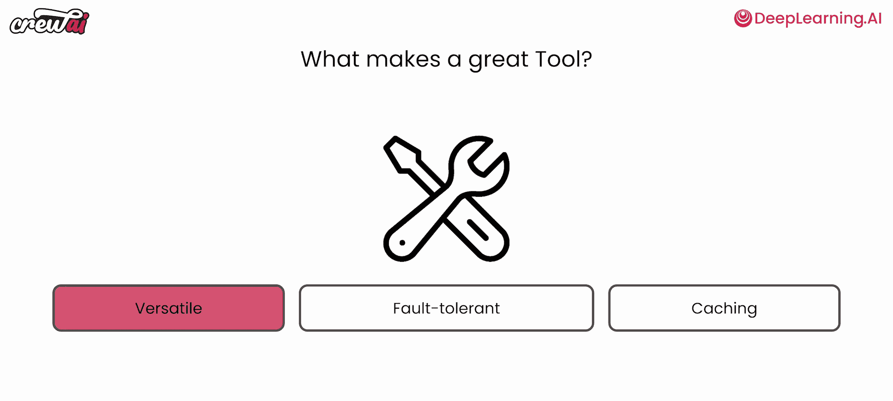
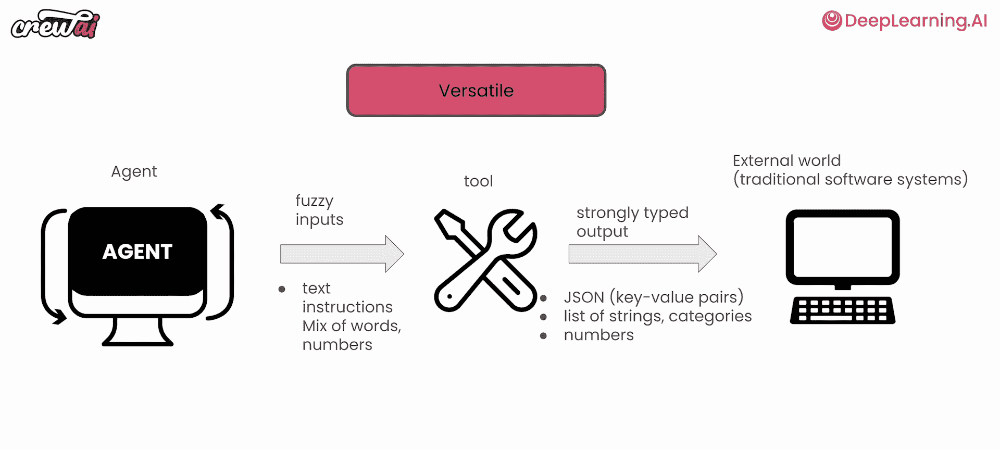
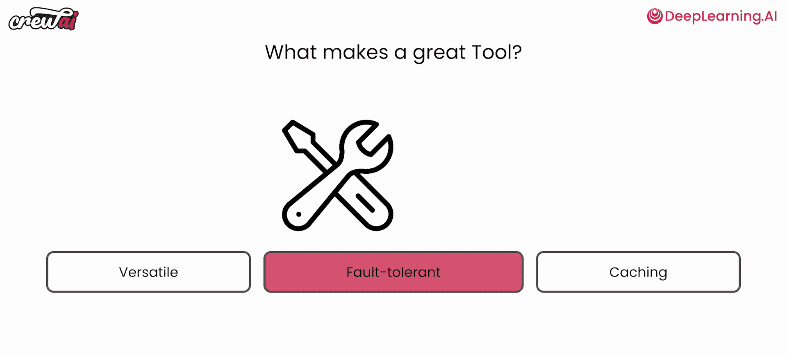
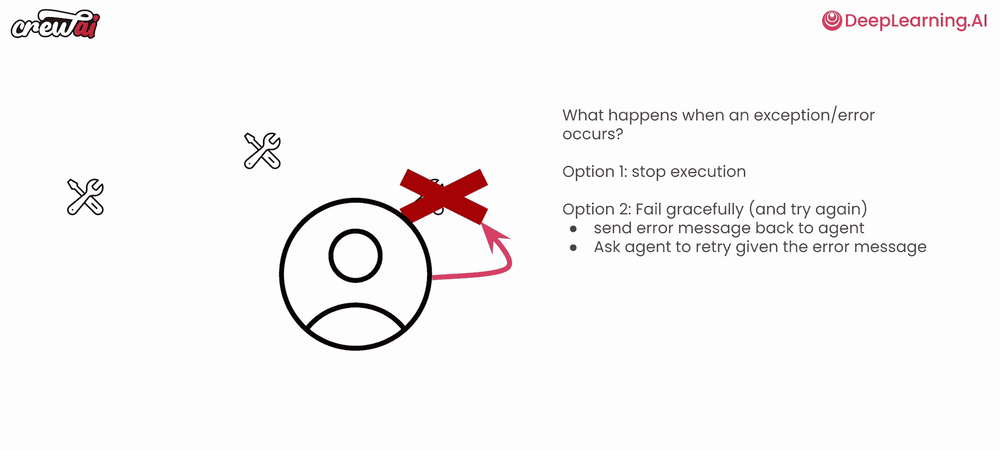
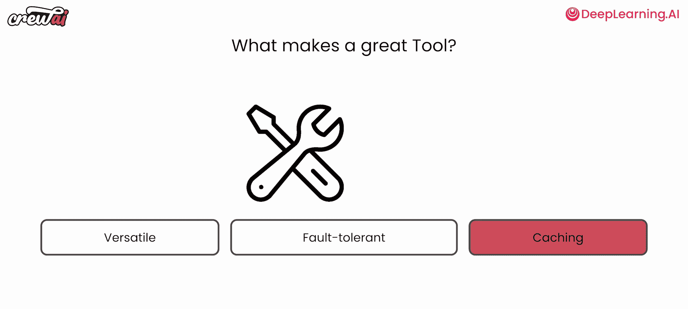
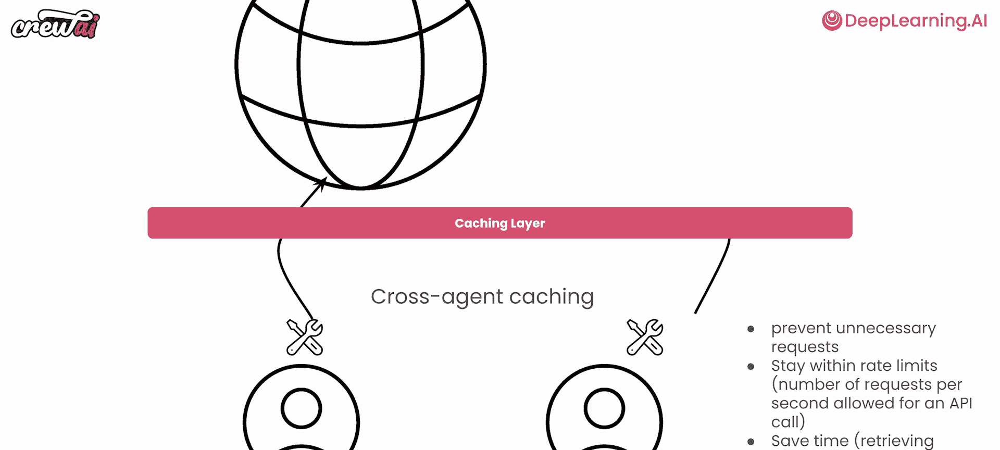
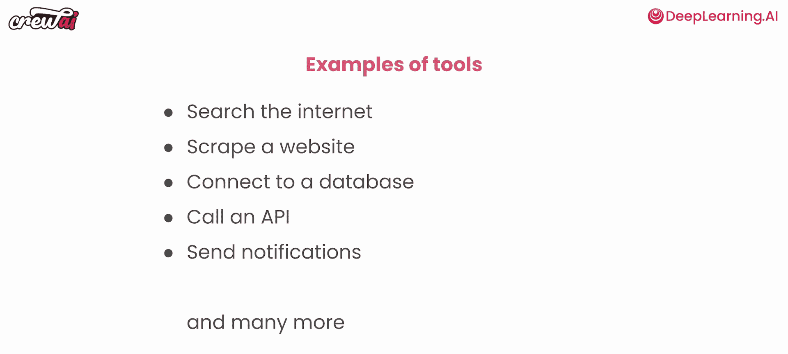
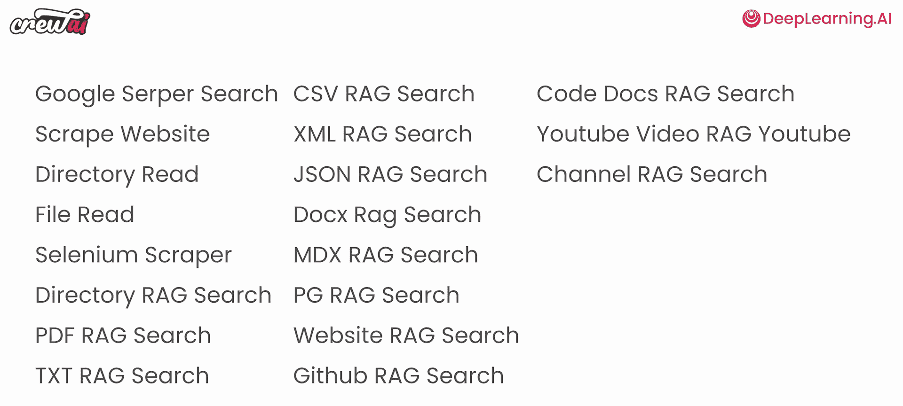

# 008：7. 智能体工具的核心要素 🔧

在本节课中，我们将学习如何为智能体配备“工具”，这是让智能体从内部对话走向外部世界、执行实际任务的关键。我们将重点探讨构成一个优秀工具的三个核心要素：多功能性、容错性和缓存机制。

上一节我们介绍了如何构建一个支持团队，本节中我们来看看如何通过工具赋予智能体更强的行动力。工具是连接AI智能体与外部系统（如数据库、API、互联网）的桥梁，使它们能够产生实际影响。

## 什么是优秀的工具？🤔

一个工具的好坏取决于几个关键特性。根据大量用户实践，我们发现至少有三个要素能区分工具的优劣。

以下是构成优秀工具的三个核心要素：

1.  **多功能性**
2.  **容错性**
3.  **缓存机制**

## 1. 多功能性 🛠️

首先，一个工具需要能够处理不同类型的输入。AI模型（如大型语言模型）的输出往往是模糊和非结构化的，而外部系统通常需要强类型的、格式明确的输入。

因此，工具的核心作用之一是充当“适配器”。它需要足够灵活，能够解析和理解AI智能体可能抛出的各种请求，并将其转换为外部系统能够处理的正确格式和类型。

**核心概念**：工具是模糊的AI输出与强类型的外部世界输入之间的桥梁。

在crewAI中，框架支持将参数自动转换为正确的类型。但如果你自己构建工具，必须确保它能妥善处理LLM可能发送的任何形式的信息。

## 2. 容错性 🛡️

其次，工具必须具备优雅处理错误的能力。在智能体与工具交互时，很多事情可能出错：参数缺失、格式错误、网络异常等。

如果工具遇到异常就简单抛出并停止执行，整个智能体团队的流程就会中断，这是不可接受的。因此，优秀的工具应该能够“优雅地失败”。

**核心概念**：工具不应因异常而终止智能体执行，而应能自我修复或将错误信息反馈给智能体，让其有机会调整输入或采取其他行动。

crewAI默认实现了这一机制。当工具执行出错时，不会停止流程，而是将错误信息返回给智能体，智能体可以据此决定下一步操作（例如，修正参数或尝试其他方法）。这在处理大量多样化数据（如金融文件分析）时尤为重要。

## 3. 缓存机制 ⚡

最后，缓存是确保工具高效、经济且可扩展的关键。工具经常需要调用网络API或访问外部服务，这些操作耗时且可能产生费用或触及速率限制。

缓存层可以防止不必要的重复请求。如果一个智能体（或不同智能体）使用相同的参数调用同一个工具，第二次调用应直接使用缓存的结果，而无需再次发起网络请求。

**核心概念**：智能缓存能避免重复的API调用，节省时间、成本和系统资源，并防止触发速率限制。

crewAI提供了跨智能体的缓存机制。这意味着，即使不同的智能体使用相同的工具和参数，系统也会利用缓存，从而显著提升多智能体系统的运行效率和速度。

## 工具示例与应用 🌐

工具的种类繁多，应用场景广泛。

以下是一些常见的工具类型：

*   **网络交互**：如互联网搜索、网页抓取。
*   **数据操作**：如连接并查询数据库。
*   **服务集成**：如调用外部或内部API。
*   **通知与通信**：如发送邮件、短信或应用通知。

工具是包括crewAI在内的所有多智能体框架的重要基石。

## 在crewAI中使用工具 📚

crewAI不仅将工具视为核心组件，还为用户提供了大量开箱即用的工具。

需要强调的是，crewAI完全兼容 **LangChain工具生态**。这意味着你可以直接使用LangChain社区提供的海量现有工具，快速增强你的智能体能力。

你可以查阅crewAI官方文档，了解所有内置工具以及如何集成LangChain工具。

## 总结 📝

本节课我们一起学习了构建优秀智能体工具的三大核心要素：
1.  **多功能性**：确保工具能灵活处理AI生成的各种输入，并正确适配外部系统。
2.  **容错性**：保证工具能优雅处理错误，避免中断智能体工作流，实现自我修复。
3.  **缓存机制**：通过智能缓存避免不必要的重复请求，提升效率、节省资源并保证系统稳定性。

掌握这些要素，你将能创建出强大、可靠且高效的智能体工具，从而构建出真正能解决实际问题的多智能体系统。