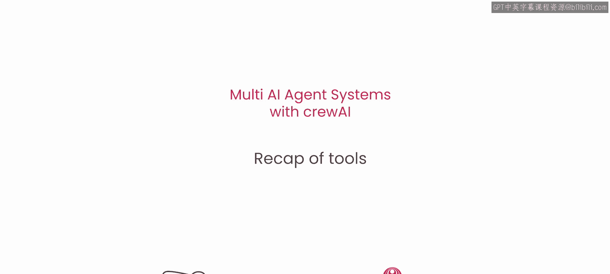
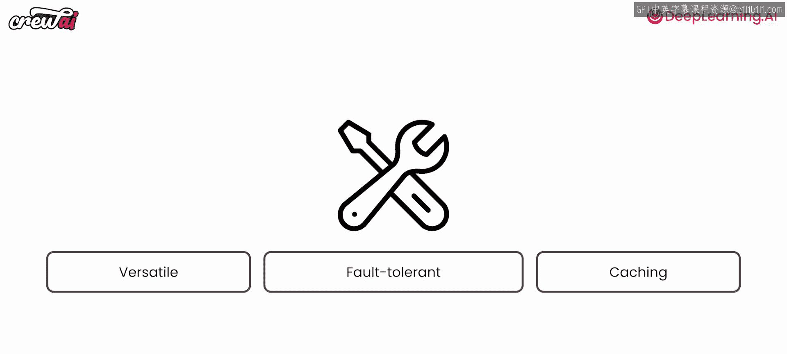

# 010：工具回顾

## 概述
在本节课中，我们将回顾工具（Tools）在智能代理系统中的核心作用。我们将理解工具如何作为代理与外部世界交互的桥梁，并探讨构建可靠工具系统所需的关键特性。

---

## 工具的核心作用
上一节我们介绍了代理的基本概念，本节中我们来看看工具为何如此关键。工具是代理的关键组成部分，因为它们允许你将代理连接到外部世界。

因此，你将查看工具并使用现有工具来调用API，以便与你的内部系统集成或执行某些计算。工具是一个**翻译层**，它允许你的代理与你可能已有的现有程序进行通信。

## 可靠工具系统的三大特性
为了让这些工具正常工作，你需要确保它们具备以下三个特性。以下是构建可靠工具时必须考虑的核心要素：

1.  **多功能性**：确保工具能够处理多种不同的任务和输入场景。
2.  **容错性**：确保工具在遇到意外输入或错误时能够优雅地处理，而不会导致整个系统崩溃。
3.  **缓存策略**：确保工具实施了有效的缓存机制，以提高性能并减少不必要的重复调用。

如果你确保在你使用的所有工具上都应用了这三个特性，那么你将拥有一个更可靠的系统。

## 工具的选择与来源
因此，在选择要使用的工具或构建自己的工具时，请务必注意这一点。

请再次记住，因为我们使用的是CrewAI，你不仅可以利用CrewAI本身提供的工具，还可以使用LangChain提供的所有工具。因此，你拥有一个庞大的工具库可以立即开始使用。

---

## 总结
本节课中我们一起学习了工具在智能代理系统中的重要性。我们明确了工具作为代理与外部系统交互的接口角色，并强调了构建可靠工具所需的三大特性：**多功能性**、**容错性**和**缓存策略**。最后，我们了解到CrewAI兼容庞大的现有工具生态，为开发提供了便利。

干得漂亮，请继续保持！你将会喜欢我们的下一课，因为我们将讨论更有趣的内容，这些内容将解锁更多的应用场景。我们下节课再见。