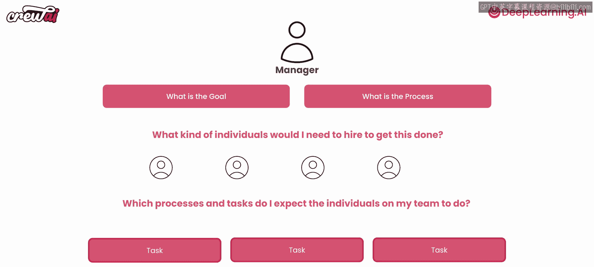
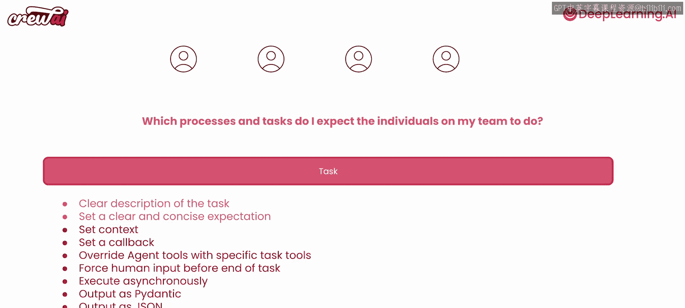

# 011：定义良好任务的10个关键要素

在本节课中，我们将学习如何为多智能体系统定义清晰、有效的任务。任务是指派给智能体的具体工作单元，是构建高效协作系统的基石。我们将探讨定义任务时需要考虑的关键要素，并通过一个活动策划的示例来加深理解。

## 概述：从管理者视角看任务

上一节我们构建了一个出色的智能体团队。现在，我们可以更进一步。在本节中，我们将构建一个能够帮助我们策划活动的多智能体系统，例如聚会或会议。这些智能体将协助我们寻找场地、安排餐饮等所有相关事宜。

让我们开始探索任务的定义。任务至关重要，因为智能体的核心就是执行任务。在多智能体系统中，任务同样是基石。

回想我们之前讨论过的“管理者类比”。我们曾将自己置于管理者的位置，思考为了完成一系列工作或达成目标，需要雇佣什么样的人（即定义智能体的角色、目标和背景故事）。现在，我们需要在这个类比之上，进一步思考如何分配任务。

当你雇佣某人，尤其是初级员工时，你会仔细思考如何将工作委派给他们。你需要确保明确告知他们需要做什么，以及期望的结果是什么。构建优秀智能体时，也应加入这种思维模式：在确定了需要雇佣的“人员”（智能体）后，思考你期望团队中的每个个体执行哪些流程和任务。

你可以利用这个思维来创建任务。创建任务时，至少需要牢记两件事：
1.  对任务本身的清晰描述。
2.  设定清晰、简洁的期望。

回到类比中：假设你刚雇佣了一名初级工程师。在指导他时，你会给他一个具体的任务，非常清晰地解释这个任务，并确保说明你期望他完成什么。CrewAI框架强制你进行这样的思考，因为它要求你为创建的每个任务至少设置两个属性：**描述**和**期望输出**。这有助于构建更好的内部提示，同样也适用于其他框架。如果你在解释任务和期望方面多下功夫，通常会得到更好的结果。

除此之外，你还可以为任务设置许多其他参数。CrewAI提供了许多可用的超参数，例如设置上下文、设置回调函数、用特定任务工具覆盖智能体的工具、强制要求人工输入（确保智能体在完成工作前暂停并询问你的意见，以便你提供进一步指示）等。我们还可以讨论异步执行任务、将结果输出为Pydantic对象或JSON对象，甚至输出为文件，或者并行执行任务。

由此可见，在定义任务时有许多选项。根据多智能体系统的复杂程度，你需要综合考虑所有这些因素。CrewAI提供了所有这些选项，你在其他框架中也会发现许多类似功能（可能不是全部，形式也可能不同）。归根结底，这一切都是为了如何为你的智能体成功、高效地执行任务做好准备。

接下来，让我们快速看一下代码示例。

## 定义良好任务的10个关键要素

以下是创建一个定义明确、可执行的任务时需要考虑的10个关键要素。

1.  **清晰的任务描述**
    用简洁的语言准确说明智能体需要做什么。避免模糊的表述。

2.  **明确的期望输出**
    具体说明任务完成后应该交付什么。例如，是“一份场地清单”还是“一个包含三个选项的详细报告”。

3.  **上下文设置**
    为任务提供必要的背景信息，帮助智能体理解其在整体工作流程中的位置和作用。

4.  **工具与资源**
    明确指定执行此任务可用的工具（如搜索引擎API、文件读写）或资源（如访问特定数据库）。

5.  **异步执行能力**
    对于独立性强、不依赖其他任务结果的工作，可以设置为异步执行以提高系统整体效率。

6.  **输出格式规范**
    定义任务结果的输出格式，例如JSON对象、Pydantic模型实例或特定格式的文件，便于后续处理。

7.  **人工审核节点**
    在关键任务节点设置“强制人工输入”，让智能体在继续前等待人类确认或提供额外指导。

8.  **回调函数**
    设置任务完成或状态更新时触发的回调函数，用于记录日志、更新状态或触发下游任务。

9.  **依赖关系管理**
    明确任务之间的先后顺序和依赖关系，确保工作流按正确的逻辑顺序执行。

10. **并行执行优化**
    识别可以同时执行的任务，通过并行处理来缩短整体流程的运行时间。

## 总结

本节课中，我们一起学习了如何为多智能体系统定义良好的任务。我们从“管理者类比”出发，理解了清晰描述和明确期望输出的重要性。随后，我们详细探讨了定义任务时需要考虑的十个关键要素，包括描述、输出、上下文、工具、异步执行、输出格式、人工审核、回调、依赖关系和并行优化。掌握这些要素，将帮助你设计出结构清晰、执行高效的任务，从而构建出更加强大和可靠的多智能体协作系统。