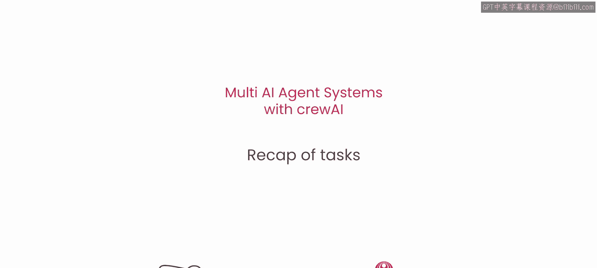
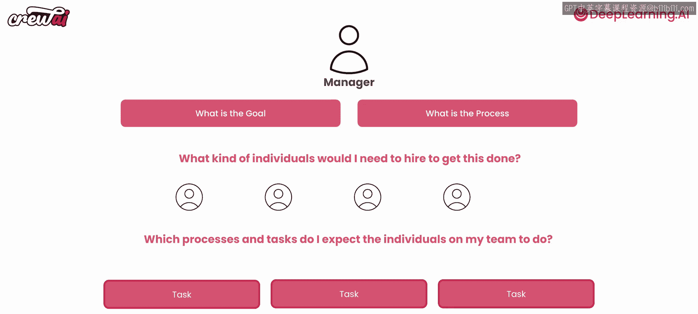

# 013：12.任务回顾 🧠

在本节课中，我们将快速回顾到目前为止所学的关于 crewAI 任务（Tasks）的所有核心知识。我们将总结如何有效地定义任务，以及任务的各种属性如何影响代理系统的行为。

---

## 任务创建框架回顾

上一节我们介绍了代理（Agents）的创建，本节中我们来看看如何为这些代理定义明确的任务。我们了解到，创建一个清晰的心智框架对于设计代理系统非常有帮助。这个框架帮助我们理解需要创建哪些代理，以及我们期望这些代理执行哪些任务。

## 任务的核心要素

在思考这些任务时，我们必须重点关注两个核心方面：**清晰的描述**和**明确的预期输出**。对于每一个任务，我们都应该清楚地定义它是什么，以及我们期望得到什么样的结果。

## 任务属性的探索

以下是任务对象提供的一系列重要属性，我们有机会对它们进行了初步探索和实验：

*   **`parallel_execution`**：此属性控制任务是否可以并行执行。
*   **`output_json`**：此属性指定任务的输出是否应为 JSON 格式。
*   **`use_pent`**：此属性涉及任务执行中使用的特定工具或方法。

此外，还有许多其他有趣的参数和功能。在未来你自己构建系统时，你将有机会深入尝试这些不同的参数，观察它们如何影响系统的运行。

## 系统能力的展示

我希望本节课程很好地展示了基于任务的代理系统可以有多么强大。通过明确定义任务及其属性，我们可以构建出结构清晰、功能明确的多代理协作流程。

---

## 总结与鼓励

本节课中，我们一起学习了 crewAI 中任务（Task）的定义、核心要素及其丰富属性。这是一个转折点，从这里开始，你将能够构建真正可用于生产环境的、你能够理解其工作原理的代理系统。

未来的学习只会让你变得更好。恭喜你坚持学习并掌握了这些知识！

我建议你暂停视频片刻，回到 Jupyter Notebook 中，尝试修改一些任务参数，看看能得到什么不同的结果。这将非常有趣。

我们下节课再见！