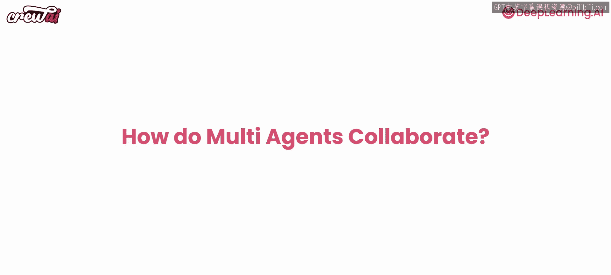
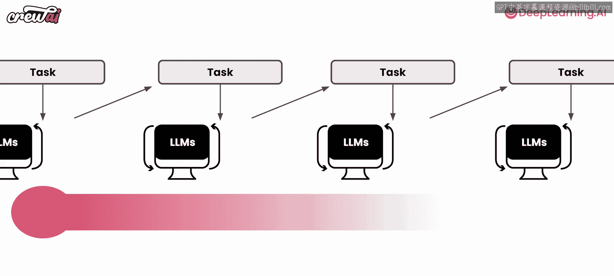
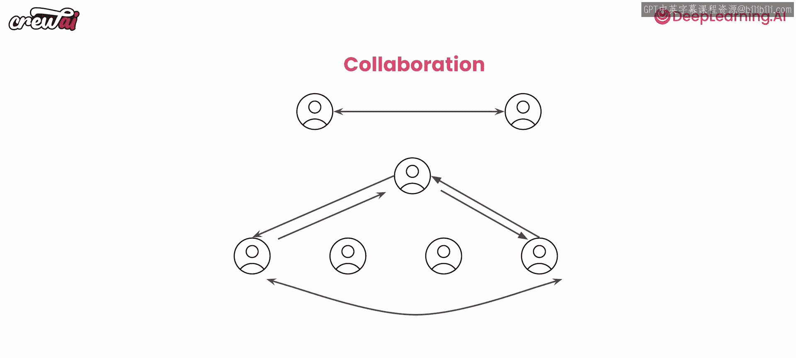

# 014：多代理协作 🧠

在本节课中，我们将深入探讨多代理系统中的核心环节——代理协作。我们将学习如何让多个AI代理相互沟通、配合工作，以实现更复杂的任务目标。

---

## 概述

上一节我们介绍了任务和代理的基本概念。本节中，我们来看看如何让多个代理协同工作。多代理系统的强大之处，不仅在于每个代理能独立完成任务，更在于它们能够通过协作，发挥出“1+1>2”的效能。我们将以金融分析这一常见且实用的场景为例，讲解不同的协作模式。

## 代理协作的多种方式

我们已经看到，代理协作的一种基础方式是**顺序执行**：一个代理完成任务后，将其输出传递给下一个代理。我们同样知道，任务也可以**并行执行**。这对于某些类型的工作流程非常有效。

然而，就像管理者不会对所有任务都采用相同的团队结构一样，代理的协作方式也需要根据具体目标来选择和设计。你可能拥有相同的代理和任务，但为了达成最佳效果，需要让它们通过不同的流程来运作。

不同的流程会带来不同的后果。例如，在顺序执行流程中，一个常见的问题是**初始上下文会随着任务在代理间传递而逐渐淡化**。这在某些情况下可以接受，但在另一些情况下则不行。

CrewAI框架为此提供了灵活性。它明确支持多种流程，让你可以轻松切换。

## 理解不同的流程

到目前为止，我们的代理主要在**顺序流程**中工作。我们虽然尝试过并行执行，但大多数任务仍是按顺序完成的。

除了顺序流程，另一个重要的流程是**分层流程**。这种流程有很多好处：
*   它有一个单一的协调点——一个“经理”代理。
*   这个经理代理始终牢记最终目标。
*   它会自动将工作委派给团队中的其他成员（代理）。
*   不仅如此，它还会在其他代理完成工作后**审查结果**，并在必要时要求进一步改进。

有趣的是，你可以自己创建这个经理代理。如下图所示，不同的流程可以让你以完全不同的方式执行相同的操作，而你只需要更改一行代码即可实现这种切换。

但这还不是全部。无论选择哪种主要流程（顺序或分层），CrewAI都允许你进行**异步执行**。这意味着你可以让某些任务并行运行，而让其他任务在必要时等待它们完成。

## 超越预设路径的协作

除了流程本身，代理之间的协作行为也非常丰富。CrewAI允许代理完全合作，并在必要时脱离任何预定义的路径来完成手头的任务。

以下是代理协作的一些关键方式：
*   **相互委派工作**：代理可以将部分工作交给更合适的同伴。
*   **相互提问**：代理可以就任务细节向其他代理询问，以获取所需信息。
*   **经理审查**：在分层流程中，经理代理可以审查下属的工作成果。
*   **并行任务**：多个任务可以同时进行，提高效率。

需要强调的是，**代理间的提问和委派行为，独立于你所选择的流程**。这意味着，即使你选择了分层流程，有一个经理在委派工作，其下属代理之间仍然可以相互委派工作。这为产出更多样化的结果提供了可能。

## 实践示例

让我们快速跳转到Jupyter Notebook，通过一个具体的金融分析案例，来看看这些协作方式是如何在代码中实现的。

## 总结

本节课中，我们一起学习了多代理协作的核心概念。我们了解到，代理可以通过**顺序**或**分层**等不同流程进行组织，并且能够在流程中实现**并行执行**、**相互委派**和**提问**等丰富的协作行为。关键在于，作为一名“管理者”，你需要根据任务目标，灵活选择和设计最适合的团队协作模式。在接下来的实践中，你将能更深入地体验这些协作方式带来的强大能力。