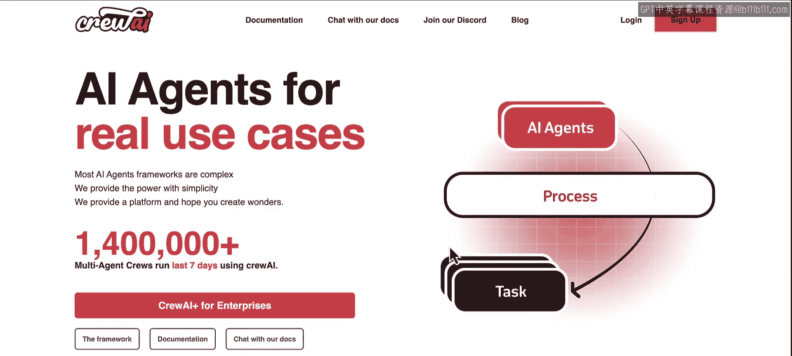
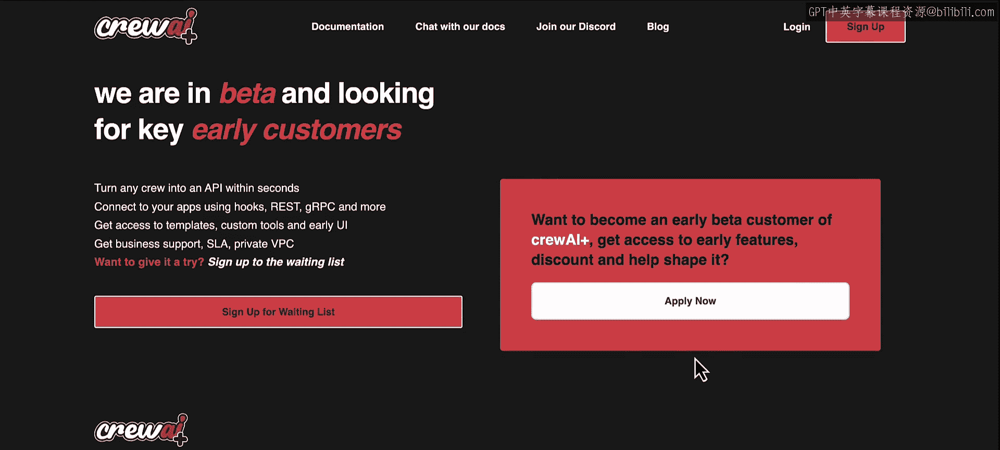
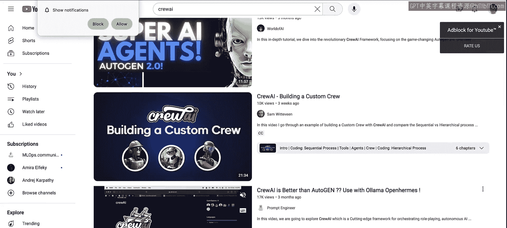
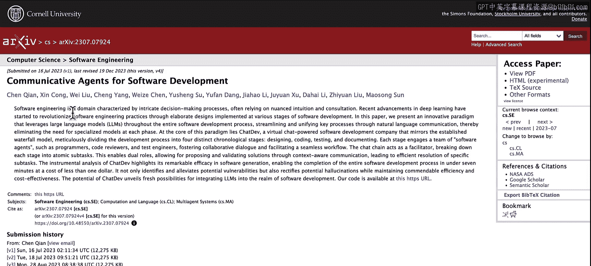
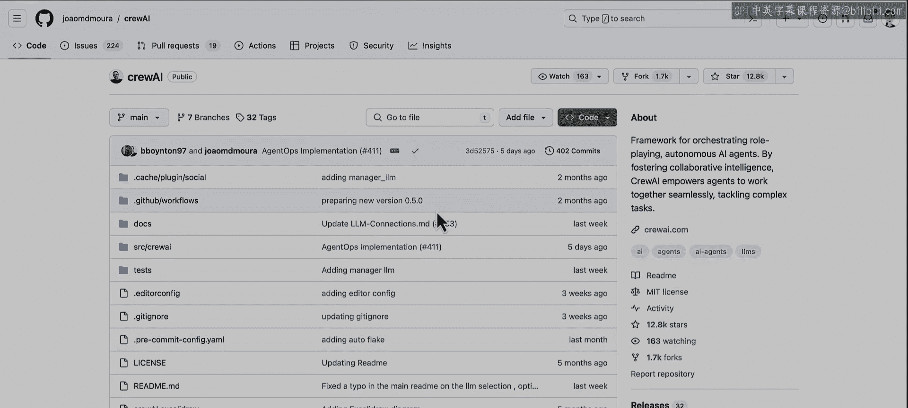

# 017：下一步行动 🚀

在本节课中，我们将回顾整个课程的学习旅程，并为你指明下一步的学习方向与可用资源。你将了解如何深化对多AI代理系统的理解，以及如何将所学知识应用于实际生产环境。

---

## 课程回顾与展望

上一节我们介绍了多AI代理系统的构建与应用。本节中，我们来看看完成本课程后，你可以采取哪些步骤来继续学习和实践。

这是一段精彩的旅程。很高兴能陪伴你一路走来。你已经学到了很多关于多AI代理系统的知识。现在，你已经能够自己组装这些代理系统了。那么，让我们看看接下来的步骤是什么。你从这里出发可以去哪里。你还能学习什么。有哪些好的资源可用。让我们开始吧。

---

## 核心学习资源

你已经走了这么远，学到了很多关于多代理系统的知识，学会了如何将它们结合使用，并在整个课程中利用crewAI构建了所有示例。现在，你可能想知道如何更进一步，或者接下来该去哪里。让我为你展示一些可以使用的资源。

以下是你可以利用的几个关键资源：

*   **官方文档**：你可以访问 [crewAI官方文档](https://docs.crewai.com)。在这里，你可以深入了解核心概念、特定属性，甚至获取一些操作指南。
*   **AI助手**：你还可以与我们的文档聊天。点击这里，你将可以访问一个名为“crewAI助手”的定制GPT。这个助手了解关于crewAI的一切，你可以询问它关于代理、任务、流程的问题，甚至可以请它为你编写一些代码。这将是一个极好的资源，能帮助你更快地进行迭代，确保你能快速构建你的团队。
*   **企业版平台**：如果你想知道如何在生产环境中使用crewAI，请随时查看crewAI企业版。我们目前正在与早期设计客户合作，因此会精心挑选合作对象。但我们非常渴望了解所有的用例。如果你认为自己有一个很好的用例，并希望在生产环境中部署它，请点击“立即申请”与我们联系，我们将很乐意将你纳入我们的平台。

在我们的平台上，你将能够访问以下功能：通过crewAI+，你可以在几分钟内将你的团队转化为API，而无需更改任何代码。你可以将其推送到GitHub，选择一个代码库，并设置任何你需要的环境变量，比如你使用的特定模型或你的SerpAPI密钥等。之后，你将获得一个可以使用的API。

这个API将托管在私有VPC中，使用SSL，并具备自动扩展等一切使其适用于生产用例的功能。这只是冰山一角，你可以在其他菜单中看到通过crewAI+可以访问的其他功能。因此，如果你认为自己已准备好将团队投入生产并以更大规模部署，这里是一个绝佳的去处。

---

## 扩展学习与社区

如果你正在寻找其他可以了解更多关于crewAI的资源，我强烈推荐你查看YouTube。我们有一个庞大的社区，已经发布了大量关于crewAI的视频。你会发现数不胜数的crewAI视频，可以学习特定的用例，学习如何构建更复杂的设置，如何将其与GMitro集成以及许多其他用例。所以，不要害怕深入搜索YouTube，了解更多关于如何在生产环境中构建crewAI的知识。这绝对是一个极好的资源。

另一件事是，如果你对我们讨论的许多概念，如代理角色扮演、沟通和协作感到好奇，有很多论文强调了这样做相对于常规提示工程或其他技术的优势。我推荐的一篇论文是关于ChatDev的论文。你完全可以深入研究它，看看代理如何能够相互交谈，以更好的方式处理更复杂的问题。如果你想要深入了解一下，我绝对推荐这篇论文。

也不要害怕加入我们的Discord社区。在我们的网站上，你会在顶部找到一个名为“加入我们的Discord”的链接。点击它，你将可以访问成千上万的人，他们正在讨论crewAI以及如何使用它进行构建。

---

## 实践与贡献

在我刚才展示的所有内容中，你应该已经准备就绪，可以开始真正地组建你的团队、创建任务，并为今天生产环境构建多代理系统了。

另一个很好的资源是实际的框架本身。你可以进入GitHub，查看驱动crewAI的代码。所以，请随时去那里查看问题、拉取请求，如果你愿意，也可以做出贡献。这里有很多好的资源和许多渴望帮助你的人。所以，请务必查看代码，如果你发现了一个错误，请告诉我们，并随时为之做出贡献。

非常感谢。

---

## 课程总结

本节课中，我们一起学习了完成多AI代理系统课程后的下一步行动。我们回顾了官方文档、AI助手、企业级平台等核心资源，探讨了通过YouTube、学术论文和Discord社区进行扩展学习的途径，并鼓励你通过查看和贡献GitHub代码库来深入实践。现在，你已经掌握了继续探索和构建强大AI代理系统所需的知识与工具。