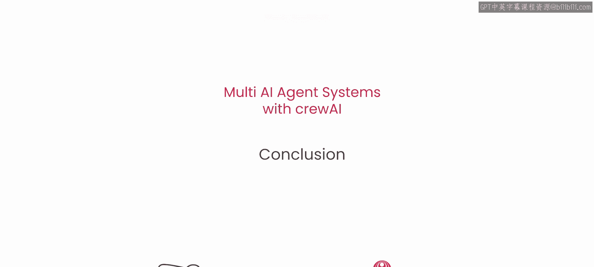

# 018：总结 🎯

在本节课中，我们将对使用 crewAI 构建多人工智能代理系统的整个学习旅程进行总结，并为你未来的实践提供指引。

我们刚刚经历了一段丰富的学习旅程，学到了很多知识。现在，你已经掌握了构建多代理系统所需了解的一切内容。

你已经准备好运用这些知识，走出去构建真正可用于生产环境的系统。这些系统将对你个人以及你所合作的企业产生实际价值。

首先，我要祝贺你坚持学习到这里。你应该走出去，真正将这些技能付诸实践。你在本课程中学到的许多内容，正是未来商业构建的方式。

因此，请务必尝试应用这些技能，在实践中磨练它们。如果你有任何问题或需要任何帮助，随时可以联系我，我随时都在。

恭喜你，期待在线交流，祝你一切顺利。😊

---

**总结**

本节课中我们一起回顾了整个课程的核心内容。你已掌握了构建多人工智能代理系统的完整知识体系，并获得了将理论转化为实际生产系统的信心。关键在于**实践**与**应用**，将所学技能用于解决真实世界的问题。